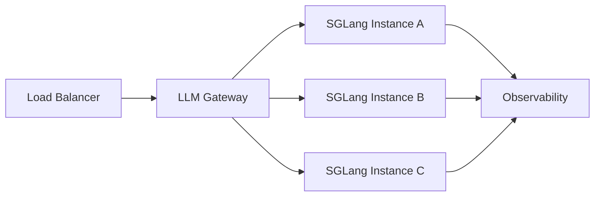

# 8. 企业生产实践

本章结合真实场景与公开资料，分析 SGLang 在生产环境中的部署方式、优化手段与踩坑经验。

## 典型生产架构

## 适用场景

SGLang 在以下场景相比通用推理引擎更具优势：

### 1. Agent / 多轮对话

- 多轮对话天然存在长 system prompt 和历史上下文重复。
- RadixAttention 自动复用这些前缀，减少重复 prefill。
- `fork` 原语支持并行尝试多个推理分支（如 ReAct 的多种候选）。

### 2. 结构化输出

- JSON mode、function calling、代码生成等场景需要输出符合 schema。
- SGLang 原生集成 XGrammar-2，约束编译与采样一体化。
- 2026 年 v0.5.11 起，XGrammar-2 成为默认结构化解码后端。

### 3. 长上下文 / 前缀重负载

- 共享 system prompt 的企业内部知识库问答。
- 长 prompt 模板 + 短用户输入的场景，Radix Tree 收益最大。

## 各公司/社区实践

### LMSYS / Chatbot Arena

SGLang 的发源地 LMSYS 在其服务后端中大量使用 SGLang，主要收益：

- RadixAttention 在多模型、多轮对话评测中显著降低 prefill 开销。
- 结构化生成用于控制模型输出格式，便于评测打分。

### Together AI / Fireworks AI

这些推理云厂商同时支持 vLLM 和 SGLang：

- 对通用高吞吐场景使用 vLLM。
- 对 Agent、结构化输出、多轮对话场景推荐 SGLang。
- 强调根据 workload 选择引擎，而不是“一刀切”。

### 月之暗面 / Mooncake

SGLang 与 Mooncake（Kimi 开源的 KVCache-centric 分离式推理架构）集成：

- 通过 Mooncake store 把 KV Cache offload 到 SSD 或远程存储。
- 支持更大规模的 Radix Tree 缓存和 PD 分离。
- 2026 年 SGLang v0.5.12 的 HiCache / UnifiedRadixTree 明确支持 Mooncake store。

### DeepSeek / 大模型推理

SGLang 在 DeepSeek-V3 / V4 系列模型上的优化：

- MoE load balancing（Waterfill、LPLB）配合 DeepEP 专家并行。
- NVFP4 MoE、FlashMLA head64 decode、FP8 量化优化。
- v0.5.14 官方宣称 DeepSeek-V4 在 GB300 上“同交互度下 5x 吞吐”。

### 国内云厂商与创业公司

- 部分国内 Agent 平台采用 SGLang 作为结构化输出和多轮对话后端。
- 与 vLLM 混合部署：通用推理走 vLLM，复杂 Agent 走 SGLang。

## 关键优化手段

### 1. RadixAttention 调优

- 保证 system prompt 和常用前缀稳定，提升复用率。
- 合理设置缓存容量，避免 LRU 把热前缀淘汰。
- 使用 HiCache + UnifiedRadixTree 时，配置 SSD offload 以扩展缓存容量。

### 2. 结构化生成

- 优先使用 XGrammar-2 后端。
- JSON schema 尽量精简，避免嵌套过深导致 FSM 状态爆炸。
- 对简单约束使用 regex，对复杂约束使用 EBNF。

### 3. 投机解码

SGLang 在 2026 年持续强化 Speculative Decoding：

- v0.5.12 引入 Speculative Decoding V2（默认开启）。
- 支持 EAGLE-3、Kimi K2.5 EAGLE-3 MLA、Gemma 3/4 + EAGLE-3。
- 在延迟敏感场景可显著降低 TPOT。

### 4. 量化

- FP8 / NVFP4 在 Blackwell（GB200/GB300）上收益明显。
- AWQ / GPTQ 可用于旧架构显存压缩。
- 量化后需要评估结构化输出的准确率（JSON 括号、字段名是否容易出错）。

### 5. 可观测性

- 监控指标：TTFT、TPOT、throughput、Radix Tree 命中率、结构化约束编译时间。
- 日志：请求生命周期、约束编译耗时、KV cache 命中长度。
- Tracing：OpenTelemetry 接入。

## 常见踩坑

| 问题 | 原因 | 解决 |
|---|---|---|
| 结构化输出吞吐低 | JSON schema 太复杂，FSM 状态多 | 简化 schema，使用更宽松的 regex |
| 首 token 延迟高 | 约束编译（尤其是复杂 EBNF）耗时 | 预编译常用约束，或启用编译缓存 |
| 缓存命中率低 | system prompt 变化频繁或缓存容量不足 | 统一 prompt 模板，增加缓存容量 |
| 多卡通信瓶颈 | TP 通信量大 | 优先 NVLink，或考虑 PP/DP |
| 版本迭代导致 API 变化 | SGLang 发展快 | 锁定版本，关注 Release Notes |

## 本章小结

SGLang 在生产环境中的成功取决于场景选择：它特别适合 Agent、多轮对话、结构化输出和长前缀复用场景。与 vLLM 混合部署、根据 workload 路由，是当前比较常见的实践。

## 参考来源

- [SGLang GitHub Releases](https://github.com/sgl-project/sglang/releases)
- [Mooncake: A KVCache-centric Disaggregated Architecture](https://github.com/kvcache-ai/Mooncake)
- LMSYS / SGLang 团队技术博客与演讲
