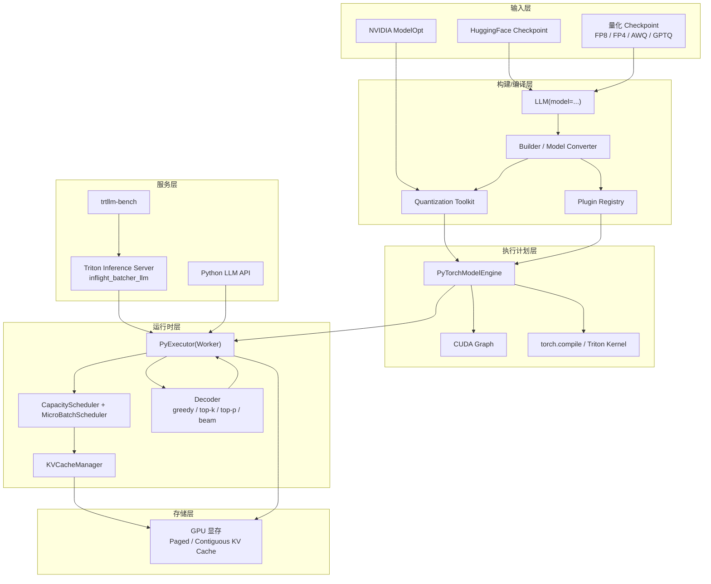

# 3. 架构设计

TensorRT-LLM 的架构围绕“**构建一次、优化执行、动态调度**”展开。1.2 之后，PyTorch 后端成为唯一执行后端，但整体分层仍然保留了 Builder / Engine / Runtime / Executor 的概念。

## 整体架构图



## 各组件职责

### 1. LLM API（Python 入口）

`tensorrt_llm.LLM` 是最常用的 Python 入口：

```python
from tensorrt_llm import LLM, SamplingParams
llm = LLM(model="meta-llama/Llama-3.1-8B-Instruct")
outputs = llm.generate(prompts, SamplingParams(max_tokens=128))
```

职责：

- 解析模型路径与配置
- 触发构建/编译流程
- 管理 tokenization / detokenization
- 提供同步/异步生成接口

### 2. Builder / Model Converter

把原始 checkpoint 转换为 TRT-LLM 内部表示。historically 这一步输出 TensorRT engine；现在更多是把权重、配置、量化参数加载到 PyTorch 后端，并触发后续编译。

### 3. PyTorchModelEngine

`tensorrt_llm/_torch/pyexecutor/model_engine.py` 中的核心类，持有语言模型并支持单步 forward。它负责：

- 调用 `torch.compile` 做图优化
- 管理 CUDA Graph 捕获与重放
- 调用 custom plugin / Triton kernel
- 处理不同精度（FP16 / FP8 / FP4）的 kernel 选择

### 4. PyExecutor(Worker)

每个 GPU rank 上运行一个 `PyExecutor`，内部是一个连续后台循环：

```
while running:
    scheduler_output = scheduler.step()
    model_output = model_engine.forward(scheduler_output)
    decoder_output = decoder.step(model_output)
    update_requests(decoder_output)
```

### 5. Scheduler

TRT-LLM 的调度器由两层组成：

- **CapacityScheduler**：检查资源是否足够，决定是否接收新请求。
- **MicroBatchScheduler**：从待处理请求中选出当前 step 的 micro-batch。

调度策略遵循 IFB 原则：优先 generation-phase，再填 context-phase；支持 chunked prefill。

### 6. KVCacheManager

管理 KV Cache 的分配、回收、复用。支持两种模式：

- **Contiguous KV Cache**：连续显存，实现简单，但不利于动态长度。
- **Paged KV Cache**：按 block 分配，支持 prefix/block 复用、chunked prefill。

### 7. Decoder

负责从 logits 采样下一个 token，支持：

- greedy
- top-k / top-p
- beam search
- 与 guided decoding / structured generation 结合

### 8. Plugin Registry

 historically 通过 `@trtllm_plugin("Name")` 注册 custom op。PyTorch 后端中，plugin 机制继续存在，但实现上更贴近 PyTorch custom op。

### 9. Triton Backend

生产环境最常用的服务化方式。模型仓库包含：

- `preprocessing`：tokenization
- `tensorrt_llm`：执行推理
- `postprocessing`：detokenization
- `tensorrt_llm_bls`：业务逻辑编排

通过 `config.pbtxt` 中的 `batching_strategy: inflight_fused_batching` 启用 IFB。

## 分布式推理

TensorRT-LLM 支持多种并行策略：

### Tensor Parallelism（TP，张量并行）

把模型层的计算切分到多个 GPU，每层内部做 all-reduce。适合单节点多 GPU。

```python
llm = LLM(model="...", tensor_parallel_size=2)
```

### Pipeline Parallelism（PP，流水线并行）

把模型按层切分到多个 GPU，stage 间传激活。适合跨节点大模型。

```python
llm = LLM(model="...", pipeline_parallel_size=2)
```

### Context Parallelism（CP，上下文并行）

针对长上下文 prefill 阶段，把序列维度切分到多个 GPU，降低单卡显存压力。

### Expert Parallelism（EP，专家并行）

用于 MoE 模型，把不同 expert 放到不同 GPU，减少单卡负载。

### 并行策略选择

| 维度 | TP | PP | CP | EP |
|---|---|---|---|---|
| 切分维度 | 层内 | 层间 | 序列 | Expert |
| 通信量 | 大（每层 all-reduce） | 中（stage 间激活） | 大（序列间 KV） | 中（gate + expert 输出） |
| 主要 overhead | 通信延迟 | Pipeline bubble | 通信 + 负载均衡 | Expert 路由 |
| 适用场景 | 单节点多 GPU | 跨节点大模型 | 超长上下文 | MoE 模型 |

## 架构演进：TensorRT 后端移除意味着什么？

| 方面 | TensorRT 后端时代 | PyTorch 后端时代（1.2+） |
|---|---|---|
| 执行载体 | TensorRT engine / plan | PyTorchModelEngine |
| 优化手段 | TensorRT builder + plugin | torch.compile + CUDA Graph + custom kernel |
| 用户 API | 基本不变 | 基本不变 |
| 生态集成 | 需要 TensorRT 依赖 | 更贴近 PyTorch / HuggingFace |
| 老模型迁移 | 需要重新 build | 多数可直接用 LLM API 加载 |

这次演进不是“性能换易用性”，而是把 TRT-LLM 的优化能力迁移到更现代、更可维护的 PyTorch 基础设施上。

## 本章小结

TensorRT-LLM 的架构清晰分层：输入层负责 checkpoint/量化，构建/编译层生成优化执行图，运行时层做 IFB 调度与 KV Cache 管理，服务层通过 Triton 或 Python API 对外暴露。PyTorch 后端接管执行后，Builder 与 Engine 的概念被重新实现，但“构建-执行-调度”的分层思想仍然不变。
