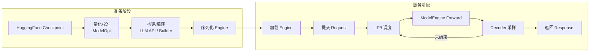

# 4. Runtime 工作流程

TensorRT-LLM 的 Runtime 工作流程可以概括为：**一次构建、多次服务**。与 vLLM / SGLang 的“即开即用”不同，TRT-LLM 需要在服务启动前完成模型转换、量化与编译；启动后，请求进入 Executor 的 In-flight Batching 循环，直到生成结束。

## 整体流程概览



## 1. 准备阶段

### 1.1 加载 Checkpoint

TRT-LLM 支持从多种来源加载模型：

- HuggingFace Transformers checkpoint（最常见）
- NVIDIA Megatron / NeMo checkpoint
- 已量化的 FP8 / FP4 / AWQ / GPTQ checkpoint
- TensorRT-LLM 自己生成的 checkpoint

```python
from tensorrt_llm import LLM
llm = LLM(model="meta-llama/Llama-3.1-8B-Instruct")
```

`LLM(model=...)` 会隐式完成权重加载、配置解析与后续构建。

### 1.2 量化（可选但推荐）

量化可以显著降低显存占用并提升吞吐。典型流程：

```python
from tensorrt_llm import LLM
from tensorrt_llm.llmapi import KvCacheConfig

llm = LLM(
    model="meta-llama/Llama-3.1-8B-Instruct",
    kv_cache_config=KvCacheConfig(dtype='fp8'),
)
```

对于更激进的量化，通常先用 NVIDIA ModelOpt 离线校准：

```bash
cd Model-Optimizer/examples/llm_ptq
scripts/huggingface_example.sh --model <model> --quant fp8
scripts/huggingface_example.sh --model <model> --quant fp8 --kv_cache_quant nvfp4
```

### 1.3 构建/编译

在 TensorRT 后端时代，这一步通过 `trtllm-build` 生成 `.engine` 文件。1.2 移除 TensorRT 后端后，`LLM(...)` 会触发 PyTorch 后端的构建：

- 权重转换到 TRT-LLM 内部表示
- 根据 `BuildConfig` 选择 TP/PP/CP/EP 策略
- 应用 plugin 替换与量化配置
- 使用 `torch.compile`、CUDA Graph 捕获等优化生成执行图

关键构建参数：

| 参数 | 含义 | 影响 |
|---|---|---|
| `max_batch_size` | 运行时最大 batch 大小 | 显存占用、吞吐上限 |
| `max_input_len` | 最大输入长度 | prefill 显存与计算量 |
| `max_seq_len` | 最大序列长度 | KV Cache 预算 |
| `max_num_tokens` | 去除 padding 后的最大 token 数 | workspace 大小、调度灵活性 |
| `precision` | 权重/激活精度 | 速度、显存、精度 |
| `tensor_parallel_size` | TP 大小 | 多 GPU 并行 |
| `pipeline_parallel_size` | PP 大小 | 跨节点并行 |

### 1.4 序列化 Engine

构建完成后，执行计划可以被序列化到磁盘，下次启动时直接加载，避免重复编译：

```python
llm.save(engine_dir)
llm = LLM(engine_dir)
```

在 PyTorch 后端中，序列化内容通常包括：模型权重、量化参数、编译状态、执行配置等。

## 2. 服务阶段

### 2.1 加载 Engine

服务启动时，TRT-LLM 加载序列化的执行计划，并为每个 GPU rank 初始化一个 `PyExecutor(Worker)`：

```
for rank in range(world_size):
    spawn PyExecutor(rank)
```

每个 `PyExecutor` 内部包含：

- `ModelEngine`：已编译的模型
- `Scheduler`：CapacityScheduler + MicroBatchScheduler
- `KVCacheManager`：显存池
- `Decoder`：采样器

### 2.2 提交 Request

用户通过 Python API 或 Triton backend 提交请求：

```python
outputs = llm.generate(
    ["The capital of France is"],
    SamplingParams(max_tokens=32, temperature=0.8)
)
```

请求被包装成内部 `Request` 对象，包含：

- `input_ids` / prompt tokens
- `max_tokens` / 停止条件
- 采样参数（temperature、top-k、top-p、beam width 等）
- KV cache 复用标记（如适用）

### 2.3 IFB 调度

Executor 的 Scheduler 在每个 step 决定哪些请求参与当前 forward：

```
1. 优先选择所有 generation-phase（decode）请求
2. 用剩余 token budget 选择 context-phase（prefill）请求
3. 受限于 max_batch_size 与 max_num_tokens
4. 对无法一次处理完的长 prefill，使用 chunked prefill 拆分到多个 step
```

这种策略保证：

- decode 请求不会因为长 prefill 而饿死
- 新请求可以尽快进入 batch
- GPU 的 token budget 被充分利用

### 2.4 ModelEngine Forward

调度器输出一个 `SchedulerOutput`，包含：

- 当前 batch 的 input_ids / position_ids
- 每序列的 sequence length
- KV cache 地址（block table 或 contiguous offset）
- attention mask / padding 信息

`ModelEngine.forward(...)` 执行一次模型前向，输出每个位置的 logits。

### 2.5 Decoder 采样

Decoder 根据采样策略从 logits 中选择下一个 token：

- greedy：取 argmax
- top-k / top-p：从截断分布中采样
- beam search：维护 beam candidates
- guided decoding：结合 grammar / JSON schema 限制合法 token

采样得到的新 token 被追加到对应请求的序列中。

### 2.6 更新请求状态

每个请求维护：

- `num_computed_tokens`：已计算 token 数
- `num_generated_tokens`：已生成 token 数
- `status`：waiting / running / finished / cancelled

如果请求达到 `max_tokens`、遇到 EOS 或满足停止条件，就移入 `finished` 队列并返回结果。

### 2.7 返回 Response

对于 Python API，`generate()` 阻塞直到所有请求完成，返回 `Response` 对象：

```python
for output in outputs:
    print(output.outputs[0].text)
```

对于 Triton backend，结果通过 gRPC/HTTP 流式返回。

## 3. 一个具体例子的 step-by-step

假设同时有三个请求进入系统：

| 请求 | prompt 长度 | 目标 |
|---|---|---|
| A | 1024 tokens | 生成 64 tokens |
| B | 8 tokens | 生成 32 tokens |
| C | 256 tokens | 生成 128 tokens |

`max_num_tokens=512`，`max_batch_size=8`。

**Step 0**：没有 running 请求，调度器选 B（context，8 tokens）和 C 的前 504 tokens（context，chunked）。A 因 token budget 不足等待。

**Step 1**：B 进入 generation；C 仍在 context；A 可以进入 context。调度器优先 B，然后 C/A 分配剩余 budget。

**Step 2**：B 和 C 都进入 generation；A 仍在 context。调度器继续优先 generation。

**Step N**：B 完成后释放 batch slot，新请求 D 进入。

这就是 IFB 的核心价值：request 生命周期相互重叠，GPU 尽量满载。

## 4. 与 vLLM / SGLang 流程的对比

| 阶段 | TensorRT-LLM | vLLM | SGLang |
|---|---|---|---|
| 启动 | 构建/编译一次 | 即开即用 | 即开即用 |
| 批处理 | IFB | Continuous Batching | Continuous Batching |
| prefill/decode | 同 batch 交错 | 同 batch 交错 | 同 batch 交错 |
| KV Cache | Paged / Contiguous | Paged | Radix Tree |
| 服务入口 | LLM API / Triton | OpenAI API / LLM API | OpenAI API / sgl API |
| 序列化 | Engine / checkpoint | 通常不序列化 engine | 通常不序列化 |

## 本章小结

TensorRT-LLM 的工作流程分为**准备阶段**和**服务阶段**：准备阶段通过量化与编译把模型变成优化执行计划；服务阶段通过 `PyExecutor` + `Scheduler` 持续做 In-flight Batching，动态交错 prefill 与 decode。理解这个流程，是后续调优 `max_batch_size`、`max_num_tokens`、量化配置与 Triton 部署参数的基础。
