# 5. 核心模块

TensorRT-LLM 的功能由多个核心模块协作完成。本章按数据流从“输入 → 构建 → 执行 → 服务”拆解每个模块的职责、关键类与配置。

## 模块总览

```mermaid
flowchart LR
    subgraph Input
        Tokenizer[TokenizerManager]
        Quant[Quantization Toolkit]
    end

    subgraph Build
        LLM[LLM API]
        Builder[Builder / Converter]
        Plugin[Plugin Registry]
    end

    subgraph Plan
        Engine[Engine / PyTorchModelEngine]
        Config[BuildConfig / KvCacheConfig]
    end

    subgraph Runtime
        Executor[PyExecutor]
        Scheduler[CapacityScheduler<br/>MicroBatchScheduler]
        KV[KVCacheManager]
        Decoder[Decoder]
    end

    subgraph Serving
        Triton[Triton Backend]
        Bench[trtllm-bench]
    end

    Input --> Build --> Plan --> Runtime --> Serving
```



## 1. LLM API（Python 入口）

`tensorrt_llm.LLM` 是最常用的 Python 入口，封装了构建、加载、生成全流程。

```python
from tensorrt_llm import LLM, SamplingParams

llm = LLM(model="TinyLlama/TinyLlama-1.1B-Chat-v1.0")
outputs = llm.generate("Hello, my name is", SamplingParams(max_tokens=32))
```

关键职责：

- 解析模型路径、trust_remote_code、tokenizer
- 根据 `BuildConfig` 与 `SamplingParams` 初始化后端
- 管理 tokenization / detokenization
- 提供 `generate()` / `save()` / `shutdown()` 等接口

主要配置类：

| 类 | 作用 |
|---|---|
| `BuildConfig` | max_batch_size、max_seq_len、precision、parallelism 等 |
| `KvCacheConfig` | KV cache dtype、enable_block_reuse、paged/cache_size 等 |
| `SamplingParams` | temperature、top_k、top_p、max_tokens、beam_width 等 |

## 2. Builder / Model Converter

Builder 负责把外部 checkpoint 转换为 TRT-LLM 内部可执行表示。

### TensorRT 后端时代（1.2 之前）

- `tensorrt_llm.Builder()`：创建 builder 与 network
- `trtllm-build` CLI：生成 `.engine` 文件
- 输出序列化的 TensorRT engine / plan

### PyTorch 后端时代（1.2+）

- `LLM(model=...)` 隐式完成权重加载与转换
- 模型定义位于 `tensorrt_llm/_torch/models/`
- 通过 `torch.compile`、CUDA Graph、custom kernel 做运行时优化

核心概念保留：

- 构建期完成算子选择、融合、量化、并行策略配置
- 运行期加载执行计划，避免重复解析模型结构

## 3. Engine / PyTorchModelEngine

Engine 是“执行计划”的载体。

### TensorRT Engine（历史）

- 二进制序列化文件，包含 CUDA kernel 选择、张量布局、融合图
- 通过 `runtime.Session` 加载
- 强绑定 GPU SKU 与 build 参数

### PyTorchModelEngine（当前）

- 位置：`tensorrt_llm/_torch/pyexecutor/model_engine.py`
- 持有 PyTorch 模型权重与计算图
- 关键方法：`forward(scheduler_output) → logits`
- 支持 CUDA Graph 重放、piecewise CUDA Graph、`torch.compile`

Engine 层的优化手段：

| 优化 | 作用 |
|---|---|
| CUDA Graph | 减少 kernel launch CPU overhead |
| torch.compile | 图级优化、kernel 融合 |
| Piecewise CUDA Graph | 对不同 shape 分段捕获 graph |
| Custom Triton Kernel | 替换标准 PyTorch op，提升特定 kernel 性能 |

## 4. Plugin Registry（插件注册表）

Plugin 机制允许注入自定义 CUDA kernel 或 PyTorch custom op。

### 自定义 Plugin 示例

```python
import tensorrt_llm as trtllm
from tensorrt_llm.plugin import PluginBase

@trtllm.plugin("TritonLookUp")
class LookUpPlugin(PluginBase):
    def shape_dtype_inference(self, inputs):
        ...

    def forward(self, inputs, outputs):
        ...
```

### 内置 Plugin（历史与现状）

| Plugin | 作用 |
|---|---|
| `gpt_attention_plugin` | 融合 masked / flash / paged attention |
| `gemm_plugin` | 融合 GEMM + bias + activation |
| `nccl_plugin` | 多 GPU 通信算子 |
| `rmsnorm_plugin` | 融合 RMSNorm |

PyTorch 后端下，这些能力更多以 custom op / Triton kernel 形式存在，但 plugin 注册与替换的思想仍然适用。

## 5. Executor（执行器）

Executor 是服务阶段的核心，负责持续调度与执行。

### PyExecutor

- 每个 rank 一个 `PyExecutor(Worker)`
- 连续后台循环：fetch → schedule → forward → decode → update
- 通过 `ExecutorConfig` 配置：
  - `max_batch_size`
  - `max_num_tokens`
  - `scheduler_config`
  - `kv_cache_config`

### C++ Executor

- 提供更低的调度延迟
- Triton backend 默认使用 C++ Executor 路径
- Python binding 暴露 `tensorrt_llm.executor`

## 6. Scheduler（调度器）

TRT-LLM 的 Scheduler 由两层组成：

### CapacityScheduler

检查当前资源是否能容纳新请求：

- KV cache 是否足够
- batch size 是否未超上限
- token budget 是否足够

### MicroBatchScheduler

从 waiting/running 队列中选出当前 step 的 micro-batch：

- 优先 generation-phase 请求
- 剩余 budget 分配给 context-phase
- 支持 chunked prefill

调度器配置：

```python
from tensorrt_llm.executor import SchedulerConfig

scheduler_config = SchedulerConfig(
    capacity_scheduler_policy=...,  # 容量调度策略
    scheduler_policy=...,            # 调度策略
)
```

## 7. KVCacheManager

KV Cache 管理器负责显存分配与复用。

### Contiguous KV Cache

- 单一大张量：`[max_batch_size * beam_width, 2, num_heads, max_seq_len, head_size]`
- 实现简单，但存在内部碎片

### Paged KV Cache

- 按 block 分配，block 大小通常为 64/128 tokens
- 每个 sequence 维护 block table
- 支持 block reuse / prefix caching
- 与 chunked prefill 配合良好

```python
from tensorrt_llm.llmapi import KvCacheConfig

kv_cache_config = KvCacheConfig(
    dtype='fp8',
    enable_block_reuse=True,
)
```

## 8. Decoder（采样器）

Decoder 从 logits 生成下一个 token。

支持策略：

- greedy
- top-k、top-p、temperature
- beam search
- repetition penalty、frequency/presence penalty
- guided decoding / structured generation

```python
from tensorrt_llm import SamplingParams

SamplingParams(
    temperature=0.8,
    top_k=50,
    top_p=0.9,
    max_tokens=128,
)
```

## 9. Quantization Toolkit（量化工具链）

TRT-LLM 支持多种量化方案：

| 方案 | 精度 | 适用硬件 |
|---|---|---|
| FP8 | 默认 Hopper 首选 | H100/H200 |
| FP4 / NVFP4 | Blackwell 专属 | B200/GB200 |
| AWQ / GPTQ | W4A16 / W4A8 | 多代 GPU |
| INT8 | 传统方案 | 多代 GPU |

量化流程：

1. 选择量化 recipe（FP8 / FP4 / AWQ / GPTQ）
2. 使用 NVIDIA ModelOpt 离线校准
3. 生成量化 checkpoint
4. TRT-LLM 加载并按 recipe 选择 kernel

## 10. TokenizerManager

负责 prompt 的 tokenization 与生成 token 的 detokenization。

- 通常使用 HuggingFace Transformers tokenizer
- 支持 chat template、special tokens
- Triton backend 中由 `preprocessing` / `postprocessing` ensemble 处理

## 11. Triton Backend

生产环境最常用的服务化入口。

模型仓库结构：

```
models/
├── ensemble/
├── preprocessing/
├── tensorrt_llm/
├── postprocessing/
└── tensorrt_llm_bls/
```

关键配置：

- `batching_strategy: inflight_fused_batching`
- `triton_max_batch_size`
- `max_queue_delay_microseconds`
- `decoupled_mode`

## 12. trtllm-bench

TRT-LLM 自带的 benchmark 工具，用于测量：

- throughput（token/s）
- TTFT（time to first token）
- TPOT（time per output token）
- 不同 batch size / sequence length 下的性能

```bash
trtllm-bench --model <model> --mode <static> --batch_size <bs> --input_len <in> --output_len <out>
```

## 模块协作示例

一个 `generate()` 调用在模块间的流转：

```
LLM.generate(prompt)
  → TokenizerManager.encode(prompt)
  → Executor.submit(Request)
  → Scheduler.step() 选择 batch
  → KVCacheManager.prepare_resources()
  → ModelEngine.forward()
  → Decoder.step(logits)
  → KVCacheManager.update_resources()
  → Request.update()
  → 若完成 → TokenizerManager.decode(tokens)
  → 返回 Response
```

## 本章小结

TensorRT-LLM 的模块划分清晰：LLM API 做封装，Builder/Engine 做编译与执行计划，Executor/Scheduler/KVCacheManager 做运行时调度，Decoder 做采样，Triton backend 做服务化。1.2 后 TensorRT 后端被移除，PyTorchModelEngine 接管执行，但模块职责与交互关系保持稳定。
