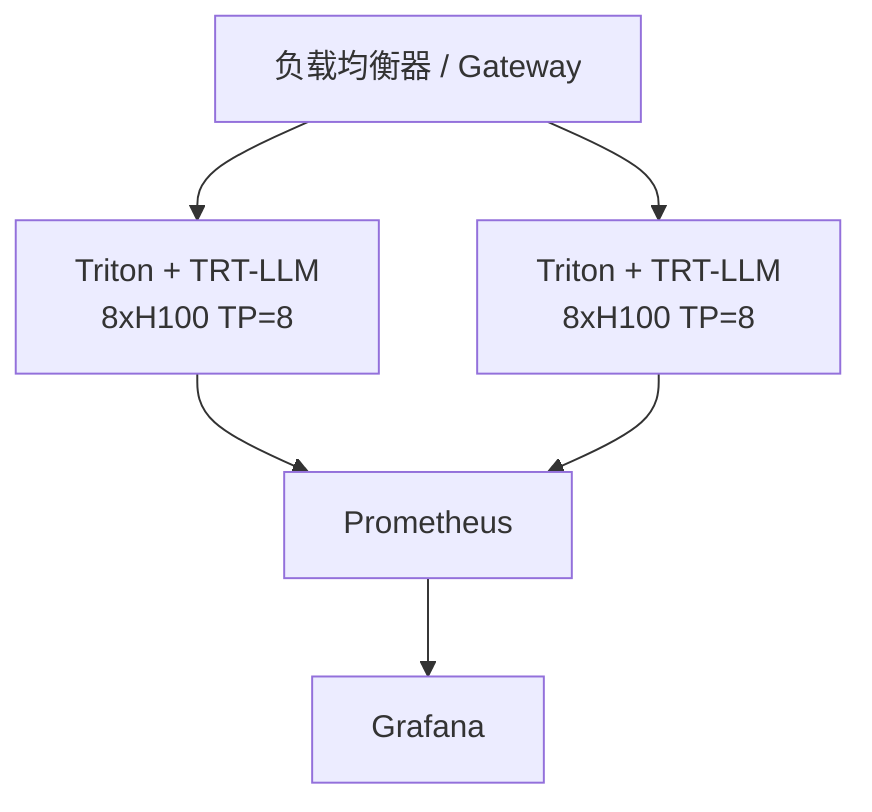

# 8. 企业生产实践

TensorRT-LLM 最常见的生产部署形态是 **NVIDIA NGC 容器 + Triton Inference Server**。本章总结容器化、多 GPU、量化、benchmark、可观测性与典型踩坑。

## 1. 容器化部署

### 官方镜像

```bash
nvcr.io/nvidia/tritonserver:<xx.yy>-trtllm-python-py3
```

例如 TensorRT-LLM 1.0 前后对应 `25.06-trtllm-python-py3`（随版本变化，请查阅 [NGC](https://catalog.ngc.nvidia.com/)）。

启动容器示例：

```bash
docker run --rm -it --net host --shm-size=2g \
  --ulimit memlock=-1 --ulimit stack=67108864 --gpus all \
  -v /path/to/engines:/engines \
  nvcr.io/nvidia/tritonserver:25.06-trtllm-python-py3
```

### 模型仓库

Triton backend 提供标准模型仓库模板：

```bash
cp -r /app/all_models/inflight_batcher_llm/* /triton_model_repo/
```

模型仓库包含五个子模型：

| 模型 | 作用 |
|---|---|
| `preprocessing` | tokenization |
| `tensorrt_llm` | 推理执行 |
| `postprocessing` | detokenization |
| `tensorrt_llm_bls` | 业务逻辑编排 |
| `ensemble` | 串联 pre/post 与推理 |

### config.pbtxt

使用 `/app/tools/fill_template.py` 填充模板：

```bash
python3 /app/tools/fill_template.py \
  -i /triton_model_repo/tensorrt_llm/config.pbtxt \
  triton_backend:tensorrtllm,\
  triton_max_batch_size:8,\
  engine_dir:/engines/llama-8b,\
  batching_strategy:inflight_fused_batching,\
  decoupled_mode:false,\
  max_queue_delay_microseconds:100
```

## 2. 多 GPU 并行

### Tensor Parallelism（TP）

适合单节点多 GPU：

```python
llm = LLM(model="...", tensor_parallel_size=4)
```

Triton 启动：

```bash
python3 /app/scripts/launch_triton_server.py \
  --world_size=4 \
  --model_repo=/triton_model_repo
```

### Pipeline Parallelism（PP）

适合跨节点大模型：

```python
llm = LLM(model="...", pipeline_parallel_size=2)
```

### Expert Parallelism（EP）

MoE 模型专用：

```python
llm = LLM(model="...", expert_parallel_size=4)
```

### 并行策略选择建议

| 场景 | 推荐并行 |
|---|---|
| 单节点 8xH100，70B 模型 | TP=8 |
| 双节点，405B 模型 | TP=8 + PP=2 |
| 超长上下文（>128k） | CP |
| DeepSeek / Mixtral MoE | TP + EP |

## 3. 量化生产实践

### FP8（Hopper 默认）

推荐用于 H100/H200：

```python
llm = LLM(
    model="nvidia/Llama-3.1-8B-Instruct-FP8",
    kv_cache_config=KvCacheConfig(dtype='fp8'),
)
```

### FP4 / NVFP4（Blackwell）

仅适用于 B200/GB200，需要离线校准：

```bash
scripts/huggingface_example.sh --model <model> --quant fp8 --kv_cache_quant nvfp4
```

### AWQ / GPTQ

适用于显存受限场景：

```python
llm = LLM(model="...", quant_config="awq")
```

### 量化校准建议

- 使用 512~1024 条与线上分布相近的样本做校准
- 评估 PPL、MMLU、业务指标，不只是看吞吐
- FP4 / INT4 需要重点关注数学/代码类任务的精度退化

## 4. Benchmark

使用官方 `trtllm-bench`：

```bash
trtllm-bench \
  --model meta-llama/Llama-3.1-8B-Instruct \
  --mode static \
  --batch_size 1,4,8,16 \
  --input_len 128,1024 \
  --output_len 128
```

关键指标：

| 指标 | 含义 | 优化方向 |
|---|---|---|
| TTFT | 首 token 延迟 | 降低 prefill 计算量、chunked prefill、CP |
| TPOT | 每输出 token 延迟 | 提高 batch size、IFB 调优、量化 |
| throughput | 总吞吐（token/s） | 提升 batch size、减少 padding、CUDA Graph |
| inter-token latency | 流式延迟 | 调度策略、decode 优先级 |

## 5. 可观测性

### Triton 指标

Triton 暴露 Prometheus 指标：

- `nv_inference_request_success` / `latency`
- `nv_inference_queue` / `compute_infer`
- GPU 利用率：`nv_gpu_utilization`
- 显存：`nv_gpu_memory_used_bytes`

### TRT-LLM 内部指标

- Scheduler 每步 batch 大小、context/decode 比例
- KV cache 使用率、block reuse 命中率
- CUDA Graph 命中率

### 日志与追踪

- 开启 `executor` debug log 观察调度决策
- 使用 Nsight Systems 分析 kernel 执行时间
- 结合 OpenTelemetry 做端到端 tracing

## 6. 常见踩坑

### Engine 与 GPU 不匹配

历史 TensorRT engine 强绑定 GPU SKU。PyTorch 后端下仍建议在同代 GPU 上构建与部署，避免 SM 差异导致性能回退。

### max_num_tokens 过大

`max_num_tokens` 决定 workspace 大小，过大会挤占 KV cache 空间，反而降低吞吐。建议根据实际 prompt 长度分布调优。

### 忘记启用 IFB

Triton backend 默认可能不是 IFB，需要在 `config.pbtxt` 中显式设置 `batching_strategy:inflight_fused_batching`。

### 量化精度不达标

不要只看吞吐。FP4/INT4 在长文本、代码、数学任务上可能退化，需要业务指标验证。

### 多 GPU 通信瓶颈

TP 通信量大，建议使用 NVLink + 同节点部署；跨节点 PP 注意 pipeline bubble。

### 动态 batch 与 timeout

设置合理的 `max_queue_delay_microseconds` 平衡延迟与吞吐。太小 batch 不满，太大增加排队延迟。

## 7. 典型部署拓扑



## 8. 分离式服务（Disaggregated Serving）

TRT-LLM 1.1+ 引入 KV Cache Connector API，支持 Prefill 与 Decode 分离部署：

- Prefill 节点：高算力，处理长上下文
- Decode 节点：低延迟，持续生成
- KV Cache Connector：在阶段间传输 KV cache

适用场景：

- 超长上下文（>100k）
- 对 TTFT 与 TPOT 要求差异大的业务
- 需要独立扩缩 prefill/decode 的集群

## 本章小结

TensorRT-LLM 的生产部署围绕 **NGC 容器 + Triton backend + 多 GPU 并行 + 量化** 展开。关键调优参数包括 `max_batch_size`、`max_num_tokens`、并行策略、量化 recipe 与调度延迟。建议通过 `trtllm-bench` 建立基准，结合 Prometheus/Grafana 做可观测性，再根据业务指标迭代优化。
