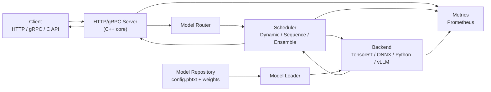
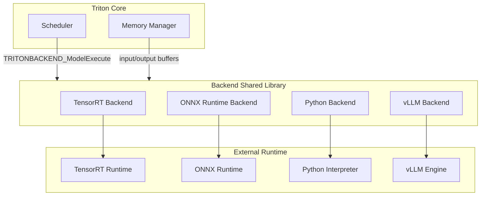

# 3. 架构设计

## 整体架构

Triton Inference Server 是一个**C++ 核心 + 可插拔 backend** 的架构。它的设计目标是：核心进程负责网络、调度、生命周期管理，而具体推理逻辑交给各个 backend。



## 各层职责

| 组件 | 职责 | 关键实现/文件 |
|---|---|---|
| **HTTP/gRPC Server** | 接收客户端请求，解析 Triton 协议，返回响应 | `src/servers/http_server.cc`、`grpc_server.cc` |
| **Model Router** | 根据请求 URL 中的模型名与版本，定位到对应模型 | `model_repository_manager.cc` |
| **Model Loader** | 读取 model repository，加载模型配置与权重 | `model_repository_manager.*`、`model_config.*` |
| **Scheduler** | 根据配置选择 Dynamic / Sequence / Ensemble 调度 | `dynamic_batch_scheduler.*`、`sequence_batch_scheduler.*`、`ensemble_scheduler.*` |
| **Backend** | 执行实际推理 | `backends/` 目录下的共享库 |
| **Metrics** | 暴露 Prometheus 指标 | `metrics.*` |
| **Memory Manager** | 管理输入输出张量的内存分配与共享内存 | `pinned_memory_manager.*`、`cuda_memory_manager.*` |

## 请求在架构中的流动

一个典型的推理请求会经历以下路径：

1. **接入层**：客户端通过 HTTP/REST 或 gRPC 发送 `/v2/models/{name}/infer` 请求。
2. **协议解析**：Server 把 JSON / protobuf 请求反序列化为内部 `InferenceRequest`。
3. **模型定位**：根据 URL 中的模型名（与版本号）从 Model Repository 中找到对应 `Model` 对象。
4. **调度**：请求进入该模型对应的 Scheduler：
   - 普通模型：进入 Dynamic Batcher 的等待队列。
   - 有状态模型：进入 Sequence Batcher，按 `correlation_id` 排队。
   - Ensemble 模型：进入 Ensemble Scheduler，按步骤执行子模型。
5. **Backend 执行**：Scheduler 把拼好的 batch 交给 backend，backend 调用 TensorRT / ONNX / vLLM 等 runtime。
6. **返回**：backend 输出回到 scheduler，再原路返回到接入层，序列化后发给客户端。

## Backend 架构细节

每个 backend 都是一个独立的共享库（`.so`），通过统一的 C API 与 core 交互：



Backend 需要实现一组标准回调：

- `TRITONBACKEND_Initialize`：backend 初始化。
- `TRITONBACKEND_ModelInitialize` / `ModelFinalize`：模型生命周期。
- `TRITONBACKEND_ModelInstanceInitialize` / `Finalize`：实例生命周期。
- `TRITONBACKEND_ModelExecute`：执行推理。

## Instance Group 与并发模型

`instance_group` 决定一个模型在多少实例上运行：

```protobuf
instance_group [
  {
    count: 2
    kind: KIND_GPU
    gpus: [0, 1]
  }
]
```

- 每个实例独立持有模型权重与运行上下文。
- Dynamic Batcher 的 batch 可以被分发到任意空闲实例。
- Sequence Batcher 需要把同一序列固定到同一个实例，以维护状态。

## 模型版本管理

Model Repository 支持多版本：

```text
my_model/
├── config.pbtxt
├── 1/
│   └── model.onnx
└── 2/
    └── model.onnx
```

- 默认加载最新版本（版本号最大的目录）。
- 可以通过 URL `/v2/models/my_model/versions/1/infer` 指定版本。
- 修改 repository 后，Triton 支持**模型热更新**（`--model-control-mode explicit` 或 `poll`）。

## 与外部生态的集成

Triton 不仅仅是独立 server，还可以嵌入到更大的平台中：

- **Kubernetes + KServe**：Triton 作为 KServe 的 runtime 之一运行。
- **NVIDIA Triton Management Service (TMS)**：集中管理多组 Triton 实例。
- **Prometheus / Grafana**：直接抓取 `/metrics` 做监控。
- **Triton Model Analyzer**：自动搜索最优 batch size、instance count、dynamic batching 参数。

## 本章小结

Triton 的架构可以概括为**“薄核心 + 厚 backend + 灵活调度”**。核心负责网络、仓库、调度和指标，backend 负责与具体推理引擎对接，scheduler 决定请求如何组合与分发。这种分层让 Triton 既能保持高性能，又能支持极其丰富的后端与部署形态。

**参考来源**

- [Triton Architecture](https://docs.nvidia.com/deeplearning/triton-inference-server/user-guide/docs/user_guide/architecture.html)
- [Triton Backend API](https://github.com/triton-inference-server/backend/blob/main/README.md)
- [Triton Model Repository](https://docs.nvidia.com/deeplearning/triton-inference-server/user-guide/docs/user_guide/model_repository.html)
- [Triton Model Configuration](https://docs.nvidia.com/deeplearning/triton-inference-server/user-guide/docs/user_guide/model_configuration.html)
