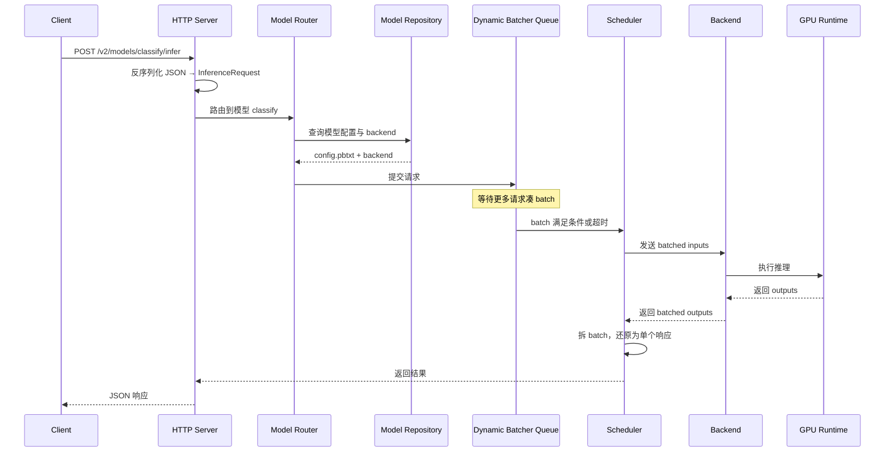
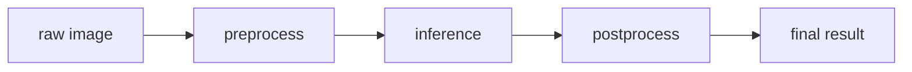

# 4. Runtime 工作流程

## 一个请求的完整生命周期

以下以 HTTP/REST 请求调用 `/v2/models/classify/infer` 为例，展示请求从进入到返回的全过程。



## 各阶段详解

### 1. 请求接入

Triton 支持三种主要接入方式：

- **HTTP/REST**：最通用，适合 Web / 移动端，默认端口 8000。
- **gRPC**：低开销，适合微服务间高吞吐通信，默认端口 8001。
- **C API**：最低延迟，适合把 Triton 嵌入到现有 C++ 应用中。

请求体遵循 Triton 的 inference protocol：

```json
{
  "inputs": [
    {
      "name": "image",
      "shape": [1, 3, 224, 224],
      "datatype": "FP32",
      "data": [0.1, 0.2, ...]
    }
  ]
}
```

### 2. 模型路由

Triton 从 URL 中解析模型名与版本：

- `/v2/models/classify/infer`：使用默认最新版本。
- `/v2/models/classify/versions/1/infer`：显式指定版本 1。

路由阶段还会检查：

- 模型是否已加载。
- 输入张量名称、数据类型、形状是否与 `config.pbtxt` 匹配。
- 请求的 batch size 是否超过 `max_batch_size`。

### 3. 调度：Dynamic Batching

Dynamic Batcher 维护一个每个模型独立的等待队列。当满足以下任一条件时，队列中的请求被拼成一个 batch：

- 请求数量达到 `preferred_batch_size`。
- 队列中最早请求等待时间超过 `max_queue_delay_microseconds`。
- 队列长度达到 `max_batch_size`。

示例：

```text
到达请求: [A, B, C, D, E]
preferred_batch_size = 4
max_queue_delay_microseconds = 10ms

调度结果:
- Batch 1: [A, B, C, D]  （凑够 4 个立即发送）
- Batch 2: [E]           （等待超时或新请求到达）
```

### 4. 调度：Sequence Batching

有状态模型（如对话）需要保证同一序列的请求按顺序执行。Sequence Batcher 的关键状态：

- `correlation_id`：标识一个用户会话。
- `CONTROL_SEQUENCE_START` / `READY` / `END`：控制序列生命周期。
- 同一 `correlation_id` 的所有请求必须路由到同一个模型实例。

### 5. 调度：Ensemble

Ensemble 模型不执行 kernel，只编排子模型。执行流程：

1. 从输入张量池开始，填充 ensemble 的原始输入。
2. 按 `ensemble_scheduling.step` 顺序执行每一步：
   - 根据 `input_map` 从张量池取出所需张量。
   - 调用子模型 backend。
   - 根据 `output_map` 把结果写回张量池。
3. 用张量池中的最终张量构造响应。



### 6. Backend 执行

Scheduler 把 batched 输入张量交给 backend。backend 负责：

- 把输入从 Triton 内存拷贝到 runtime 需要的内存（GPU / pinned memory）。
- 调用 runtime 执行推理。
- 把输出拷回 Triton 内存。
- 通知 scheduler 完成。

对于 vLLM / TensorRT-LLM backend，这里会触发 Continuous / In-flight Batching 的下一 step。

### 7. 响应返回

Scheduler 把 batched 输出按请求拆分，还原为单个响应。HTTP Server 序列化后返回：

```json
{
  "model_name": "classify",
  "outputs": [
    {
      "name": "class",
      "shape": [1, 1],
      "datatype": "INT64",
      "data": [42]
    }
  ]
}
```

## 延迟分解

Triton 的 Prometheus 指标把一次请求的延迟拆成三段：

- **Queue + Compute Input**：请求等待 batch 以及输入张量准备的时间。
- **Compute Infer**：backend 实际执行推理的时间。
- **Compute Output**：输出张量后处理与返回的时间。

在生产调优时，通常先看 **queue 时间**是否过长（说明 batch 没凑够或实例不足），再看 **compute infer**是否还有优化空间。

## 本章小结

Triton 的 runtime 流程可以概括为：**接入 → 路由 → 调度 → backend 执行 → 拆分返回**。Dynamic Batching 与 Sequence Batching 决定了请求如何被组合，Ensemble 决定了多模型链如何被执行，而 backend 只关心“把张量跑完”。

**参考来源**

- [Triton Protocol — HTTP/REST](https://docs.nvidia.com/deeplearning/triton-inference-server/user-guide/docs/protocol/extension_binary_data.html)
- [Triton Dynamic Batching](https://docs.nvidia.com/deeplearning/triton-inference-server/user-guide/docs/user_guide/model_configuration.html#dynamic-batcher)
- [Triton Sequence Batching](https://docs.nvidia.com/deeplearning/triton-inference-server/user-guide/docs/user_guide/model_configuration.html#sequence-batcher)
- [Triton Ensemble Models](https://docs.nvidia.com/deeplearning/triton-inference-server/user-guide/docs/user_guide/architecture.html#ensemble-models)
