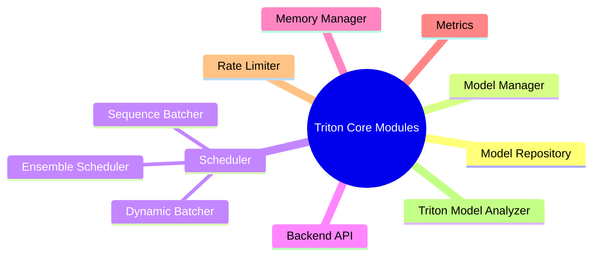
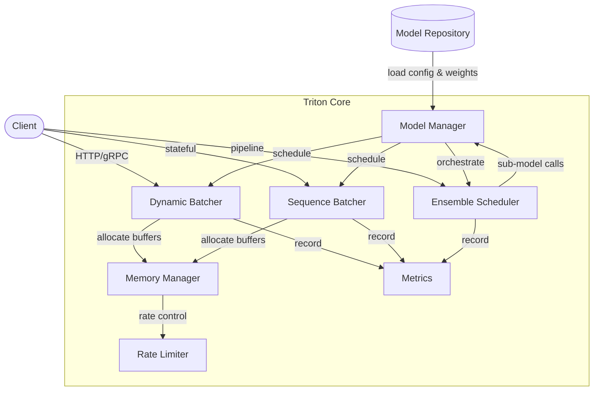

# 5. 核心模块

Triton Inference Server 的源码虽然庞大，但其核心模块可以归纳为以下八类：



## 1. Model Repository（模型仓库）

职责：

- 定义模型目录结构规范。
- 在启动时扫描并发现模型。
- 支持本地文件系统、S3、GCS、Azure Blob 等远程存储。
- 支持多版本目录（`1/`、`2/`）。

关键点：

- `config.pbtxt` 必须在模型根目录下。
- 远程仓库需要正确配置 credentials 与 polling interval。
- 版本目录号越大表示越新。

## 2. Model Manager（模型管理器）

职责：

- 维护所有已加载模型的生命周期。
- 根据 `--model-control-mode` 决定加载策略：
  - `none`：加载 repository 中所有模型，后续不自动更新。
  - `poll`：周期性扫描 repository，自动加载/卸载/更新模型。
  - `explicit`：通过 `LoadModel` / `UnloadModel` API 显式控制。
- 处理模型依赖：例如 ensemble 模型依赖的子模型必须先加载。
- 版本策略：默认加载最新版本，支持版本号映射。

## 3. Scheduler（调度器）

### Dynamic Batcher

- 每个启用 `dynamic_batching` 的模型独立拥有一个 batcher。
- 内部维护一个等待队列和定时器。
- 通过 `preferred_batch_size` 与 `max_queue_delay_microseconds` 平衡延迟与吞吐。
- 支持 `preserve_ordering` 以保证返回顺序。

### Sequence Batcher

- 用于有状态模型（stateful models）。
- 需要模型实现 `TRITONBACKEND_ModelInstanceState` 来维护序列状态。
- 通过 `correlation_id` 与 control inputs 管理序列开始/继续/结束。

### Ensemble Scheduler

- 没有自己的执行线程，只负责按依赖图调用子模型。
- 输入输出通过张量池（tensor pool）传递。
- 支持多分支、合并、条件执行等复杂拓扑。

## 4. Backend API

Backend API 是 Triton core 与 backend 之间的契约。每个 backend 需要实现一组 C 函数：

| 回调 | 作用 |
|---|---|
| `TRITONBACKEND_Initialize` | Backend 级初始化，读取 backend 配置 |
| `TRITONBACKEND_Finalize` | Backend 级清理 |
| `TRITONBACKEND_ModelInitialize` | 模型加载时调用 |
| `TRITONBACKEND_ModelFinalize` | 模型卸载时调用 |
| `TRITONBACKEND_ModelInstanceInitialize` | 每个实例创建时调用 |
| `TRITONBACKEND_ModelInstanceFinalize` | 每个实例销毁时调用 |
| `TRITONBACKEND_ModelExecute` | 执行一次推理 batch |

通过这组回调，Triton 可以管理 backend 的整个生命周期，并在不同 backend 之间复用统一的调度与内存管理。

## 5. Memory Manager（内存管理器）

Triton 需要高效地在客户端、core、backend、GPU 之间搬运张量。核心组件：

- **Pinned Memory Pool**：锁页内存，用于 CPU ↔ GPU 异步拷贝。
- **CUDA Memory Pool**：预分配 GPU 显存，减少 `cudaMalloc` 开销。
- **System Memory**：普通 CPU 内存，用于 CPU backend。
- **Shared Memory**：支持客户端与 Triton 进程之间零拷贝传输（Linux `/dev/shm`）。

配置示例：

```bash
tritonserver --cuda-memory-pool-byte-size=0:1073741824
```

## 6. Metrics（指标模块）

Triton 原生暴露 Prometheus 指标，默认端口 8002。

核心指标类别：

| 类别 | 示例 |
|---|---|
| 推理计数 | `nv_inference_count{model="classify",version="1"}` |
| 推理延迟 | `nv_inference_latency{model="classify"}` |
| 队列延迟 | `nv_inference_queue_duration_us` |
| GPU 显存 | `nv_gpu_memory_used_bytes{gpu="0"}` |
| GPU 利用率 | `nv_gpu_utilization_gpu{gpu="0"}` |
| 请求大小 | `nv_request_payload_size` |

这些指标可以直接被 Prometheus 抓取，并在 Grafana 中做 dashboard。

## 7. Rate Limiter（限流器）

用于多模型共享 GPU 时的资源分配：

- 限制每个模型实例占用的资源（如 GPU execution streams）。
- 支持 priority 与 resource 配置，避免一个模型把 GPU 占满导致其他模型饿死。
- 在 LLM 场景中特别重要，因为大模型实例可能长时间占用 compute。

## 8. Triton Model Analyzer

Model Analyzer 是一个独立工具，用于自动搜索最优配置：

- 扫描不同的 `max_batch_size`、`instance_group`、dynamic batching 参数组合。
- 在约束条件（延迟 P99、吞吐、显存）下寻找帕累托最优解。
- 输出推荐配置与性能报告。

典型工作流：

```bash
model-analyzer profile \
  --model-repository /models \
  --profile-models classify \
  --triton-launch-mode docker \
  --output-model-repository-path /output
```

## 模块协作图



## 本章小结

Triton 的核心模块围绕**模型仓库 → 模型管理 → 调度 → backend 执行 → 内存管理 → 指标与限流**展开。每个模块职责清晰，并通过 Backend API 解耦，使得新 backend 的接入不需要改动 core 的调度与网络逻辑。

**参考来源**

- [Triton Model Analyzer](https://github.com/triton-inference-server/model_analyzer)
- [Triton Backend API](https://github.com/triton-inference-server/backend/blob/main/README.md)
- [Triton Metrics](https://docs.nvidia.com/deeplearning/triton-inference-server/user-guide/docs/user_guide/metrics.html)
- [Triton Rate Limiter](https://docs.nvidia.com/deeplearning/triton-inference-server/user-guide/docs/user_guide/rate_limiter.html)
- [Triton Model Management](https://docs.nvidia.com/deeplearning/triton-inference-server/user-guide/docs/user_guide/model_management.html)
