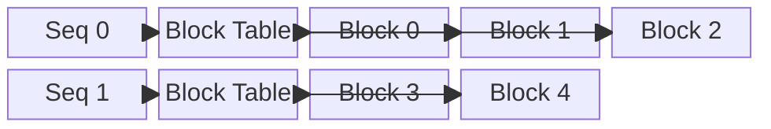

# 2. 核心思想

## 一句话理解

> vLLM 把 LLM 推理中的 KV Cache 当成操作系统的虚拟内存来管理：按需分配、按 Block 分页、动态映射，从而在不浪费显存的前提下持续动态批处理请求。

## 核心抽象

### 1. Sequence（序列）

一个 Sequence 代表一个用户请求从 prompt 到完整输出的 token 序列。在 vLLM 中，Sequence 是调度的基本单位。

### 2. Block（块）

Block 是 KV Cache 分页管理的基本单位，通常包含固定数量的 token（常见为 16）。每个 Block 在物理显存中占据连续空间，但一个 Sequence 的多个 Block 可以离散分布。vLLM 的 `KVCacheBlock` 数据结构包含：

- `block_id`：物理块唯一标识
- `block_hash`：块内容哈希，用于 prefix caching
- `ref_cnt`：引用计数，支持 Copy-on-Write 和跨请求共享

### 3. Block Table（块表）

Block Table 记录了每个 Sequence 的逻辑 Block 到物理 Block 的映射关系。它类似操作系统中的页表，是 PagedAttention 的核心数据结构。在 vLLM V1 中，`BlockTable` 使用二维 buffer 存储：`[max_num_reqs, max_num_blocks_per_req]`，配合 `num_blocks_per_row` 记录每个请求实际使用的块数。

### 4. Scheduler（调度器）

Scheduler 决定在当前 iteration 中，哪些 Sequence 可以进入 GPU 执行。它实现了 **Continuous Batching**（也称 iteration-level scheduling）。vLLM V1 的调度器更进一步，统一了 prefill 和 decode 阶段：每个请求只有 `num_computed_tokens` 和 `num_tokens_with_spec`，调度器在每轮尝试让 `num_computed_tokens` 追上 `num_tokens_with_spec`。

## 设计理念

### PagedAttention 的核心洞察

在 Transformer 的 decode 阶段，每次只生成一个新 token，但需要读取之前所有 token 的 Key 和 Value。这些 KV 张量如果静态分配，会留下大量未使用空间。vLLM 论文指出：

> "The key-value cache (KV cache) memory for each request is huge and grows and shrinks dynamically."

PagedAttention 的洞察是：

> 我们不需要为每个请求预先分配一段连续的大块显存。只需要在 token 实际产生时，按 Block 分配，并用 Block Table 记录映射关系。

### Continuous Batching 的核心洞察

传统批处理在 batch 内所有请求完成后才释放资源。Continuous Batching 则允许在每个 iteration 边界动态加入新请求或移出已完成请求，从而提高 GPU 利用率。vLLM V1 的调度算法不再区分 prefill 和 decode 阶段，而是统一处理 token 预算，这使得 chunked prefills、prefix caching 和 speculative decoding 可以自然结合。

## 为什么这样设计？

| 设计选择 | 解决的问题 | Trade-off |
|---|---|---|
| Block 分页 | 显存碎片、内部碎片 | 需要维护 Block Table，增加调度复杂度 |
| 动态分配 | 避免预分配浪费 | 需要更复杂的显存管理 |
| Continuous Batching | 提高吞吐、减少尾部延迟 | 调度开销增大，实现更复杂 |
| Copy-on-Write | 支持 beam search 等解码策略 | 增加了 Block 引用计数管理 |
| Prefix Caching | 避免重复计算共享前缀 | 需要哈希索引和引用计数 |

## 与操作系统的类比

| 操作系统 | vLLM |
|---|---|
| 虚拟内存页 | KV Cache Block |
| 页表 | Block Table |
| 物理页帧 | GPU 显存中的物理 Block |
| 按需分页（Demand Paging） | 按需分配 Block |
| Copy-on-Write Fork | Block 共享 + 引用计数 |

## 本章小结

vLLM 的核心思想可以概括为：**用分页管理 KV Cache，用迭代级调度持续批处理请求**。这两个机制共同解决了 LLM 推理中的显存与吞吐矛盾，而 vLLM V1 通过统一 prefill/decode 调度，进一步提升了系统的灵活性和性能上限。
