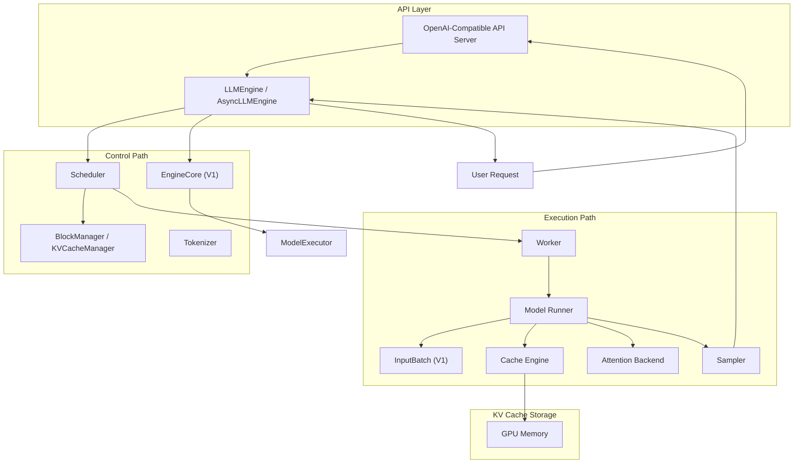

# 3. 架构设计

vLLM 的架构围绕 "如何高效地调度请求、管理 KV Cache、执行模型推理" 展开。整体可以分为控制路径与执行路径两层。

从 vLLM 0.6+ 开始，社区并行开发了新的 **V1 引擎**（`vllm.v1`），对调度器、执行器、KV cache 管理进行了重构，目标是更低的调度开销、更好的 chunked prefill / prefix caching / speculative decoding 支持。本章在介绍经典架构的同时，会标注 V1 引擎的变化。

## 整体架构图



## 各组件职责

### 1. API Server

接收 HTTP / gRPC 请求，提供 OpenAI 兼容的 `/v1/completions` 和 `/v1/chat/completions` 接口。负责：

- 请求解析与参数校验
- 请求封装为 `SequenceGroup`
- 流式/非流式响应返回

### 2. LLMEngine / AsyncLLMEngine

整个推理引擎的控制中心。

- `LLMEngine`：同步接口，适合离线批处理
- `AsyncLLMEngine`：异步接口，支持高并发在线服务

职责：
- 维护请求队列
- 驱动 Scheduler 进行每轮调度
- 收集 Worker 输出并返回给 API Server

### 3. Scheduler

决定每一轮 iteration 中哪些 Sequence 进入 GPU 执行。核心功能：

- 维护 `Waiting`、`Running`、`Swapped` 三个队列（经典引擎）
- 根据 token 预算和显存预算选择可执行的 Sequence
- 实现 Continuous Batching
- 支持 preemption（抢占）和 recomputation（重算）

在 **V1 引擎** 中，调度器进行了重构：

- 不再区分 prefill / decode 阶段，而是统一处理 `num_computed_tokens` 和 `num_tokens_with_spec`
- 调度器输出 `SchedulerOutput`，包含每个请求本轮应计算的 token 数
- 通过 `token_budget` 控制每轮总计算量，天然支持 chunked prefills

### 4. BlockManager / KVCacheManager

管理 GPU 上的 KV Cache Block。核心功能：

- Block 分配与回收
- Block Table 维护
- Copy-on-Write 支持
- Prefix Caching（前缀缓存）

V1 中由 `KVCacheManager` 管理 `KVCacheBlock`，支持 hybrid block sizes（内存分配块大小与 kernel 块大小可以不同）。

### 5. Worker / Model Runner

Worker 是模型执行的实际工作者。每个 Worker 可能对应一个 GPU。Model Runner 负责：

- 加载模型权重
- 执行 forward（prefill / decode）
- 调用 Attention Backend 计算注意力
- 调用 Sampler 采样下一个 token

V1 的 `GPUModelRunner` 维护一个 `InputBatch` 对象，根据每轮的 `SchedulerOutput` 重新构建输入张量，并调用高度优化的 attention kernel。

### 6. Cache Engine

管理 KV Cache 在 GPU 显存中的物理布局。负责：

- 为当前 iteration 准备 KV Cache
- Block 之间的拷贝与 swap
- CPU offloading（可选）

### 7. Attention Backend

vLLM 支持多种注意力实现：

- FlashAttention
- FlashInfer
- XFormers
- PagedAttention（自定义 CUDA kernel）

Attention Backend 根据硬件和模型自动选择最合适的实现。

### 8. Tokenizer

将文本输入转换为 token ID，并将模型输出的 token ID 解码为文本。

## 分布式推理

vLLM 支持多种分布式并行策略：

### Tensor Parallelism（TP，张量并行）

把模型层的计算切分到多个 GPU 上。vLLM 采用 Megatron-LM 的 tensor parallel 算法，默认使用 PyTorch 的 distributed tensor。适用于单节点多 GPU。

配置方式：

```bash
python -m vllm serve meta-llama/Llama-3.1-8B --tensor-parallel-size 2
```

### Pipeline Parallelism（PP，流水线并行）

把模型按层切分到多个 GPU 上，适合超大规模模型跨节点部署。可以与 TP 组合使用：

```python
llm = LLM(
    model="meta-llama/Llama-3.3-70B-Instruct",
    tensor_parallel_size=4,
    pipeline_parallel_size=2,
)
```

### 其他并行

- **Data Parallelism（DP）**：每个 GPU 持有模型副本，处理不同数据 batch
- **Context Parallelism（CP）**：针对长上下文 decode 阶段优化

### TP vs PP 的选择

| 维度 | TP | PP |
|---|---|---|
| 切分粒度 | 层内 | 层间 |
| 通信量 | 大（每层 all-reduce） | 小（stage 间传激活） |
| 适用场景 | 单节点多 GPU | 跨节点大模型 |
| 主要 overhead | 通信延迟 | Pipeline bubble |

## 本章小结

vLLM 的架构清晰分层：API 层负责接入，控制层负责调度与显存管理，执行层负责模型推理。BlockManager 与 Scheduler 是 vLLM 区别于其他推理引擎的核心。
