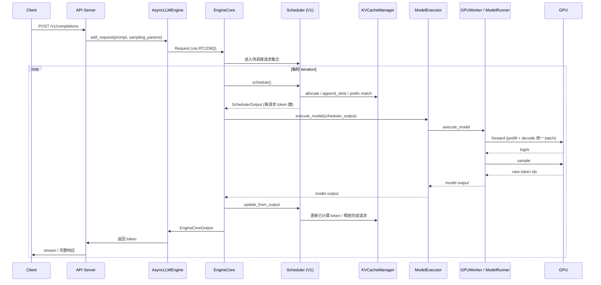

# 4. Runtime 工作流程

本章从一条 HTTP 请求进入 vLLM 开始，一直讲到最终 token 返回客户端，完整描述 vLLM 的运行时生命周期。当前默认 V1 引擎的调度与执行流程较经典引擎有显著变化，会重点说明。

## 完整时序图（V1 引擎）

## 阶段一：请求接入

1. 客户端发送 HTTP 请求到 API Server。
2. API Server 解析请求参数，调用 Tokenizer 将 prompt 编码为 token IDs。
3. API Server 创建 `Request` 并调用 `AsyncLLMEngine.add_request()`。
4. 在 V1 引擎中，请求通过 IPC（默认 ZMQ）发送给 **EngineCore** 进程；经典引擎则放入 Scheduler 的 **Waiting 队列**。

## 阶段二：调度（Schedule）

V1 引擎中，调度由 `vllm/v1/core/scheduler.py` 完成，核心变化：

1. 不再区分 prefill / decode 队列，所有请求统一维护 `num_computed_tokens` 与 `num_tokens_with_spec`。
2. 每轮根据 `token_budget` 决定每个请求本轮应计算的 token 数量。
3. 为选中的 token 范围分配 KV Cache Block（`KVCacheManager.allocate` / `append_slots`）。
4. 支持 prefix caching：先匹配已缓存前缀，再分配剩余 Block。
5. 返回 `SchedulerOutput`，包含 `num_scheduled_tokens` 和对应的 Block 信息。

经典引擎的调度器维护 `Waiting / Running / Swapped` 三个队列，按 prefill / decode 分开调度。

## 阶段三：模型执行（Execute Model）

`EngineCore` 拿到 `SchedulerOutput` 后，调用 `ModelExecutor.execute_model`：

1. `GPUModelRunner` 根据 `SchedulerOutput` 构造 `InputBatch`。
2. `GPUModelRunner.forward` 调用 attention backend 与 sampler。
3. Attention kernel 根据 `SchedulerOutput` 中的 `num_scheduled_tokens` 同时处理新 prompt token 和 decode token（统一 batch）。
4. Sampler 采样出下一个 token。

### Prefill 与 Decode 在 V1 中的统一

V1 调度器不再显式区分 prefill 和 decode。每个请求只有“还需要计算多少 token”，attention kernel 根据各请求的 `num_scheduled_tokens` 决定是做 full attention（新 token 多）还是 single-token decode。

## 阶段四：状态更新与输出

1. Worker 将新的 token 返回给 EngineCore。
2. Scheduler 更新每个请求：
   - `num_computed_tokens += num_scheduled_tokens`
   - 如果请求完成（EOS 或达到 max_tokens），释放 Block 并从运行集合移除。
3. EngineCore 将输出回传给 AsyncLLMEngine。
4. API Server 将 token 返回给客户端（流式或非流式）。

## 迭代级调度的关键

传统批处理一旦开始，batch 大小固定。vLLM 的 Continuous Batching 允许在每轮 iteration 的边界：

- 新请求加入 batch
- 已完成请求退出 batch
- 长 prefill 被 chunk 成多轮，与 decode 交错执行
- 被抢占的请求重新进入（经典引擎）

V1 引擎进一步将 prefill 与 decode 统一调度，使 GPU 在每个 iteration 都能保持高利用率，并自然支持 chunked prefill、prefix caching 和 speculative decoding。

## 本章小结

vLLM 的运行时可以概括为：`接入 → 调度 → 执行 → 输出 → 状态更新` 的循环。V1 引擎通过 EngineCore 统一调度与执行，消除了 prefill/decode 的显式边界，是实现高吞吐与低延迟的关键。
