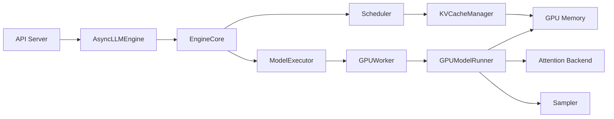

# 5. 核心模块

本章拆解 vLLM 中每个核心模块的职责、输入、输出、生命周期、异常处理与扩展方式。当前 vLLM 默认使用 V1 引擎，因此会同时覆盖 V1 与经典引擎（V0）的模块。

## 1. AsyncLLMEngine / LLMEngine

### 职责

用户与 vLLM 推理系统交互的主入口。V1 引擎中，`AsyncLLMEngine` 是 `vllm.v1.engine.async_llm.AsyncLLM` 的别名/包装。

- 接收 `add_request` 请求并转发给 EngineCore（V1）或 Scheduler（V0）。
- 通过 `generate` 以异步生成器形式返回 token。
- 管理请求生命周期、输出后处理与 detokenization。

### 输入

- prompt / token IDs
- `SamplingParams`
- 请求 ID 与路由信息

### 输出

- `RequestOutput`（包含 generated tokens、finish reason 等）

### 生命周期

随服务进程启动而创建，随进程退出而销毁。

### 异常处理

- 请求超时：按策略取消或丢弃
- EngineCore 失联：重连或报错

---

## 2. EngineCore（V1）

### 职责

V1 引擎中，调度与执行的核心进程。`vllm/v1/engine/core.py` 实现。

- 持有 Scheduler 与 ModelExecutor。
- 每轮调用 `Scheduler.schedule()`，再调用 `ModelExecutor.execute_model()`。
- 支持 `step_with_batch_queue`，在 pipeline parallelism 下异步调度。

### 输入

- 来自 AsyncLLMEngine 的 Request
- 来自 GPU Worker 的 model output

### 输出

- `EngineCoreOutput`：新的 token、请求状态更新、finished 请求

### 生命周期

服务启动时初始化，独立进程运行。

### 异常处理

- CUDA OOM：通过调度器减少 token budget
- 模型执行失败：上报错误并释放相关请求

---

## 3. Scheduler

### 职责

决定每一轮 iteration 中哪些请求进入 GPU 执行。

### V1 调度器（`vllm/v1/core/scheduler.py`）

- 维护所有请求的统一状态：`num_computed_tokens`、`num_tokens_with_spec`。
- 每轮计算 `num_scheduled_tokens`，目标让 `num_computed_tokens` 追上 `num_tokens_with_spec`。
- 受全局 `token_budget` 限制，天然支持 chunked prefill。
- 与 `KVCacheManager` 交互分配 Block。

### V0 调度器（`vllm/core/scheduler.py`）

- 维护 `Waiting / Running / Swapped` 三个队列。
- 分别调度 prefill 与 decode。

### 输入

- 当前所有请求的状态
- KV Cache 预算
- token budget

### 输出

- `SchedulerOutput`（V1）或 `SchedulerOutputs`（V0）

### 生命周期

每轮 `EngineCore.step()` / `LLMEngine.step()` 调用一次。

### 异常处理

- 显存不足：触发抢占（V0）或减少本轮 token（V1）
- 请求超时：根据配置丢弃

### 扩展方式

可通过自定义 `Scheduler` 子类实现不同的调度策略（如优先级调度、公平调度）。

---

## 4. KVCacheManager / BlockManager

### 职责

管理 GPU 上 KV Cache Block 的分配、回收、映射与前缀缓存。

### V1：`vllm/v1/core/kv_cache_manager.py`

- 管理 `KVCacheBlock`。
- 支持 hybrid block sizes：内存分配块大小与 attention kernel 块大小可以不同。
- 维护 block hash 索引，实现 prefix caching。
- 支持 Copy-on-Write 与引用计数。

### V0：`vllm/core/block_manager.py`

- 管理 `PhysicalTokenBlock`。
- 维护 Block Table。
- 支持 prefix caching 与 swapping。

### 输入

- 请求的 token 范围
- Block 大小
- 分配 / 释放 / 拷贝请求

### 输出

- Block Table（V1 中为 `BlockTable` buffer）
- 物理 Block ID 列表

### 生命周期

伴随请求从创建到销毁。请求完成时回收 Block。

### 异常处理

- Block 不足：触发 swapping（V0）或降低调度量（V1）
- 引用计数错误：可能导致 Block 泄漏

### 扩展方式

V1 的 `KVCacheManager` 接口更统一，便于接入新的 attention backend。

---

## 5. ModelExecutor / Worker

### 职责

执行实际的模型推理，管理 GPU 设备。

### V1：`vllm/v1/executor/` + `vllm/v1/worker/gpu_worker.py`

- `ModelExecutor` 负责任务分发到 Worker。
- `GPUWorker` 在每个 GPU 进程上运行。
- `GPUModelRunner` 负责具体的 forward。

### V0：`vllm/executor/` + `vllm/worker/worker.py`

- `Worker` 执行模型 forward。
- `ModelRunner` 组织 attention、MLP、sampler 调用。

### 输入

- `SchedulerOutput`
- 模型权重
- KV Cache 布局 / Block Table

### 输出

- 采样后的 token IDs
- logits / hidden states

### 生命周期

从 Engine 初始化时创建，到进程退出时销毁。

### 异常处理

- CUDA OOM：捕获并上报
- NCCL 错误：在分布式场景下需要重启

### 扩展方式

支持本地 Worker、Ray Worker、多节点 Worker。

---

## 6. GPUModelRunner / ModelRunner

### 职责

组织模型 forward 的具体执行，包括 attention、MLP、sampler 的调用顺序。

### V1：`vllm/v1/worker/gpu_model_runner.py`

- 维护 `InputBatch`，根据 `SchedulerOutput` 每轮重新构造输入张量。
- 调用 `attention` 模块与 `sampler`。

### 输入

- token IDs
- positions
- Block Tables / `SchedulerOutput`
- attention metadata

### 输出

- logits
- sampled tokens

### 生命周期

每个 Worker 持有一个 Model Runner。

### 扩展方式

支持不同模型架构（Llama、Qwen、Mistral 等）通过 `ModelRegistry` 注册。

---

## 7. Attention Backend

### 职责

提供高效的注意力计算实现。

### 实现选项

- FlashAttention
- FlashInfer
- XFormers
- PagedAttention（vLLM 自定义 CUDA kernel）

### 选择逻辑

根据 GPU 架构、模型类型、是否使用 prefix caching / chunked prefill 自动选择。

---

## 8. Tokenizer

### 职责

文本与 token ID 的相互转换。

### 注意点

- 不同模型的 tokenizer 不同
- detokenization 需要处理 unicode 多字节字符
- V1 中 detokenization 在 AsyncLLMEngine 端完成

---

## 9. API Server

### 职责

提供 OpenAI 兼容的 HTTP 接口。

### 输入

- HTTP 请求

### 输出

- HTTP 响应（流式或非流式）

### 扩展方式

vLLM 的 API Server 基于 FastAPI，可以自定义中间件、认证、路由。

## 模块协作图（V1）

## 本章小结

vLLM 的模块划分清晰，每个模块只负责一个明确的职责。V1 引擎通过 EngineCore 将调度与执行紧密整合，Scheduler 与 KVCacheManager 是 vLLM 性能优势的核心来源。
