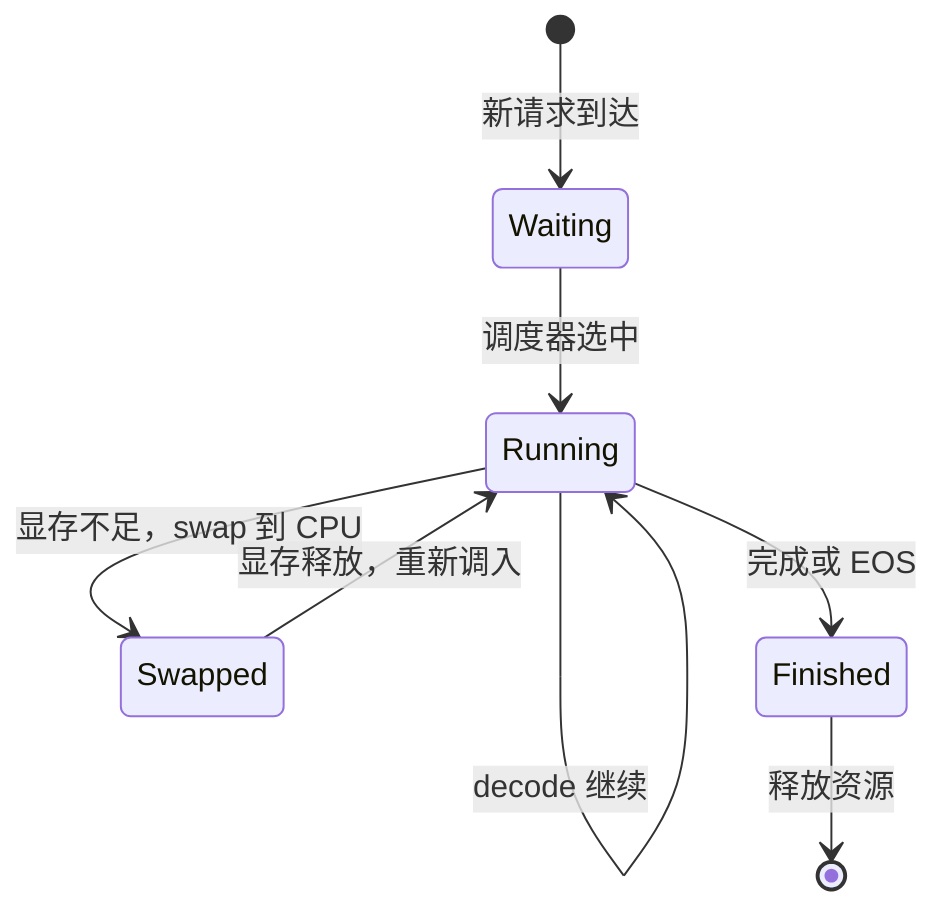

# 6. 源码分析

本章基于 vLLM GitHub 源码，分析其目录结构、模块划分、入口函数与调用链。截至 2026 年中，vLLM 主分支已默认使用 V1 引擎，`vllm/engine/async_llm_engine.py` 中的 `AsyncLLMEngine` 已作为 `vllm.v1.engine.async_llm.AsyncLLM` 的别名重新导出。因此源码分析需要同时理解经典引擎（V0）和 V1 引擎两条路径。

## 仓库结构

```
vllm/
├── vllm/
│   ├── entrypoints/          # API Server、CLI 入口
│   │   ├── openai/           # OpenAI 兼容 API
│   │   └── llm.py            # LLM 类入口（离线推理）
│   ├── engine/               # 经典引擎（V0）兼容层
│   │   ├── llm_engine.py     # 现为 V1 AsyncLLM 的别名/包装
│   │   ├── async_llm_engine.py # AsyncLLMEngine = AsyncLLM (V1)
│   │   ├── arg_utils.py      # 参数解析
│   │   └── output_processor/
│   ├── v1/                   # V1 引擎核心（当前默认）
│   │   ├── engine/
│   │   │   ├── async_llm.py  # AsyncLLM 实现
│   │   │   ├── core.py       # EngineCore：调度器 + KV cache 管理
│   │   │   └── llm_engine.py # LLMEngine 包装
│   │   ├── core/
│   │   │   ├── scheduler.py  # V1 统一调度器
│   │   │   └── kv_cache_manager.py # KVCacheManager
│   │   ├── worker/
│   │   │   ├── gpu_worker.py # GPU Worker 进程
│   │   │   ├── gpu_model_runner.py # Model Runner
│   │   │   └── block_table.py # BlockTable
│   │   └── executor/
│   ├── core/                 # V0 核心数据结构与调度
│   │   ├── scheduler.py
│   │   ├── block_manager.py
│   │   └── sample/
│   ├── worker/               # V0 Worker 实现
│   ├── model_executor/       # 模型执行层（V0/V1 共享大部分）
│   │   ├── layers/
│   │   ├── models/
│   │   └── attention/
│   ├── sequence.py
│   └── sampling_params.py
├── tests/
└── examples/
```

## 关键入口函数（V1 引擎）

### 1. `AsyncLLMEngine.add_request`

接收新请求，封装为 `Request`，通过 IPC 发送给 EngineCore。

### 2. `EngineCore.step` / `step_with_batch_queue`

V1 引擎每轮调度的核心：

```python
# 伪代码
scheduler_output = self.scheduler.schedule()
model_output = self.model_executor.execute_model(scheduler_output)
engine_core_outputs = self.scheduler.update_from_output(
    scheduler_output, model_output
)
```

V1 支持 batch queue，允许在 pipeline parallelism 场景下异步调度与执行。

### 3. `Scheduler.schedule`（V1）

不再区分 prefill / decode。核心逻辑：

```python
# 为每个请求计算 num_scheduled_tokens
# 目标：让 num_computed_tokens 追上 num_tokens_with_spec
# 受 token_budget 限制
```

### 4. `GPUWorker.execute_model`

执行模型 forward，由 `GPUModelRunner` 实际运行。

### 5. `GPUModelRunner.forward`

组织 attention、MLP、sampler 调用，维护 `InputBatch`。

## 调用链（V1）

```
OpenAIServingCompletion.create_completion
  → AsyncLLMEngine.add_request
    → EngineCore 接收 Request
  → AsyncLLMEngine.generate
    → EngineCore.step (循环)
      → Scheduler.schedule
        → KVCacheManager.allocate / append_slots
      → ModelExecutor.execute_model
        → GPUWorker.execute_model
          → GPUModelRunner.forward
            → Attention Backend
            → Sampler
      → Scheduler.update_from_output
    → yield token
```

## 状态流转

### Sequence 状态



### Block 状态

- Free：未被使用
- Allocated：被某个 Sequence 占用
- Swapped：被 swap 到 CPU

## 设计思路

vLLM 源码的核心设计思想：

1. **解耦控制与执行**：Scheduler 只负责调度决策，Worker 只负责执行。
2. **显存与计算分离**：BlockManager 管理显存，Model Runner 不直接操作显存布局。
3. **插件化模型支持**：通过 `ModelRegistry` 注册不同模型架构。
4. **多后端注意力**：根据硬件自动选择最优 Attention Backend。

## 本章小结

vLLM 源码虽然庞大，但核心路径清晰。理解 `LLMEngine.step()` → `Scheduler.schedule()` → `Worker.execute_model()` 这条主线，就能把握整个系统。
