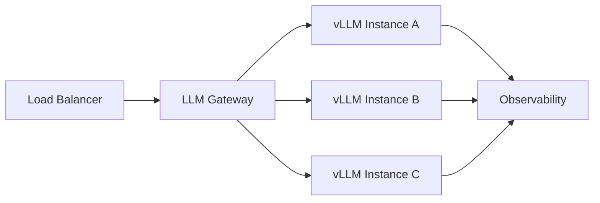

# 8. 企业生产实践

本章结合真实公司与场景，分析 vLLM 在生产环境中的部署方式、优化手段与踩坑经验。

## 典型生产架构

## 各公司实践

### Together AI / Fireworks AI

这两家是 vLLM 的早期采用者与积极推动者，主要经验：

- 使用 vLLM 的 PagedAttention 提升多租户场景下的显存利用率
- 结合自定义调度策略优化长尾延迟
- 强调 prefix caching 在长 system prompt 场景下的收益
- 针对自家硬件和负载定制 Attention Kernel 与调度器

### AWS SageMaker

AWS 在 SageMaker 中支持 vLLM 作为推理后端：

- 与 EC2 GPU 实例（如 g5/p4d）集成
- 通过 SageMaker Endpoint 暴露模型服务
- 利用 CloudWatch 进行可观测性

### 腾讯

腾讯基于 vLLM 构建了 **Prefill-Decode（PD）分离推理框架**，并已在多个业务场景中大规模部署。PD 分离的核心思想是把计算密集的 prefill 阶段与内存带宽密集的 decode 阶段解耦到不同实例，从而分别优化资源利用率。

### 蚂蚁集团

蚂蚁集团的基础设施团队在 DeepSeek 推理优化中，通过 GPU 内存优化、延迟降低、单节点多模型部署以及 PD 分离架构，基于 vLLM 实现了 **10 倍的推理性能提升**。

### 字节跳动

字节跳动的 **AIBrix v0.4.0** 控制平面与 vLLM 紧密集成，基于字节内部大量在线 workload 实践，解决大规模模型推理中效率与成本的平衡问题。AIBrix 提供了自动扩缩容、LoRA 管理、KV cache 转移等能力。

### Moonshot AI / 小米

- **Moonshot AI**：在生产环境中运行 Kimi K2 模型，面临高并发在线推理与 RL 训练需求的双重压力，基于 vLLM 设计了硬件与负载感知的部署策略。
- **小米**：在 vLLM 内部实现了原生的 PD 分离方案，使用点对点 NCCL 通信，并在真实部署中取得了显著性能提升。

### 阿里云 / 腾讯云

国内云厂商通常的做法：

- 将 vLLM 封装为 PaaS 推理服务
- 结合自研 LLM Gateway 做流量调度与配额管理
- 针对国内模型（如 Qwen、Baichuan）做适配与优化

## 关键优化手段

### 1. Tensor Parallelism / Pipeline Parallelism

- TP：适合单节点多 GPU，通信 overhead 在 NVLink 下可接受
- PP：适合超大模型跨节点部署，但会增加 bubble

### 2. Quantization

vLLM 当前支持的量化格式非常丰富：FP8、MXFP8/MXFP4、NVFP4、INT8、INT4、GPTQ、AWQ、GGUF、compressed-tensors、ModelOpt、TorchAO 等。

生产中最常用的选择：

- **FP8**：在 H100/H200 等 Hopper/Blackwell 架构上性能最好，推荐使用 `llm-compressor` 做校准
- **AWQ / GPTQ**：4-bit 权重量化，显著降低显存占用
- **compressed-tensors / GGUF**：适合直接部署社区预量化模型

注意：量化可能带来精度损失，需要在业务指标和 perplexity 上评估容忍度。MXFP4 activations 尚未完全支持，MXFP8 仍处于实验阶段，NVFP4 主要面向 Blackwell。

### 3. Prefix Caching

对共享系统 prompt 或长前缀的请求，缓存其 KV Cache，避免重复计算。

### 4. Speculative Decoding

用小模型（draft model）快速生成候选 token，再用大模型验证，可显著降低 latency。

### 5. 可观测性

- 监控指标：TTFT（Time To First Token）、TPOT（Time Per Output Token）、throughput、KV Cache 利用率
- 日志：请求生命周期、调度决策、错误堆栈
- 追踪：OpenTelemetry 接入

## 常见踩坑

| 问题 | 原因 | 解决 |
|---|---|---|
| CUDA OOM | KV Cache 增长超过预期 | 调整 max_num_seqs、max_model_len、block_size |
| 尾延迟高 | 长序列阻塞短序列 | 调整调度策略、启用抢占/swapping |
| 吞吐不达预期 | batch size 不够大 | 优化 Continuous Batching、降低 pad 开销 |
| 分布式卡死 | NCCL 通信问题 | 检查网络拓扑、CUDA_VISIBLE_DEVICES、RDMA 配置 |
| 模型输出异常 | 量化精度损失 | 评估 AWQ/GPTQ/FP8 的 perplexity 变化 |

## 本章小结

vLLM 在生产环境中的成功不仅取决于软件本身，还取决于硬件选型、分布式并行、量化策略、调度调优和可观测性的系统工程能力。
