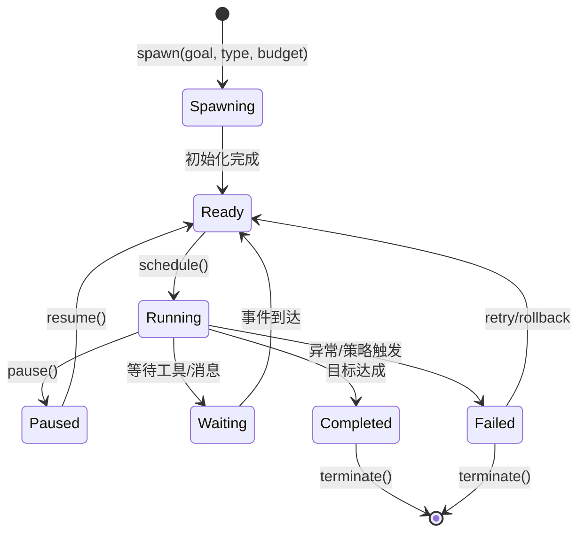
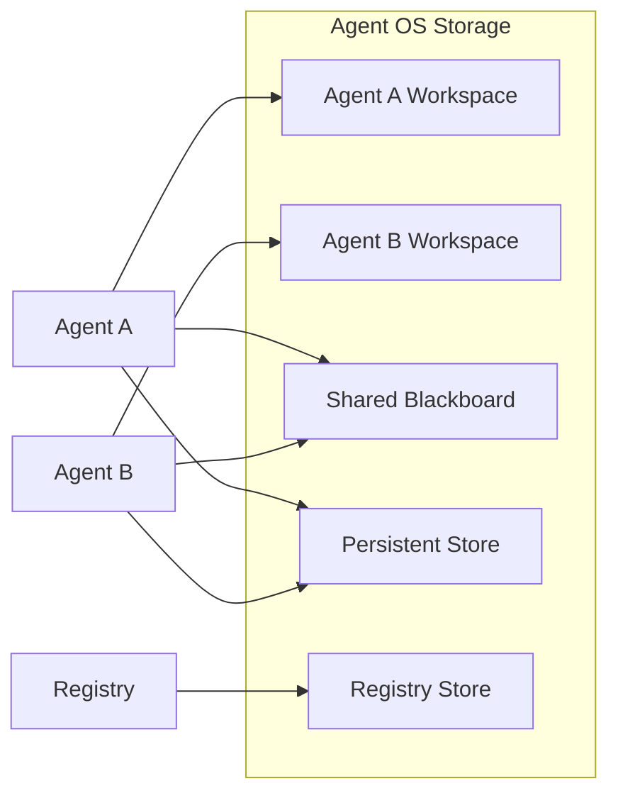
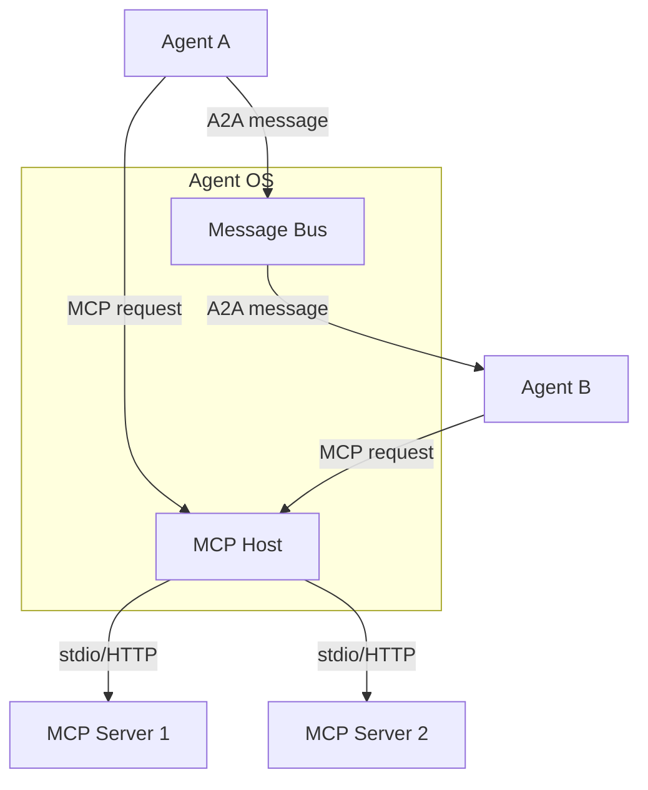

# 核心思想

> 一句话理解：**Agent OS 的核心思想是把 Agent 抽象为“进程”，并围绕进程构建调度、隔离、存储、通信、治理与恢复六大能力。**

## 1. Agent as Process：Agent 即进程

传统操作系统通过进程抽象程序的执行。Agent OS 把 Agent 也抽象为进程：

- **Spawn**：根据 Agent 类型创建实例，分配 PID（或 Agent ID）、命名空间、初始预算。
- **Run**：把 Agent 放入调度队列，分配 CPU/Token/时间片。
- **Pause / Resume**：长程任务可以中断，状态持久化后恢复。
- **Terminate**：任务完成、失败或策略触发时结束进程，回收资源。

把 Agent 当作进程的好处：

- 可以复用操作系统成熟的资源隔离、调度、审计概念。
- 多 Agent 之间的边界清晰，避免状态污染。
- 支持抢占、配额、优先级等高级调度策略。

## 2. Scheduler：调度器

Agent OS 的调度器决定“哪个 Agent 在什么时候获得多少资源”。

### 协作式 vs 抢占式

- **协作式（Cooperative）**：Agent 主动让出控制权，适合工具调用型任务，实现简单但容易被恶意/异常 Agent 霸占资源。
- **抢占式（Preemptive）**：OS 强制中断 Agent，按时间片/Token 预算重新分配，适合多租户与长程任务，但实现复杂。

### MLFQ 与 AgentRM

AgentRM（arXiv:2603.13110）提出多级反馈队列（MLFQ）风格的 Agent 调度：

- 新 Agent 进入高优先级队列。
- 如果 Agent 频繁失败或超预算，降低优先级。
- 如果 Agent 稳定完成，可获得更多时间片或提升优先级。

### Token 预算与 HiveMind

HiveMind（arXiv:2604.17111）把 Token 作为核心资源进行调度与预算控制：

- 每个 Agent/任务有 Token 预算。
- 调度器在 Token 消耗接近上限时触发减速、暂停或终止。
- 支持跨任务的 Token 配额分配与抢占。

### Admission Control

调度器还需要做准入控制：

- 检查当前系统负载、租户配额、依赖服务可用性。
- 拒绝或排队无法满足 SLO 的请求。

来源：
- [AgentRM: A Resource Management Framework for LLM Agents](https://arxiv.org/abs/2603.13110)
- [HiveMind: Token-Centric Scheduling for LLM Agents](https://arxiv.org/abs/2604.17111)

## 3. Sandbox & Isolation：沙箱与隔离

Agent 调用外部工具时具有潜在破坏力，必须隔离。

### 能力模型（Capability Model）

借鉴操作系统的能力模型：

- 每个 Agent 拥有有限的能力集合，例如 `[read_file, search_web, send_email]`。
- Agent 不能获得超出其能力集合的权限。
- 能力可以按命名空间、版本、租户进行划分。

### 权限边界

- **Allowed Tool List**：明确允许调用的工具白名单。
- **Resource Limits**：最大调用次数、最大执行时间、最大 Token 消耗、最大网络请求次数。
- **Workspace Isolation**：每个 Agent 只能访问自己的工作目录。
- **Process Isolation**：AgentSys（arXiv:2602.07398）提出 worker agent 运行在独立进程中，避免一个 Agent 的崩溃影响其他 Agent。

### Checkpoint / Rollback

DeltaBox（arXiv:2605.22781）提出对 Agent 执行状态进行 checkpoint，并在失败时回滚到上一个稳定状态：

- 在关键步骤前保存状态快照。
- 失败时回滚，避免副作用累积。
- 支持分支执行与对比不同路径。

来源：
- [AgentSys: Building Efficient Multi-Agent Systems with Worker Agents](https://arxiv.org/abs/2602.07398)
- [DeltaBox: Checkpoint and Rollback for LLM Agents](https://arxiv.org/abs/2605.22781)

## 4. Workspace / Storage：工作区与存储

Agent OS 提供类似文件系统的存储抽象：

- **Per-Agent Working Memory**：每个 Agent 私有的临时工作空间。
- **Shared Blackboard**：多个 Agent 可协作读写的共享空间。
- **Persistent Store**：长程任务的状态持久化。
- **Registry Store**：Agent 类型、技能、工具的元数据。

Workspace 与 Memory 主题的区别：

- **Agent OS Workspace**：关注“在哪里存、谁能访问、生命周期如何”。
- **Memory 主题**：关注“存什么、怎么检索、怎么向量化、怎么压缩”。

## 5. Registry：注册表

Registry 是 Agent OS 的“元数据中心”：

- **Agent Types**：可创建的 Agent 类型定义（角色、能力、默认工具、默认策略）。
- **Skills / Tools**：可用技能的 schema、版本、命名空间、依赖。
- **Versions**：Agent 类型与技能的版本管理，支持灰度升级。
- **Namespaces**：按团队/租户/项目划分命名空间。
- **Entitlements**：谁能创建哪种 Agent、谁能使用哪个工具。

Registry 与 MCP 的关系：

- MCP Server 提供工具实现与能力描述。
- Agent OS Registry 管理这些能力在组织内的注册、授权与版本。

## 6. Messaging / IPC：消息与进程间通信

Agent 之间需要通信协作。Agent OS 提供消息总线：

- **Agent-to-Agent**：直接消息、发布/订阅、请求/响应。
- **MCP as Syscall**：Agent 到工具的调用被抽象为“系统调用”。
- **A2A as IPC Bus**：Google 的 A2A 协议可作为 Agent 之间的 IPC 总线，标准化 Agent 之间的能力发现与协作。

## 7. Security & Governance：安全与治理

Agent OS 是安全策略的强制执行点（Policy Enforcement Point，PEP）。

### Host 作为策略执行点

MCP Host 位于 Agent 与工具之间，天然适合执行策略：

- 校验每次工具调用是否在允许列表内。
- 检查参数是否符合安全策略。
- 记录审计日志。
- 对敏感操作触发人工审批（HITL）。

### Governed MCP 与 ProbeLogits

- **Governed MCP**（arXiv:2604.16870）提出把治理规则嵌入 MCP Host，实现能力注册、授权、审计、consent 管理。
- **ProbeLogits**（arXiv:2604.11943）提出通过探测 LLM 的 logits 来识别潜在的有害输出或越权行为，在生成阶段进行干预。

来源：
- [Governed MCP: From Technical Specifications to Multi-Agent Governance](https://arxiv.org/abs/2604.16870)
- [ProbeLogits: Probing LLM Logits for Safety and Governance](https://arxiv.org/abs/2604.11943)

### Consent 与审计

- **Consent**：用户对 Agent 能力的授权需要显式记录，支持撤销。
- **Audit Log**：记录 Agent 的全生命周期事件、工具调用、策略决策、人工干预。

## 8. Human-in-the-Loop（HITL）

Agent OS 在关键节点引入人类：

- 创建高权限 Agent 时的人工审批。
- 敏感工具调用前的人工确认。
- 失败/异常时的人工接管。
- 长程任务中断后的人工恢复决策。

HITL 不是阻碍，而是让 Agent 系统在安全边界内自治的关键机制。

## 9. Observability：可观测性

Agent OS 需要完整的可观测能力：

- **Spans / Traces**：跨 Agent、跨工具调用的请求链路。
- **Metrics**：调度延迟、Token 消耗、工具调用成功率、Agent 状态分布。
- **Reasoning Traceability**：记录 Agent 的思考路径，支持事后审计与调试。
- **Logs**：结构化日志，支持按 Agent ID、工具、租户、策略事件检索。

## 10. Recovery：恢复

Agent OS 需要面对 Agent 失败后的恢复：

- **Retry**：对可恢复错误进行指数退避重试。
- **Checkpoint/Rollback**：保存状态快照，失败后回滚。
- **Escalation**：失败无法自动恢复时升级给人类或其他 Agent。
- **Circuit Breaker**：对连续失败的工具/服务熔断，避免级联故障。

## 本章小结

- Agent OS 的十大核心思想：Agent as Process、Scheduler、Sandbox、Capability Model、Workspace、Registry、Messaging/IPC、Security/Governance、HITL、Observability、Recovery。
- 这些思想借鉴传统 OS，但针对 LLM Agent 的 Token 预算、工具调用、长程执行、安全治理等特点做了适配。
- 下一章将把这些思想组织成具体的分层架构。

**参考来源**
- [AIOS: LLM Agent Operating System](https://arxiv.org/abs/2403.16971)
- [AgentRM: A Resource Management Framework for LLM Agents](https://arxiv.org/abs/2603.13110)
- [HiveMind: Token-Centric Scheduling for LLM Agents](https://arxiv.org/abs/2604.17111)
- [AgentSys: Building Efficient Multi-Agent Systems with Worker Agents](https://arxiv.org/abs/2602.07398)
- [DeltaBox: Checkpoint and Rollback for LLM Agents](https://arxiv.org/abs/2605.22781)
- [Governed MCP: From Technical Specifications to Multi-Agent Governance](https://arxiv.org/abs/2604.16870)
- [ProbeLogits: Probing LLM Logits for Safety and Governance](https://arxiv.org/abs/2604.11943)
- [MCP Specification](https://modelcontextprotocol.io/specification/2025-03-26/architecture)
