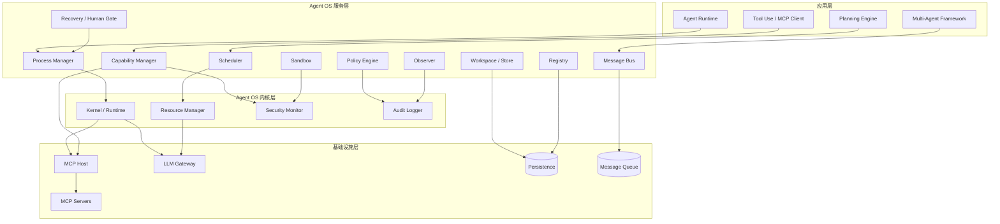
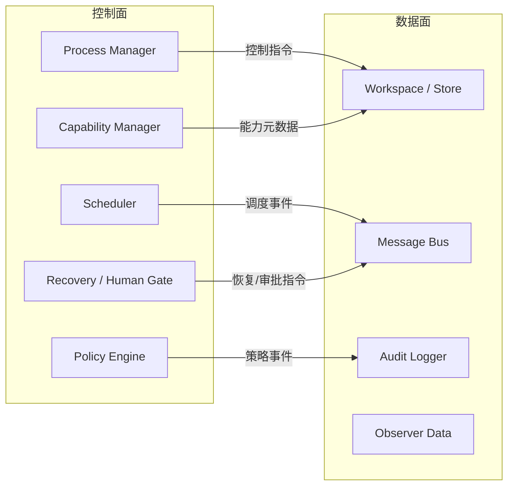

# 架构设计

> 一句话理解：**Agent OS 采用分层架构：底层是 Kernel/Runtime 与资源抽象，中间是调度、沙箱、存储、注册表、消息总线、策略与可观测，上层向 Agent Runtime、Planning、Multi-Agent、MCP 提供统一接口。**

## 分层架构图



## 各层职责

### 应用层

应用层是开发者直接面对的框架与引擎：

- **Agent Runtime**：单 Agent 的执行循环（ReAct、工具调用、状态管理）。
- **Planning Engine**：任务分解、计划生成、重规划。
- **Multi-Agent Framework**：多 Agent 协作、角色分配、团队协调。
- **Tool Use / MCP Client**：单次工具调用、MCP Client 实现。

应用层不直接管理资源，而是通过 Agent OS 服务层申请进程、调度、存储、通信等服务。

### Agent OS 服务层

服务层是 Agent OS 的核心，包含以下模块：

| 模块 | 职责 |
|---|---|
| Process Manager | Agent 进程的生命周期：spawn、pause、resume、terminate、状态机 |
| Scheduler | 调度策略、优先级、准入控制、Token/时间片分配 |
| Capability Manager | 工具/技能的能力注册、版本、授权、命名空间 |
| Sandbox | 进程隔离、资源限制、权限边界、工作区隔离 |
| Workspace / Store | per-agent 工作区、共享 blackboard、持久化存储 |
| Registry | Agent 类型、技能、工具、版本、entitlement 的元数据中心 |
| Message Bus | Agent-to-Agent 通信、发布/订阅、请求/响应 |
| Policy Engine | 安全策略、治理规则、HITL 触发、预算约束 |
| Observer | 可观测：trace、metrics、logs、reasoning 路径 |
| Recovery / Human Gate | 失败恢复、checkpoint/rollback、人工审批与接管 |

### Agent OS 内核层

内核层提供最基础的资源与安全抽象：

- **Kernel / Runtime**：进程调度原语、上下文切换、事件循环。
- **Resource Manager**：CPU、内存、Token、网络、工具调用配额的监控与分配。
- **Security Monitor**：实时监控系统调用（MCP 请求）、检测越权行为。
- **Audit Logger**：记录所有策略决策、工具调用、状态变更。

内核层与具体 Agent 框架解耦，向上暴露通用原语。

### 基础设施层

基础设施层是 Agent OS 依赖的外部系统：

- **MCP Host / Servers**：标准化工具与资源接入。
- **LLM Gateway**：统一的多供应商模型接入。
- **Persistence**：数据库、对象存储、向量数据库。
- **Message Queue**：Kafka、RabbitMQ、NATS 等消息中间件。

## 控制面与数据面



- **控制面**：负责决策与指令下发，通常由 Agent OS 内核与策略引擎驱动。
- **数据面**：负责状态、消息、日志、观测数据的流转与持久化。

控制面与数据面应解耦：控制面不直接处理高吞吐数据流，而是通过定义良好的 API 与数据面交互。

## 核心模块接口示例

以下是最小化的接口设计，用于说明模块协作关系：

```python
class ProcessManager:
    def spawn(self, agent_type: str, goal: Goal, budget: Budget) -> AgentId: ...
    def pause(self, agent_id: AgentId) -> None: ...
    def resume(self, agent_id: AgentId) -> None: ...
    def terminate(self, agent_id: AgentId, reason: str) -> None: ...

class Scheduler:
    def admit(self, request: ScheduleRequest) -> bool: ...
    def schedule(self) -> list[AgentId]: ...
    def preempt(self, agent_id: AgentId) -> None: ...

class CapabilityManager:
    def register(self, capability: Capability) -> CapabilityId: ...
    def authorize(self, agent_id: AgentId, capability_id: CapabilityId) -> bool: ...
    def list_allowed(self, agent_id: AgentId) -> list[Capability]: ...

class Sandbox:
    def create(self, agent_id: AgentId, capabilities: list[Capability]) -> SandboxHandle: ...
    def enter(self, handle: SandboxHandle, task: Task) -> Result: ...
    def destroy(self, handle: SandboxHandle) -> None: ...

class Workspace:
    def read(self, agent_id: AgentId, key: str) -> bytes: ...
    def write(self, agent_id: AgentId, key: str, value: bytes) -> None: ...
    def share(self, agent_id: AgentId, key: str, recipients: list[AgentId]) -> None: ...

class MessageBus:
    def send(self, from_id: AgentId, to_id: AgentId, message: Message) -> None: ...
    def subscribe(self, agent_id: AgentId, topic: str) -> Iterator[Message]: ...

class PolicyEngine:
    def evaluate(self, event: Event) -> Decision: ...
    def require_human_approval(self, agent_id: AgentId, action: Action) -> bool: ...

class Observer:
    def trace(self, agent_id: AgentId, span: Span) -> None: ...
    def log_event(self, agent_id: AgentId, event: dict) -> None: ...
```

这些接口应根据实际系统选择同步或异步实现，但职责边界应保持清晰。

## 与相邻主题的边界

### 与 Agent Runtime 的边界

| 职责 | Agent OS | Agent Runtime |
|---|---|---|
| 单 Agent 执行循环 | 不直接负责 | 负责 ReAct、工具调用、状态机 |
| 多 Agent 调度 | 负责 | 不负责 |
| 进程隔离与资源限制 | 负责 | 消费 OS 提供的隔离环境 |
| 工具注册与授权 | 负责能力管理 | 负责单次调用的解析与执行 |
| 失败恢复 | 负责 checkpoint/rollback | 负责步骤级重试与异常上报 |

### 与 Memory 的边界

- **Agent OS**：管理 per-agent workspace、shared blackboard、持久化存储的访问控制与生命周期。
- **Memory 主题**：负责记忆的内容建模、向量化、检索、压缩与长期存储引擎。

### 与 Planning 的边界

- **Agent OS**：为 Planner 提供执行调度、状态持久化、checkpoint 与恢复。
- **Planning 主题**：负责目标拆解、计划生成、动态重规划。

### 与 MCP 的边界

- **Agent OS**：作为 MCP Host，管理 Server 生命周期、能力协商、权限审计、准入控制。
- **MCP 主题**：定义 Host/Client/Server 协议、传输方式（stdio/Streamable HTTP）、能力发现。

### 与 Multi-Agent 的边界

- **Agent OS**：提供 Agent 间通信、命名空间、隔离、生命周期。
- **Multi-Agent 主题**：定义协作协议、角色、团队目标、共享黑板语义。

### 与 Tool Use 的边界

- **Agent OS**：决定 Agent 能使用哪些工具、在什么条件下使用。
- **Tool Use 主题**：负责工具的定义、schema、解析、执行、结果格式化。

## 部署形态

Agent OS 可以表现为不同形态：

| 形态 | 说明 | 适用场景 |
|---|---|---|
| 库式（libOS） | 作为库链接到应用中，如 Agent libOS | 边缘、嵌入式、单进程应用 |
| 服务式 | 独立进程/服务，Agent Runtime 通过 RPC 调用 | 企业级、多语言、多租户 |
| 内核扩展式 | 与容器/K8s 结合，Agent 以 Pod/容器运行 | 强隔离、云原生 |
| POSIX 进程式 | Agent 作为原生进程，如 Quine | 与现有 Unix/Linux 生态集成 |

## 本章小结

- Agent OS 分为应用层、服务层、内核层、基础设施层，每层职责清晰。
- 控制面负责决策，数据面负责状态流转，两者应解耦。
- 与 Runtime、Memory、Planning、MCP、Multi-Agent、Tool Use 的边界必须明确，避免职责耦合。
- Agent OS 可以是库式、服务式、内核扩展式或 POSIX 进程式，选型取决于隔离与集成需求。

**参考来源**
- [AIOS: LLM Agent Operating System](https://arxiv.org/abs/2403.16971)
- [Agent libOS: A Library Operating System for LLM Agents](https://arxiv.org/abs/2606.03895)
- [Quine: LLM agents as native POSIX processes](https://arxiv.org/abs/2603.18030)
- [MCP Specification](https://modelcontextprotocol.io/specification/2025-03-26/architecture)
- [Governed MCP: From Technical Specifications to Multi-Agent Governance](https://arxiv.org/abs/2604.16870)
