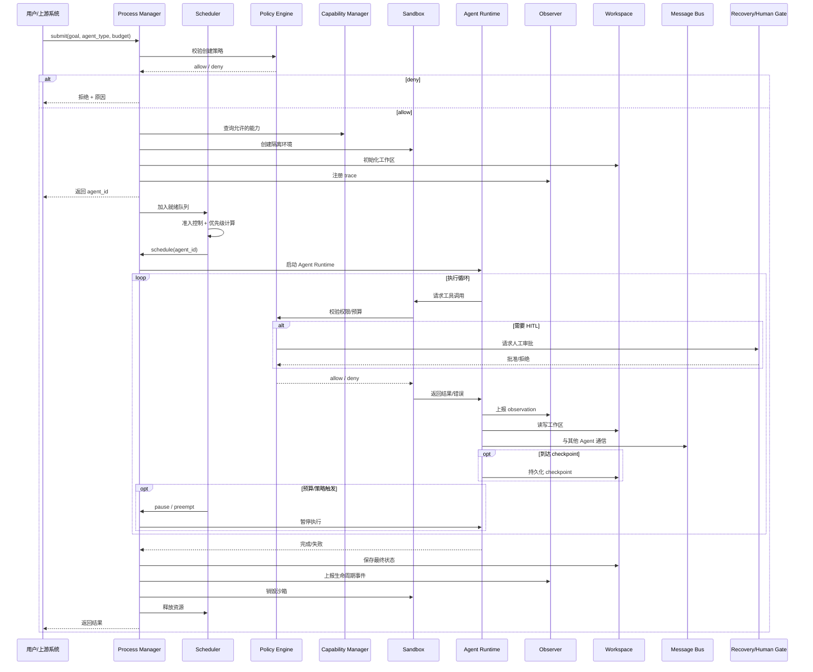
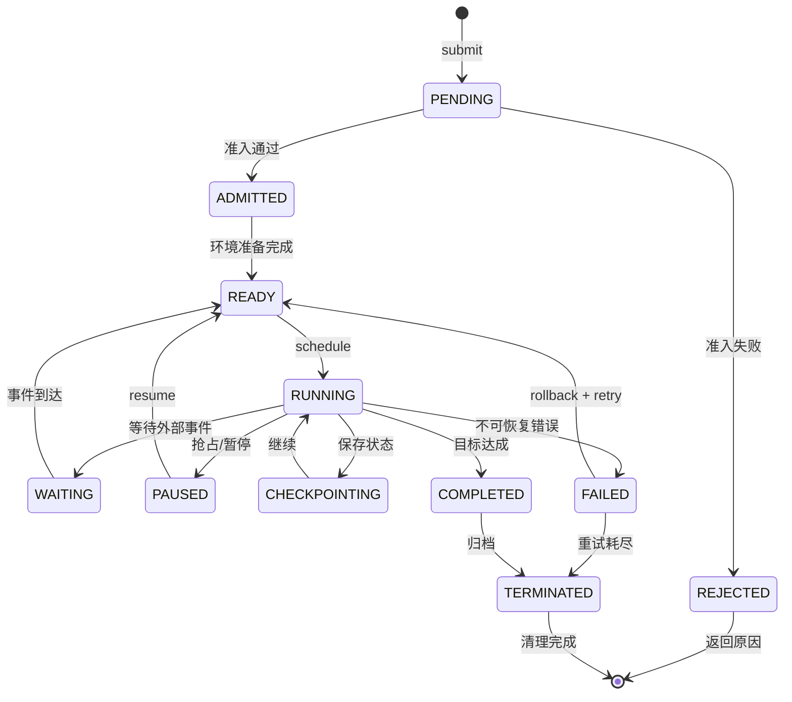
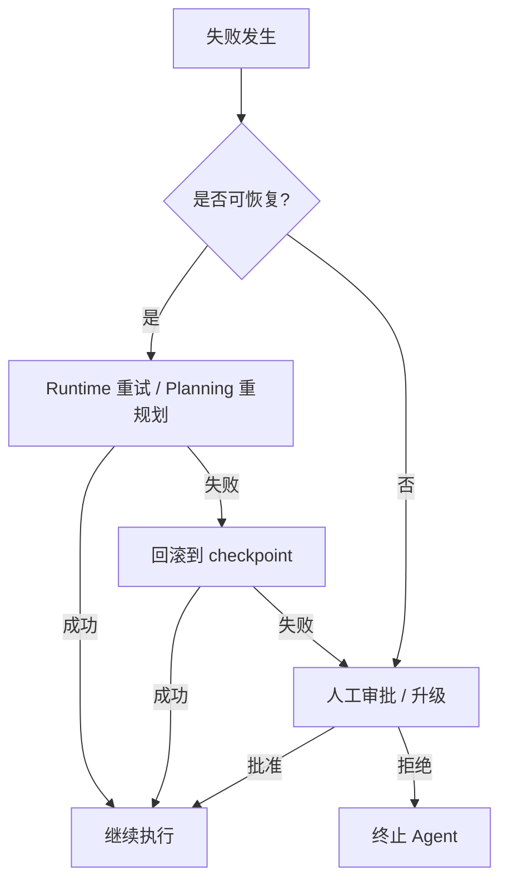

# Agent OS 工作流程

> 一句话理解：**Agent OS 把 Agent 任务抽象为完整的进程生命周期：spawn → schedule → execute → observe → checkpoint/rollback → terminate，并在每个阶段执行资源、权限、可观测与恢复策略。**

## 端到端生命周期

## 1. Spawn：创建 Agent 进程

Spawn 阶段把用户请求转化为一个受管理的 Agent 进程：

1. **解析请求**：目标、Agent 类型、租户、预算、优先级、依赖。
2. **策略校验**：Policy Engine 检查是否允许创建该类型 Agent、是否超出租户配额。
3. **能力绑定**：Capability Manager 根据 Agent 类型与 entitlements 确定允许的工具集合。
4. **资源预留**：Scheduler 评估系统负载，决定是否准入或排队。
5. **环境创建**：Sandbox 创建隔离环境（进程/容器/namespace）。
6. **工作区初始化**：Workspace 为该 Agent 创建私有目录与初始上下文。
7. **Trace 注册**：Observer 为该 Agent 创建根 span 与生命周期事件。
8. **返回 Agent ID**：用户获得一个可查询、可控制、可审计的 Agent 标识。

## 2. Schedule：调度

调度阶段决定 Agent 何时获得执行资源：

- **准入控制**：检查 Token 预算、并发数、依赖服务可用性。
- **优先级计算**：根据任务紧急程度、用户等级、历史行为计算优先级。
- **队列放置**：放入合适的优先级队列（MLFQ）。
- **时间片/Token 片分配**：分配一个执行窗口。
- **抢占**：当高优先级任务到达或当前 Agent 超预算时，暂停当前 Agent。

## 3. Execute：执行

执行阶段 Agent Runtime 在 OS 提供的沙箱内运行：

- Agent Runtime 执行 ReAct 循环或 Planning 生成的计划。
- 每次工具调用都经过 Sandbox 与 Policy Engine 校验。
- Workspace 提供临时存储与状态持久化。
- Message Bus 支持与其他 Agent 通信。

执行过程中，Scheduler 持续监控资源消耗：

- Token 消耗接近上限 → 减速/警告。
- 时间片耗尽 → 抢占，保存上下文。
- 工具调用次数超限 → 拒绝并触发策略。

## 4. Observe：观测

Observer 在每个执行步骤收集数据：

- **Span**：每次 LLM 调用、工具调用、Agent 间通信都是一个 span。
- **Event**：状态变更、策略决策、权限校验、HITL 触发。
- **Metric**：延迟、Token 消耗、成功率、队列长度。
- **Reasoning Trace**：记录 Agent 的思考路径，支持事后审计。

观测数据写入 Audit Logger 与可观测后端（如 OpenTelemetry、Prometheus）。

## 5. Checkpoint / Rollback：检查点与回滚

长程任务需要在关键节点保存状态：

- **Checkpoint 触发条件**：完成一个重要步骤、即将调用高风险工具、Token 消耗达到阈值、收到暂停指令。
- **Checkpoint 内容**：当前计划版本、已完成步骤输出、工作区状态、权限上下文、Token 消耗。
- **Rollback**：当后续步骤失败时，回滚到上一个 checkpoint，避免副作用累积。

DeltaBox（arXiv:2605.22781）把 checkpoint/rollback 作为 Agent OS 的核心原语，支持分支执行与状态对比。

## 6. Terminate：终止

终止阶段确保资源被正确回收：

1. **状态归档**：最终状态、结果、审计日志写入持久化存储。
2. **沙箱销毁**：Sandbox 清理进程/容器/临时文件。
3. **资源释放**：Scheduler 回收 Token/CPU/内存配额。
4. **通知上游**：返回最终结果或失败原因。
5. **生命周期事件**：Observer 记录 terminate 事件。

终止原因可能包括：

- 任务完成（completed）。
- 用户取消（cancelled）。
- 预算耗尽（budget_exhausted）。
- 策略触发（policy_violation）。
- 不可恢复错误（failed）。

## 状态机

## 失败处理

Agent OS 中的失败不是二元的，而是分层的：

| 失败层级 | 示例 | 处理方式 |
|---|---|---|
| 工具调用失败 | API 超时、参数错误 | Runtime 重试，Sandbox 记录 |
| Agent 步骤失败 | 计划步骤执行异常 | Planning 重规划，OS 提供 checkpoint |
| Agent 进程失败 | 沙箱崩溃、内存溢出 | Process Manager 重启或升级 |
| 系统级失败 | 调度器故障、存储不可用 | Recovery 模块介入，HITL 决策 |

失败处理流程：

## 并发与多租户场景

在多租户环境中，Agent OS 需要额外处理：

- **命名空间隔离**：不同租户的 Agent ID、Workspace、Registry 命名空间隔离。
- **公平调度**：确保低优先级租户不被饿死。
- **配额硬限制**：租户级 Token/调用/并发上限。
- **审计隔离**：租户只能查看自己的 Agent 审计日志。

## 本章小结

- Agent OS 的完整生命周期：spawn → schedule → execute → observe → checkpoint/rollback → terminate。
- 每个阶段都涉及策略校验、资源管理、权限控制与可观测。
- 状态机覆盖 PENDING、ADMITTED、READY、RUNNING、PAUSED、WAITING、CHECKPOINTING、FAILED、COMPLETED、TERMINATED。
- 失败处理是分层可恢复的，最终依赖 HITL 与审计。

**参考来源**
- [AIOS: LLM Agent Operating System](https://arxiv.org/abs/2403.16971)
- [DeltaBox: Checkpoint and Rollback for LLM Agents](https://arxiv.org/abs/2605.22781)
- [AgentSys: Building Efficient Multi-Agent Systems with Worker Agents](https://arxiv.org/abs/2602.07398)
