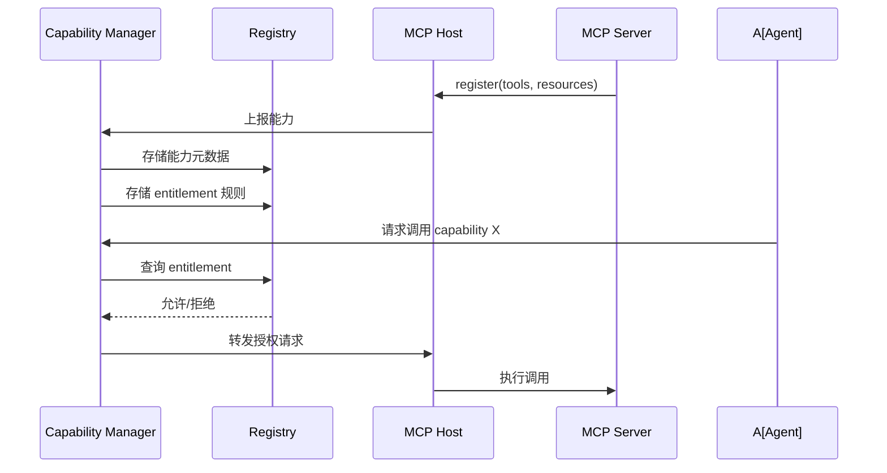
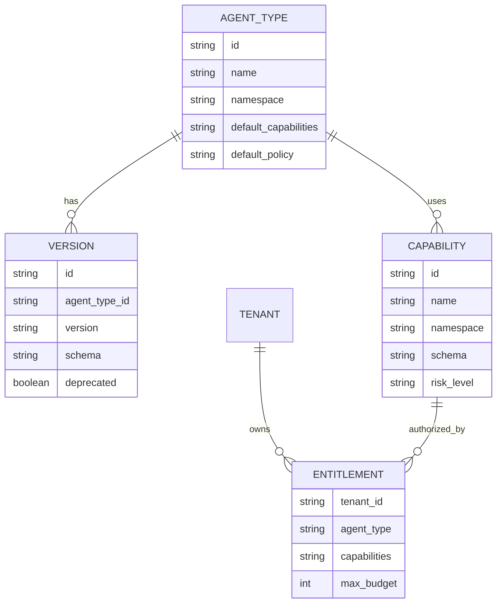
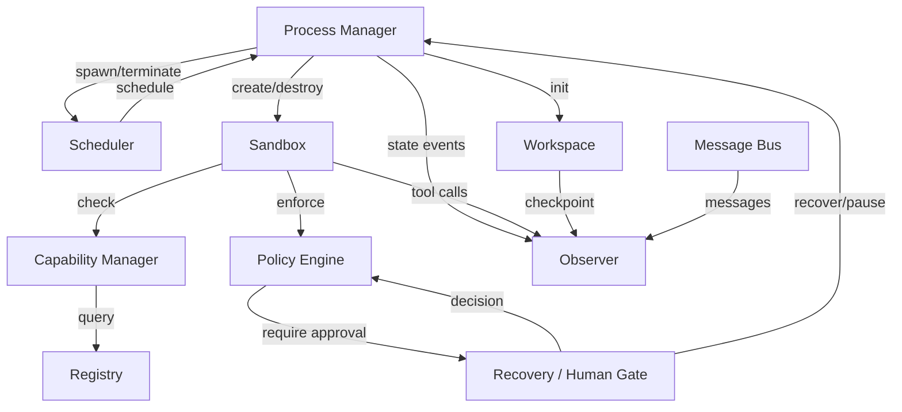

# 核心模块

> 一句话理解：**Agent OS 的核心模块分别是进程、调度、沙箱、能力、存储、注册表、消息、策略、观测、恢复十个“系统原语”，它们共同支撑 Agent 的安全、高效、可治理运行。**

## 1. Process Manager（进程管理器）

### 职责

- 维护 Agent 进程的全生命周期状态机。
- 提供 spawn、pause、resume、terminate 原语。
- 分配 Agent ID、命名空间、初始预算。
- 与 Scheduler、Sandbox、Workspace、Observer 协作。

### 关键数据结构

```python
@dataclass
class AgentProcess:
    agent_id: str
    agent_type: str
    tenant_id: str
    goal: str
    status: AgentStatus
    budget: Budget
    capabilities: list[str]
    sandbox_handle: SandboxHandle
    workspace_path: str
    created_at: datetime
    updated_at: datetime
```

### 输入输出

| 输入 | 输出 |
|---|---|
| submit(goal, type, tenant, budget) | agent_id 或拒绝原因 |
| pause(agent_id) | 成功/失败 |
| resume(agent_id) | 成功/失败 |
| terminate(agent_id, reason) | 最终状态与审计记录 |

## 2. Scheduler（调度器）

### 职责

- 决定 Agent 何时、以何种资源投入运行。
- 实现准入控制、优先级队列、时间片/Token 预算管理。
- 支持协作式与抢占式调度。

### 调度策略

| 策略 | 说明 | 适用场景 |
|---|---|---|
| FCFS | 先来先服务 | 简单批处理 |
| Priority Queue | 按优先级调度 | 客服、告警处理 |
| MLFQ | 多级反馈队列 | 混合负载，惩罚长任务 |
| Token Budget | 按 Token 消耗调度 | 成本敏感场景 |
| Fair Share | 按租户/用户公平分配 | 多租户 |

### MLFQ 示例

```python
class MLFQScheduler:
    def __init__(self, num_queues=3):
        self.queues = [deque() for _ in range(num_queues)]
        self.time_slices = [10, 20, 40]  # 时间片递增

    def enqueue(self, agent_id, priority=0):
        self.queues[priority].append(agent_id)

    def schedule(self):
        for i, q in enumerate(self.queues):
            if q:
                agent_id = q.popleft()
                return agent_id, self.time_slices[i]
        return None, 0

    def demote(self, agent_id, current_priority):
        new_priority = min(current_priority + 1, len(self.queues) - 1)
        self.queues[new_priority].append(agent_id)
```

AgentRM（arXiv:2603.13110）在此基础上增加了失败惩罚、预算感知与依赖感知。

## 3. Sandbox（沙箱）

### 职责

- 为每个 Agent 提供隔离执行环境。
- 限制资源使用（CPU、内存、网络、文件系统）。
- 拦截并审计系统调用（MCP 请求）。

### 隔离级别

| 级别 | 机制 | 开销 | 隔离强度 |
|---|---|---|---|
| 进程级 | 独立进程、文件描述符限制 | 低 | 中 |
| 容器级 | Docker/containerd | 中 | 高 |
| VM 级 | Firecracker/Kata | 高 | 最高 |
| 语言级 | Python venv、限制 builtins | 低 | 低 |

### 实现要点

- 工作目录隔离（chroot/bind mount）。
- 网络访问白名单。
- 工具调用次数/频率限制。
- 环境变量与 Secret 注入控制。

AgentSys（arXiv:2602.07398）采用 worker agent 进程隔离，确保一个 Agent 崩溃不影响全局。

## 4. Capability Manager（能力管理器）

### 职责

- 管理工具/技能的注册、版本、命名空间。
- 根据 Agent 类型与 entitlements 授权能力。
- 与 MCP Host 集成，动态发现 Server 能力。

### 关键数据结构

```python
@dataclass
class Capability:
    id: str
    name: str
    namespace: str
    version: str
    schema: dict
    allowed_tenants: list[str]
    risk_level: str  # low, medium, high, critical

@dataclass
class Entitlement:
    tenant_id: str
    agent_type: str
    capabilities: list[str]
    max_calls_per_min: int
    max_token_budget: int
```

### 与 MCP 的集成



## 5. Workspace / Store（工作区与存储）

### 职责

- 为每个 Agent 提供私有工作区。
- 支持共享 blackboard。
- 持久化 checkpoint、最终结果、审计日志。

### 存储类型

| 类型 | 用途 | 示例 |
|---|---|---|
| Working Memory | Agent 执行中的临时状态 | Redis、本地 KV |
| Blackboard | 多 Agent 协作共享空间 | 共享数据库、对象存储 |
| Persistent Store | 长程任务状态、checkpoint | PostgreSQL、S3 |
| Artifact Store | 文件、报告、代码产出 | 对象存储、NAS |

### 访问控制

```python
class Workspace:
    def read(self, agent_id: str, key: str) -> bytes:
        self._check_ownership(agent_id, key)
        return self.backend.get(key)

    def write(self, agent_id: str, key: str, value: bytes):
        self._check_quota(agent_id)
        self.backend.set(self._namespaced_key(agent_id, key), value)

    def share(self, agent_id: str, key: str, recipients: list[str]):
        self._check_ownership(agent_id, key)
        for recipient in recipients:
            self.acl.grant_read(recipient, key)
```

## 6. Registry（注册表）

### 职责

- 管理 Agent 类型、技能、工具、版本、命名空间。
- 支持灰度发布与依赖管理。
- 提供 entitlement 规则存储。

### 核心实体



## 7. Message Bus（消息总线）

### 职责

- 提供 Agent 间通信原语。
- 支持直接消息、发布/订阅、请求/响应。
- 与 A2A、MCP 协议对齐。

### 通信模式

| 模式 | 说明 | 适用场景 |
|---|---|---|
| Direct | 点对点 | 单任务协作 |
| Pub/Sub | 发布订阅 | 事件广播 |
| Req/Resp | 同步请求响应 | 需要等待结果 |
| Blackboard | 共享读写 | 多 Agent 协作 |

### A2A 作为 IPC Bus

Google A2A 协议定义了 Agent 之间的能力发现与任务委托：

- Agent Card：描述 Agent 能力与接口。
- Task：跨 Agent 的任务单元。
- Message：Agent 间消息格式。
- Artifact：任务产物。

Agent OS 的 Message Bus 可以实现 A2A 语义，同时管理消息路由、持久化与审计。

## 8. Policy Engine（策略引擎）

### 职责

- 执行安全策略、治理规则、预算约束。
- 在敏感操作前触发 HITL。
- 记录所有策略决策。

### 策略类型

| 类型 | 示例 |
|---|---|
| 能力策略 | Agent A 不能调用 `delete_database` |
| 预算策略 | Token 消耗超过 100k 触发暂停 |
| 时间策略 | 夜间禁止执行高成本任务 |
| 数据策略 | PII 数据不能离开沙箱 |
| 审批策略 | `send_email` 需要人工确认 |

### 决策流程

```python
class PolicyEngine:
    def evaluate(self, agent_id: str, action: Action) -> Decision:
        rules = self.registry.get_rules(agent_id, action)
        for rule in rules:
            result = rule.check(action)
            if result == Decision.DENY:
                return Decision(deny=True, reason=rule.reason)
            if result == Decision.REQUIRE_APPROVAL:
                return Decision(require_approval=True, approvers=rule.approvers)
        return Decision(allow=True)
```

Governed MCP（arXiv:2604.16870）强调把策略引擎嵌入 MCP Host，使每一次工具调用都可被治理。

## 9. Observer（观测器）

### 职责

- 收集 Agent 全生命周期的 trace、metrics、logs。
- 支持 reasoning path 的追溯。
- 与 OpenTelemetry、Prometheus 等标准集成。

### 观测维度

| 维度 | 内容 | 后端 |
|---|---|---|
| Trace | Agent 生命周期、工具调用、Agent 间通信 | OpenTelemetry |
| Metrics | 队列长度、Token 消耗、成功率、调度延迟 | Prometheus |
| Logs | 策略事件、审计事件、错误日志 | Loki/ELK |
| Reasoning | Agent 思考路径、决策依据 | 专用审计存储 |

## 10. Recovery / Human Gate（恢复与人机门）

### 职责

- 失败恢复：重试、回滚、熔断、升级。
- 人工审批：敏感操作、异常处理、策略冲突。
- 把“自动”与“人工”无缝衔接。

### 恢复策略

| 策略 | 说明 |
|---|---|
| Retry | 指数退避重试可恢复错误 |
| Rollback | 回滚到上一个 checkpoint |
| Circuit Breaker | 连续失败时熔断工具/服务 |
| Escalation | 自动恢复失败时升级给人类 |
| Compensation | 执行补偿操作抵消副作用 |

### Human Gate 触发条件

- 高权限 Agent 创建。
- 敏感工具调用（如发送邮件、修改数据库）。
- 策略冲突或未知风险。
- 自动恢复耗尽。

## 模块协作关系



## 本章小结

- Process Manager、Scheduler、Sandbox、Capability Manager、Workspace/Store、Registry、Message Bus、Policy Engine、Observer、Recovery/Human Gate 是 Agent OS 的十大核心模块。
- 各模块职责清晰，通过标准接口协作。
- Policy Engine 是安全与治理的强制执行点，Observer 提供全生命周期可观测，Recovery/Human Gate 处理失败与人工协作。

**参考来源**
- [AIOS: LLM Agent Operating System](https://arxiv.org/abs/2403.16971)
- [AgentRM: A Resource Management Framework for LLM Agents](https://arxiv.org/abs/2603.13110)
- [HiveMind: Token-Centric Scheduling for LLM Agents](https://arxiv.org/abs/2604.17111)
- [AgentSys: Building Efficient Multi-Agent Systems with Worker Agents](https://arxiv.org/abs/2602.07398)
- [DeltaBox: Checkpoint and Rollback for LLM Agents](https://arxiv.org/abs/2605.22781)
- [Governed MCP: From Technical Specifications to Multi-Agent Governance](https://arxiv.org/abs/2604.16870)
- [ProbeLogits: Probing LLM Logits for Safety and Governance](https://arxiv.org/abs/2604.11943)
- [MCP Specification](https://modelcontextprotocol.io/specification/2025-03-26/architecture)
