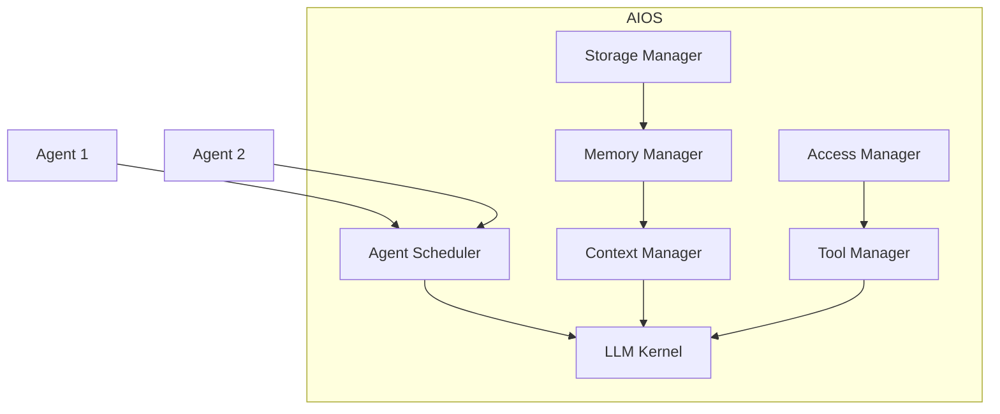
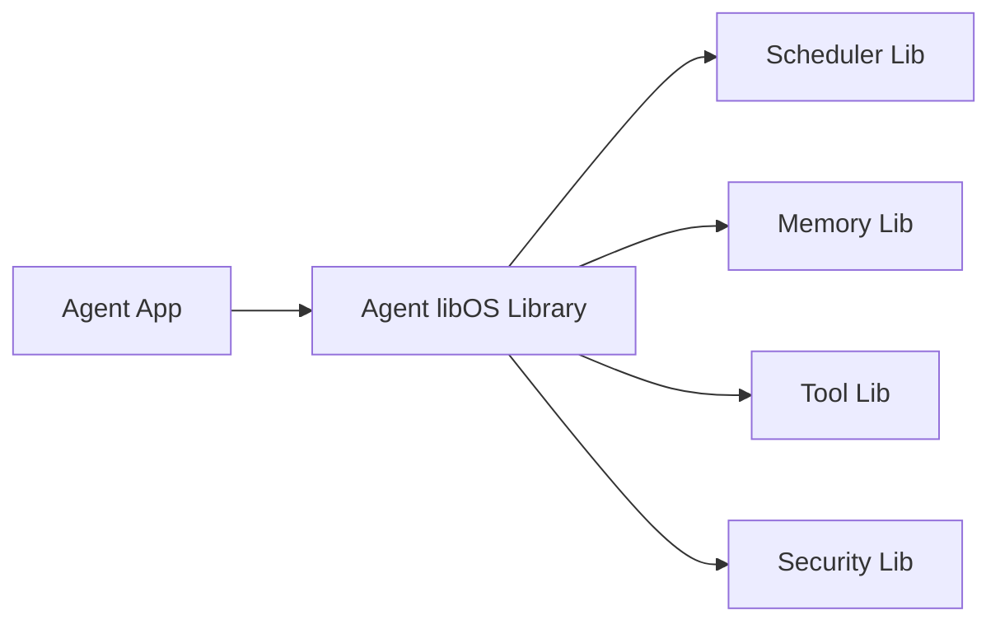
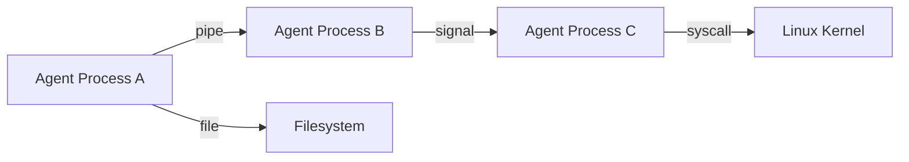
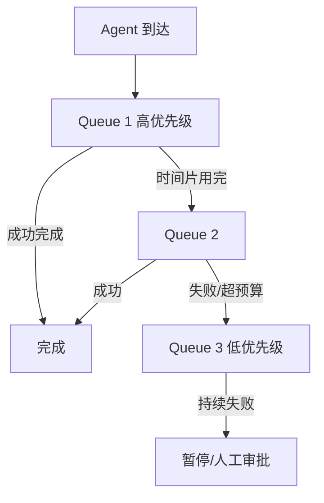
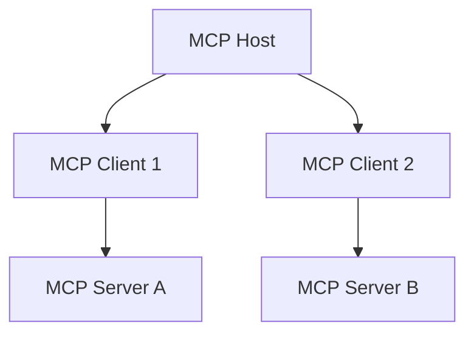
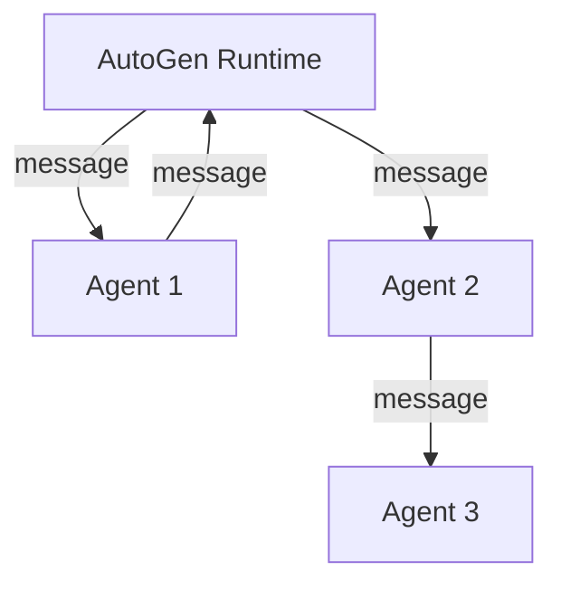

# 源码分析

> 一句话理解：**AIOS、Agent libOS、Quine、AgentRM/HiveMind、MCP Host、OpenAI Agents SDK Runner、AutoGen Runtime 与开源 AgentOS 项目代表了 Agent OS 的多种实现路径：内核式、库式、进程式、调度式、协议式与框架式。**

## 1. AIOS：LLM Agent Operating System

**论文**：AIOS: LLM Agent Operating System（arXiv:2403.16971）

**核心思想**：把 LLM 作为操作系统内核，把 Agent 作为应用进程，围绕 LLM 的上下文窗口与调用特性设计调度器、内存管理器、存储管理器、工具管理器。

**架构图**：



**关键设计**：

- **Agent Scheduler**：解决多个 Agent 请求对 LLM 的并发访问，支持 FIFO、优先级、时间片等策略。
- **Context Manager**：管理每个 Agent 的上下文窗口，避免超长上下文导致延迟与成本爆炸。
- **Memory Manager**：短期记忆缓存与长期记忆检索。
- **Storage Manager**：持久化 Agent 状态与中间结果。
- **Tool Manager / Access Manager**：工具注册、调用与权限控制。

**代码级思路**（基于 agiresearch/AIOS 开源实现）：

```python
class AIOS:
    def __init__(self, llm, scheduler, memory_manager, tool_manager):
        self.llm = llm
        self.scheduler = scheduler
        self.memory_manager = memory_manager
        self.tool_manager = tool_manager

    def run(self, agent):
        # Agent 进入调度队列
        self.scheduler.add(agent)
        while True:
            # 调度器选择下一个执行的 Agent
            current_agent = self.scheduler.next()
            if current_agent is None:
                break
            # 获取上下文与记忆
            context = self.memory_manager.get_context(current_agent)
            # 调用 LLM 内核
            response = self.llm.chat(context)
            # 解析工具调用
            tool_calls = self.tool_manager.parse(response)
            # 执行并反馈
            results = self.tool_manager.execute(tool_calls, current_agent)
            self.memory_manager.update(current_agent, response, results)
```

**优点**：

- 系统性地把 OS 抽象引入 Agent 世界。
- 调度器、内存管理器、工具管理器职责清晰。

**缺点**：

- 实现相对集中，扩展性受限于 AIOS 内核本身。
- 生产级多租户、强隔离、可观测仍需大量工程补齐。

**适用场景**：研究原型、统一 LLM 调度、上下文敏感型多 Agent 系统。

来源：[AIOS: LLM Agent Operating System](https://arxiv.org/abs/2403.16971)、[agiresearch/AIOS GitHub](https://github.com/agiresearch/AIOS)

## 2. Agent libOS：库操作系统

**论文**：Agent libOS: A Library Operating System for LLM Agents（arXiv:2606.03895）

**核心思想**：把 Agent OS 服务以库的形式链接到 Agent 应用中，而不是作为独立内核运行。

**架构图**：



**关键设计**：

- Agent 应用与 OS 服务运行在同一地址空间。
- 通过库 API 调用调度、存储、安全服务。
- 适合资源受限或低延迟场景。

**优点**：

- 启动快、延迟低、适合边缘设备。
- 不需要部署独立的 OS 服务。

**缺点**：

- 隔离性弱，一个 Agent 的崩溃可能影响整个进程。
- 多 Agent 之间需要额外机制共享资源。

**适用场景**：边缘计算、移动设备、嵌入式 Agent。

来源：[Agent libOS: A Library Operating System for LLM Agents](https://arxiv.org/abs/2606.03895)

## 3. Quine：LLM Agent 作为 POSIX 进程

**论文**：Quine: LLM agents as native POSIX processes（arXiv:2603.18030）

**核心思想**：让 LLM Agent 成为原生 POSIX 进程，直接使用 fork、exec、信号、文件描述符、管道等机制。

**架构图**：



**关键设计**：

- 每个 Agent 是一个独立的 Unix 进程。
- 使用标准进程间通信机制（pipe、socket、signal）。
- Agent 可以像普通程序一样被 shell 脚本、systemd、Docker 管理。

**优点**：

- 与现有 Unix/Linux 生态完全兼容。
- 隔离性强，可利用容器、VM、cgroups。

**缺点**：

- 对 LLM 特定资源（Token、上下文窗口）的调度不够原生。
- 需要额外封装才能提供 Agent 语义。

**适用场景**：与现有基础设施深度集成、需要强隔离的 Agent 工作负载。

来源：[Quine: LLM agents as native POSIX processes](https://arxiv.org/abs/2603.18030)

## 4. AgentRM：Agent 资源管理框架

**论文**：AgentRM: A Resource Management Framework for LLM Agents（arXiv:2603.13110）

**核心思想**：把 Agent 调度问题建模为资源管理问题，借鉴操作系统中的 MLFQ 与反馈控制理论。

**关键设计**：

- **多级反馈队列（MLFQ）**：根据 Agent 的历史行为调整优先级。
- **失败惩罚**：频繁失败或超预算的 Agent 被降级。
- **依赖感知**：考虑 Agent 之间的依赖关系进行调度。

**调度流程**：



**优点**：

- 调度策略与 Agent 行为反馈结合。
- 适合混合负载与多租户场景。

**缺点**：

- 主要关注调度，对隔离、存储、治理覆盖较少。

**适用场景**：大规模 Agent 集群调度、成本敏感型任务。

来源：[AgentRM: A Resource Management Framework for LLM Agents](https://arxiv.org/abs/2603.13110)

## 5. HiveMind：Token 为中心的调度

**论文**：HiveMind: Token-Centric Scheduling for LLM Agents（arXiv:2604.17111）

**核心思想**：把 Token 作为主要调度资源，围绕 Token 预算进行准入控制、调度与抢占。

**关键设计**：

- **Token Budget**：每个 Agent/任务有 Token 预算。
- **Token-Aware Scheduling**：调度器根据剩余 Token 与任务优先级分配资源。
- **Preemption**：Token 预算耗尽时触发暂停或终止。

**调度公式示意**：

```python
def priority(agent):
    return agent.urgency / (agent.token_used + 1)

# 调度器按 priority 排序，优先执行高紧急度且 Token 消耗低的 Agent
```

**优点**：

- 直接面向 LLM 的核心成本单元（Token）。
- 适合成本敏感与预算约束场景。

**缺点**：

- Token 预测困难，预算可能频繁触发抢占。
- 需要与模型层紧密集成以获取实时 Token 消耗。

**适用场景**：Token 预算严格、需要精细化成本控制的企业环境。

来源：[HiveMind: Token-Centric Scheduling for LLM Agents](https://arxiv.org/abs/2604.17111)

## 6. MCP Host：协议式 Agent OS 入口

**来源**：Model Context Protocol Specification（2025-03-26）

**核心思想**：MCP 定义了 Host、Client、Server 三方模型，Host 负责管理 Client 与 Server 的生命周期、能力协商、权限边界。Host 本质上是 Agent OS 的“系统调用门面”。

**架构图**：



**关键设计**：

- **Lifecycle Management**：Host 创建/销毁 Client，维护 Server 连接（stdio、Streamable HTTP）。
- **Capability Negotiation**：Host 聚合 Server 提供的 tools、resources、prompts、roots。
- **Sampling**：Host 可以代表 Server 向 LLM 请求采样。
- **Security Boundary**：Host 是可信边界，Client 与 Server 之间的通信由 Host 控制。

**与 Agent OS 的关系**：

- MCP Host 是 Agent OS 中 Capability Manager 与 Policy Engine 的协议化身。
- Agent OS 负责 Host 的多实例管理、调度、审计、多租户隔离。

来源：[MCP Specification](https://modelcontextprotocol.io/specification/2025-03-26/architecture)

## 7. OpenAI Agents SDK Runner

**来源**：OpenAI Agents SDK

**核心思想**：提供 `Runner.run()` 作为 Agent 执行入口，封装了循环、工具调用、handoff、guardrails 与 tracing。

**代码示例**：

```python
from agents import Agent, Runner

agent = Agent(
    name="Math Tutor",
    instructions="You are a helpful math tutor.",
    tools=[calculator],
)

result = Runner.run_sync(agent, "What is 2 + 2?")
print(result.final_output)
```

**关键设计**：

- **Runner**：单 Agent 执行容器，管理 ReAct 循环与工具调用。
- **Handoff**：支持 Agent 之间转交任务。
- **Guardrails**：输入/输出护栏。
- **Tracing**：内置可观测能力。

**与 Agent OS 的关系**：

- OpenAI Agents SDK Runner 是 Agent Runtime 层的优秀实现。
- Agent OS 在其之上管理多个 Runner 实例的调度、隔离与治理。

来源：[OpenAI Agents SDK](https://openai.github.io/openai-agents-python/)

## 8. AutoGen Runtime

**来源**：Microsoft AutoGen

**核心思想**：多 Conversable Agent 通过消息传递协作，Runtime 负责消息路由、事件循环与团队执行。

**架构图**：



**关键设计**：

- **Message-Driven**：Agent 通过发送消息协作，Runtime 负责路由。
- **Group Chat**：支持多 Agent 讨论模式。
- **Human-in-the-Loop**：支持用户代理 Agent 参与协作。

**与 Agent OS 的关系**：

- AutoGen Runtime 是 Multi-Agent 协作的运行时。
- Agent OS 为其提供进程隔离、命名空间、消息持久化与治理。

来源：[AutoGen Documentation](https://microsoft.github.io/autogen/stable/)

## 9. 开源 AgentOS 项目

### Rivet agentOS

Rivet 是一款可视化 Agent 构建工具，其 agentOS 提供 Agent 部署、监控与生命周期管理。

- 强调低代码/无代码的 Agent 编排。
- 提供运行时的状态监控与版本管理。

### Framers AgentOS

Framers AgentOS 面向企业级 Agent 管理，强调：

- Agent 注册与目录。
- 权限与治理。
- 多环境部署（dev/staging/prod）。

### Microsoft Agent Governance Toolkit

微软的 Agent 治理工具包提供：

- Agent 注册与发现。
- 策略定义与执行。
- 审计与合规报告。

这些项目代表了 Agent OS 从“调度运行时”向“治理平台”演进的工业实践。

## 设计取舍对比表

| 项目/论文 | 核心抽象 | 调度 | 隔离 | 存储 | 治理 | 适用场景 |
|---|---|---|---|---|---|---|
| AIOS | LLM 内核 + Agent 进程 | 有（Scheduler） | 中 | 有 | 基础 | 研究原型、统一调度 |
| Agent libOS | 库式 OS 服务 | 有 | 低 | 有 | 基础 | 边缘、嵌入式 |
| Quine | POSIX 进程 | 依赖外部 OS | 高 | 文件系统 | 依赖外部 | Unix/Linux 集成 |
| AgentRM | 资源管理 | MLFQ | 弱 | 无 | 无 | 大规模调度 |
| HiveMind | Token 预算 | Token-aware | 弱 | 无 | 无 | 成本敏感 |
| MCP Host | Host/Client/Server | 无 | 协议边界 | 无 | Host 层策略 | 工具标准化 |
| OpenAI Agents SDK Runner | Runner | 单 Agent | 低 | 无 | Guardrails | 单 Agent 应用 |
| AutoGen Runtime | 消息驱动 | 消息路由 | 低 | 无 | 基础 | Multi-Agent 协作 |
| 开源 AgentOS | 治理平台 | 有 | 中/高 | 有 | 强 | 企业治理 |

## 选型建议

| 场景 | 推荐方向 |
|---|---|
| 研究 Agent OS 抽象 | AIOS、Agent libOS |
| 与现有 Linux 生态集成 | Quine |
| 大规模 Agent 调度优化 | AgentRM、HiveMind |
| 标准化工具接入 | MCP Host |
| 单 Agent 应用快速开发 | OpenAI Agents SDK Runner |
| 多 Agent 协作原型 | AutoGen Runtime |
| 企业级 Agent 治理 | Microsoft Agent Governance Toolkit、Framers AgentOS |

## 本章小结

- AIOS 是系统化的 Agent OS 学术原型；Agent libOS 与 Quine 分别代表库式与 POSIX 进程式实现。
- AgentRM 与 HiveMind 专注于调度，分别从 MLFQ 与 Token 预算角度优化。
- MCP Host 是 Agent OS 在协议层的关键入口，负责工具/资源的能力协商与权限边界。
- OpenAI Agents SDK Runner 与 AutoGen Runtime 是 Runtime/Multi-Agent 层的优秀实现，Agent OS 在其之上提供调度、隔离与治理。
- 工业界开源项目正从“运行时”向“治理平台”演进。

**参考来源**
- [AIOS: LLM Agent Operating System](https://arxiv.org/abs/2403.16971)
- [Agent libOS: A Library Operating System for LLM Agents](https://arxiv.org/abs/2606.03895)
- [Quine: LLM agents as native POSIX processes](https://arxiv.org/abs/2603.18030)
- [AgentRM: A Resource Management Framework for LLM Agents](https://arxiv.org/abs/2603.13110)
- [HiveMind: Token-Centric Scheduling for LLM Agents](https://arxiv.org/abs/2604.17111)
- [MCP Specification](https://modelcontextprotocol.io/specification/2025-03-26/architecture)
- [OpenAI Agents SDK](https://openai.github.io/openai-agents-python/)
- [AutoGen Documentation](https://microsoft.github.io/autogen/stable/)
- [Rivet](https://rivet.gg/)
- [Framers AgentOS](https://www.framers.ai/)
- [Microsoft Agent Governance Toolkit](https://www.microsoft.com/en-us/security/blog/2025/05/06/introducing-the-microsoft-agent-governance-toolkit/)
- [agiresearch/AIOS GitHub](https://github.com/agiresearch/AIOS)
