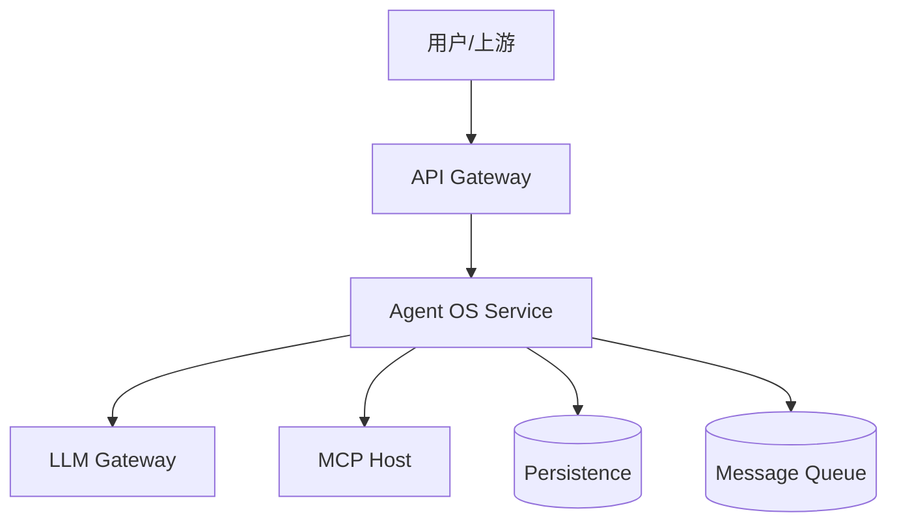
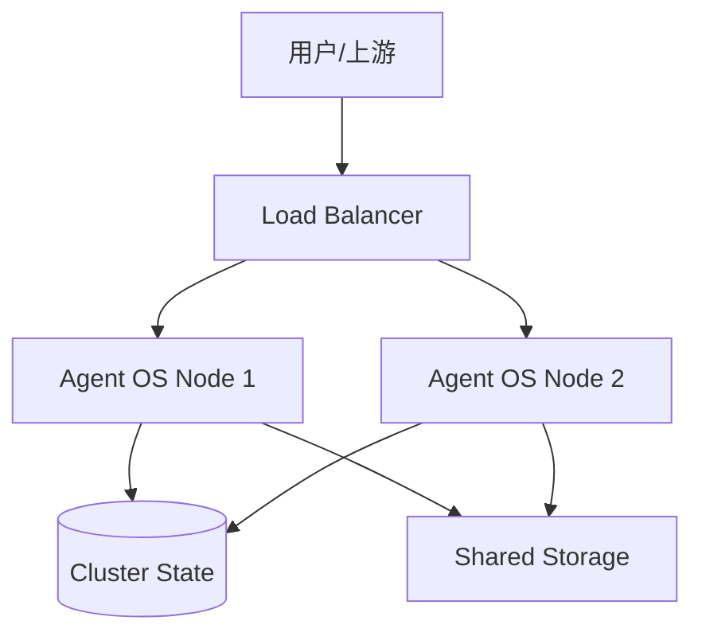
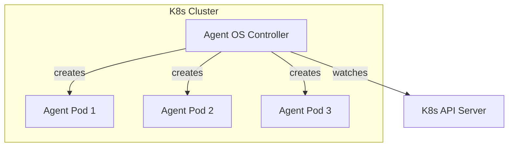
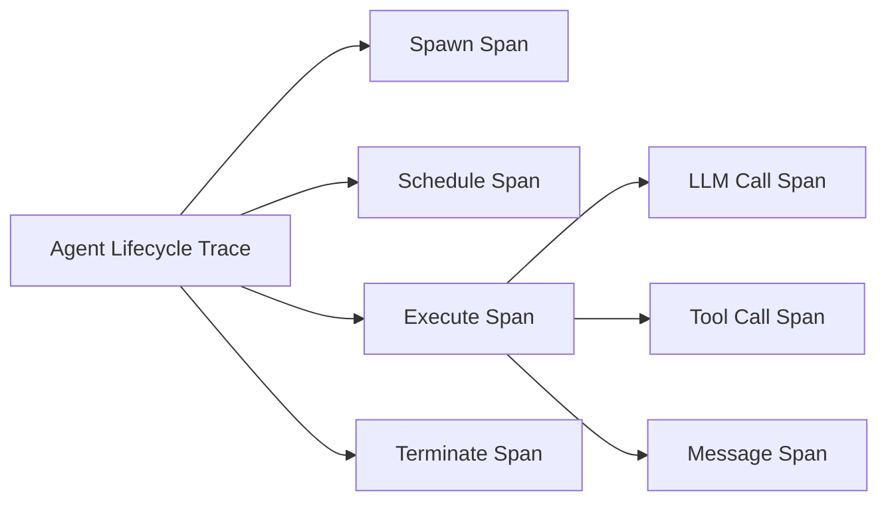

# 企业生产实践

> 一句话理解：**生产级 Agent OS 需要在多租户、强隔离、高可用、可观测、安全合规与成本控制之间取得平衡，并根据业务场景选择部署拓扑、沙箱策略、调度模型与恢复机制。**

## 部署拓扑

### 单节点服务式

- 适合中小规模、单一团队使用。
- Agent OS 作为独立服务，所有 Agent 实例由其统一管理。
- 简单易运维，但存在单点故障。

### 多节点集群式

- 适合大规模多租户场景。
- 需要共享状态存储（如 etcd、PostgreSQL）与共享存储（如 S3）。
- 调度器需要支持分布式调度或分片。

### Kubernetes 原生式

- 每个 Agent 作为一个 Pod/Job 运行。
- 利用 K8s 的调度、网络策略、资源限制实现隔离。
- 适合云原生环境，但启动延迟与资源开销较大。

### 混合式

- 控制面（Process Manager、Scheduler、Policy Engine）作为中心服务。
- 执行面（Sandbox、Agent Runtime）分布在 K8s Pod、容器或边缘节点。
- 适合大型企业与边缘协同场景。

## 多租户

### 隔离维度

| 维度 | 说明 | 实现方式 |
|---|---|---|
| 命名空间 | Agent ID、Workspace、Registry 按租户前缀隔离 | 命名空间 + ACL |
| 资源配额 | 每个租户有 Token、并发、调用次数上限 | Resource Quota |
| 网络隔离 | 租户 Agent 不能互相访问私有网络 | Network Policy / VPC |
| 数据隔离 | 工作区与审计日志按租户隔离 | 数据库行级安全 / 分表 |
| 能力隔离 | 租户只能使用授权的工具 | Capability Manager + Entitlement |

### 公平调度

- 防止单一租户霸占资源。
- 可采用 Fair Share Scheduling 或按租户权重分配。
- 对高优先级租户允许短时间抢占，但需记录并审计。

## 沙箱策略

### 按任务风险选择隔离级别

| 风险等级 | 示例 | 隔离级别 |
|---|---|---|
| 低 | 文本生成、内部数据查询 | 进程级 / 语言级 |
| 中 | 文件操作、第三方 API 调用 | 容器级 |
| 高 | 数据库写入、代码执行 | VM 级 / gVisor |
| 极高 | 生产环境变更、资金操作 | 专用隔离环境 + HITL |

### 沙箱实现要点

- **文件系统**：只读挂载必要目录，工作区按 Agent 隔离。
- **网络**：出站网络白名单，禁止横向扫描。
- **Secret**：通过 Vault 等 Secret Manager 注入，避免泄露到 Agent 上下文。
- **资源**：CPU、内存、磁盘、网络带宽限制。
- **时间**：单次工具调用与总执行时间上限。

## 调度生产实践

### Token 预算管理

- 为每个 Agent/任务/租户设置 Token 预算。
- 实时统计输入/输出 Token，接近阈值时告警或减速。
- 对异常消耗（如循环调用）触发熔断。

### 优先级与抢占

- 高优先级任务（如告警响应）可抢占低优先级任务。
- 被抢占任务保存 checkpoint，稍后恢复。
- 避免频繁抢占导致上下文切换开销。

### 依赖调度

- 当 Agent 依赖外部服务（如 MCP Server、数据库）时，调度器应考虑服务健康状态。
- 对不可用依赖的任务进行延迟调度或快速失败。

## 可观测

### Trace 设计

- 每个 Agent 生命周期作为一个根 trace。
- 每次 LLM 调用、工具调用、Agent 间通信作为子 span。
- Span 属性包括 agent_id、tenant_id、tool_name、token_count、policy_decision。

### Metrics 设计

| 指标 | 说明 |
|---|---|
| agent_os_active_agents | 当前活跃 Agent 数 |
| agent_os_queue_wait_seconds | 调度等待时间 |
| agent_os_tool_calls_total | 工具调用总数 |
| agent_os_tool_call_errors_total | 工具调用错误数 |
| agent_os_token_usage_total | Token 消耗总量 |
| agent_os_policy_denials_total | 策略拒绝次数 |
| agent_os_hitl_requests_total | HITL 请求次数 |

### 日志设计

- 结构化 JSON 日志，包含 agent_id、tenant_id、event_type、timestamp、payload。
- 所有策略决策、工具调用、权限校验、HITL 事件必须记录。
- 日志保留周期符合合规要求（如 6 个月）。

## 安全

### 最小权限原则

- 每个 Agent 只能访问完成任务所需的最小能力集合。
- 定期审计 entitlement，移除不再需要的权限。

### MCP Host 安全

- 对 MCP Server 进行身份验证（如 OAuth、MTLS）。
- 对每次工具调用进行参数校验与策略检查。
- 敏感操作触发 HITL。

### ProbeLogits 集成

- 在 LLM 生成阶段探测 logits，识别潜在有害输出或越权意图。
- 对高风险输出进行拦截或标记。

来源：[ProbeLogits: Probing LLM Logits for Safety and Governance](https://arxiv.org/abs/2604.11943)

### 审计与合规

- 所有 Agent 操作可追溯：谁创建、谁审批、谁调用、结果如何。
- 支持按租户、按 Agent 类型、按工具导出审计报告。
- 符合 SOC2、GDPR、HIPAA 等合规要求。

## 成本核算

### 成本拆分

| 成本项 | 说明 | 归属 |
|---|---|---|
| LLM Token | 输入/输出 Token 费用 | 按 Agent/租户分摊 |
| 工具调用 | 外部 API 调用费用 | 按 Agent/租户分摊 |
| 计算资源 | CPU/内存/容器费用 | 按运行时间分摊 |
| 存储 | checkpoint、日志、工作区 | 按容量分摊 |
| 网络 | 出站流量 | 按流量分摊 |

### 预算控制

- 租户级月度预算。
- 任务级实时预算。
- 预算耗尽时自动暂停或终止。

## 升级

### Agent 类型升级

- Registry 支持版本管理。
- 新版本先灰度发布到部分租户。
- 保留旧版本，允许回滚。

### MCP Server 升级

- MCP Host 支持多版本 Server 同时运行。
- 通过 Capability Manager 控制版本路由。
- 升级前验证 schema 兼容性。

## 失败恢复

### 分级恢复

| 级别 | 策略 | 触发条件 |
|---|---|---|
| L1 | 工具调用重试 | 临时网络/服务错误 |
| L2 | Agent 步骤重试 | 单步骤失败 |
| L3 | 回滚到 checkpoint | 多步骤失败或状态污染 |
| L4 | 重新 spawn Agent | Agent 进程崩溃 |
| L5 | HITL / 升级 | 自动恢复失败或策略冲突 |

### 灾备

- 控制面多活部署。
- 持久化数据定期备份。
- 关键状态跨区域复制。

## 本章小结

- 生产级 Agent OS 需要综合考虑部署拓扑、多租户隔离、沙箱策略、调度、可观测、安全、成本、升级与恢复。
- Kubernetes 原生式适合强隔离，服务式适合快速迭代，混合式适合大型企业。
- 可观测应覆盖 trace、metrics、logs、reasoning path；安全应以 MCP Host 为策略执行点。
- 成本核算需要按 Token、工具调用、计算、存储、网络多维度拆分。

**参考来源**
- [AIOS: LLM Agent Operating System](https://arxiv.org/abs/2403.16971)
- [AgentRM: A Resource Management Framework for LLM Agents](https://arxiv.org/abs/2603.13110)
- [HiveMind: Token-Centric Scheduling for LLM Agents](https://arxiv.org/abs/2604.17111)
- [DeltaBox: Checkpoint and Rollback for LLM Agents](https://arxiv.org/abs/2605.22781)
- [Governed MCP: From Technical Specifications to Multi-Agent Governance](https://arxiv.org/abs/2604.16870)
- [ProbeLogits: Probing LLM Logits for Safety and Governance](https://arxiv.org/abs/2604.11943)
- [MCP Specification](https://modelcontextprotocol.io/specification/2025-03-26/architecture)
