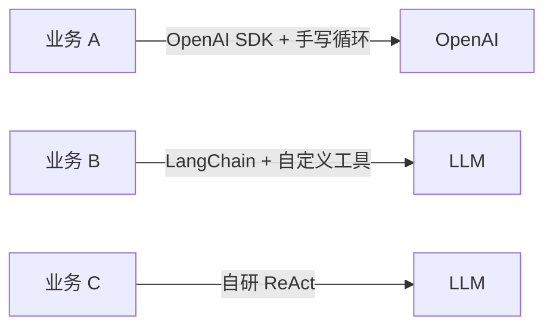
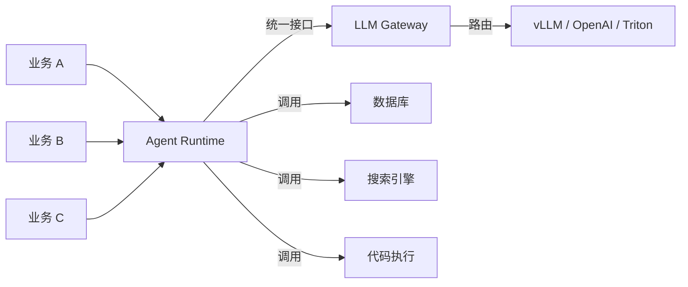

# 1. 背景

## 为什么需要 Agent Runtime？

大模型应用的发展大致经历了三个阶段：

```text
Prompt Engineering → RAG → Agent
```

- **Prompt Engineering**：直接问模型，模型只负责生成文本。
- **RAG**：给模型加上外部知识库，让它能基于检索结果回答。
- **Agent**：让模型能够自主调用工具、分解任务、多轮迭代，最终完成目标。

当进入 Agent 阶段后，简单的 `curl` 调用已经不够用了。一个 Agent 任务通常要：

1. 把用户目标拆成多步计划。
2. 在每一步决定调用哪个工具、传入什么参数。
3. 执行工具并观察结果。
4. 根据结果调整计划，继续循环。
5. 管理会话状态、记忆、权限、超时、失败恢复。
6. 记录完整 trace 供审计与评测。

这些能力如果散落在每个业务应用里，会迅速失控。Agent Runtime 就是要把它们收敛到一个统一的执行层。

## 从“调用模型”到“执行任务”

没有 Runtime 时，一个 Agent 应用通常长这样：



每个团队都要重复实现：工具注册、ReAct 循环、状态管理、护栏、trace、错误恢复。

引入 Agent Runtime 后，架构收敛为：



Runtime 向上暴露“给定目标，返回结果”的简单接口；向下管理工具调用、LLM 交互、状态与观测。

## Agent Runtime 与相关概念的区别

| 概念 | 核心问题 | 与 Runtime 的关系 |
|---|---|---|
| **Workflow Engine（Airflow/Prefect）** | 按预定义 DAG 执行任务 | Agent Runtime 是动态的、由模型决策的循环，不是固定 DAG |
| **LLM Gateway** | 统一接入多种模型 | Runtime 通过 Gateway 调用模型；Gateway 不管理 Agent 循环 |
| **MCP** | 工具发现与调用协议 | Runtime 可以使用 MCP，也可以直接用 function calling；MCP 不是 Runtime 本身 |
| **Multi-Agent Framework** | 多 Agent 协作 | Runtime 通常管理单个 Agent 的执行；多 Agent 协调在更高层 |
| **Agent OS** | 把 Agent 当作应用管理 | Agent OS 是产品化控制面；Runtime 是其执行底座 |
| **Agent Framework（LangGraph/CrewAI）** | 开发者如何写 Agent 逻辑 | Runtime 是这些框架的运行时支撑，也可独立存在 |

> 一句话：Agent Runtime 是 Agent 的“操作系统内核”，负责调度、隔离、状态、可观测与恢复。

## 为什么现在 Agent Runtime 变得重要？

1. **模型能力变强**：Claude 3.5/3.7、GPT-4o/o1、Gemini 2.5/3 等模型已经能在一次调用中完成复杂推理，真正需要的是安全的执行环境。
2. **任务时长变长**：Agent 从单次秒级调用演进为分钟级、小时级甚至持续运行，需要状态持久化和断点续跑。
3. **工具越来越多**：企业内 API、数据库、代码执行、浏览器自动化等工具需要统一注册、权限控制与审计。
4. **安全要求提高**：Agent 能写代码、调 API、访问数据库，必须隔离、限权、可回滚。

## 主流 Agent Runtime / Framework 对比

| 项目 | 定位 | 核心抽象 | 适用场景 |
|---|---|---|---|
| **OpenAI Agents SDK** | OpenAI 生态原生 SDK | Agent + handoffs + guardrails | OpenAI-only、快速落地 |
| **LangGraph** | 生产级状态图编排 | StateGraph / checkpoint / edges | 复杂、有状态、需可观测的生产工作流 |
| **CrewAI** | 角色化多 Agent 团队 | Role + Task + Crew | 快速原型、角色扮演类任务 |
| **Smolagents** | 轻量级代码优先 Agent | Python code agent | 教学、轻量工具调用 |
| **PydanticAI** | 类型安全 Agent | Typed tools / structured outputs | Python 生态、强类型偏好 |
| **Microsoft Agent Framework** | Azure/企业级 Agent | Actor / message-passing | Azure、企业协作 |
| **LlamaIndex Workflows** | RAG-first Agent | Indexes + event-driven workflows | 数据密集型任务 |

## 本章小结

Agent Runtime 的产生是模型能力进化的必然结果：当模型不仅能生成文本，还能调用工具、执行代码、访问外部系统时，就必须有一个执行层来管理这些行为的边界、状态与可观测性。它既不是 workflow engine，也不是 LLM Gateway，而是介于两者之间、面向 Agent 的动态执行容器。

**参考来源**

- [OpenAI Agents SDK Docs](https://platform.openai.com/docs/guides/agents)
- [LangGraph Documentation](https://langchain-ai.github.io/langgraph/)
- [ReAct: Synergizing Reasoning and Acting in Language Models](https://arxiv.org/abs/2210.03629)
- [Agent Runtime 与 Agent OS — Diors.tech](https://www.diors.tech/blog/099-agent-runtime-os)
- [quant67 — Agent 框架工程](https://quant67.com/post/llm-infra/19-agent-framework/19-agent-framework.html)
