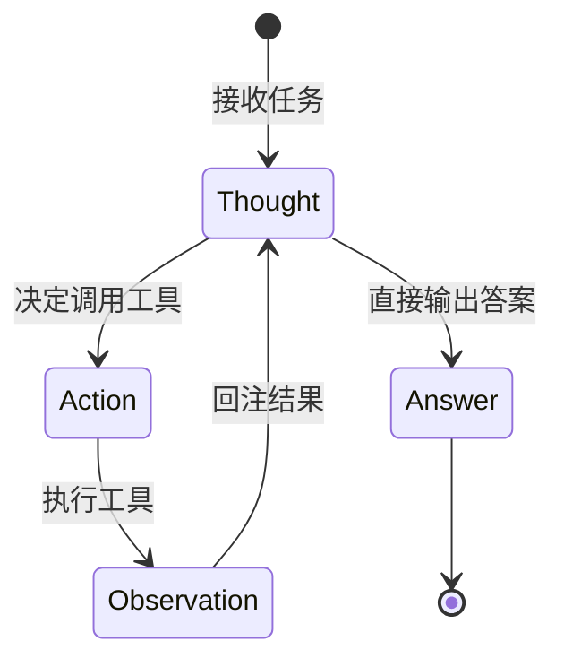
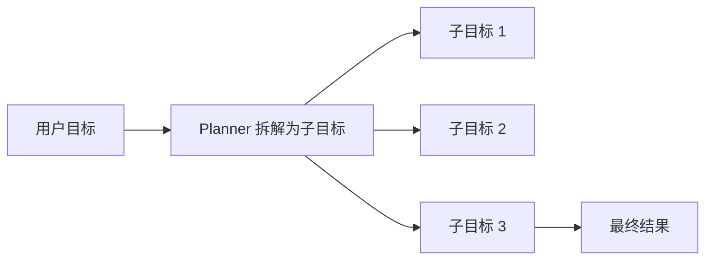
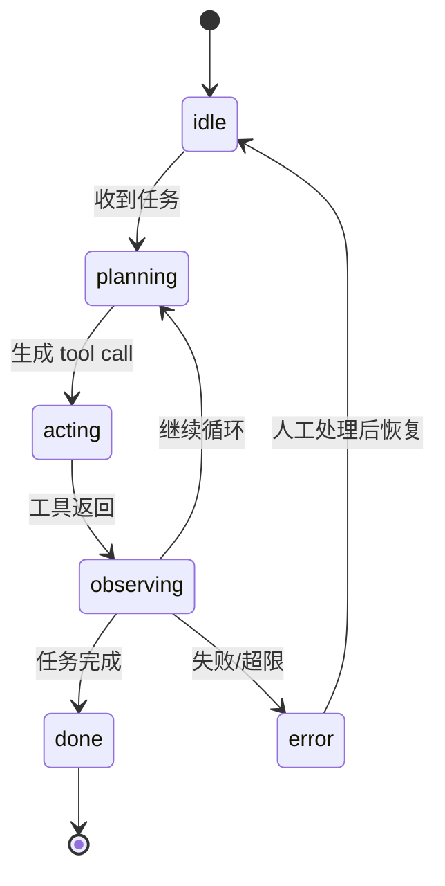

# 2. 核心思想

> 一句话理解：Agent Runtime 的核心思想是**把“模型单次响应”扩展成“目标驱动的多轮执行循环”，并在循环中集中管理工具、记忆、状态、护栏与可观测**。

## 1. ReAct：推理与行动交织

ReAct（Reasoning + Acting）是大多数 Agent Runtime 的基础范式：

```text
Thought → Action → Observation → Thought → Action → Observation → ... → Answer
```

每一轮：

1. **Thought**：模型根据当前目标和历史，思考下一步要做什么。
2. **Action**：模型输出结构化调用请求，例如调用 `calculator` 或 `search`。
3. **Observation**：Runtime 执行工具，把结果回传给模型。
4. 循环直到模型认为任务完成，输出最终答案。



ReAct 让模型从“聊天”变成“做事”。Runtime 的价值就是把这套循环标准化、可观测、可恢复。

## 2. Tool / Function Calling

工具调用是 Agent 与外部世界交互的接口。Runtime 需要提供：

- **Tool Registry**：注册工具、生成 JSON Schema、校验参数。
- **Schema 生成**：自动从函数签名和类型注解生成 OpenAI-compatible function schema。
- **并行调用**：支持一次返回多个 tool call。
- **结果回注**：把 tool output 以 `tool` role 消息写回对话历史。

示例：

```python
@tool(description="计算数学表达式")
def calculator(expr: str) -> str:
    return str(eval(expr))
```

对应 schema：

```json
{
  "type": "function",
  "function": {
    "name": "calculator",
    "description": "计算数学表达式",
    "parameters": {
      "type": "object",
      "properties": {
        "expr": {"type": "string"}
      },
      "required": ["expr"]
    }
  }
}
```

## 3. Memory：让 Agent 有记忆

Runtime 需要在循环中维护上下文。常见记忆类型：

| 类型 | 作用 | 示例 |
|---|---|---|
| **Working Memory** | 当前会话的完整对话历史 | messages list |
| **Short-term Memory** | 最近几轮摘要 | 防止上下文溢出 |
| **Long-term Memory** | 跨会话的用户偏好、事实 | vector DB、知识图谱 |
| **Episodic Memory** | 过去的任务经验 | 成功/失败案例 |

生产要点：

- 上下文长度有限，需要摘要或截断策略。
- 记忆读写应该可插拔，支持内存、Redis、向量数据库。
- 敏感信息不能无差别存入长期记忆。

更系统的记忆系统设计参见 [Agent Memory 主题](/05-agent/memory/)。

## 4. Planning：从目标到计划

复杂任务需要先规划再执行。Planning 在 Runtime 中有两种粒度：

- **单步规划**：每轮只决定下一个 action（纯 ReAct）。
- **多步规划**：先把目标拆成 subgoals，再逐个执行。



Runtime 内置轻量 Planner；更复杂的规划（hierarchical planning、orchestrator-delegate）留给后续 Planning 主题。

## 5. Guardrails：护栏

Agent 能调用工具，就必须有边界。Runtime 的护栏包括：

- **输入护栏**：过滤敏感词、越狱提示、越权请求。
- **输出护栏**：检查模型输出是否泄露 PII、是否符合格式。
- **工具调用护栏**：限制调用次数、禁止危险工具、路径白名单。
- **资源护栏**：超时、最大迭代次数、最大 token 消耗。
- **人机协同（HITL）**：写文件、转账、删除数据等高风险操作需要人类确认。

## 6. Observability：可观测从 Day 0 做起

Runtime 是 Agent 执行路径上的唯一观测点，必须记录：

- **Trace**：一次完整任务的执行树。
- **Span**：每个 thought、tool call、observation 的耗时。
- **Event**：guardrail 触发、fallback、HITL 请求、错误恢复。
- **Metrics**：任务成功率、平均步数、工具调用分布、token/成本。
- **Logs**：结构化日志，包含 session_id、task_id、tool、参数、结果。

没有 trace 的 Agent 就像没有日志的分布式系统，出了问题无法定位。

## 7. Session & State：让任务可恢复

Agent 任务可能持续很久，Runtime 需要管理：

- **Session State**：当前处于 `idle/planning/acting/observing/done/error` 哪个状态。
- **Checkpoint**：把状态持久化，支持中断后恢复。
- **Resume**：从上次状态继续执行，而不是从头开始。



## 8. Recovery：失败恢复

Agent 任务失败模式比普通 API 更复杂：

- 工具调用参数错误 → Runtime 可让模型重新生成。
- 工具执行超时 → 可 fallback 到备用工具或提示用户。
- 模型输出无法解析 → 可重试或进入错误状态。
- 循环次数超限 → 强制终止并返回中间结果。

## 9. Skills：比 MCP 更轻量的能力封装

2026 年工程界越来越倾向于用 **Skills** 描述 Agent 能力：

```text
Function Call → MCP → Skills
```

- **Function Call**：最原始，模型直接输出 JSON。
- **MCP**：标准化工具发现协议，但带来额外进程/网络开销。
- **Skills**：在 Runtime 内声明式注册的能力单元，带 auth、telemetry、sandbox，开箱即用。

本主题不深入 MCP，把 Skills 视为 Runtime 内部的原生能力单元。

## 本章小结

Agent Runtime 的九大核心思想——ReAct、Tool Calling、Memory、Planning、Guardrails、Observability、Session/State、Recovery、Skills——共同构成 Agent 的执行底座。理解它们之间的边界，是后续学习架构与源码的基础。

**参考来源**

- [ReAct Paper](https://arxiv.org/abs/2210.03629)
- [OpenAI Function Calling](https://platform.openai.com/docs/guides/function-calling)
- [LangGraph Persistence](https://langchain-ai.github.io/langgraph/concepts/persistence/)
- [从 Function Call 到 MCP → SKILLS](https://crossoverjie.top/2026/02/03/AI/MCP-Skills-intro/)
