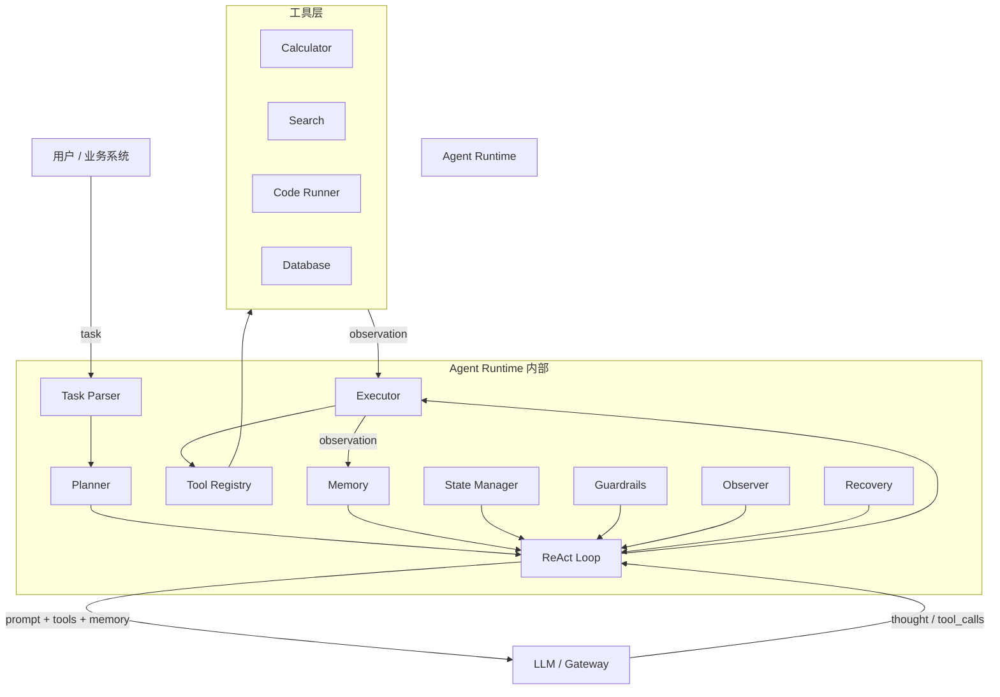
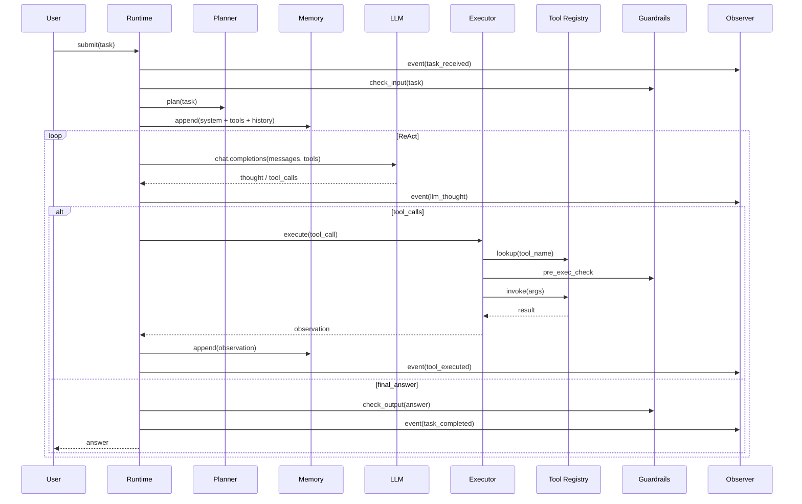

# 3. 架构设计

> 一句话理解：Agent Runtime 的架构可以概括为“**一个中心循环 + 多个能力插件**”——Runtime 负责 ReAct 主循环，工具、记忆、规划、护栏、观测等能力以插件形式围绕其工作。

## 整体架构



## 分层职责

| 层级 | 职责 | 典型组件 |
|---|---|---|
| **接入层** | 接收任务、鉴权、路由 | API Gateway / LLM Gateway / SDK |
| **Runtime 控制面** | 配置、session 管理、权限、审计 | Admin API、Policy Store、Secret Manager |
| **Runtime 数据面** | ReAct 循环、工具调用、状态流转 | Runtime Core、Planner、Executor |
| **能力插件** | 工具、记忆、规划、护栏、观测 | Tool Registry、Memory、Guardrails、Observer |
| **工具层** | 实际执行动作 | 数据库、搜索、代码执行、浏览器、内部 API |
| **可观测层** | trace、metrics、logs | OpenTelemetry、LangSmith、Prometheus |

## 核心模块协作



## 控制面 vs 数据面

| 维度 | 控制面 | 数据面 |
|---|---|---|
| 职责 | 配置、策略、密钥、审计、生命周期 | 执行任务循环、调用工具、更新状态 |
| 状态 | 长期、可持久化 | 会话级、可 checkpoint |
| 扩展 | 管理员/API | 水平扩展 worker 池 |
| 示例 | Tool policy、Rate limit、User quota | ReAct loop、Tool execution、Memory update |

控制面决定“能做什么”，数据面决定“正在怎么做”。

## 部署形态

### 形态 1：库 / SDK

```text
业务进程直接 import agent_runtime 并调用 runtime.run(task)
```

优点：低延迟、易集成。
缺点：状态与观测分散在各业务进程中。

### 形态 2：独立服务

```text
Client → Agent Runtime Service → LLM Gateway → Tools
```

优点：集中管理、可扩展、可观测统一。
缺点：多一跳网络延迟。

### 形态 3：Serverless / 云托管

例如 AWS Bedrock AgentCore、Azure AI Agent Service、Vertex AI Agent Engine。

优点：按需计费、自动扩缩、托管持久化。
缺点：供应商锁定、自定义能力受限。

### 形态 4：Sidecar

与业务容器一起部署，适合高隔离场景。

## 与 LLM Gateway 的关系

Agent Runtime 通常位于 LLM Gateway 之上：

```text
Agent Runtime → LLM Gateway → vLLM / OpenAI / Triton
```

Gateway 解决“调哪家模型”，Runtime 解决“怎么循环调用模型和工具”。两者边界清晰，不应混为一谈。

## 状态持久化设计

生产 Runtime 需要把会话状态持久化，常见选择：

| 存储 | 适用场景 |
|---|---|
| 内存 | 单进程 Demo、无状态 worker |
| Redis | 分布式会话、快速恢复 |
| Postgres | 强一致性、审计、长时任务 |
| 对象存储 | checkpoint 快照、大 trace |

## 本章小结

Agent Runtime 架构的核心是“一个中心循环 + 多个能力插件”。Runtime 主循环负责调度，工具、记忆、规划、护栏、观测等模块以插件方式协同。控制面管理策略与生命周期，数据面负责执行。部署形态可以是库、服务、Serverless 或 Sidecar，选择取决于延迟、隔离和可观测需求。

**参考来源**

- [LangGraph Architecture](https://langchain-ai.github.io/langgraph/concepts/high_level/)
- [OpenAI Agents SDK — Agents](https://platform.openai.com/docs/guides/agents)
- [AWS Bedrock AgentCore](https://docs.aws.amazon.com/bedrock/)
