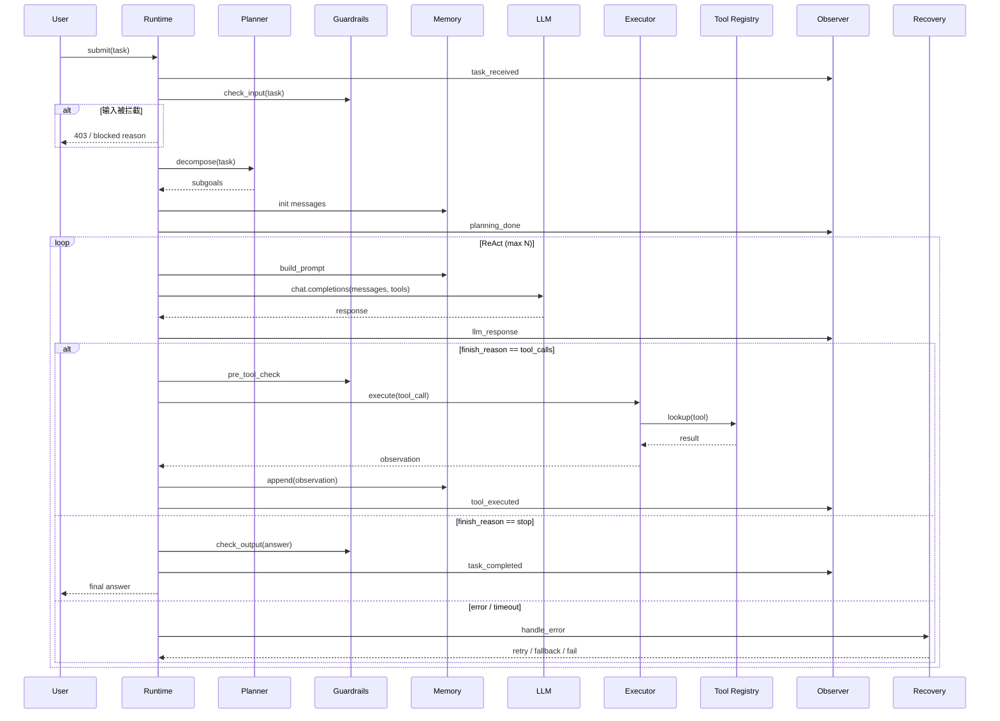
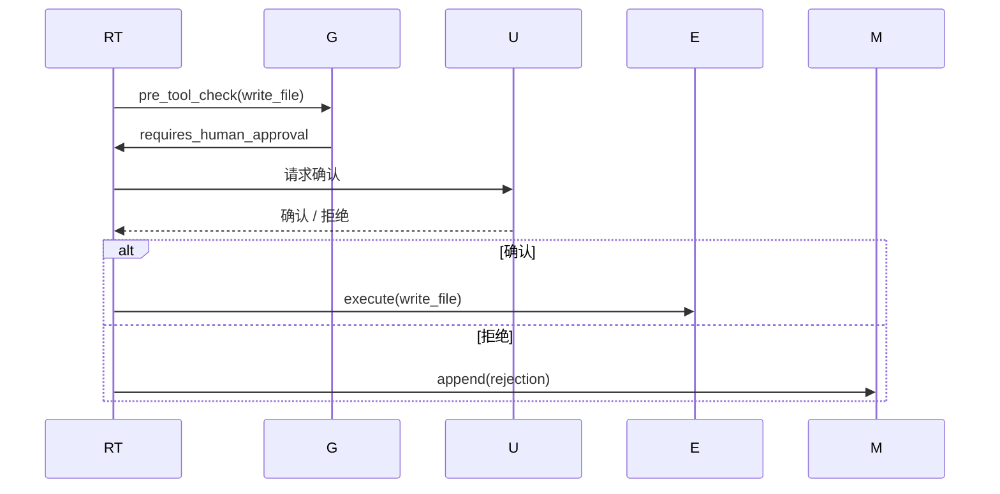

# 4. Runtime 工作流程

> 一句话理解：**一个任务进入 Agent Runtime 后，会经过输入校验、规划、ReAct 循环、工具执行、状态更新、输出检查，最终返回结果并落盘 trace**。

## 完整生命周期



## 阶段详解

### 1. 任务接收

用户提交任务：

```json
{
  "session_id": "sess-123",
  "task": "查询 2026 年 Q1 销售额，并生成同比增长图表",
  "user_id": "u456"
}
```

Runtime 首先：

- 校验身份与权限。
- 生成或恢复 `session_id`。
- 初始化 Observer trace。

### 2. 输入护栏

Guardrails 检查输入：

- 是否包含敏感指令（越狱、提示注入）。
- 是否超出用户权限（例如普通用户查老板数据）。
- 是否符合内容安全策略。

被拦截的任务直接返回错误，不进入 LLM 调用。

### 3. 规划

Planner 把任务拆成子目标：

```text
1. 查询数据库获取 2026 Q1 销售额
2. 查询数据库获取 2025 Q1 销售额
3. 计算同比增长率
4. 调用图表工具生成柱状图
5. 返回图表与摘要
```

对于简单任务，Planner 可能直接返回单个目标，由 ReAct 循环自行决定每一步 action。

### 4. 构建上下文

Memory 组装发送给 LLM 的消息：

```text
system: 你是数据助手，可使用 calculator、query_db、chart 工具。
user: 查询 2026 年 Q1 销售额，并生成同比增长图表。
assistant: thought: 我需要先查询数据库...
```

同时附加可用工具的 JSON Schema 列表。

### 5. LLM 调用

Runtime 通过 LLM Client 调用模型：

```python
response = llm.chat.completions(
    messages=messages,
    tools=tool_schemas,
)
```

模型返回两种结果之一：

- `tool_calls`：需要调用工具。
- `content`：直接给出最终答案。

### 6. 工具执行

如果模型返回 tool_calls：

1. Runtime 解析每个 tool call 的 name 和 arguments。
2. Guardrails 做前置检查（调用次数、参数合法性、权限）。
3. Executor 通过 Tool Registry 找到对应函数并调用。
4. 捕获结果或异常，作为 observation。
5. 把 observation 加入 Memory。

示例：

```json
{
  "role": "tool",
  "tool_call_id": "call_xxx",
  "name": "query_db",
  "content": "{\"q1_2026\": 1200000, \"q1_2025\": 1000000}"
}
```

### 7. 状态更新

每轮循环结束，State Manager 更新状态：

```text
idle → planning → acting → observing → acting → observing → done
```

状态会 checkpoint 到持久化存储，支持中断恢复。

### 8. 输出检查

当模型输出最终答案时：

- Guardrails 检查输出是否合规。
- Observer 记录 task_completed 事件。
- Runtime 返回结果给用户。

### 9. Trace 落盘

无论成功失败，Runtime 都会把完整 trace 写入可观测后端：

- task_id、session_id、user_id。
- 每轮 thought、action、observation。
- 工具调用耗时、token 消耗、guardrail 事件。
- 最终状态与错误信息。

## 异常与恢复路径

| 异常 | 处理策略 |
|---|---|
| LLM 调用失败 | 按策略重试；fallback 到备用模型 |
| 工具参数错误 | 让模型重新生成；超过次数则报错 |
| 工具执行超时 | 返回 timeout observation；可重试或 fallback |
| 工具执行异常 | 捕获异常信息作为 observation |
| 迭代次数超限 | 强制终止，返回当前最佳结果 |
| 护栏触发 | 根据策略阻断、告警或请求 HITL |
| 状态丢失 | 从最近一次 checkpoint 恢复 |

## 人机协同（HITL）

高风险工具（如写文件、转账、删除数据）在执行前可以暂停并请求人类确认：



HITL 是 Runtime 从 Demo 走向生产的关键能力。

## 本章小结

Agent Runtime 的工作流程是“输入校验 → 规划 → 循环推理 → 工具执行 → 状态更新 → 输出检查 → trace 落盘”。每一环都有明确的异常处理与恢复策略。人机协同则让 Runtime 在高风险场景下安全可控。

**参考来源**

- [ReAct Paper](https://arxiv.org/abs/2210.03629)
- [OpenAI Agents SDK — Tracing](https://platform.openai.com/docs/guides/agents#tracing)
- [LangGraph Human-in-the-loop](https://langchain-ai.github.io/langgraph/concepts/human_in_the_loop/)
