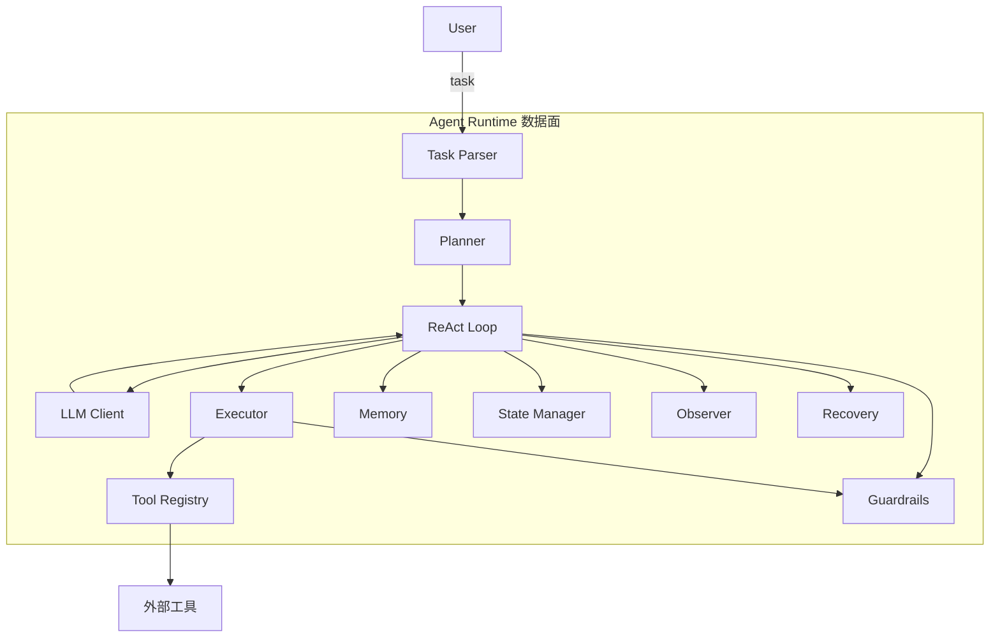

# 5. 核心模块

> 一句话理解：Agent Runtime 的功能可以被拆成若干独立模块，每个模块只负责一个横切关注点，并通过统一的事件与状态机制协同。

## 模块总览



## 1. Task Parser

职责：把外部输入解析成 Runtime 内部任务对象。

处理内容：

- 提取 `task` 文本。
- 解析 `session_id`、`user_id`、`metadata`。
- 校验必填字段与格式。
- 注入默认策略（如最大迭代次数、超时时间）。

```python
@dataclass
class Task:
    task_id: str
    session_id: str
    user_id: str
    content: str
    max_steps: int = 10
    timeout: float = 60.0
```

## 2. Planner

职责：把任务分解为可执行的子目标或行动序列。

两种模式：

- **静态规划**：一次性生成完整计划，Runtime 按计划执行。
- **动态规划**：每轮根据 observation 重新评估下一步。

生产要点：

- 复杂任务才做显式规划，简单任务可直接进入 ReAct 循环。
- 计划应可回滚：当某步失败时，Planner 能重新生成替代计划。

## 3. ReAct Loop

职责：驱动“思考 → 行动 → 观察”循环。

核心逻辑：

```python
while not done and steps < max_steps:
    response = llm.chat(messages, tools)
    if response.tool_calls:
        observations = execute_all(response.tool_calls)
        append_observations(observations)
    else:
        return response.content
```

生产要点：

- 设置最大迭代次数，防止无限循环。
- 每轮更新 State Manager。
- 把每步事件发送给 Observer。

## 4. LLM Client

职责：统一封装对各种 LLM 的调用。

能力：

- 支持 OpenAI-compatible API、vLLM、Triton 等。
- 自动注入 tools schema。
- 处理响应解析（content / tool_calls / refusal）。
- 重试、fallback、超时管理。

Runtime 内部不直接绑定某个模型，而是通过 LLM Gateway 或 LLM Client 配置切换。

## 5. Tool Registry

职责：管理 Agent 可调用的工具集合。

功能：

- 用装饰器注册工具：`@tool(description="...")`。
- 自动生成 JSON Schema。
- 按 name 分发调用。
- 支持工具分组、版本、权限标签。

```python
registry = ToolRegistry()

@registry.tool(description="计算表达式")
def calculator(expr: str) -> str:
    ...

schemas = registry.get_schemas()
result = registry.invoke("calculator", {"expr": "1+1"})
```

## 6. Executor

职责：安全地执行工具调用。

能力：

- 参数校验。
- 超时控制。
- 异常捕获。
- 教学版沙箱（如限制文件路径、网络访问）。
- 记录执行耗时与结果。

生产级 Executor 通常会把危险工具放到独立进程或容器中运行。

## 7. Memory

职责：维护对话历史与上下文。

设计：

- `WorkingMemory`：当前会话的 messages 列表。
- `Summarizer`：上下文过长时压缩早期对话。
- `LongTermMemory`：跨会话记忆（可插拔向量 DB）。

详细实现参见 [Agent Memory 主题](/05-agent/memory/)。

接口示例：

```python
memory.add(role="user", content="...")
memory.add_tool_output(tool_call_id, name, content)
messages = memory.get_context(max_tokens=8000)
```

## 8. State Manager

职责：维护会话状态机与 checkpoint。

状态：

```python
class SessionState(Enum):
    IDLE = "idle"
    PLANNING = "planning"
    ACTING = "acting"
    OBSERVING = "observing"
    DONE = "done"
    ERROR = "error"
    WAITING_FOR_HUMAN = "waiting_for_human"
```

Checkpoint 内容：

- 当前状态。
- 最新 messages。
- 已执行 tool calls。
- 计划/subgoals。
- trace id。

## 9. Guardrails

职责：在执行关键路径上实施策略。

分类：

| 检查点 | 说明 |
|---|---|
| 输入检查 | 敏感词、越狱、越权 |
| 工具前置检查 | 调用次数、参数范围、权限标签 |
| 工具后置检查 | 结果是否包含敏感信息 |
| 输出检查 | 内容安全、格式校验 |
| 资源检查 | 迭代次数、超时、token 上限 |
| HITL 检查 | 高风险操作需人类确认 |

Guardrails 应该可配置、可组合，并且不影响核心循环的可读性。

## 10. Observer

职责：记录 Agent 执行的完整轨迹。

事件类型：

```python
event_types = [
    "task_received",
    "input_guardrail_passed",
    "planning_done",
    "llm_called",
    "llm_response",
    "tool_executed",
    "observation_added",
    "output_guardrail_passed",
    "task_completed",
    "task_failed",
    "hitl_requested",
]
```

输出格式：

- OpenTelemetry trace/span。
- LangSmith run。
- 结构化日志。

Observer 不应阻塞主循环；可以异步发送事件。

## 11. Recovery

职责：处理失败与异常，决定重试、降级还是终止。

策略：

- **重试**：参数错误时让 LLM 重新生成。
- **Fallback**：主模型失败时切备用模型。
- **部分结果**：迭代超限时返回已完成的子目标结果。
- **HITL**：无法自动恢复时请求人类介入。
- **终止**：无法恢复时记录错误并结束。

## 模块协作原则

1. **Loop 是核心，其他是插件**：Planner、Memory、Guardrails、Observer 都通过接口接入，不侵入循环逻辑。
2. **状态唯一**：State Manager 是状态的唯一来源，避免多模块各自维护状态。
3. **事件驱动**：Observer 通过事件总线接收通知，模块间不直接耦合。
4. **失败隔离**：Executor 的失败不应导致整个 Runtime 崩溃。

## 本章小结

Agent Runtime 的 11 个核心模块——Task Parser、Planner、ReAct Loop、LLM Client、Tool Registry、Executor、Memory、State Manager、Guardrails、Observer、Recovery——覆盖了从任务输入到结果输出的完整链路。模块化设计让 Runtime 既能作为教学 Demo 跑通，也能在生产中按需扩展。

**参考来源**

- [LangGraph Concepts](https://langchain-ai.github.io/langgraph/concepts/high_level/)
- [OpenAI Agents SDK — Agents and Tools](https://platform.openai.com/docs/guides/agents)
- [PydanticAI — Tools](https://ai.pydantic.dev/tools/)
