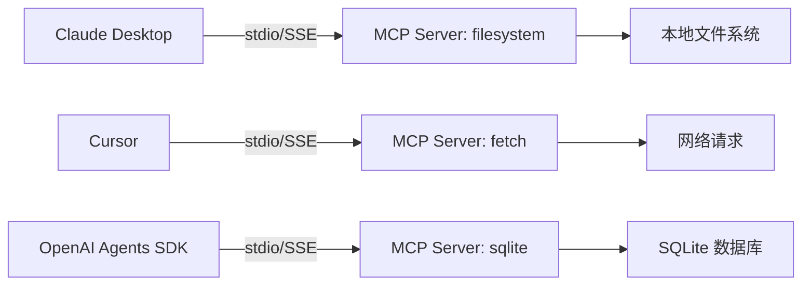

# 1. 背景

> 一句话理解：**从“每个 Agent 手写工具调用”到“标准化协议”**，MCP 解决了工具发现、跨模型复用与供应商锁定问题。

## 为什么需要 MCP？

大模型应用的发展大致经历了三个阶段：

```text
Prompt Engineering → RAG → Agent → Agent Ecosystem
```

- **Prompt Engineering**：模型只负责生成文本。
- **RAG**：模型基于检索结果回答。
- **Agent**：模型自主调用工具、分解任务、多轮迭代。
- **Agent Ecosystem**：大量 Agent、工具、数据源需要互操作。

当进入 Agent Ecosystem 阶段后，每个 Agent 都手写工具集成，会带来几个问题：

1. **重复集成**：每个 Agent 都要为同一个数据库/API/文件系统写一遍封装。
2. **发现困难**：Agent 不知道当前环境有哪些可用工具，只能硬编码。
3. **跨模型复用差**：OpenAI 的 function schema、Claude 的 tool use、Gemini 的 function calling 格式略有不同。
4. **供应商锁定**：工具实现与某个框架或模型供应商深度绑定，迁移成本高。
5. **权限与审计分散**：每个 Agent 自己管认证、限流、日志，安全策略难以统一。

MCP 想要做的，就是给这些外部能力定义一个统一的“接口形状”，让能力提供方（Server）和能力消费方（Client/Host）解耦。

## 从 Function Calling 到 MCP


- **Function Calling**：模型直接输出 JSON 调用请求，由应用层解析执行。最灵活，但发现、注册、复用都靠手写。
- **MCP**：在 Function Calling 之上增加标准化的发现、协商、调用、通知协议，Server 可以独立进程/服务运行。
- **Skills**：更工程化的能力封装，把 auth、telemetry、sandbox 打包，可直接在 Runtime 内复用。可以看作 MCP 在 Runtime 内的“轻量本地化”形态。

MCP 没有替代 Function Calling，而是把 Function Calling 的发现与调用过程标准化。

## MCP 与相关概念的区别

| 概念 | 核心问题 | 与 MCP 的关系 |
|---|---|---|
| **REST / OpenAPI** | 人类/程序如何调用 HTTP API | MCP Server 内部可以用 REST 实现，但 MCP 关注“模型视角”的能力发现与调用 |
| **A2A（Agent-to-Agent）** | Agent 之间如何协作通信 | A2A 解决多 Agent 协作，MCP 解决 Agent 与外部能力连接；两者互补 |
| **Skills** | Runtime 内如何封装能力单元 | Skills 可在 Runtime 内原生运行，MCP 强调跨进程/跨服务的协议互操作 |
| **Function Calling** | 模型如何表达工具调用 | MCP 复用 function calling 的 JSON schema 思想，并扩展了发现与生命周期 |
| **LLM Gateway** | 多模型统一接入 | Gateway 在模型侧，MCP 在工具/资源侧，两者可在 Agent 架构中并存 |
| **Agent Runtime** | Agent 如何执行 | Runtime 可通过 MCP Client 接入 Server，也可直接 function calling |

> 一句话：MCP 是模型视角的“能力 USB-C”，不是替代 REST 或 Function Calling，而是让它们对模型更可发现、可复用。

## MCP 解决的关键问题

1. **标准化发现**：Server 启动后通过 `tools/list`、`resources/list`、`prompts/list` 告诉 Client 自己能做什么。
2. **动态协商**：Client 与 Server 在 `initialize` 阶段交换 capability，双方只启用都支持的能力。
3. **解耦实现**：Server 可以是本地 Python 脚本、Docker 容器、远程 HTTP 服务，Client 不感知实现细节。
4. **跨 Host 复用**：同一个 Server 可以被 Claude Desktop、Cursor、Cline、OpenAI Agents SDK 同时使用。
5. **安全集中**：Host 掌握最终决策权，决定哪些 Server 能运行、哪些 Tool 能调用、哪些 Resource 能读取。

## 主流生态

| 产品/项目 | MCP 角色 | 说明 |
|---|---|---|
| **Claude Desktop / Claude Code** | Host | 官方 Host，支持通过配置文件添加 MCP Server |
| **Cursor** | Host | IDE 内置 MCP，可直接调用文件、数据库、搜索等 Server |
| **Cline** | Host | VS Code 插件，支持 MCP Server 扩展 |
| **OpenAI Agents SDK** | Client/Host | 通过 `MCPServerStdio` / `MCPServerSse` 接入 MCP Server |
| **modelcontextprotocol/servers** | Server 集合 | 官方参考 Server：filesystem、fetch、sqlite、postgres 等 |
| **python-sdk / typescript-sdk** | SDK | 官方提供的 Server/Client 开发包 |



## 为什么现在 MCP 变得重要？

1. **Agent 数量爆炸**：每个业务线都在做 Agent，工具集成不能重复造轮子。
2. **模型供应商多样化**：企业同时使用 Claude、OpenAI、Gemini、自研模型，需要跨模型复用工具。
3. **安全与治理需求**：工具调用涉及数据访问、代码执行、外部 API，需要统一的认证、审计、审批。
4. **生态成熟度**：Anthropic 开源 MCP 后，官方 SDK、参考 Server、主流 IDE 快速跟进，生态已经越过“概念验证”阶段。

## 本章小结

MCP 的产生是 Agent 生态演进的必然结果：当外部能力（文件、数据库、API、提示模板）越来越多、Agent 越来越普及时，就必须有一个开放协议来统一能力的声明、发现与调用。它不是替代 Function Calling 或 REST，而是站在模型视角，把“每个 Agent 自己写工具集成”变成“一次实现、到处复用”。

**参考来源**

- [Model Context Protocol Specification](https://modelcontextprotocol.io/specification/2025-06-18)
- [Introduction to MCP](https://modelcontextprotocol.io/introduction)
- [Anthropic: Model Context Protocol](https://www.anthropic.com/news/model-context-protocol)
- [Claude Code MCP Docs](https://docs.anthropic.com/en/docs/claude-code/mcp)
- [OpenAI Agents SDK MCP](https://openai.github.io/openai-agents-python/mcp/)
- [从 Function Call 到 MCP → SKILLS](https://crossoverjie.top/2026/02/03/AI/MCP-Skills-intro/)
- [Building Effective Agents — Anthropic Engineering](https://www.anthropic.com/engineering/building-effective-agents)
