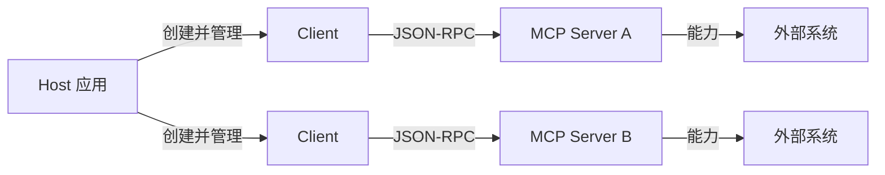
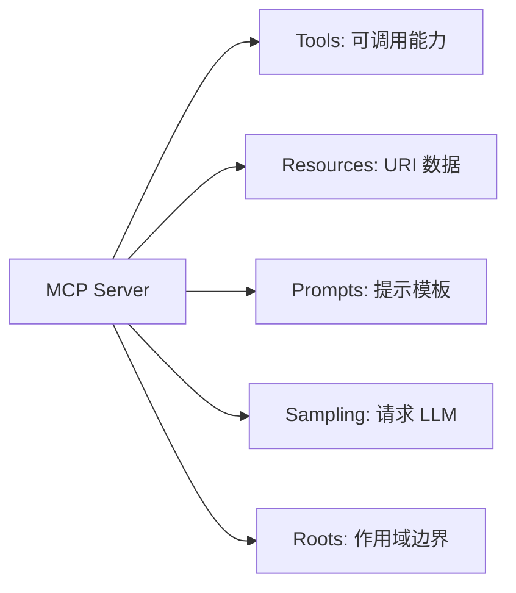
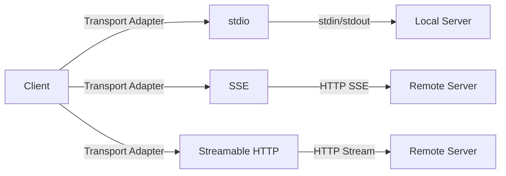

# 2. 核心思想

> 一句话理解：MCP 的核心是“能力声明 + 动态发现 + 请求/通知双通道”，Server 声明 Tools/Resources/Prompts，Client 按需调用，Host 做最终决策。

## 1. Host / Client / Server 三角角色

MCP 把参与者分成三个角色，职责边界非常清晰：

| 角色 | 职责 | 典型实现 |
|---|---|---|
| **Host** | 发起连接、管理多个 Client、做最终安全决策、暴露 UI/入口 | Claude Desktop、Cursor、Cline、自定义 Agent 应用 |
| **Client** | 维持与单个 Server 的连接，转发请求/通知，管理会话生命周期 | SDK 中的 `Client` 或 `ClientSession` |
| **Server** | 暴露 Tools、Resources、Prompts、Sampling、Roots 等能力 | filesystem、fetch、sqlite、自定义业务 Server |



- **Host 掌握最终决策权**：是否允许调用某个 Tool、是否读取某个 Resource、是否转发 Sampling 请求给 LLM，都由 Host 决定。
- **Client 是连接代理**：一个 Client 对应一个 Server，负责协议细节（initialize、心跳、关闭）。
- **Server 只关心能力实现**：不感知其他 Server，也不关心 Host 是谁。

## 2. Primitives：MCP 的五大原语

MCP 协议围绕五种核心能力原语展开：

| 原语 | 说明 | 典型调用 |
|---|---|---|
| **Tools** | Server 提供的可调用的函数/能力 | `tools/list`、`tools/call` |
| **Resources** | Server 暴露的可读数据，用 URI 标识 | `resources/list`、`resources/read` |
| **Prompts** | Server 提供的可复用提示模板 | `prompts/list`、`prompts/get` |
| **Sampling** | Server 请求 Host 代为调用 LLM 生成文本 | `sampling/createMessage` |
| **Roots** | Client 告诉 Server 哪些目录/空间是“根” | `notifications/roots/list_changed` |



- **Tools** 是“动作”：有副作用，需要 Host 审批。
- **Resources** 是“数据”：只读（默认），用于给模型提供上下文。
- **Prompts** 是“模板”：帮助用户/Agent 快速构造高质量提示。
- **Sampling** 是“反向调用”：Server 不直接调 LLM，而是请 Host 帮忙调。
- **Roots** 是“作用域”：告诉 Server 当前会话允许访问哪些根目录或空间。

## 3. Capability Negotiation：能力协商

MCP 会话开始前，Client 与 Server 必须交换 capability：

```json
{
  "jsonrpc": "2.0",
  "id": 1,
  "method": "initialize",
  "params": {
    "protocolVersion": "2025-06-18",
    "capabilities": {
      "sampling": {},
      "roots": { "listChanged": true }
    },
    "clientInfo": { "name": "my-client", "version": "1.0.0" }
  }
}
```

Server 回复：

```json
{
  "jsonrpc": "2.0",
  "id": 1,
  "result": {
    "protocolVersion": "2025-06-18",
    "capabilities": {
      "tools": { "listChanged": true },
      "resources": { "subscribe": true, "listChanged": true },
      "prompts": { "listChanged": true }
    },
    "serverInfo": { "name": "my-server", "version": "1.0.0" }
  }
}
```

协商要点：

- **protocolVersion**：双方必须使用兼容的版本，否则应拒绝连接。
- **capabilities**：只启用双方都声明支持的能力，避免协议不匹配。
- **listChanged / subscribe**：Server 是否支持动态增删 Tool/Resource 或订阅变更。
- **info**：记录 name/version，便于调试与审计。

## 4. Transport 无关性

MCP 协议层不依赖特定传输方式。官方 Spec 定义了三种 Transport：

| Transport | 适用场景 | 特点 |
|---|---|---|
| **stdio** | 本地进程 | Server 作为子进程启动，stdin/stdout 传输 JSON-RPC；最简单、最常见 |
| **SSE** | 远程 Server | 基于 HTTP Server-Sent Events，适合浏览器/远程服务 |
| **Streamable HTTP** | 远程 Server | 在 SSE 基础上进一步标准化流式传输 |

Transport 无关性的价值：

- 同一套 Server 逻辑可以编译成本地 stdio Server，也可以部署成远程 HTTP Server。
- Client 代码只需替换 Transport Adapter，无需改动协议处理逻辑。
- Host 可以根据安全策略选择本地隔离还是远程共享。



## 5. URI 与 MIME type 约定

MCP Resource 使用 URI 作为全局标识符：

```text
file:///Users/case/project/README.md
sqlite:///app.db/tables/users
https://api.example.com/v1/reports/123
```

约定：

- **URI scheme 表达来源**：`file://`、`sqlite://`、`https://` 等。
- **路径表达资源位置**：Server 负责把 URI 映射到实际数据。
- **MIME type 表达内容类型**：`text/plain`、`application/json`、`image/png` 等，帮助 Host 决定如何渲染。

```json
{
  "uri": "file:///project/README.md",
  "mimeType": "text/markdown",
  "text": "# Project README\n..."
}
```

URI 稳定性很重要：同一个 URI 在不同时间应返回语义一致的资源，便于缓存与审计。

## 6. 请求/通知双通道

MCP 基于 JSON-RPC 2.0，支持两种消息：

- **Request/Response**：Client 发请求，Server 必须回复，例如 `tools/call`。
- **Notification**：单向通知，不需要回复，例如 `notifications/resources/updated`。

通知机制让 Server 可以主动推送变更：

- `notifications/tools/list_changed`：Tool 列表发生变化。
- `notifications/resources/updated`：某个 Resource 内容更新。
- `notifications/roots/list_changed`：Roots 发生变化。
- `notifications/initialized`：Client 完成初始化。
- `notifications/cancelled`：取消某个进行中的请求。

这种设计让 MCP 既能做同步调用，也能做事件驱动的更新。

## 7. Host 的最终决策权

MCP 把安全责任放在 Host 上：

- Server 只能声明能力，不能主动调用。
- Client 必须转发请求给 Host，由 Host 决定是否执行。
- 对于 Sampling，Host 可以拦截、修改、拒绝或记录。
- 对于 Roots，Host 可以限定 Server 能访问的数据范围。

这意味着 MCP 不是一个“Server 可以随意操作 Host”的协议，而是一个“Host 授权下 Server 才能被使用”的协议。

## 本章小结

MCP 的核心思想可以概括为：Server 声明能力、Client 管理连接、Host 掌控决策。通过 Tools、Resources、Prompts、Sampling、Roots 五大原语，MCP 把外部能力抽象成模型可理解、可发现、可协商的接口；通过 Transport 无关性和 URI/MIME 约定，它又能适应本地与远程多种部署形态。

**参考来源**

- [MCP Specification: Architecture](https://modelcontextprotocol.io/specification/2025-06-18/architecture)
- [MCP Core Primitives](https://modelcontextprotocol.io/specification/2025-06-18/server/tools)
- [MCP Server Capabilities](https://modelcontextprotocol.io/specification/2025-06-18/server/utilities/capabilities)
- [Anthropic: Model Context Protocol](https://www.anthropic.com/news/model-context-protocol)
