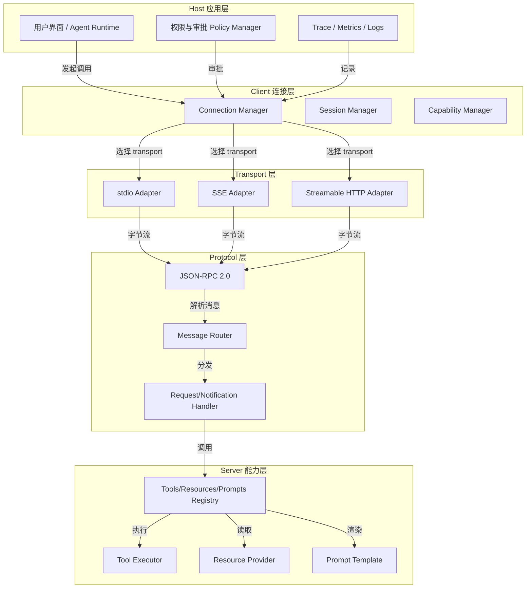
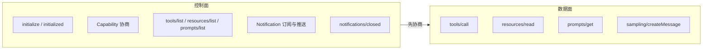
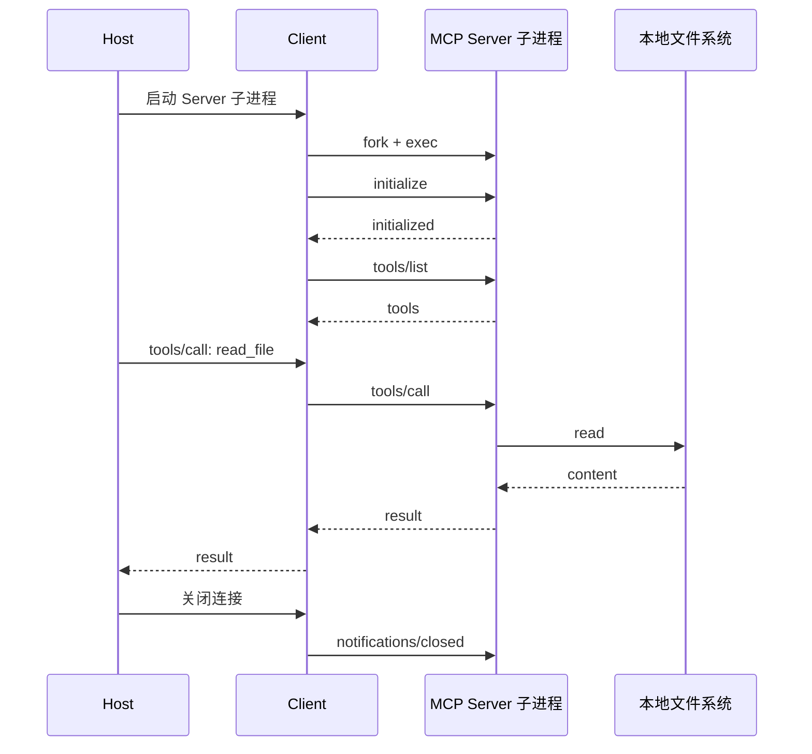
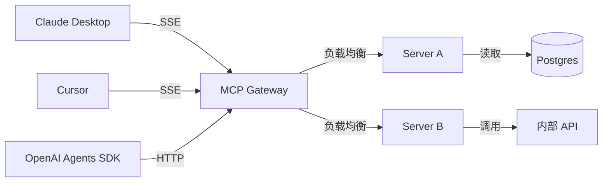
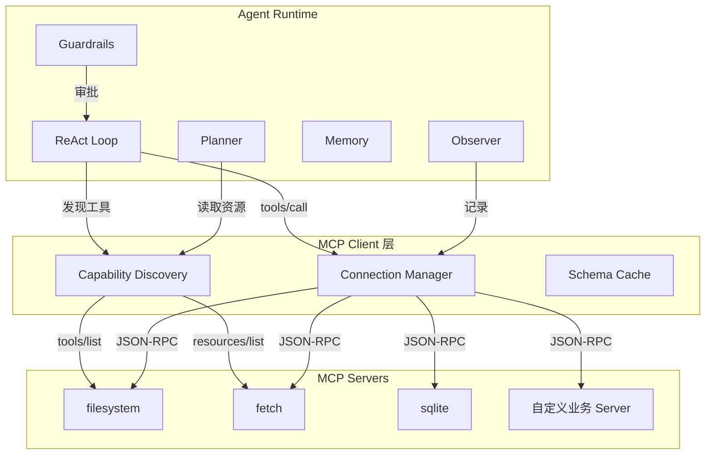

# 3. 架构设计

> 一句话理解：典型 MCP 架构分为 Host 应用层、Client 连接层、Transport 层、Protocol 层、Server 能力层五层。

## 1. 五层架构

各层职责：

| 层级 | 职责 | 关键组件 |
|---|---|---|
| **Host 应用层** | 用户交互、权限审批、最终决策、可观测 | UI、Policy Manager、Observer |
| **Client 连接层** | 创建/维护与 Server 的连接，管理会话状态 | Connection Manager、Session Manager、Capability Manager |
| **Transport 层** | 把 JSON-RPC 消息映射到具体传输通道 | stdio/SSE/Streamable HTTP Adapter |
| **Protocol 层** | JSON-RPC 编解码、消息路由、请求/通知分发 | JSON-RPC、Router、Handler |
| **Server 能力层** | 实现 Tools、Resources、Prompts、Sampling 等能力 | Registry、Executor、Provider |

## 2. 控制面与数据面

MCP 架构可以进一步拆分为控制面和数据面：

- **控制面**：负责连接建立、能力发现、变更通知、生命周期管理。消息量小、频率低、必须可靠。
- **数据面**：负责实际能力调用与数据流动。消息量大、可能包含大文本/二进制、需要流控与超时。

生产建议：

- 控制面与数据面可以使用同一条 Transport，但在网关/代理层应分别设限。
- 数据面的大资源传输应考虑分片、压缩、流式返回。
- 控制面的 capability 变更应触发 Client 重新发现。

## 3. 本地 stdio 部署形态

stdio 是最常见的 MCP 部署方式，特别适合本地工具：

特点：

- **进程隔离**：Server 作为独立进程运行，崩溃不影响 Host。
- **简单部署**：无需网络配置，适合本地文件、数据库、脚本工具。
- **权限依赖 OS**：Server 继承启动用户的权限，需要 Host 控制启动参数与环境。

## 4. 远程 SSE / Streamable HTTP 部署形态

远程部署适合共享服务、多 Host 复用：

特点：

- **共享能力**：多个 Host 可以复用同一组 Server。
- **集中治理**：网关层统一做认证、限流、审计、路由。
- **网络开销**：相比 stdio，远程调用有延迟与序列化成本。
- **安全边界**：Server 与 Host 不在同一机器，需要 TLS、OAuth/API Key 等机制。

## 5. 与 Agent Runtime 集成的参考架构

Agent Runtime 可以通过 MCP Client 接入外部 Server：

集成要点：

- **Schema 缓存**：发现阶段把 Tool/Resource/Prompt schema 缓存起来，避免每次调用都重新 list。
- **权限前置**：Runtime 的 Guardrails 在调用前检查 Tool 权限与参数白名单。
- **错误回传**：Tool 执行失败的信息作为 observation 回传给模型，让模型决定重试或放弃。
- **观测打通**：MCP Client 层把请求/响应、 capability 变更、连接事件汇入 Runtime 的 trace。

## 本章小结

MCP 架构通过五层分层（Host/Client/Transport/Protocol/Server）把复杂的协议交互拆成可替换、可扩展的模块；通过控制面与数据面的分离，把能力协商与实际调用分开治理；通过 stdio/SSE/Streamable HTTP 三种部署形态，覆盖本地隔离与远程共享两种场景。与 Agent Runtime 集成时，MCP Client 层承担发现、缓存、调用、观测的职责，让 Runtime 专注于 ReAct 循环与策略控制。

**参考来源**

- [MCP Specification: Architecture](https://modelcontextprotocol.io/specification/2025-06-18/architecture)
- [MCP Specification: Transports](https://modelcontextprotocol.io/specification/2025-06-18/basic/transports)
- [Anthropic: Building Effective Agents](https://www.anthropic.com/engineering/building-effective-agents)
- [从 Function Call 到 MCP → SKILLS](https://crossoverjie.top/2026/02/03/AI/MCP-Skills-intro/)
