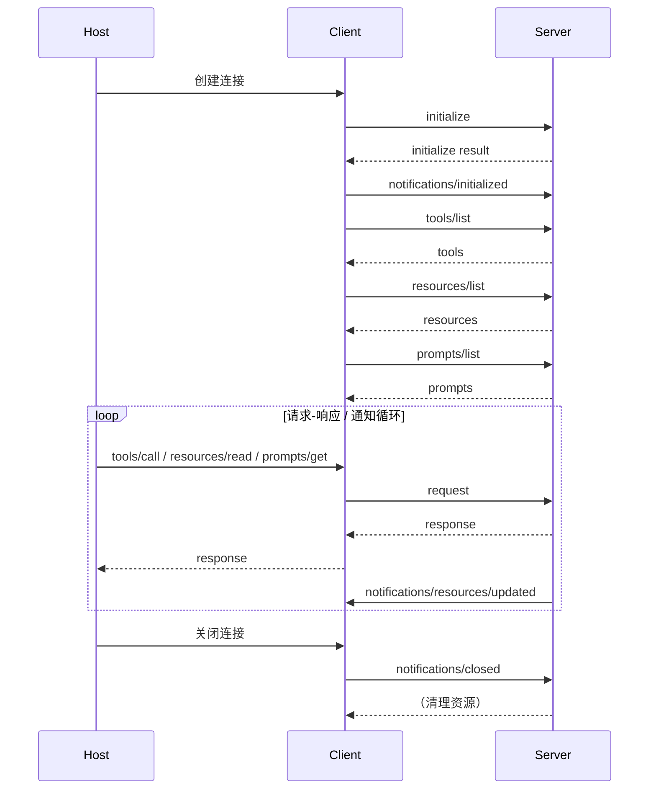
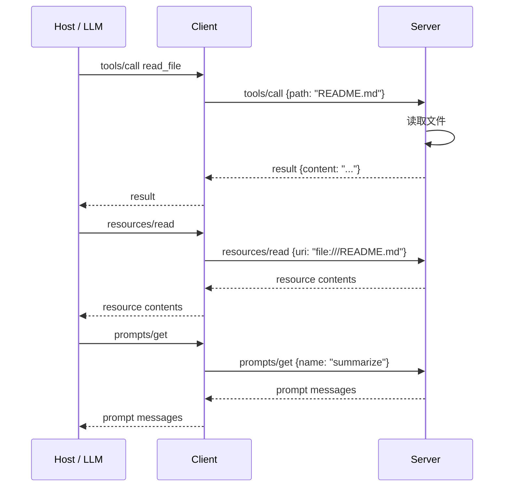

# 4. 协议工作流程

> 一句话理解：一个 MCP 会话从 `initialize` 握手开始，经过能力交换、工具/资源/提示发现，最终进入请求-响应或通知循环，直到 `notifications/closed`。

## 1. 连接生命周期



一个完整生命周期包含四个阶段：

1. **连接建立**：Transport 层建立通道（stdio 启动子进程、SSE/HTTP 建立连接）。
2. **初始化握手**：`initialize` → `initialize result` → `notifications/initialized`。
3. **能力发现**：`tools/list`、`resources/list`、`prompts/list` 获取可用能力。
4. **运行与关闭**：请求-响应循环 + 通知循环，最后 `notifications/closed` 清理。

## 2. initialize / initialized

`initialize` 是 MCP 会话的第一个请求，Client 发送自身支持的 protocolVersion 与 capabilities：

```json
{
  "jsonrpc": "2.0",
  "id": 1,
  "method": "initialize",
  "params": {
    "protocolVersion": "2025-06-18",
    "capabilities": {
      "roots": { "listChanged": true },
      "sampling": {}
    },
    "clientInfo": {
      "name": "ai-infra-handbook-client",
      "version": "0.1.0"
    }
  }
}
```

Server 回复自身能力：

```json
{
  "jsonrpc": "2.0",
  "id": 1,
  "result": {
    "protocolVersion": "2025-06-18",
    "capabilities": {
      "tools": { "listChanged": true },
      "resources": { "subscribe": true, "listChanged": true },
      "prompts": { "listChanged": true },
      "logging": {}
    },
    "serverInfo": {
      "name": "mini-mcp-server",
      "version": "0.1.0"
    }
  }
}
```

Client 收到 initialize result 后，必须发送 `notifications/initialized`，Server 在此之前不会处理其他请求。

```json
{
  "jsonrpc": "2.0",
  "method": "notifications/initialized"
}
```

## 3. tools/list、resources/list、prompts/list

发现阶段让 Client 知道 Server 提供哪些能力：

```json
// Client 请求
{
  "jsonrpc": "2.0",
  "id": 2,
  "method": "tools/list"
}

// Server 回复
{
  "jsonrpc": "2.0",
  "id": 2,
  "result": {
    "tools": [
      {
        "name": "read_file",
        "description": "读取本地文件内容",
        "inputSchema": {
          "type": "object",
          "properties": {
            "path": { "type": "string" }
          },
          "required": ["path"]
        }
      }
    ]
  }
}
```

`resources/list` 返回 URI、name、MIME type；`prompts/list` 返回 name、description、参数 schema。Host 通常会把这些 schema 缓存，并决定是否展示给用户/模型。

## 4. tools/call、resources/read、prompts/get

发现完成后进入调用阶段：



- **tools/call**：执行动作，可能有副作用，需要 Host 审批。
- **resources/read**：读取数据，默认只读，用于给模型提供上下文。
- **prompts/get**：获取提示模板，帮助模型/用户构造高质量输入。

`tools/call` 响应示例：

```json
{
  "jsonrpc": "2.0",
  "id": 3,
  "result": {
    "content": [
      {
        "type": "text",
        "text": "文件内容 ..."
      }
    ],
    "isError": false
  }
}
```

## 5. Notification 与 Subscription

Notification 是 MCP 的事件驱动机制。Client 不需要回复 Notification，但可以主动订阅 Resource 变更：

```json
// Client 订阅
{
  "jsonrpc": "2.0",
  "id": 4,
  "method": "resources/subscribe",
  "params": {
    "uri": "file:///project/config.json"
  }
}

// Server 后续主动推送
{
  "jsonrpc": "2.0",
  "method": "notifications/resources/updated",
  "params": {
    "uri": "file:///project/config.json"
  }
}
```

常用 Notification：

| Notification | 方向 | 含义 |
|---|---|---|
| `notifications/initialized` | C→S | Client 已完成初始化 |
| `notifications/cancelled` | C→S | 取消某个请求 |
| `notifications/progress` | 双向 | 报告长请求进度 |
| `notifications/tools/list_changed` | S→C | Tool 列表变化 |
| `notifications/resources/updated` | S→C | Resource 内容更新 |
| `notifications/resources/list_changed` | S→C | Resource 列表变化 |
| `notifications/prompts/list_changed` | S→C | Prompt 列表变化 |
| `notifications/roots/list_changed` | C→S | Roots 变化 |
| `notifications/closed` | C→S | 连接即将关闭 |

## 6. 错误码与 JSON-RPC 2.0 映射

MCP 基于 JSON-RPC 2.0，错误响应格式如下：

```json
{
  "jsonrpc": "2.0",
  "id": 3,
  "error": {
    "code": -32602,
    "message": "Invalid params",
    "data": {
      "details": "缺少必填参数 path"
    }
  }
}
```

常用错误码：

| 错误码 | 含义 | 场景 |
|---|---|---|
| `-32700` | Parse error | JSON 解析失败 |
| `-32600` | Invalid Request | 请求格式非法 |
| `-32601` | Method not found | Server 不支持该方法 |
| `-32602` | Invalid params | 参数校验失败 |
| `-32603` | Internal error | Server 内部错误 |
| `-32000` | Server error | 自定义 Server 错误 |

MCP 还定义了协议级错误码，例如：

- `InvalidRequest`：请求本身非法。
- `MethodNotFound`：方法不存在。
- `InvalidParams`：参数错误。
- `InternalError`：Server 内部错误。

生产建议：

- 不要把业务错误直接映射成 JSON-RPC error，而是放在 `tools/call` 的 `isError=true` 结果里返回，让模型自己决定下一步。
- JSON-RPC error 保留给协议级错误（连接、解析、方法不存在等）。

## 7. 关闭与清理

MCP 连接关闭时应发送 `notifications/closed`，让 Server 有机会释放资源：

```json
{
  "jsonrpc": "2.0",
  "method": "notifications/closed"
}
```

对于 stdio Server，Client 关闭 stdin/stdout 后通常应等待子进程退出；对于 SSE/HTTP Server，Client 应正常关闭连接。

关闭阶段注意：

- 未完成的长请求应通过 `notifications/cancelled` 取消。
- Server 收到 closed 后应停止执行中的任务、关闭文件句柄、释放数据库连接。
- Host 应记录会话关闭事件，用于审计与调试。

## 本章小结

MCP 协议工作流程可以概括为：先握手（initialize），再发现（list），后调用（call/read/get），期间通过 Notification 处理事件与变更，最后通过 closed 安全收尾。理解这套生命周期，是读懂 SDK、实现 Server、调试连接问题的基础。

**参考来源**

- [MCP Specification: Lifecycle](https://modelcontextprotocol.io/specification/2025-06-18/basic/lifecycle)
- [MCP Specification: Messages](https://modelcontextprotocol.io/specification/2025-06-18/basic/messages)
- [JSON-RPC 2.0 Specification](https://www.jsonrpc.org/specification)
- [MCP Specification: Errors](https://modelcontextprotocol.io/specification/2025-06-18/server/utilities/errors)
