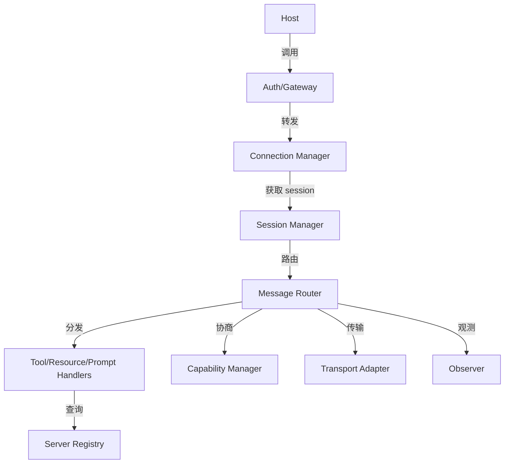
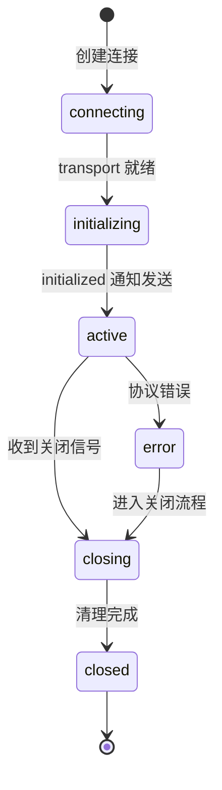

# 5. 核心模块

> 一句话理解：生产级 MCP 系统需要 Server Registry、Capability Manager、Transport Adapter、Session Manager、Message Router、Tool/Resource/Prompt Handlers、Auth/Gateway、Observer 八大模块协同工作。

## 模块总览



| 模块 | 输入 | 输出 | 关键职责 |
|---|---|---|---|
| **Server Registry** | Server 元数据、manifest、capability | 可用 Server 列表、schema 缓存 | 注册、发现、版本管理 |
| **Capability Manager** | Client/Server capability | 协商后的 capability | 版本检查、能力启用/禁用 |
| **Transport Adapter** | JSON-RPC 消息、transport 配置 | 字节流 / HTTP 帧 | stdio/SSE/HTTP 适配 |
| **Session Manager** | 连接、会话 ID、生命周期事件 | Session 状态、清理句柄 | 创建、维护、关闭会话 |
| **Message Router** | JSON-RPC 消息 | 分发到 Handler 或 Client | 请求/响应/通知路由 |
| **Handlers** | Tool/Resource/Prompt 请求 | 执行结果 | 参数校验、调用、错误处理 |
| **Auth/Gateway** | 请求、凭证、策略 | 允许/拒绝/转发 | 认证、授权、限流、审计 |
| **Observer** | 协议事件、请求/响应 | Trace、Metrics、Logs | 可观测与诊断 |

## 1. Server Registry

Server Registry 负责管理所有可用的 MCP Server：

- **注册**：记录 Server 名称、版本、入口命令、transport 类型、manifest 路径。
- **发现**：Host 启动时从 Registry 拉取 Server 列表。
- **schema 缓存**：缓存 `tools/list`、`resources/list`、`prompts/list` 结果，减少重复发现。
- **版本管理**：跟踪 Server 版本，支持灰度发布与回滚。

示例接口：

```python
class ServerRegistry:
    def register(self, server: ServerMeta) -> None: ...
    def list_servers(self) -> list[ServerMeta]: ...
    def get_schema(self, server_name: str, primitive: str) -> dict: ...
    def invalidate_cache(self, server_name: str) -> None: ...
```

生产注意点：

- Registry 应支持 manifest 校验，防止恶意 Server 注入非法 schema。
- schema 缓存需要失效机制，Server 更新后应触发重新发现。
- 多 Host 场景下，Registry 应集中存储，避免每个 Host 各自维护一份。

## 2. Capability Manager

Capability Manager 在初始化阶段完成 Client 与 Server 的能力协商：

- **protocolVersion 校验**：不兼容版本必须拒绝连接。
- **capability 交集**：只启用双方都支持的能力。
- **动态更新**：当 Server capability 变化时，通知 Client 重新协商。

示例逻辑：

```python
def negotiate(client_caps: Capabilities, server_caps: Capabilities) -> Capabilities:
    return Capabilities(
        tools=intersect(client_caps.tools, server_caps.tools),
        resources=intersect(client_caps.resources, server_caps.resources),
        prompts=intersect(client_caps.prompts, server_caps.prompts),
        sampling=intersect(client_caps.sampling, server_caps.sampling),
    )
```

生产注意点：

- capability 不匹配时要明确拒绝，不能静默降级导致功能缺失。
- Server 升级新增 capability 后，老 Client 应能继续工作（向后兼容）。
- capability 变更事件应被 Observer 记录。

## 3. Transport Adapter

Transport Adapter 把上层 JSON-RPC 消息映射到具体传输通道：

| Adapter | 适用场景 | 关键实现 |
|---|---|---|
| **stdio** | 本地子进程 | `subprocess.Popen`，stdin 写请求，stdout 读响应 |
| **SSE** | 远程 Server | HTTP GET 建立 SSE 通道，HTTP POST 发送请求 |
| **Streamable HTTP** | 远程 Server | 复用 HTTP 连接做双向流式传输 |

Adapter 接口示例：

```python
class TransportAdapter(ABC):
    async def send(self, message: bytes) -> None: ...
    async def receive(self) -> AsyncIterator[bytes]: ...
    async def close(self) -> None: ...
```

生产注意点：

- stdio Server 崩溃时要能检测并重启。
- SSE/HTTP 需要处理重连、心跳、超时。
- Transport 层不应解析 JSON-RPC 内容，只负责可靠传输字节。

## 4. Session Manager

Session Manager 管理一个 Client-Server 连接的生命周期：

- **创建会话**：分配 session_id，初始化状态。
- **状态机**：`connecting` → `initializing` → `active` → `closing` → `closed`。
- **请求关联**：维护 `id` 到 pending request 的映射。
- **清理**：关闭时取消未完成的请求，释放资源。



生产注意点：

- 每个会话应有独立的超时与配额管理。
- 长请求应支持 progress notification 与取消。
- Session 状态应暴露给 Observer，便于监控连接健康度。

## 5. Message Router

Message Router 负责把 JSON-RPC 消息分发到正确的地方：

- **请求路由**：Client 收到 Host 请求后转发给 Server；Server 收到请求后交给 Handler。
- **响应路由**：根据 `id` 找到对应的 pending request。
- **通知路由**：把 Notification 分发给订阅者（例如 Resource 变更通知）。

生产注意点：

- Router 需要处理乱序到达的响应。
- Notification 不应阻塞 Request/Response 主通道。
- 未知 method 应返回 `Method not found` 错误。

## 6. Tool / Resource / Prompt Handlers

Handlers 是 Server 侧真正执行业务逻辑的地方：

| Handler | 职责 | 生产注意点 |
|---|---|---|
| **Tool Handler** | 执行 Tool、校验参数、返回结果 | 幂等、超时、沙箱、权限检查 |
| **Resource Handler** | 读取 Resource、返回内容 | URI 稳定、MIME 正确、大资源分片 |
| **Prompt Handler** | 渲染 Prompt 模板 | 版本化、参数校验、避免提示注入 |

Tool Handler 示例：

```python
class ToolHandler:
    async def handle(self, name: str, arguments: dict) -> ToolResult:
        tool = self.registry.get(name)
        if tool is None:
            raise MethodNotFound(f"tool {name} not found")
        validated = tool.schema.validate(arguments)
        result = await tool.execute(validated)
        return ToolResult(content=[TextContent(text=result)])
```

## 7. Auth/Gateway

MCP Gateway 是企业部署中的关键模块：

- **认证**：API Key、OAuth 2.0、JWT、mTLS。
- **授权**：根据 Host/用户身份决定能调用哪些 Server/Tool/Resource。
- **限流**：按 Host、Server、Tool 维度限流，防止滥用。
- **审计**：记录所有请求/响应、审批事件、错误事件。
- **路由**：把请求转发到正确的 Server 实例。

生产注意点：

- Gateway 不应解密或修改业务 payload，除非策略要求。
- 敏感操作（写文件、删除、转账）应触发 HITL 审批。
- Gateway 自身应支持水平扩展与高可用。

## 8. Observer

Observer 负责 MCP 系统的可观测：

- **Trace**：一次完整 MCP 会话的执行树。
- **Span**：每个请求/响应、每个 Tool 调用、每个 capability 协商。
- **Metrics**：连接数、QPS、延迟、错误率、Tool 调用分布。
- **Logs**：结构化日志，包含 session_id、request_id、method、status。

Observer 应集成 OpenTelemetry、Prometheus、结构化日志系统：

```python
class Observer:
    def start_span(self, name: str, parent: Span | None) -> Span: ...
    def log_event(self, event: MCPEvent) -> None: ...
    def record_metric(self, name: str, value: float, labels: dict) -> None: ...
```

## 本章小结

生产级 MCP 系统不是简单的 JSON-RPC 代理，而是由 Server Registry、Capability Manager、Transport Adapter、Session Manager、Message Router、Handlers、Auth/Gateway、Observer 八大模块组成的完整基础设施。每个模块都有明确的输入输出与职责边界，只有在权限、治理、可观测方面都考虑周全，MCP 才能真正在企业中稳定运行。

**参考来源**

- [MCP Specification: Architecture](https://modelcontextprotocol.io/specification/2025-06-18/architecture)
- [MCP Python SDK](https://github.com/modelcontextprotocol/python-sdk)
- [MCP TypeScript SDK](https://github.com/modelcontextprotocol/typescript-sdk)
- [Anthropic: Building Effective Agents](https://www.anthropic.com/engineering/building-effective-agents)
