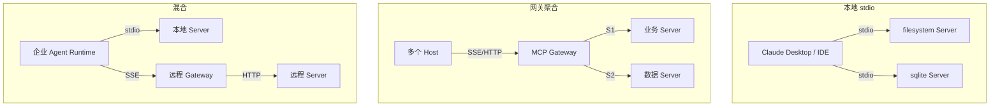
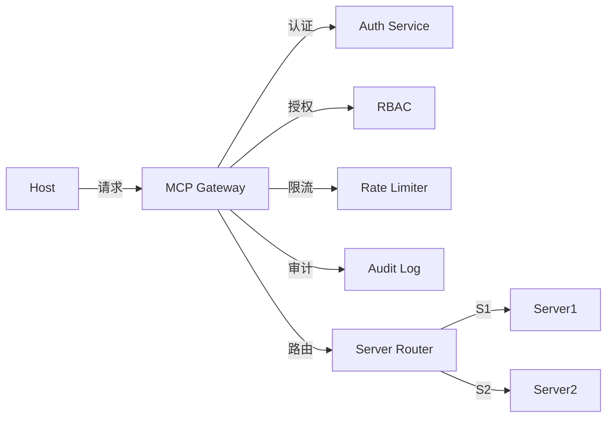
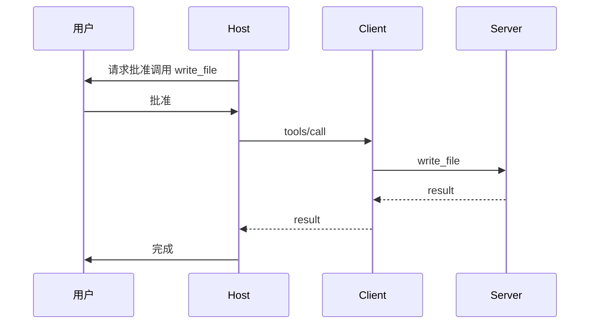

# 8. 企业生产实践

> 一句话理解：企业落地 MCP 需要 Server 注册中心、Transport 选型、认证授权、网关、限流、多租户、版本兼容、审计与可观测九件事协同运转。

## 1. 部署拓扑

企业 MCP 部署通常有三种形态：

选型建议：

- **本地 stdio**：适合个人开发者、本地文件/脚本工具，部署简单，权限依赖 OS。
- **网关聚合**：适合企业内多 Host 复用同一套能力，便于集中治理。
- **混合**：最贴近生产实际，本地能力 + 远程共享能力并存。

## 2. 本地 stdio vs 远程 SSE/HTTP

| 维度 | stdio | SSE / Streamable HTTP |
|---|---|---|
| 启动方式 | Host 启动子进程 | 独立服务或容器 |
| 隔离性 | 进程级 | 网络/容器级 |
| 延迟 | 低 | 中/高 |
| 部署复杂度 | 低 | 中/高 |
| 共享能力 | 仅当前 Host | 多 Host 复用 |
| 认证 | OS 用户权限 | OAuth/API Key/mTLS |
| 适用 | 本地工具、敏感数据 | 共享服务、SaaS 集成 |

生产建议：

- 敏感数据（本地文件、内网数据库）优先用 stdio，限定运行用户与目录。
- 共享服务（搜索、知识库、公共 API）优先用 SSE/HTTP，便于版本管理与限流。
- 同一个 Host 可以同时连接 stdio 和远程 Server，根据数据敏感度选择 Transport。

## 3. MCP Gateway 设计

MCP Gateway 是企业落地的核心组件，职责包括：

- **认证**：验证 Host/用户身份，支持 API Key、OAuth 2.0、JWT、mTLS。
- **授权**：根据身份决定能访问哪些 Server、Tool、Resource。
- **限流**：按 Host、Server、Tool 维度限流，防止单用户打爆服务。
- **审计**：记录所有请求/响应、审批事件、错误事件。
- **路由**：根据 Server 名称或标签把请求转发到对应实例。
- **协议转换**：必要时在 stdio 与 HTTP 之间做桥接。

## 4. 认证授权

MCP 协议本身不规定认证机制，企业需要在 Transport 或 Gateway 层补齐：

| 层级 | 方案 | 适用场景 |
|---|---|---|
| stdio | OS 用户、环境变量、启动参数 | 本地 Server |
| SSE/HTTP | API Key、JWT、OAuth 2.0 | 远程共享 Server |
| Gateway | 统一认证 + 细粒度 RBAC | 企业集中治理 |

Tool/Resource 级别的授权建议：

- 给每个 Tool/Resource 打标签，例如 `read-only`、`write`、`sensitive`、`external-saas`。
- Host 在调用前检查用户/Agent 是否拥有对应标签权限。
- 写操作、删除操作、外部 API 调用默认需要二次确认或 HITL。

## 5. Tool Approval 与 HITL

高风险 Tool 必须引入人机协同（Human-in-the-Loop）：

需要 HITL 的场景：

- 写文件、删除文件、执行代码。
- 访问敏感数据库、修改配置、调用支付/转账 API。
- 首次调用某个 Server 或首次访问某个 Resource。

生产建议：

- HITL 不应阻塞整个 UI，可以异步等待用户确认。
- 审批记录应进入审计日志，包含时间、用户、Tool、参数、结果。
- 支持“本次会话允许”或“永久允许”等粒度，避免频繁打扰。

## 6. Server 版本与 Capability 演进

企业内 MCP Server 会不断迭代，需要管理版本兼容：

- **语义化版本**：Server 使用 `major.minor.patch`，capability 变更在 minor/major 中体现。
- **Capability 声明**：新 capability 默认不启用，只有协商成功才启用。
- **Schema 版本化**：Tool/Resource/Prompt 的 schema 增加 `version` 字段或命名空间。
- **灰度发布**：Gateway 按 Host/用户维度灰度路由到新版本 Server。
- **弃用通知**：Server 通过 `logging/message` 或 capability 变更通知 Client。

## 7. 限流与配额

限流维度建议：

| 维度 | 示例 | 目的 |
|---|---|---|
| Host | 每个 Host 每秒 100 请求 | 防止单 Host 滥用 |
| Server | 每个 Server 每秒 1000 请求 | 保护后端服务 |
| Tool | `write_file` 每分钟 10 次 | 控制高风险操作 |
| User | 每个用户每日 10,000 tokens | 成本控制 |
| Resource | 每个 URI 每秒 1 次读取 | 防止数据刷取 |

限流策略：

- 控制面（initialize/list）与数据面（call/read）应分别限流。
- 长请求应支持 progress notification，并设置独立的并发配额。
- 超限响应应返回明确的错误信息，而不是直接断开连接。

## 8. 多租户

多租户场景下，MCP Gateway 需要隔离不同租户的数据与能力：

- **租户识别**：通过 Header、JWT claim、子域名识别租户。
- **Server 隔离**：不同租户看到不同的 Server 列表与 schema。
- **Resource 隔离**：Resource URI 中嵌入租户标识，例如 `file:///tenant-123/data/`。
- **配额隔离**：每个租户独立计算 QPS、token、存储配额。
- **审计隔离**：审计日志按租户分区存储，避免跨租户泄露。

## 9. 审计与可观测

生产级 MCP 系统必须记录：

- **Trace**：一次完整会话的调用链，包含 initialize、list、call、read、get、close。
- **Span**：每个请求的耗时、状态码、Server 名称、Tool 名称。
- **Event**：capability 变更、HITL 审批、限流触发、连接断开。
- **Metrics**：连接数、QPS、错误率、平均延迟、Tool 调用分布。
- **Logs**：结构化日志，包含 session_id、request_id、method、arguments_hash、status。

集成建议：

- Trace 使用 OpenTelemetry，span 名称使用 MCP method。
- Metrics 使用 Prometheus，标签包含 server、tool、transport、status。
- Logs 使用 JSON 格式，便于检索与聚合。

## 本章小结

企业 MCP 生产落地不是简单地把官方 SDK 跑起来，而是需要在部署拓扑、Transport 选型、认证授权、网关、HITL、版本管理、限流、多租户、审计与可观测等方面做系统设计。只有把协议层的能力与企业的治理需求结合起来，MCP 才能从“好用的本地工具”变成“可信赖的企业基础设施”。

**参考来源**

- [MCP Specification: Authorization](https://modelcontextprotocol.io/specification/2025-06-18/basic/authorization)
- [MCP Python SDK](https://github.com/modelcontextprotocol/python-sdk)
- [Claude Code MCP Docs](https://docs.anthropic.com/en/docs/claude-code/mcp)
- [Anthropic: Building Effective Agents](https://www.anthropic.com/engineering/building-effective-agents)
- [从 Function Call 到 MCP → SKILLS](https://crossoverjie.top/2026/02/03/AI/MCP-Skills-intro/)
