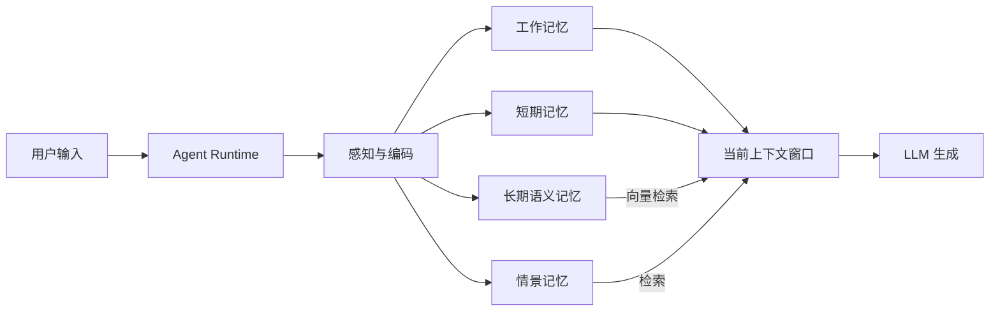

# 1. 背景

> 一句话理解：**Agent 不能只做“会回答问题的模型”，还要做“能记住用户、任务与世界的长期服务者”**，Agent Memory 就是让这种连续性成为可能的工程层。

## 为什么 Agent 不能只靠 Prompt？

早期的大模型应用基本可以归结为：

```text
用户提问 → 模型根据 Prompt 生成回答
```

这时的“记忆”就是一次请求的上下文窗口。只要对话一结束，所有信息就烟消云散。进入 Agent 阶段后，单次调用远远不够，因为 Agent 需要：

1. **多轮推理**：ReAct 循环中每一步都要基于历史 thought、action、observation 做决策。
2. **跨会话保持**：用户昨天提到的偏好，今天应该还能影响回答。
3. **任务经验复用**：之前成功完成过的任务，下次遇到类似场景应该更快、更稳。
4. **个性化服务**：不同用户、不同租户、不同角色需要不同的默认行为。
5. **长时任务**：任务可能持续数分钟到数小时，中间状态必须持久化。

如果把这一切都塞进 Prompt，很快会遇到三个天花板：

- **上下文长度限制**：再长的窗口也装不下数年积累的用户偏好与任务历史。
- **成本与延迟**：每次调用都塞满历史记录，token 消耗和推理时间会线性增长。
- **信息检索低效**：模型需要在海量历史文本中“自行回忆”，命中率低、幻觉风险高。

因此，Agent 需要一个**显式的记忆系统**，把重要信息结构化地存下来，在需要时按需检索。

## 演进：从“无状态 LLM”到“长期记忆”

Agent 记忆的发展大致经历了三个阶段：

```text
无状态 LLM → 上下文历史 → 显式记忆系统
```

### 阶段一：无状态 LLM

每个请求独立，模型看不到之前说过什么。适合一次性问答、文本生成，但无法完成复杂任务。

### 阶段二：上下文历史

把多轮对话作为 `messages` 列表传给模型，形成“工作记忆”。这是 ChatGPT、Claude 等对话产品的标配。

优点：

- 实现简单，直接复用模型 API。
- 对当前会话的短期依赖效果好。

局限：

- 受窗口长度限制。
- 跨会话无法保留。
- 没有显式检索机制，模型容易遗忘早期信息。

### 阶段三：显式记忆系统

把 Agent 运行过程中产生的关键信息提取出来，分类存储，按需检索。这是 Agent Memory 的核心。



## Agent Memory 与相关概念的区别

| 概念 | 核心问题 | 与 Memory 的关系 |
|---|---|---|
| **Prompt / 上下文窗口** | 当前请求能看到多少历史 | Memory 把超出窗口的内容持久化，按需回注 |
| **RAG** | 从外部知识库检索固定知识 | RAG 读企业文档；Memory 读 Agent 自身运行中积累的用户偏好与经验 |
| **Cache** | 避免重复计算、加速响应 | Cache 是短期、命中即用的；Memory 是长期、可检索、可遗忘的 |
| **Agent Runtime** | 如何执行 Agent 任务 | Runtime 在循环中读写 Memory；Memory 负责存储、检索、压缩本身 |
| **数据库 / KV 存储** | 通用数据持久化 | Memory 是面向语义检索与生命周期的专门抽象，底层可以用 KV/向量/图数据库 |
| **知识图谱** | 实体关系结构化表示 | 可作为长期记忆的一种实现形式，与向量记忆互补 |

一个常见误区是：把 Memory 等同于“给 Prompt 多塞点历史”。真正的 Memory 系统要解决的是：

- 什么值得记？
- 怎么编码才能检索？
- 什么时候回注？
- 什么时候遗忘？
- 多用户之间如何隔离？

## 为什么 Memory 现在变得重要？

1. **Agent 任务越来越长**：从一次性问答发展到小时级研究、数据分析、代码生成，必须持久化中间状态。
2. **用户对个性化期待提高**：真正的助手应该记得用户习惯，而不是每次重新适应。
3. **多 Agent 协作需要共享上下文**：不同 Agent 之间需要共享事实、任务状态与经验。
4. **模型上下文成本仍然显著**：即使长上下文模型越来越便宜，把所有历史塞进 Prompt 仍不是可持续的做法。
5. **企业场景对隐私与审计要求更高**：记忆系统必须支持租户隔离、TTL、敏感信息过滤与审计。

## 主流记忆系统 / 框架

| 项目 | 定位 | 核心抽象 | 适用场景 |
|---|---|---|---|
| **Letta（原 MemGPT）** | 面向 Agent 的分层记忆系统 | core memory / archival memory / recall memory | 长对话、需要显式记忆管理的 Agent |
| **LangGraph Persistence / Store** | 生产级状态与记忆持久化 | checkpoint / store / memory | 有状态工作流、跨会话记忆 |
| **OpenAI Agents SDK Sessions** | OpenAI 生态的会话管理 | session / state / memory | OpenAI-only、快速落地 |
| **Mem0** | 面向 AI 助手的记忆层 | memory / user / session | 个性化助手、用户偏好记忆 |
| **Chroma / Weaviate / Milvus / pgvector** | 向量数据库 | collection / index / embedding | 语义检索、长期记忆存储后端 |

## 本章小结

Agent Memory 的产生是 Agent 从“一次性问答”走向“长期服务”的必然结果。它既不是 Prompt 的无限延长，也不是 RAG 的别名，而是一个独立的工程层：负责把 Agent 运行中产生的上下文、事实、偏好与经验结构化地保存、检索、压缩与遗忘。理解 Memory 与 Prompt、RAG、Cache、Agent Runtime 的边界，是设计生产级 Agent 的基础。

**参考来源**

- [MemGPT: Towards LLMs as Operating Systems](https://arxiv.org/abs/2310.08560)
- [Steve Kinney — Agent Memory Systems](https://stevekinney.com/writing/agent-memory-systems)
- [Letta Documentation](https://docs.letta.com)
- [LangGraph Persistence](https://docs.langchain.com/oss/python/langgraph/persistence)
- [OpenAI Agents SDK Sessions](https://openai.github.io/openai-agents-python/sessions/)
