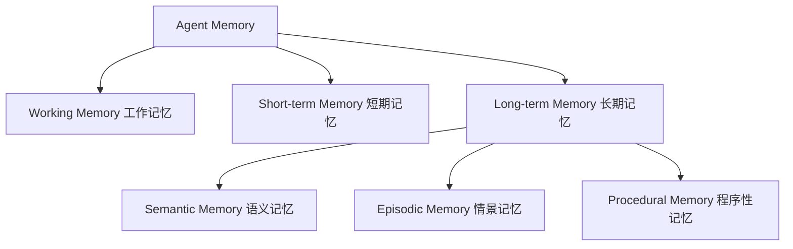
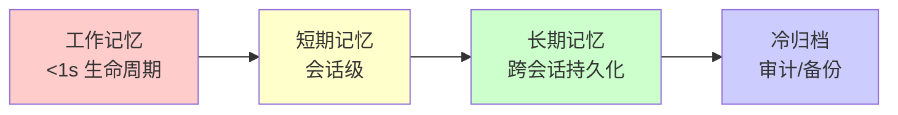

# 2. 核心思想

> 一句话理解：**Agent Memory 的核心思想是把“无差别的上下文历史”拆分成不同寿命、不同用途、不同存储形式的记忆类型，并通过编码、检索、回注、遗忘的完整生命周期，让 Agent 在合适的时机想起合适的事**。

## 1. 记忆分类：不只是“长期”和“短期”

人类记忆心理学通常把记忆分为工作记忆、短期记忆、长期记忆，长期记忆又细分为语义记忆、情景记忆、程序性记忆。Agent Memory 系统借用了这套分类，但做了工程化改造。



| 类型 | 寿命 | 存储内容 | 典型实现 | 回注方式 |
|---|---|---|---|---|
| **Working Memory** | 当前请求 | 完整对话 messages | 内存 list / 上下文窗口 | 直接追加到 prompt |
| **Short-term Memory** | 当前会话 | 最近几轮摘要或窗口 | 内存 / Redis | 摘要后追加 |
| **Semantic Memory** | 跨会话 | 用户偏好、事实、实体 | 向量 DB + embedding | 向量检索后追加 |
| **Episodic Memory** | 跨会话 | 任务片段、成败记录 | 向量 DB / 文档 DB | 检索相似任务后追加 |
| **Procedural Memory** | 长期稳定 | 工具使用模式、流程模板 | 规则库 / 向量 DB / 代码 | 作为 system prompt 或 tool hint |

### Working Memory（工作记忆）

工作记忆就是当前 Agent 能直接“看到”的上下文窗口，通常是完整的 `messages` 列表。它的特点是：

- **全量**：保留当前会话的完整对话历史。
- **易失**：会话结束或超出窗口后不再保留。
- **直接**：不需要检索，直接拼进 prompt。

生产要点：

- 受 LLM 上下文长度限制，需要截断或摘要。
- 保留 system prompt 和最近用户消息，优先丢弃中间轮次。
- 工具返回的长文本需要摘要后再加入工作记忆。

### Short-term Memory（短期记忆）

短期记忆解决“当前会话内但已超出工作记忆窗口”的信息。常见策略：

- **滑动窗口**：只保留最近 N 轮。
- **增量摘要**：把早期对话压缩成一段摘要，替代原始 messages。
- **关键事件**：只保留用户明确确认、Agent 自我评估为高价值的信息。

### Long-term Semantic Memory（长期语义记忆）

语义记忆保存可脱离具体场景的“事实”和“偏好”。例如：

- 用户是素食主义者。
- 用户喜欢简洁的回答。
- 项目默认使用 Python 3.11。

实现方式通常是 embedding + 向量检索：

```text
文本 → Embedder → 向量 → Vector Store → 按 query 相似度检索
```

### Episodic Memory（情景记忆）

情景记忆保存“发生过的事”，特别强调任务目标、关键动作、结果与反思。例如：

- 上次用户让 Agent 写周报，最后采用了 Markdown 模板 A。
- 某次数据分析任务因为 SQL 写错导致超时，正确写法是 X。

情景记忆让 Agent 能“从经验中学习”，Planner 和 Runtime 都可以检索它。

### Procedural Memory（程序性记忆）

程序性记忆保存“怎么做”的技能和流程，例如：

- 调用某 API 的标准步骤。
- 写测试文件时必须包含的 fixture 模式。
- 用户喜欢的邮件回复格式。

它可以表现为：

- 硬编码的 tool description。
- 从成功案例中提炼出的模板。
- 动态注入到 system prompt 的指令。

## 2. 记忆层次：从“马上用”到“永久存”

不同记忆类型的存取速度和持久化要求不同，形成自然的层次结构：



| 层次 | 延迟要求 | 持久化 | 存储介质 | 典型操作 |
|---|---|---|---|---|
| 工作记忆 | 毫秒 | 不持久 | 内存 | append、truncate |
| 短期记忆 | 毫秒~百毫秒 | 会话级 | 内存 / Redis | summarize、slide window |
| 长期记忆 | 百毫秒~秒 | 持久化 | 向量 DB / 图 DB | encode、search、update |
| 冷归档 | 秒级可接受 | 审计级 | 对象存储 / 数据湖 | batch archive、audit |

## 3. 记忆生命周期：不只是“存”和“取”

记忆的完整生命周期包括：

```text
Perceive → Encode → Store → Index → Retrieve → Inject → Forget / Decay / Update
```

每一步都有明确的工程含义：

| 阶段 | 动作 | 关键问题 |
|---|---|---|
| **Perceive** | 感知 | 从 Runtime、用户输入、工具结果中捕捉哪些信息值得记忆？ |
| **Encode** | 编码 | 如何把原始文本变成可检索的向量、摘要或结构化记录？ |
| **Store** | 存储 | 按记忆类型写入合适的存储后端 |
| **Index** | 索引 | 为向量、关键词、时间戳建立索引 |
| **Retrieve** | 检索 | 根据当前 query 找到最相关的记忆 |
| **Inject** | 回注 | 把检索结果以合适形式拼进 prompt |
| **Forget/Decay/Update** | 遗忘/衰减/更新 | 记忆冲突、过期、低价值时如何处理？ |

本章先给出概念，下一章会结合时序图详细展开。

## 4. 检索策略：怎么想起对的事

### 向量检索

把 query 和记忆都编码成向量，按 cosine similarity 或 dot product 排序。适合语义记忆和情景记忆。

优点：

- 能召回语义相关但字面不同的记忆。
- 可扩展到大容量记忆库。

缺点：

- 依赖 embedding 模型质量。
- 对精确匹配（如订单号、ID）不如关键词检索。

### 关键词 / 稀疏检索

基于 BM25、TF-IDF、倒排索引做字面匹配。适合精确实体、订单号、文件名。

### Hybrid 检索

把向量检索与关键词检索结合，常用做法：

```text
hybrid_score = alpha * dense_score + (1 - alpha) * sparse_score
```

其中 `alpha` 可根据场景调整。对 Agent Memory 来说，hybrid 通常是默认选择。

### 时间衰减检索

近期记忆更重要，检索时对时间做加权：

```text
final_score = similarity_score * decay_factor(t)
```

decay 函数可以是指数衰减、阶跃衰减或业务自定义。

### 上下文感知检索

不仅根据当前 query，还结合用户身份、会话主题、当前任务阶段来过滤和排序记忆。例如：

- 同一用户跨会话偏好优先。
- 同一项目下的文档优先。
- 当前任务阶段只召回相关 tool 使用经验。

## 5. 遗忘、衰减与摘要：记忆不能无限增长

记忆系统的容量不是无限的，必须主动“遗忘”。

### 截断（Truncation）

最简单：超过数量或 token 上限时，删除最旧或最低分的记忆。适合工作记忆。

### 摘要压缩（Summarization）

把多轮对话压缩成一段摘要，替换原始记录。适合短期记忆向长期记忆过渡。

### 衰减（Decay）

给每条记忆赋予重要性分数，随时间或使用频率衰减。低分记忆进入冷存储或被删除。

```text
importance(t) = importance_0 * exp(-λ * t)
```

### 冲突解决与更新

当新记忆与旧记忆冲突时，需要策略：

- **覆盖**：新事实替换旧事实（如用户更新了偏好）。
- **并存**：保留多个版本，带时间戳（如用户偏好随项目变化）。
- **置信度加权**：低置信度记忆不直接覆盖高置信度记忆。

### 主动遗忘

有些信息本来就不该长期保存：

- 临时验证码。
- 用户明确要求删除的记忆。
- 含 PII 的敏感对话。

## 6. 个性化：记忆的价值体现

个性化是 Agent Memory 最直观的收益。通过长期语义记忆，Agent 可以：

- 记住用户语言偏好（中文/英文/正式/随意）。
- 记住用户喜欢的输出格式（Markdown / JSON / 表格）。
- 记住业务上下文（项目技术栈、团队规范、审批流程）。

但要注意：**个性化必须建立在用户授权与隐私合规之上**。

## 7. 隐私与安全：记忆的底线

记忆系统天然会积累敏感信息，必须在设计之初就考虑：

| 风险 | 应对 |
|---|---|
| PII 泄露 | 存储前做 PII 检测、脱敏或过滤 |
| 跨用户记忆混淆 | 强租户/用户隔离，检索时带 filter |
| 敏感事实被长期保留 | TTL、用户删除权、敏感标签 |
| 记忆被提示注入污染 | 对写入记忆的内容做输入护栏 |
| 记忆回注导致越狱 | 回注前做输出护栏与上下文审计 |

隐私原则：

- **默认最小化**：只记必要信息。
- **用户可控**：用户可查看、修改、删除自己的记忆。
- **租户隔离**：多租户场景下，记忆必须在逻辑或物理上隔离。
- **审计可追踪**：记忆写入、读取、删除都要记录日志。

## 本章小结

Agent Memory 的核心思想可以概括为：把记忆按寿命和用途分层，通过编码、存储、索引、检索、回注、遗忘的完整生命周期管理信息。工作记忆、短期记忆、长期语义记忆、情景记忆、程序性记忆各司其职；向量检索、关键词检索、hybrid 检索、时间衰减检索共同决定“想起什么”；摘要、衰减、冲突解决与主动遗忘控制记忆增长；个性化与隐私安全是记忆价值与风险的平衡点。

**参考来源**

- [Steve Kinney — Agent Memory Systems](https://stevekinney.com/writing/agent-memory-systems)
- [MemGPT: Towards LLMs as Operating Systems](https://arxiv.org/abs/2310.08560)
- [Letta Memory Documentation](https://docs.letta.com/agentic-ai/letta-platform)
- [LangGraph Add Memory](https://docs.langchain.com/oss/python/langgraph/add-memory)
- [Mem0 Documentation](https://docs.mem0.ai)
