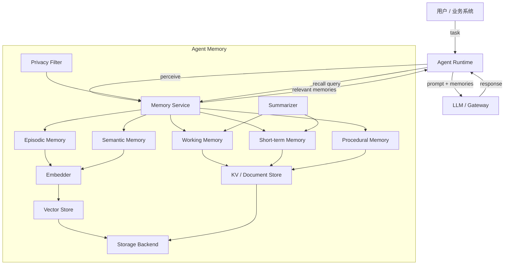
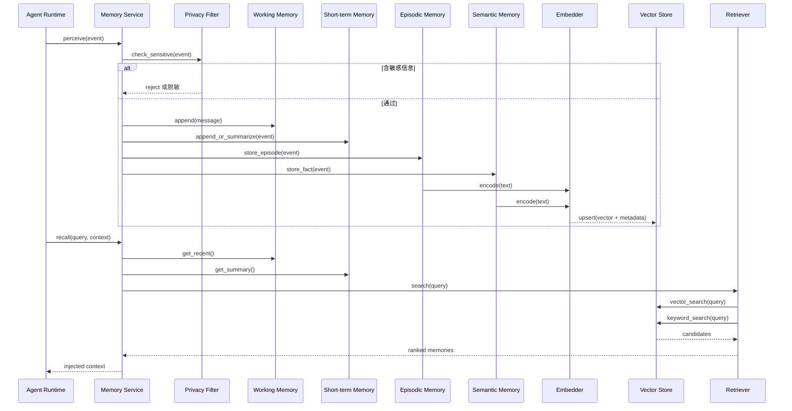
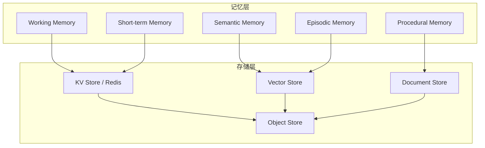
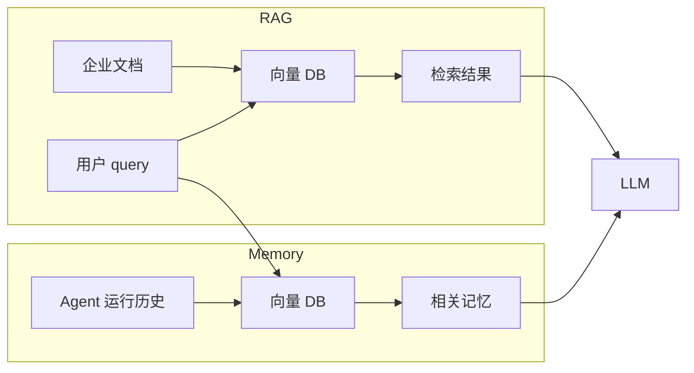

# 3. 架构设计

> 一句话理解：**Agent Memory 的架构可以概括为“一次感知、多层存储、统一检索、按需回注”——Agent Runtime 把运行中产生的事实与经验交给 Memory Service，Memory Service 再按记忆类型分发给不同存储与检索后端**。

## 整体架构



## 分层职责

| 层级 | 职责 | 典型组件 |
|---|---|---|
| **接入层** | 接收 Runtime 的记忆读写请求 | Memory Service API、gRPC/HTTP |
| **编排层** | 感知、路由、过滤、生命周期管理 | Memory Service、Privacy Filter、Summarizer |
| **记忆层** | 按类型保存不同寿命的记忆 | Working / Short-term / Semantic / Episodic / Procedural Memory |
| **编码层** | 文本向量化、摘要、结构化 | Embedder、Summarizer、Entity Extractor |
| **存储层** | 持久化与索引 | Vector Store、KV Store、Document Store、对象存储 |
| **可观测层** | trace、metrics、审计日志 | OpenTelemetry、Prometheus、审计日志 |

## 核心模块协作



## 控制面 vs 数据面

| 维度 | 控制面 | 数据面 |
|---|---|---|
| 职责 | 配置、策略、权限、审计、生命周期规则 | 执行记忆编码、存储、检索、回注 |
| 状态 | 长期策略、schema、租户配置 | 会话级与持久化记忆数据 |
| 扩展 | 管理 API、策略中心 | 水平扩展检索与编码 worker |
| 示例 | 隐私策略、TTL 规则、embedding 模型版本 | 向量写入、相似度检索、摘要生成 |

控制面决定“什么能记、什么该忘”，数据面决定“怎么记、怎么取”。

## 记忆层内部结构



## 部署形态

### 形态 1：库 / SDK

```text
业务进程直接 import agent_memory 并调用 memory.remember() / memory.recall()
```

优点：低延迟、易集成。
缺点：状态与索引分散，多进程间难以共享。

### 形态 2：独立服务

```text
Agent Runtime → Memory Service → Vector Store / KV Store
```

优点：集中管理、可扩展、可观测统一。
缺点：多一跳网络延迟。

### 形态 3：Sidecar

与 Runtime 进程一起部署，适合高隔离、多租户场景。

### 形态 4：Serverless / 托管

使用云厂商托管的向量数据库与记忆服务，例如 Pinecone、Weaviate Cloud、Zilliz Cloud。

## 与 Agent Runtime 的关系

Agent Runtime 与 Agent Memory 是调用与被调用的关系：

```text
Agent Runtime → Memory Service
```

Runtime 负责：

- 决定什么时候调用 `remember` 或 `recall`。
- 把工具结果、用户输入、最终答案传给 Memory。
- 把检索到的记忆拼进 prompt。

Memory 负责：

- 决定如何编码、存储、索引、检索。
- 管理记忆生命周期（遗忘、衰减、摘要）。
- 保证多租户隔离与隐私合规。

## 与 RAG 的关系

RAG 和 Memory 都使用向量检索，但数据来源不同：



生产系统中，RAG 与 Memory 往往共用同一个向量数据库，但通过 collection、namespace 或 metadata 隔离。

## 本章小结

Agent Memory 的架构核心是“一次感知、多层存储、统一检索、按需回注”。Memory Service 作为 Runtime 与存储后端之间的编排层，把感知到的事件分发给工作记忆、短期记忆、语义记忆、情景记忆与程序性记忆；编码层负责 embedding 与摘要；存储层提供向量、KV、文档等多种后端；控制面管理策略与生命周期，数据面执行高并发的编码与检索。部署形态可以是库、独立服务、Sidecar 或托管，选择取决于延迟、隔离和可扩展需求。

**参考来源**

- [Letta Architecture Documentation](https://docs.letta.com)
- [LangGraph Persistence](https://docs.langchain.com/oss/python/langgraph/persistence)
- [Mem0 Platform Documentation](https://docs.mem0.ai)
- [Steve Kinney — Agent Memory Systems](https://stevekinney.com/writing/agent-memory-systems)
