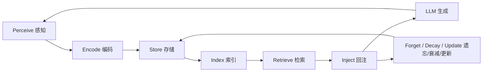
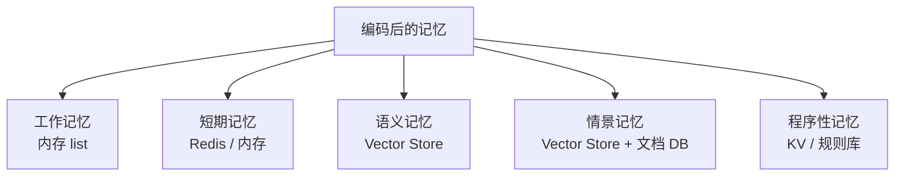
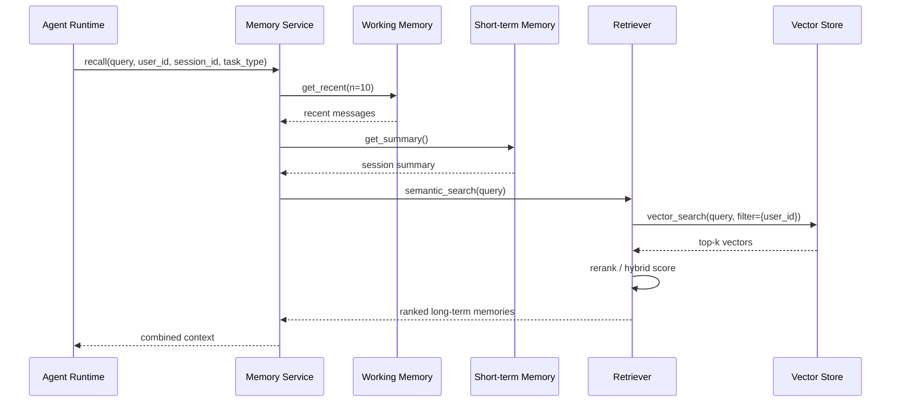
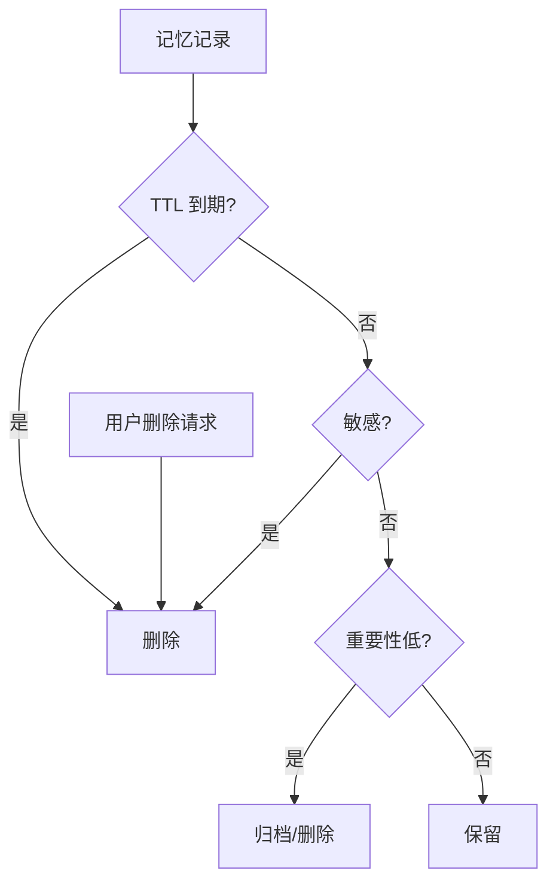

# 4. 记忆生命周期

> 一句话理解：**Agent Memory 的生命周期不是简单的“写入—读取”，而是从感知信息开始，经过编码、存储、索引、检索、回注，最终通过遗忘、衰减或更新实现记忆质量与容量的动态平衡**。

## 完整生命周期概览



每个阶段都有明确的输入、输出与工程决策点。

## 阶段一：Perceive（感知）

感知阶段决定“什么信息值得进入记忆系统”。它不是把所有消息都存下来，而是做选择性捕获。

### 常见感知来源

| 来源 | 示例 | 记忆类型 |
|---|---|---|
| 用户输入 | 用户偏好、目标、约束 | 语义记忆、情景记忆 |
| Agent 输出 | 最终答案、反思、计划 | 语义记忆、程序性记忆 |
| 工具结果 | 数据库查询、搜索摘要、代码执行结果 | 情景记忆 |
| Runtime 事件 | 任务完成、失败、重试、HITL | 情景记忆 |
| 外部系统 | 用户画像、业务状态变更 | 语义记忆 |

### 感知策略

- **全量感知**：把当前轮次的 user/assistant/tool 消息都送入短期记忆。
- **事件感知**：只把关键事件（任务完成、失败、用户确认）送入长期记忆。
- **摘要感知**：对多轮对话做摘要后再存入长期记忆。
- **主动感知**：Agent 主动询问用户以补全记忆，例如“您希望我以后都用这种格式回复吗？”

## 阶段二：Encode（编码）

原始文本不能直接用于高效检索，必须编码成适合存储与检索的形式。

### 编码方式

| 方式 | 输出 | 适用场景 |
|---|---|---|
| **Embedding** | 稠密向量 | 语义检索、相似度匹配 |
| **关键词提取** | 关键词 / 标签 | 精确过滤、分类 |
| **实体抽取** | 实体关系 | 知识图谱、用户画像 |
| **摘要** | 压缩文本 | 短期记忆向长期记忆过渡 |
| **结构化** | JSON / 数据库记录 | 程序性记忆、偏好配置 |

### 编码示例

```text
原始文本：
"用户 Alice 喜欢把周报写成 Markdown，偏好简洁风格，项目代号 Phoenix。"

编码结果：
- embedding: [0.12, -0.05, 0.88, ...]
- entities: {user: Alice, project: Phoenix}
- tags: ["preference", "weekly-report", "markdown"]
- summary: "Alice 喜欢 Markdown 简洁周报"
```

## 阶段三：Store（存储）

按记忆类型写入不同后端。



存储时需要带上元数据，便于后续检索与生命周期管理：

```json
{
  "id": "mem-001",
  "type": "semantic",
  "user_id": "alice",
  "tenant_id": "team-a",
  "session_id": "sess-123",
  "created_at": "2026-07-01T10:00:00Z",
  "updated_at": "2026-07-01T10:00:00Z",
  "ttl": null,
  "sensitivity": "low",
  "source": "user_explicit",
  "text": "Alice 喜欢 Markdown 简洁周报",
  "embedding": [0.12, -0.05, 0.88]
}
```

## 阶段四：Index（索引）

索引决定检索效率与质量。

| 索引类型 | 用途 | 代表实现 |
|---|---|---|
| 向量索引 | 语义相似度检索 | HNSW、IVF、FLAT |
| 倒排索引 | 关键词检索 | BM25、TF-IDF |
| 元数据索引 | 按用户/租户/时间过滤 | B-tree、LSM-tree |
| 图索引 | 实体关系遍历 | 知识图谱索引 |

生产要点：

- 向量索引需要权衡召回率与延迟，HNSW 适合高召回低延迟场景。
- 元数据过滤常与向量检索一起使用，例如 `tenant_id == "team-a" AND similarity > 0.75`。
- 索引需要支持增量更新，因为记忆是持续写入的。

## 阶段五：Retrieve（检索）

当 Runtime 需要上下文时，Memory Service 根据 query 检索最相关的记忆。

### 检索流程



### 检索增强技术

- **Reranking**：用 cross-encoder 对粗排结果精排。
- **Query 扩展**：把当前任务上下文加入 query，提高相关性。
- **去重**：合并语义重复的记忆。
- **过滤**：按 tenant、user、时间、标签等元数据过滤。

## 阶段六：Inject（回注）

检索到的记忆需要以 LLM 能理解的形式拼进 prompt。

### 回注策略

| 策略 | 说明 | 适用场景 |
|---|---|---|
| **System Prompt 注入** | 把用户偏好、长期事实放入 system prompt | 语义记忆、程序性记忆 |
| **Message 列表追加** | 把相关历史消息追加到 messages | 工作记忆、短期记忆 |
| **上下文块注入** | 把检索结果作为独立文本块放入 prompt | 情景记忆、RAG 结果 |
| **Tool hint 注入** | 把程序性记忆作为 tool description 补充 | 工具使用经验 |

### 回注格式示例

```text
## 相关记忆
- 用户 Alice 喜欢 Markdown 简洁周报。
- 上一次周报任务中，Agent 使用了模板 A，用户反馈良好。

## 当前任务
请为 Alice 生成本周周报。
```

生产要点：

- 回注内容不能超过上下文预算。
- 要标注记忆来源与时间，帮助模型判断可信度。
- 避免注入冲突记忆（如用户前后矛盾的偏好）。

## 阶段七：Forget / Decay / Update（遗忘、衰减、更新）

记忆系统必须主动管理容量与质量。

### Forget（主动遗忘）

- 用户明确要求删除。
- 信息过期（如临时验证码）。
- 被标记为敏感或低价值。
- 达到 TTL。

### Decay（衰减）

给记忆赋予重要性分数，随时间或使用频率变化：

```text
importance(t) = importance_0 * exp(-λ * t) + access_count * boost
```

低分记忆进入冷存储或删除。

### Update（更新）

- 用户偏好变化时更新旧记录。
- 发现冲突时做版本管理。
- 根据反馈调整记忆的权重或标签。

### 遗忘决策流程



## 生命周期中的关键决策点

| 决策点 | 问题 | 常见策略 |
|---|---|---|
| 感知什么 | 避免记忆噪音 | 事件驱动 + 摘要 + 用户显式确认 |
| 如何编码 | 向量 vs 摘要 vs 结构化 | 按记忆类型选择，可多种并存 |
| 存在哪里 | 延迟 vs 持久化 | 工作记忆放内存，长期记忆放向量 DB |
| 怎么检索 | 召回率 vs 精确率 | hybrid + rerank + 元数据过滤 |
| 何时回注 | 上下文预算 | 按相关性与时效性排序，截断低分记忆 |
| 何时遗忘 | 容量与隐私 | TTL + 衰减 + 敏感标签 + 用户删除权 |

## 本章小结

Agent Memory 的生命周期包括感知、编码、存储、索引、检索、回注、遗忘/衰减/更新七个阶段。感知决定记忆来源，编码决定记忆形式，存储与索引决定可扩展性，检索决定召回质量，回注决定模型能否有效利用记忆，遗忘与衰减决定系统的长期健康。每个阶段都有多个工程策略可选，选择应基于任务延迟、隐私合规、成本与用户体验之间的平衡。

**参考来源**

- [MemGPT: Towards LLMs as Operating Systems](https://arxiv.org/abs/2310.08560)
- [Letta Memory Lifecycle](https://docs.letta.com)
- [LangGraph Add Memory](https://docs.langchain.com/oss/python/langgraph/add-memory)
- [Steve Kinney — Agent Memory Systems](https://stevekinney.com/writing/agent-memory-systems)
