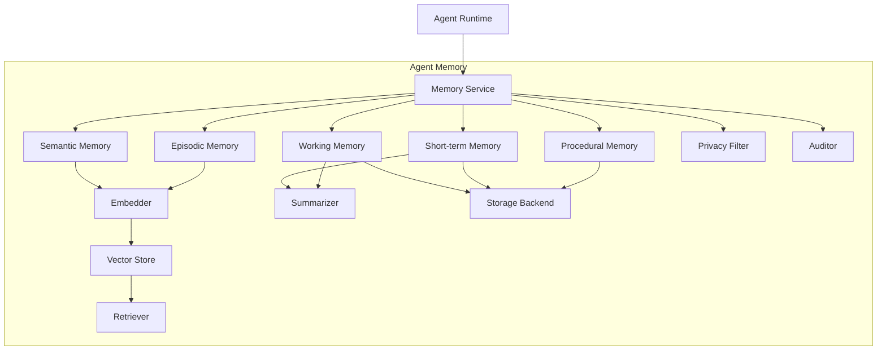

# 5. 核心模块

> 一句话理解：**Agent Memory 的功能可以被拆成若干独立模块，每个模块只负责一个横切关注点，并通过统一的 Memory Service 接口协同工作**。

## 模块总览



## 1. Memory Service

职责：作为 Agent Runtime 与 Memory 子系统的统一入口，负责记忆读写请求的编排、路由与生命周期管理。

核心接口：

```python
class MemoryService:
    def remember(self, event: MemoryEvent) -> None: ...
    def recall(self, query: str, context: RecallContext) -> List[Memory]: ...
    def forget(self, memory_id: str) -> None: ...
    def update(self, memory_id: str, patch: MemoryPatch) -> None: ...
```

生产要点：

- 所有记忆操作都应以 tenant/user 为作用域，防止越权。
- `remember` 应支持批量写入，减少存储调用次数。
- `recall` 需要支持按记忆类型、时间范围、标签过滤。

## 2. Working Memory

职责：维护当前会话的完整 messages 列表，是 LLM 最直接可见的上下文。

核心接口：

```python
class WorkingMemory:
    def add_message(self, role: str, content: str, metadata: dict = None) -> None: ...
    def get_messages(self, max_tokens: int = None) -> List[Message]: ...
    def truncate(self, strategy: str = "oldest_non_system") -> None: ...
```

生产要点：

- 保留 system prompt，优先截断早期 assistant/user 消息。
- 工具消息必须与对应的 tool_call 配对，否则模型会 confused。
- 截断前应尝试摘要，而不是简单丢弃。

## 3. Short-term Memory

职责：保存当前会话内但已超出工作记忆窗口的信息，通常以摘要或滑动窗口形式存在。

核心接口：

```python
class ShortTermMemory:
    def append(self, event: MemoryEvent) -> None: ...
    def summarize(self) -> str: ...
    def get_recent_summary(self) -> str: ...
    def clear(self) -> None: ...
```

生产要点：

- 摘要触发时机可以是每 N 轮、token 阈值或任务节点结束。
- 摘要应保留关键事实，而不是简单拼接文本。
- 会话结束时，可选择把高价值摘要提升到长期记忆。

## 4. Semantic Memory（长期语义记忆）

职责：保存跨会话的用户偏好、事实、实体，是 Agent 个性化的基础。

核心接口：

```python
class SemanticMemory:
    def store_fact(self, text: str, metadata: dict) -> str: ...
    def recall_facts(self, query: str, top_k: int = 5, filters: dict = None) -> List[Memory]: ...
    def update_fact(self, memory_id: str, text: str) -> None: ...
```

生产要点：

- 事实性记忆需要支持更新与冲突检测。
- 用户偏好应带置信度与时间戳。
- 检索时必须按 user/tenant 过滤。

## 5. Episodic Memory（情景记忆）

职责：保存任务级别的经验片段，包括目标、关键动作、结果与反思。

核心接口：

```python
class EpisodicMemory:
    def record_episode(self, goal: str, actions: List[str], outcome: str, reflection: str = None) -> str: ...
    def recall_similar_episodes(self, query: str, top_k: int = 5) -> List[Episode]: ...
```

生产要点：

- 每个 episode 应包含“目标-动作-结果-反思”四元组。
- 失败 episode 同样有价值，可帮助 Agent 避免重复犯错。
- 检索结果应标注成功率，供 Planner 参考。

## 6. Procedural Memory（程序性记忆）

职责：保存“怎么做”的技能与流程模板，指导 Agent 更高效地使用工具或完成任务。

核心接口：

```python
class ProceduralMemory:
    def store_procedure(self, name: str, steps: List[str], context: dict) -> str: ...
    def recall_procedure(self, task_type: str) -> Optional[Procedure]: ...
```

生产要点：

- 程序性记忆可以是硬编码规则，也可以从成功案例中学习。
- 注入方式可以是 system prompt、tool description 补充或示例 few-shot。
- 需要版本管理，防止旧流程误导新任务。

## 7. Embedder

职责：把文本转换为稠密向量，供向量检索使用。

核心接口：

```python
class Embedder:
    def encode(self, texts: List[str]) -> List[List[float]]: ...
    def dimension(self) -> int: ...
```

生产要点：

- embedding 模型版本变更需要重新索引或做向量迁移。
- 多语言场景需要选择支持目标语言的模型。
- 延迟敏感场景可考虑本地 small embedding 模型或量化版本。
- embedding 结果应做 batch，减少调用开销。

## 8. Vector Store

职责：存储向量与元数据，并提供高效的相似度检索。

核心接口：

```python
class VectorStore:
    def upsert(self, ids: List[str], texts: List[str], embeddings: List[List[float]], metadatas: List[dict]) -> None: ...
    def search(self, query_embedding: List[float], top_k: int, filters: dict = None) -> List[SearchResult]: ...
    def delete(self, ids: List[str]) -> None: ...
```

生产要点：

- 选择支持元数据过滤与 hybrid search 的向量数据库。
- 大规模场景需要支持分片、多副本、增量索引。
- 向量维度与距离度量（cosine / dot / euclidean）要与 embedding 模型匹配。

## 9. Retriever

职责：根据 query 从多个记忆源中检索最相关的记忆，并做排序、去重、截断。

核心接口：

```python
class Retriever:
    def retrieve(self, query: str, sources: List[str], top_k: int, context: dict) -> List[Memory]: ...
```

生产要点：

- 支持 vector / keyword / hybrid 多种检索模式。
- 支持按时间、租户、用户、标签过滤。
- 对检索结果做 rerank 与去重。
- 返回结果应包含相关性分数与来源信息。

## 10. Summarizer

职责：把长文本或多轮对话压缩成短摘要，用于短期记忆向长期记忆过渡或上下文截断。

核心接口：

```python
class Summarizer:
    def summarize(self, texts: List[str], max_length: int = 200) -> str: ...
    def extract_facts(self, text: str) -> List[str]: ...
```

生产要点：

- 摘要应保留关键实体、动作、结果，而不是泛泛概括。
- 可结合抽取式与生成式摘要。
- 摘要本身也可以存入向量库，方便后续检索。

## 11. Storage Backend

职责：提供可插拔的持久化实现，屏蔽底层存储差异。

常见实现：

| 实现 | 适用场景 |
|---|---|
| `InMemoryStorage` | 测试、单进程 Demo |
| `RedisStorage` | 短期记忆、分布式会话 |
| `JsonFileStorage` | 本地持久化 Demo、小规模 |
| `PostgresStorage` | 强一致性、审计、关系型元数据 |
| `VectorDBStorage` | 语义/情景记忆的向量检索 |
| `ObjectStorage` | 冷归档、大 trace 快照 |

## 12. Privacy Filter

职责：在记忆写入前检测、脱敏或拒绝敏感信息。

核心接口：

```python
class PrivacyFilter:
    def check(self, text: str) -> FilterResult: ...
```

生产要点：

- 支持 PII 检测、敏感词、正则规则。
- 对敏感信息可脱敏后存储，或直接拒绝。
- 规则应可配置，并支持按租户差异化。

## 13. Auditor

职责：记录记忆系统的所有操作，用于审计、调试与合规。

核心事件：

```python
event_types = [
    "memory_stored",
    "memory_retrieved",
    "memory_updated",
    "memory_deleted",
    "sensitive_blocked",
    "retrieval_filtered",
]
```

## 模块协作原则

1. **Memory Service 是统一入口**：Runtime 不直接访问存储后端。
2. **记忆类型解耦**：工作、短期、长期记忆独立实现，便于按需替换。
3. **编码与存储解耦**：Embedder 与 Vector Store 通过标准向量接口协作。
4. **隐私检查前置**：任何写入长期记忆的操作都应经过 Privacy Filter。
5. **可观测内建**：所有记忆操作都应产生审计事件。

## 本章小结

Agent Memory 的核心模块包括 Memory Service、Working Memory、Short-term Memory、Semantic Memory、Episodic Memory、Procedural Memory、Embedder、Vector Store、Retriever、Summarizer、Storage Backend、Privacy Filter 与 Auditor。每个模块职责单一，通过统一接口协同。Memory Service 作为 Runtime 的入口屏蔽了底层复杂性；各类记忆按寿命与用途选择不同存储；Embedder 与 Vector Store 支撑语义检索；Retriever 负责多源融合；Privacy Filter 与 Auditor 保证安全与合规。

**参考来源**

- [Letta Memory Modules](https://docs.letta.com)
- [LangGraph Memory Store](https://docs.langchain.com/oss/python/langgraph/add-memory)
- [Mem0 Architecture](https://docs.mem0.ai)
- [Steve Kinney — Agent Memory Systems](https://stevekinney.com/writing/agent-memory-systems)
