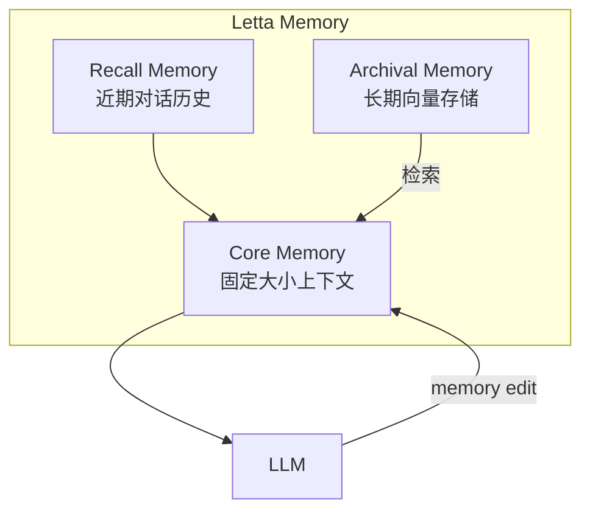

# 6. 源码分析

> 一句话理解：**现代 Agent Memory 的源码核心可以概括为“分层记忆抽象 + 统一存储接口 + 面向 Runtime 的 recall/remember 契约”；本节以 Letta（MemGPT）、LangGraph、OpenAI Agents SDK Sessions、Mem0 为主，结合主流向量数据库，说明关键代码组织与扩展点**。

## 分析对象选择

| 项目 | 仓库/文档 | 定位 | 分析重点 |
|---|---|---|---|
| **Letta（原 MemGPT）** | [docs.letta.com](https://docs.letta.com) / [github.com/letta-ai/letta](https://github.com/letta-ai/letta) | 面向 Agent 的分层记忆系统 | core / recall / archival memory、memory 编辑 |
| **LangGraph Persistence / Store** | [docs.langchain.com/oss/python/langgraph/persistence](https://docs.langchain.com/oss/python/langgraph/persistence) / [add-memory](https://docs.langchain.com/oss/python/langgraph/add-memory) | 生产级状态与记忆持久化 | checkpoint、store、cross-thread memory |
| **OpenAI Agents SDK Sessions** | [openai.github.io/openai-agents-python/sessions/](https://openai.github.io/openai-agents-python/sessions/) | OpenAI 生态会话管理 | session state、memory、handoffs |
| **Mem0** | [docs.mem0.ai](https://docs.mem0.ai) | 面向 AI 助手的记忆层 | user/session/memory 抽象、API |
| **Chroma / Weaviate / Milvus / pgvector** | 各官方文档 | 向量数据库 | 索引、过滤、扩展性、运维 |

> 注：开源项目迭代较快，本节基于 2026 年中主流分支结构进行分析，具体类名与 API 可能随版本微调。

## Letta（原 MemGPT）

Letta 是 Agent Memory 领域最具代表性的开源项目之一，其前身 MemGPT 论文首次系统地把 OS 中的虚拟内存思想引入 LLM Agent。

### 核心抽象

Letta 把 Agent 记忆分为三层：



| 类型 | 说明 | 特点 |
|---|---|---|
| **Core Memory** | 固定 token 预算的记忆区，直接拼进 prompt | 可编辑、分 `human` / `persona` 区 |
| **Recall Memory** | 当前会话的完整 messages | 按时间顺序，超出部分归档 |
| **Archival Memory** | 长期向量存储 | embedding + 检索 |

### Memory 编辑机制

Letta 的一个重要设计是把记忆管理也暴露为工具：

```python
# 概念伪代码
functions.core_memory_append:0{"section": "human", "content": "用户喜欢 Markdown 格式"}
functions.archival_memory_insert:1{"content": "项目 Phoenix 使用 Python 3.11"}
functions.conversation_search:2{"query": "上次的周报模板"}
```

这样，Agent 可以主动决定：

- 什么信息值得写入 core memory。
- 什么信息应该归档到 archival memory。
- 什么时候从 archive 中搜索。

### 优点与局限

| 优点 | 局限 |
|---|---|
| 显式分层，概念清晰 | 自托管部署相对复杂 |
| Agent 可主动管理记忆 | 需要模型具备较强的 memory edit 能力 |
| 有深厚学术研究背景 | 与外部 Runtime 集成需要适配 |

## LangGraph Persistence / Store

LangGraph 是生产级 Agent Runtime，其 Persistence 与 Store 机制也代表了 Memory 的一种工程化实现。

### Checkpoint：状态持久化

LangGraph 的 `checkpoint` 把每次图执行的状态保存下来：

```python
from langgraph.checkpoint.memory import MemorySaver
from langgraph.graph import StateGraph

graph = StateGraph(State)
# ... 添加节点与边 ...
app = graph.compile(checkpointer=MemorySaver())

config = {"configurable": {"thread_id": "session-1"}}
app.invoke({"messages": [user_message]}, config=config)
```

Checkpoint 保存的内容包括：

- 图的完整 State。
- 所有消息历史。
- 当前节点位置。
- 中断/恢复所需信息。

这意味着 LangGraph 的 checkpoint 本身就承担了“工作记忆 + 短期记忆 + 可恢复状态”的角色。

### Store：跨会话长期记忆

LangGraph 的 `Store` 提供了跨 thread/session 的长期记忆能力：

```python
from langgraph.store.memory import InMemoryStore

store = InMemoryStore()
store.put(("user", "alice"), "preferences", {"theme": "dark", "language": "zh"})
value = store.get(("user", "alice"), "preferences")
```

Store 的特点：

- 按 namespace 组织，例如 `("user", "alice")`。
- 支持向量搜索（配合 embedding）。
- 可被多个 thread 共享，实现跨会话记忆。

### 优点与局限

| 优点 | 局限 |
|---|---|
| 与图执行深度集成 | 学习曲线较陡 |
| checkpoint 支持断点续跑 | 默认 memory store 不适合大规模生产 |
| store 支持跨会话记忆 | 需要自行选择 Postgres/Redis 等外部后端 |

## OpenAI Agents SDK Sessions

OpenAI Agents SDK 的 Sessions 机制代表了厂商生态中的记忆方案。

### 核心抽象

```python
from agents import Agent, Runner

agent = Agent(name="Assistant", instructions="你是一个 helpful 助手。")
result = await Runner.run(agent, "你好", session_id="session-1")
```

Sessions 负责：

- 维护当前会话的 messages。
- 在多次 `Runner.run` 调用之间保持上下文。
- 支持状态、记忆与 handoffs。

### 与 Memory 的关系

OpenAI Agents SDK 的 Sessions 更偏向“工作记忆 + 短期记忆”，长期记忆通常需要开发者自己集成外部 store。SDK 提供的 `memory` 扩展点允许开发者插入自定义记忆后端。

### 优点与局限

| 优点 | 局限 |
|---|---|
| 与 OpenAI 模型生态无缝集成 | 深度绑定 OpenAI |
| API 极简，快速落地 | 长期记忆能力不如 Letta/LangGraph 显式 |
| session 管理开箱即用 | 多租户、审计、隐私需要自行实现 |

## Mem0

Mem0 是一个专门为 AI 助手和 Agent 设计的记忆层，定位介于 Letta 与 LangGraph Store 之间。

### 核心抽象

```python
from mem0 import Memory

m = Memory()

# 添加记忆
result = m.add("我喜欢简洁的 Markdown 周报", user_id="alice")

# 检索记忆
memories = m.search("周报格式", user_id="alice")
```

Mem0 的核心抽象包括：

- **User**：记忆归属的用户。
- **Session**：一次交互会话。
- **Memory**：一条记忆记录，包含文本、metadata、embedding。

### 设计特点

1. **以用户为中心**：所有记忆都围绕 `user_id` 组织，天然适合个性化助手。
2. **自动提取**：会自动从对话中抽取事实与偏好。
3. **多层级**：支持会话级、用户级、组织级记忆。
4. **云端与本地**：提供托管云服务和可自托管的开源版本。

### 优点与局限

| 优点 | 局限 |
|---|---|
| API 非常简洁 | 复杂企业级场景需要扩展 |
| 用户-centric 设计 | 与 LangGraph 等 Runtime 集成需要适配 |
| 自动事实提取 | 提取质量依赖模型 |

## 向量数据库对比

Agent Memory 的长期语义记忆和情景记忆通常依赖向量数据库。以下是四款主流向量数据库的对比。

### Chroma

Chroma 是一个面向开发者的轻量向量数据库，强调易用性。

特点：

- 本地/内存/服务端多种模式。
- Python-first API，学习成本低。
- 支持 metadata 过滤与 embedding 自动计算。

适用：原型、中小型应用、本地 Demo。

### Weaviate

Weaviate 是一个云原生向量数据库，支持 GraphQL 与 REST 接口。

特点：

- 内置模块化 pipeline（embedding、rerank、生成）。
- 支持 hybrid search。
- 强调多模态与知识图谱集成。

适用：需要 hybrid search 和模块化能力的生产系统。

### Milvus / Zilliz Cloud

Milvus 是面向大规模向量检索的数据库，Zilliz Cloud 是其托管版本。

特点：

- 支持十亿级向量。
- 多种索引类型（HNSW、IVF_FLAT、DISKANN 等）。
- 分布式架构，云原生设计。

适用：大规模、高并发、需要水平扩展的场景。

### pgvector

pgvector 是 PostgreSQL 的向量扩展，把向量检索能力带入关系型数据库。

特点：

- 与 Postgres 事务、权限、生态完全兼容。
- 支持 HNSW、IVF 索引。
- 适合已有 Postgres 基础设施的团队。

适用：需要强一致性、关系型元数据与向量检索共存的场景。

### 向量数据库能力矩阵

| 维度 | Chroma | Weaviate | Milvus | pgvector |
|---|---|---|---|---|
| 部署模式 | 本地/服务端/云 | 自托管/云 | 自托管/云 | Postgres 扩展 |
| 索引类型 | HNSW | HNSW、BM25 | HNSW、IVF、DISKANN 等 | HNSW、IVF |
| Hybrid Search | 支持 | 原生支持 | 支持 | 需配合全文检索 |
| 扩展性 | 中小规模 | 大规模 | 超大规模 | 依赖 Postgres 扩展 |
| 学习曲线 | 低 | 中 | 中高 | 低（会 Postgres） |
| 最佳场景 | 原型/Demo | 模块化生产 | 大规模向量检索 | 已有 Postgres 的团队 |

## 共同模式总结

| 能力 | Letta | LangGraph | OpenAI SDK | Mem0 |
|---|---|---|---|---|
| 核心抽象 | Core / Recall / Archival | Checkpoint / Store | Session | User / Session / Memory |
| 状态持久化 | 强 | 极强 | 中 | 中 |
| 长期记忆 | 显式 archival memory | Store + 向量 | 需扩展 | 原生支持 |
| 跨会话记忆 | 支持 | Store | 需扩展 | 原生支持 |
| Agent 主动管理记忆 | 是 | 可扩展 | 可扩展 | 自动提取 |
| 最佳场景 | 研究/复杂 Agent | 生产级工作流 | OpenAI 快速落地 | 个性化助手 |

## 本章小结

Letta（MemGPT）把 OS 虚拟内存思想引入 Agent，提出了 Core / Recall / Archival 三层记忆，并允许 Agent 主动编辑记忆；LangGraph 通过 Checkpoint 与 Store 把状态持久化和跨会话记忆深度集成到图执行中；OpenAI Agents SDK Sessions 提供了开箱即用的会话管理，但长期记忆需要自行扩展；Mem0 以用户为中心，提供了极简的记忆 API。向量数据库方面，Chroma 适合原型，Weaviate 适合模块化生产，Milvus 适合大规模，pgvector 适合已有 Postgres 的团队。理解这些实现的抽象差异，有助于在自己的场景中做出合理选型。

**参考来源**

- [Letta Documentation](https://docs.letta.com)
- [Letta GitHub](https://github.com/letta-ai/letta)
- [LangGraph Persistence](https://docs.langchain.com/oss/python/langgraph/persistence)
- [LangGraph Add Memory](https://docs.langchain.com/oss/python/langgraph/add-memory)
- [OpenAI Agents SDK Sessions](https://openai.github.io/openai-agents-python/sessions/)
- [Mem0 Documentation](https://docs.mem0.ai)
- [Chroma Documentation](https://docs.trychroma.com)
- [Weaviate Documentation](https://weaviate.io/developers/weaviate)
- [Milvus Documentation](https://milvus.io/docs)
- [pgvector GitHub](https://github.com/pgvector/pgvector)
- [MemGPT Paper](https://arxiv.org/abs/2310.08560)
- [Steve Kinney — Agent Memory Systems](https://stevekinney.com/writing/agent-memory-systems)
