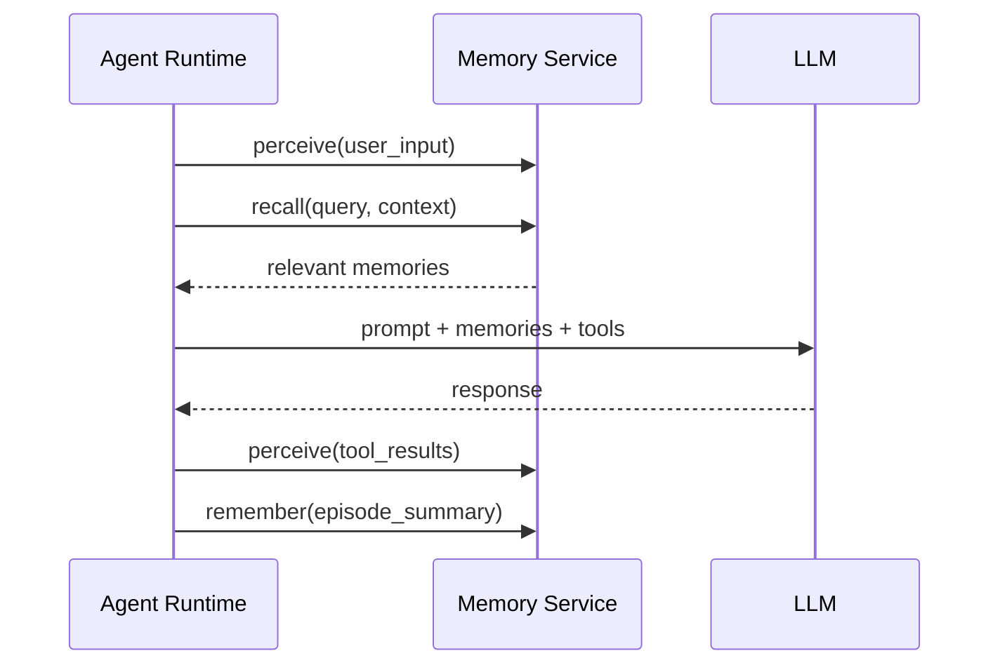

# 8. 企业生产实践

> 一句话理解：**生产环境的 Agent Memory 要解决的不是“能不能记住”，而是“能不能在多用户、大规模、长周期、高隐私要求下稳定、经济、合规地记住与遗忘”**。

## 多租户隔离

多租户是生产 Memory 系统的首要问题。不同租户、不同用户之间的记忆绝对不能串味。

### 隔离级别

| 级别 | 实现方式 | 安全性 | 成本 |
|---|---|---|---|
| **逻辑隔离** | 每条记忆带 `tenant_id` / `user_id`，检索时过滤 | 中 | 低 |
| **Namespace 隔离** | 按租户分 collection / namespace | 较高 | 中 |
| **物理隔离** | 不同租户使用独立数据库/集群 | 最高 | 高 |

### 推荐做法

- 同一企业内不同团队：逻辑隔离 + namespace 隔离。
- 不同企业或强合规场景：物理隔离。
- 所有检索操作必须带 tenant/user filter，不能在应用层拼接后再过滤。
- 审计日志必须记录访问的租户与用户。

```python
# 错误做法：先检索再过滤
candidates = vector_store.search(query, top_k=50)
results = [c for c in candidates if c.metadata["user_id"] == user_id]

# 正确做法：在向量数据库层过滤
results = vector_store.search(
    query,
    top_k=5,
    filters={"tenant_id": tenant_id, "user_id": user_id}
)
```

## 持久化后端选择

不同记忆类型适合不同后端。

| 记忆类型 | 推荐后端 | 理由 |
|---|---|---|
| Working Memory | 内存 / Redis | 低延迟、会话级 |
| Short-term Memory | Redis / Postgres | 会话级、可快速恢复 |
| Semantic Memory | 向量 DB | 语义检索 |
| Episodic Memory | 向量 DB + 文档 DB | 语义检索 + 结构化查询 |
| Procedural Memory | KV Store / Postgres | 规则/模板、版本管理 |
| 冷归档 | 对象存储 | 低成本、审计 |

### 常见后端组合

```text
Working Memory: Redis
Short-term Memory: Redis + Postgres
Semantic Memory: pgvector / Weaviate / Milvus
Episodic Memory: Milvus + Postgres
Procedural Memory: Postgres
Cold Archive: S3 / OSS
```

## 向量数据库选型

选型维度：

| 维度 | 考虑点 |
|---|---|
| **数据规模** | 百万级以下 Chroma/pgvector 足够；亿级以上考虑 Milvus/Weaviate |
| **查询 QPS** | 高 QPS 需要 HNSW 索引 + 缓存 + 水平扩展 |
| **Hybrid Search** | 是否需要同时做向量+关键词检索 |
| **元数据过滤** | 是否需要在检索时按 tenant/user/time 过滤 |
| **运维成本** | 团队是否有 Postgres/云原生运维经验 |
| **成本** | 自托管 vs 托管服务；向量维度与索引内存消耗 |

选型建议：

- **已有 Postgres 团队**：优先 pgvector，降低运维复杂度。
- **需要模块化和 hybrid search**：Weaviate。
- **超大规模、高并发**：Milvus 或 Zilliz Cloud。
- **快速原型、教学 Demo**：Chroma。

## Embedding 模型管理

Embedding 是 Memory 系统的核心依赖，模型选择与管理直接影响检索质量。

### 模型选择维度

| 维度 | 说明 |
|---|---|
| **语言** | 多语言场景需要 multilingual model |
| **领域** | 代码、医疗、法律等领域可考虑领域微调模型 |
| **维度** | 常见 384/768/1024/1536/3072 维，维度越高存储与计算成本越高 |
| **延迟** | 本地 small model 延迟低，云端大模型质量好 |
| **成本** | 按 token 计费 vs 自托管 GPU |

### 版本管理与迁移

Embedding 模型升级时，向量空间会发生变化，必须处理：

1. **重新编码**：用新模型把所有记忆重新生成向量。
2. **双写过渡**：新旧模型同时写入，逐步切换检索。
3. **版本标记**：每条记忆记录 embedding_model_version，检索时按版本过滤。

```python
{
  "id": "mem-001",
  "text": "...",
  "embedding": [...],
  "embedding_model": "text-embedding-3-small",
  "embedding_version": "2024-07"
}
```

### 生产建议

- embedding 服务应独立部署，支持批量、缓存、熔断。
- 对高价值记忆做 embedding 持久化，避免每次检索重新编码。
- 监控 embedding 延迟、失败率、向量分布漂移。

## 隐私与 TTL

### 敏感信息处理

| 信息类型 | 处理方式 |
|---|---|
| PII（姓名、电话、地址） | 检测后脱敏或拒绝存储 |
| 密码、Token、密钥 | 绝对禁止存入长期记忆 |
| 财务/医疗数据 | 加密 + 访问控制 + 审计 |
| 用户聊天记录 | 按隐私政策设置 TTL |

### TTL 策略

- 工作记忆：会话结束即清除。
- 短期记忆：会话结束或 24 小时后清除。
- 长期记忆：默认永久，但用户可删除。
- 敏感记忆：强制短 TTL（如 1 小时）。
- 审计日志：按法规要求保留（如 1 年）。

### 用户权利

- **查看**：用户可查看自己的记忆。
- **修改**：用户可纠正错误记忆。
- **删除**：用户可删除单条或全部记忆。
- **导出**：按法规要求支持数据导出。

## 与 Agent Runtime 集成

Memory Service 与 Agent Runtime 的集成点主要在：

1. **每次用户输入后**：Runtime 把输入传给 Memory Service 感知。
2. **每次工具结果后**：Runtime 把结果传给 Memory Service。
3. **调用 LLM 前**：Runtime 向 Memory Service 请求 recall，把相关记忆拼进 prompt。
4. **任务结束后**：Runtime 把任务摘要传给 Episodic Memory。



## 可观测体系

生产 Memory 系统需要：

| 类型 | 工具 | 关注点 |
|---|---|---|
| Trace | OpenTelemetry / LangSmith | remember/recall 调用链路、embedding 延迟、检索结果 |
| Metrics | Prometheus + Grafana | recall 命中率、检索延迟、存储容量、TTL 清理速率 |
| Logs | Loki / ELK | 记忆写入、读取、删除、敏感信息拦截 |
| Audit | 审计数据库 | 用户查看/删除记忆记录 |

关键告警：

- 检索延迟 P99 超过阈值。
- 记忆写入失败率突增。
- 敏感信息拦截率异常。
- 单用户记忆量异常增长。
- TTL 清理任务失败。

## 常见踩坑

| 踩坑 | 原因 | 解法 |
|---|---|---|
| 跨租户记忆串味 | 检索没加 tenant filter | 在数据库层强制过滤 |
| 上下文爆炸 | 一次性召回太多记忆 | top-k 限制 + rerank + 截断 |
| 记忆污染 | 把工具错误结果或幻觉存入长期记忆 | 置信度过滤 + 人工确认 |
| embedding 版本混乱 | 模型升级后向量空间不一致 | 版本标记 + 双写过渡 + 重编码 |
| 敏感信息泄露 | 未做 PII 检测 | 存储前强制隐私过滤 |
| 检索延迟高 | 索引未优化、无缓存 | HNSW 索引 + embedding 缓存 + 批量 |
| 记忆无限增长 | 无 TTL 与遗忘策略 | 按类型设置 TTL + 衰减策略 |

## 本章小结

生产级 Agent Memory 需要在多租户隔离、持久化后端选择、向量数据库选型、embedding 模型管理、隐私保护、TTL、与 Agent Runtime 集成、可观测等方面做系统设计。记忆系统的可靠性不仅取决于存储和检索，还取决于“记住什么、遗忘什么、如何保护”的全生命周期策略。只有把隐私、合规、成本与性能同时纳入设计，Memory 才能真正从 Demo 走向生产。

**参考来源**

- [Letta Production Deployment](https://docs.letta.com)
- [LangGraph Persistence Production](https://docs.langchain.com/oss/python/langgraph/persistence)
- [Mem0 Platform](https://docs.mem0.ai)
- [Chroma Docs](https://docs.trychroma.com)
- [Weaviate Docs](https://weaviate.io/developers/weaviate)
- [Milvus Docs](https://milvus.io/docs)
- [pgvector GitHub](https://github.com/pgvector/pgvector)
