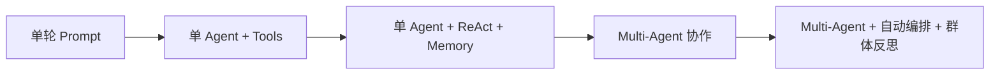
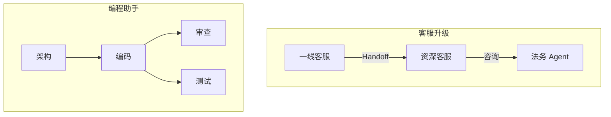

# 1. 背景

> 一句话理解：**当任务复杂到需要同时调用多种专业能力、并行探索多条路径、并在执行中持续协商时，单 Agent 的“一人全包”模式就不再够用**。

## 1. 单 Agent 的局限

单 Agent 通常由“一个 LLM + 工具 + 记忆 + ReAct 循环”组成。它在以下场景会遇到明显天花板：

- **角色冲突**：同一个 Prompt 里既要它做架构师又要它写代码，容易顾此失彼。
- **上下文爆炸**：任务越复杂，需要携带的 instructions、历史、工具描述越长，反而降低决策质量。
- **能力边界模糊**：模型自己决定什么时候调用工具、什么时候做规划，出错后难以定位是模型问题还是编排问题。
- **难以并行**：单 Agent 一次只能走一条推理链，无法让多个专家同时探索不同方案。
- **安全与隔离**：高权限工具和低权限工具混在一起，容易越权。

Multi-Agent 的核心动机就是**把复杂任务拆成多个角色，让每个 Agent 聚焦一个专业能力，再通过协作机制把它们串起来**。

## 2. 演进阶段

| 阶段 | 特点 | 代表 |
|---|---|---|
| 单轮 Prompt | 无状态问答，依赖单次模型能力 | 早期 Chatbot |
| 单 Agent + Tools | 模型可调用外部工具，但仍是单角色 | Function Calling Agent |
| 单 Agent + ReAct + Memory | 多轮循环、可读写记忆 | LangGraph Agent、OpenAI Agents SDK |
| Multi-Agent 协作 | 多角色分工、消息通信、共享状态 | AutoGen、CrewAI、MetaGPT |
| 自动编排 + 群体反思 | Agent 动态组队、自我评估、共识聚合 | 研究前沿 |

## 3. 典型场景

### 客服升级

一线客服 Agent 处理退换货，遇到复杂投诉时 Handoff 给资深客服 Agent，必要时引入法务 Agent 复核。

### 编程助手

架构 Agent 负责设计、Coder Agent 负责实现、Reviewer Agent 负责代码审查、Test Agent 负责生成测试用例。

### 研究助手

搜索 Agent 收集资料、摘要 Agent 提炼观点、写作 Agent 生成报告、Fact-check Agent 校验引用。

### 内容生产

选题 Agent 提创意、编剧 Agent 写脚本、审核 Agent 检查合规、运营 Agent 生成标题与摘要。

## 4. 核心挑战

| 挑战 | 说明 |
|---|---|
| **角色边界** | 哪些工作分给哪个 Agent？职责不清会互相推诿或重复劳动。 |
| **通信开销** | Agent 之间消息太多会拖慢整体，太少又会导致信息不对称。 |
| **状态一致** | 共享 Blackboard 的读写冲突、缓存失效、部分失败如何处理？ |
| **协调策略** | 谁来分配任务？Manager-Worker 还是去中心化？ |
| **冲突解决** | 多个 Agent 给出矛盾结论时，如何聚合或投票？ |
| **可观测** | 多个 Agent 的执行路径交织，如何 trace 一次完整任务？ |
| **成本与延迟** | 每增加一个 Agent 就多一次或多次 LLM 调用，必须精打细算。 |

## 本章小结

Multi-Agent 的产生源于单 Agent 在复杂任务中的角色冲突、上下文爆炸与并行能力缺失。它把任务拆给多个专业 Agent，但也带来了角色边界、通信、状态一致、协调、冲突解决、可观测和成本等新挑战。理解这些挑战，是设计 Multi-Agent 架构的前提。

**参考来源**

- [AutoGen: Enabling Next-Gen LLM Applications via Multi-Agent Conversation](https://arxiv.org/abs/2308.08155)
- [MetaGPT: Meta Programming for A Multi-Agent Collaborative Framework](https://arxiv.org/abs/2308.00352)
- [Steve Kinney — Multi-Agent Systems](https://stevekinney.com/writing/multi-agent-systems)
