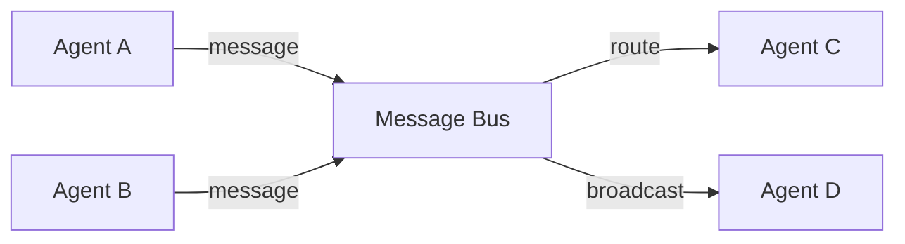
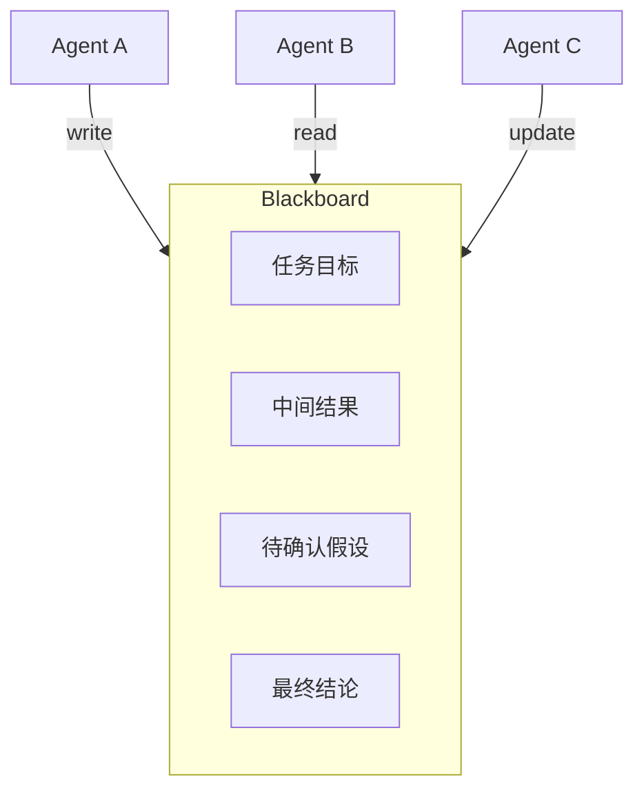
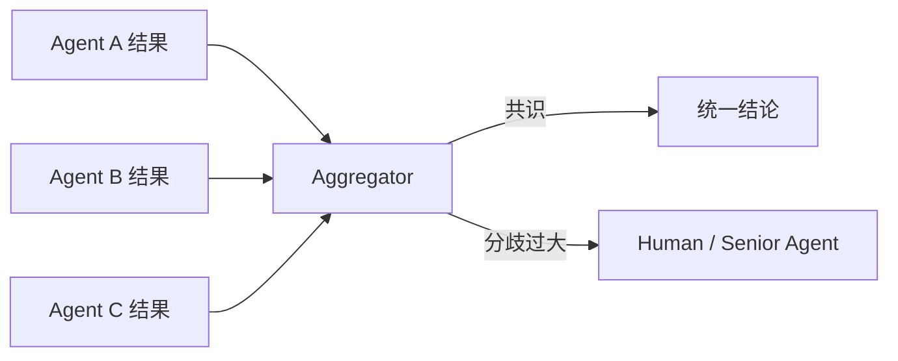

# 2. 核心思想

> 一句话理解：**Multi-Agent 的核心思想是“分而治之、协同共治”——通过角色、技能、消息、协调与共享状态的显式设计，把多个独立 Agent 组织成可预测、可观测、可扩展的协作系统**。

## 1. Agent 角色与技能

每个 Agent 都应该有明确的角色（Role）和技能（Skill）：

- **Role**：回答“你是谁、你负责什么、你关注什么”。例如架构师、编码者、审稿人。
- **Skill**：回答“你能调用什么工具和知识”。例如数据库查询、代码生成、合规审查。

一个 Agent 可以只拥有少量技能，避免工具过多导致决策混乱。角色和技能都应该在运行时可注册、可发现、可版本化。

## 2. 消息总线与收件箱

Agent 之间不直接互相引用，而是通过消息总线（Message Bus）通信：

消息应包含：

- `from`、`to`、`message_type`（request/response/event/heartbeat）。
- `task_id`、`session_id`，用于 trace。
- `payload`，结构化数据而非自由文本。
- `timestamp`、`priority`、`ttl`。

每个 Agent 维护自己的收件箱（Inbox），按策略消费消息，避免被瞬时消息洪流冲垮。

## 3. 协调器与编排器

协调器（Coordinator / Orchestrator）决定“下一步谁做什么”：

- **集中式**：一个 Manager Agent 分配任务、收集团队结果。
- **去中心化**：Agent 通过黑板或拍卖机制自行协商。
- **混合式**：粗粒度由 Manager 分配，细粒度由 Agent 自组织。

协调器本身也可以是 Agent，因此不要把“协调器”理解为固定代码，它更像一个特殊角色。

## 4. 共享黑板

Blackboard 是多个 Agent 共同读写的共享工作区：

黑板解决“共同上下文”问题，但也带来读写冲突。工程上通常给每条记录加版本号、作者、时间戳与置信度，支持乐观锁或事件溯源。

## 5. Handoff 与轮询

两种常见的任务切换方式：

| 方式 | 说明 | 适用场景 |
|---|---|---|
| **Handoff** | 当前 Agent 主动把任务交给另一个 Agent，交接时携带上下文 | 客服升级、阶段性成果移交 |
| **Round-Robin** | 多个 Agent 按固定顺序依次发言/执行 | 讨论、头脑风暴、多轮审稿 |

Handoff 要求上下文完整移交；Round-Robin 要求明确的终止条件，否则容易陷入无尽讨论。

## 6. 共识与结果聚合

多个 Agent 产出结果后，需要聚合：

- **投票**：多数决，适合有明确选项的场景。
- **加权投票**：按 Agent 专业度或历史准确率加权。
- **综合摘要**：由一个汇总 Agent 把多个意见整理成统一结论。
- **争议升级**：分歧过大时交给人类或更高阶 Agent 裁决。

## 7. 追踪与观察

Multi-Agent 的可观测比单 Agent 更复杂。必须记录：

- 每个 Agent 的输入、输出、工具调用。
- Agent 之间的消息流转。
- Blackboard 的写入历史。
- Coordinator 的决策理由。

Trace 需要按 `task_id` 串联所有 Agent 的事件，形成跨 Agent 的执行树。

## 8. 失败与恢复

Multi-Agent 的失败模式包括：

- 单个 Agent 失败：由 Coordinator 决定重试、替换或降级。
- 消息丢失：消息总线需支持 at-least-once 投递与幂等消费。
- 状态不一致：通过 checkpoint 与黑板版本机制恢复。
- 任务卡住：设置超时、心跳检测、强制终止或人工介入。

## 本章小结

Multi-Agent 的八大核心思想——角色与技能、消息总线、协调器、共享黑板、Handoff 与轮询、共识聚合、追踪观测、失败恢复——共同构成多 Agent 协作的设计基础。它们让“多个 Agent 一起工作”从随机行为变成工程系统。

**参考来源**

- [AutoGen: Enabling Next-Gen LLM Applications via Multi-Agent Conversation](https://arxiv.org/abs/2308.08155)
- [LangGraph Multi-Agent Concepts](https://langchain-ai.github.io/langgraph/concepts/multi_agent/)
- [CrewAI — Core Concepts](https://docs.crewai.com/concepts)
