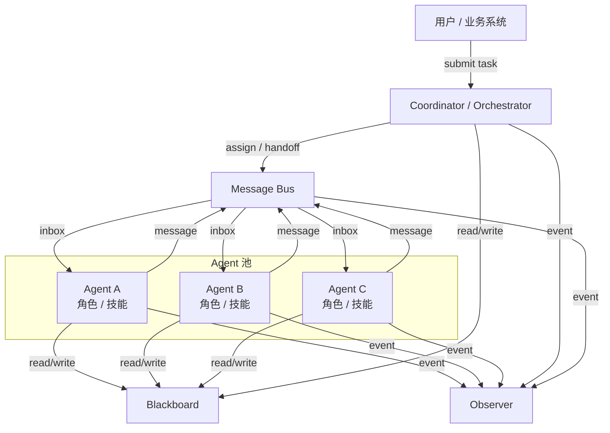
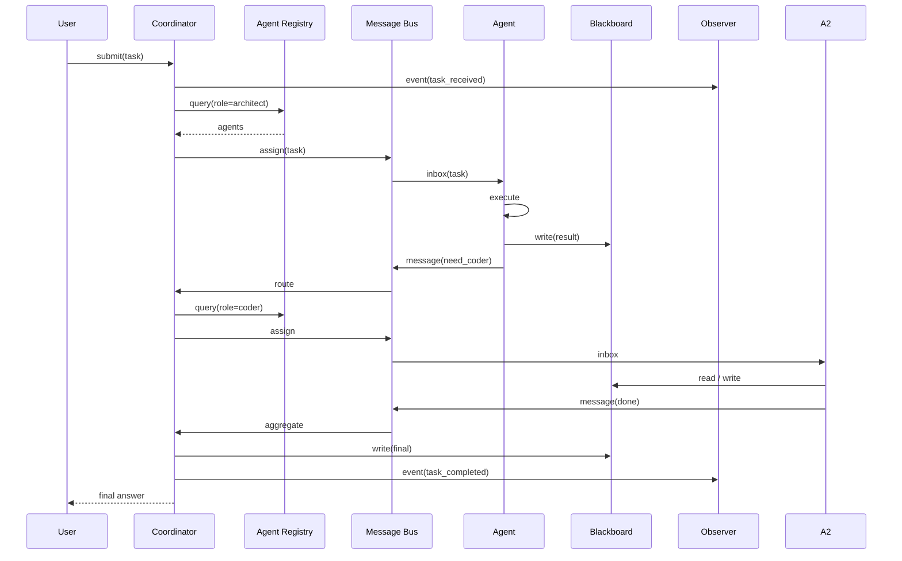

# 3. 架构设计

> 一句话理解：**Multi-Agent 架构可以概括为“角色层 + 通信层 + 协调层 + 记忆层 + 观测层”的五层结构，控制面负责生命周期与策略，数据面负责消息流转与状态更新**。

## 整体架构



## 分层职责

| 层级 | 职责 | 典型组件 |
|---|---|---|
| **接入层** | 接收任务、鉴权、路由 | API Gateway、LLM Gateway |
| **控制面** | Agent 注册、角色策略、权限、审计 | Agent Registry、Policy Store、Secret Manager |
| **协调层** | 任务分配、Handoff、终止判定 | Coordinator、Planner、Aggregator |
| **通信层** | 消息路由、收件箱、重试、顺序保证 | Message Bus、Inbox、Queue |
| **Agent 层** | 具体执行任务的 Agent | 多个带 Role/Skill 的 Runtime 实例 |
| **记忆层** | 共享 Blackboard、跨 Agent 记忆 | Blackboard、Agent Memory、持久化存储 |
| **可观测层** | 跨 Agent trace、metrics、logs | OpenTelemetry、LangSmith、Prometheus |

## 控制面 vs 数据面

| 维度 | 控制面 | 数据面 |
|---|---|---|
| 职责 | Agent 注册、角色权限、任务路由策略、审计 | Agent 执行、消息流转、黑板读写 |
| 状态 | 长期、持久化 | 会话级、可 checkpoint |
| 扩展 | 管理 API、配置中心 | 水平扩展 Agent worker、消息队列分片 |
| 示例 | 谁能调用哪个 Agent、哪些任务必须 HITL | Agent 之间的一次 Handoff、黑板更新 |

控制面决定“谁能做什么”，数据面决定“正在怎么做”。

## 核心模块协作



## 部署形态

### 形态 1：同进程多 Agent

所有 Agent 跑在同一个进程内，Message Bus 是内存队列，Blackboard 是共享对象。

优点：低延迟、易调试。
缺点：无法横向扩展，单点故障影响全部。

### 形态 2：独立服务集群

每个 Agent 类型是一个独立服务，通过消息队列通信。

```text
User → Coordinator Service → MQ → Agent Services → Blackboard Service
```

优点：可独立扩缩、按角色优化资源。
缺点：网络延迟增加，需要消息序列化与持久化。

### 形态 3：Serverless / 云托管

例如 Azure AI Agent Service、AWS Bedrock Multi-Agent Orchestration。

优点：按需计费、自动扩缩。
缺点：供应商锁定、自定义协调策略受限。

## 与 Runtime、Memory、Gateway 的关系

```text
User → LLM Gateway → Multi-Agent Coordinator → Agent Runtime → Tools
                          ↓
                    Agent Memory / Blackboard
                          ↓
                       Observer
```

- **LLM Gateway**：提供统一模型接入。
- **Multi-Agent Coordinator**：负责任务分配与协作编排。
- **Agent Runtime**：每个 Agent 的 ReAct 执行容器。
- **Agent Memory / Blackboard**：提供共享或隔离的记忆。
- **Observer**：记录跨 Agent 的 trace 与事件。

## 本章小结

Multi-Agent 架构通过五层设计把复杂的群体协作拆解为清晰的模块边界：角色层定义能力，通信层传递消息，协调层决定调度，记忆层共享上下文，观测层记录全局 trace。控制面与数据面分离后，系统才能在生产环境中横向扩展、独立升级与故障隔离。

**参考来源**

- [LangGraph Multi-Agent Concepts](https://langchain-ai.github.io/langgraph/concepts/multi_agent/)
- [AutoGen Architecture](https://microsoft.github.io/autogen/stable/user-guide/core-user-guide/architecture.html)
- [CrewAI — Agents and Tasks](https://docs.crewai.com/concepts/agents)
