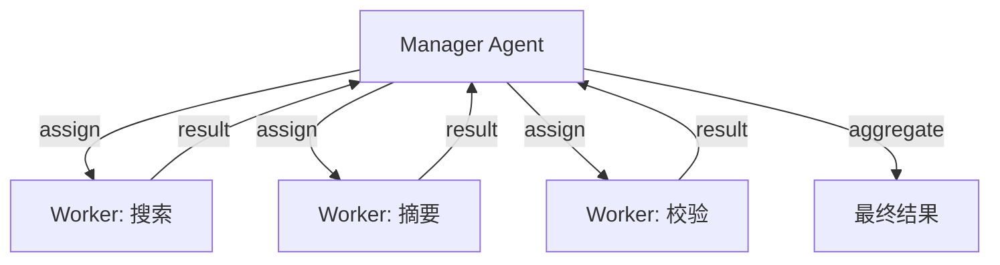
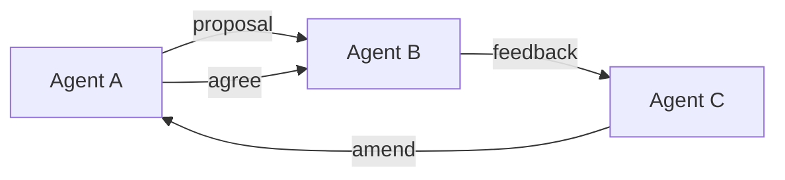
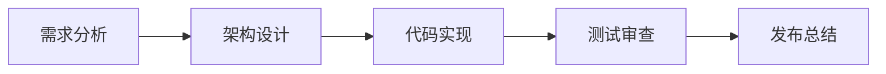
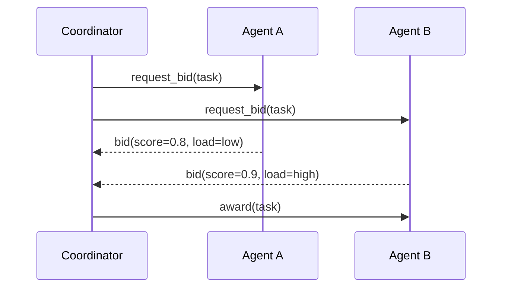
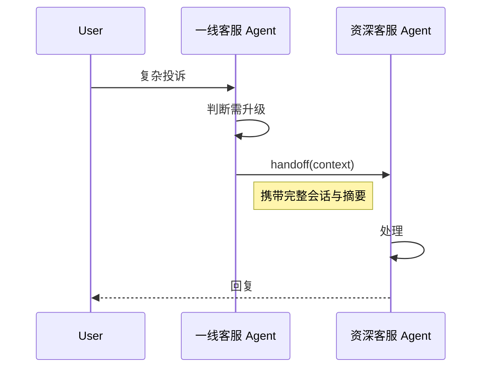
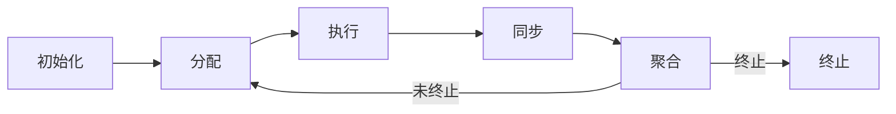

# 4. 协作模式

> 一句话理解：**Multi-Agent 的协作模式回答“多个 Agent 怎么组织起来干活”——Manager-Worker 适合分工明确、Peer-to-Peer 适合协商讨论、Pipeline 适合流水作业、Auction 适合资源竞争、Handoff 适合阶段移交**。

## 1. Manager-Worker

一个 Manager Agent 把任务拆成子任务，分派给多个 Worker Agent，最后聚合结果。

适用：任务可拆解、角色清晰、需要统一收口。
风险：Manager 成为瓶颈；Worker 之间缺乏直接沟通。

## 2. Peer-to-Peer

Agent 之间平等交流，通过消息协商达成一致。

适用：头脑风暴、方案评审、需要多角度碰撞。
风险：容易讨论发散，需要明确的终止条件与共识机制。

## 3. Pipeline

Agent 按固定阶段依次处理，输出作为下一个 Agent 的输入。

适用：流程标准化、阶段依赖明确。
风险：一个阶段卡住会阻塞整条流水线，需要回退与重试机制。

## 4. Auction

多个 Agent 对同一个任务出价，Coordinator 根据能力、负载、历史表现选择中标者。

适用：资源竞争、动态负载均衡、多 Agent 具备相似能力。
风险：拍卖本身带来额外通信开销，出价策略需要设计。

## 5. 动态 Handoff

Agent 在执行过程中判断当前任务应由另一个 Agent 处理，主动移交上下文。

适用：客服、医疗分诊、技术支持等需要逐层升级的场景。
风险：上下文移交不完整会导致接收 Agent 反复询问。

## 模式对比

| 模式 | 结构 | 通信方式 | 优点 | 缺点 | 典型场景 |
|---|---|---|---|---|---|
| Manager-Worker | 星型 | Manager 分配与聚合 | 职责清晰、易于监控 | Manager 瓶颈、Worker 不直接通信 | 任务拆解、报告生成 |
| Peer-to-Peer | 网状 | 互相发送消息 | 灵活、多角度碰撞 | 容易发散、终止条件难定 | 头脑风暴、方案评审 |
| Pipeline | 链式 | 阶段输出 → 下阶段输入 | 流程标准化 | 单点阻塞、回退复杂 | 软件开发、内容生产 |
| Auction | 竞争 | 出价与中标 | 负载均衡、动态选择 | 额外开销、策略复杂 | 多专家竞选 |
| Handoff | 阶段移交 | 上下文打包传递 | 体验自然、逐层升级 | 上下文丢失风险 | 客服、分诊 |

## 协作生命周期

无论采用哪种模式，一次 Multi-Agent 任务通常经历以下阶段：

| 阶段 | 动作 |
|---|---|
| **初始化（Init）** | 创建 session、加载角色、准备 Blackboard、初始化 Observer。 |
| **分配（Assign）** | Coordinator 根据任务与 Agent 能力分配工作或触发 Handoff。 |
| **执行（Execute）** | Agent 在 Runtime 中运行，可能调用工具、读写 Blackboard。 |
| **同步（Sync）** | Agent 把结果写回 Blackboard 或广播给相关 Agent。 |
| **聚合（Aggregate）** | Coordinator 或 Aggregator 汇总结果，判断是否满足终止条件。 |
| **终止（Terminate）** | 返回最终结果、归档 trace、清理资源。 |

## 本章小结

Multi-Agent 没有万能协作模式。Manager-Worker 适合明确分工，Peer-to-Peer 适合协商讨论，Pipeline 适合标准化流程，Auction 适合资源竞争，Handoff 适合阶段移交。实际系统往往是多种模式的组合，关键是让协作生命周期“初始化 → 分配 → 执行 → 同步 → 聚合 → 终止”清晰可观测。

**参考来源**

- [AutoGen — Conversation Patterns](https://microsoft.github.io/autogen/stable/user-guide/agentchat-user-guide/tutorial/conversation-patterns.html)
- [LangGraph Multi-Agent](https://langchain-ai.github.io/langgraph/concepts/multi_agent/)
- [CrewAI — Processes](https://docs.crewai.com/concepts/processes)
- [OpenAI Agents SDK — Handoffs](https://openai.github.io/openai-agents-python/handoffs/)
