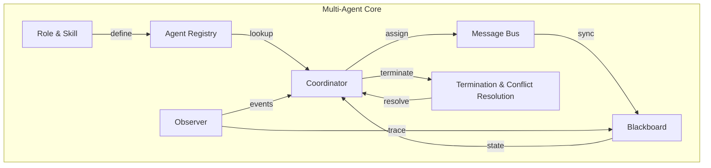

# 5. 核心模块

> 一句话理解：**Multi-Agent 的核心模块是“注册中心、角色技能、消息总线、协调器、共享黑板、观察者、终止与冲突解决”七大件，它们把群体协作从概念变成可运行、可观测、可治理的系统**。

## 1. Agent Registry

Agent Registry 是所有 Agent 的注册中心，解决“有哪些 Agent、它们能干什么、当前是否可用”的问题。

| 字段 | 说明 |
|---|---|
| `agent_id` | 全局唯一标识 |
| `role` | 角色，例如 architect / coder / reviewer |
| `skills` | 技能列表，每个技能含名称、schema、权限标签 |
| `model` | 偏好模型或模型组 |
| `version` | Agent 定义版本 |
| `status` | online / offline / overloaded |
| `metadata` | 负载、延迟、历史准确率 |

Registry 支持动态发现：新 Agent 上线时自动注册，下线时自动摘除。

## 2. Role & Skill

Role 与 Skill 是 Agent 能力的声明式描述：

- **Role**：定义 Agent 的身份、目标、行为准则。
- **Skill**：定义 Agent 可调用的原子能力，包括输入 schema、输出 schema、权限标签、成本标签。

```yaml
role: code_reviewer
skills:
  - name: review_python
    description: 审查 Python 代码的规范性与潜在 bug
    input: {code: string}
    output: {issues: list, score: int}
    tags: [read_only, low_risk]
```

Skill 的设计原则：单一职责、输入输出结构化、危险操作加标签。

## 3. Message Bus

Message Bus 负责 Agent 之间的消息路由：

- **点对点**：按 `to` 字段投递到目标 Agent 的收件箱。
- **广播**：按 `topic` 投递给所有订阅者。
- **请求-回复**：通过 `correlation_id` 关联请求与回复。
- **优先级与 TTL**：避免消息堆积，过期消息自动丢弃。

生产环境中，Message Bus 通常基于 Redis Streams、RabbitMQ、Kafka 或 NATS 实现，保证至少一次投递与顺序性。

## 4. Coordinator

Coordinator 是 Multi-Agent 的“调度大脑”，主要职责：

- 根据任务与 Agent 能力做任务分配。
- 处理 Handoff 与动态重分配。
- 监控任务进度，检测卡住或失败。
- 触发聚合与终止判定。

Coordinator 可以是规则驱动，也可以是另一个 LLM Agent。但需要注意：**Coordinator 本身不能成为不可观测的黑盒**，它的每次决策都应记录理由。

## 5. Blackboard

Blackboard 是共享工作区，保存任务进展、中间结果与共同假设。关键设计：

- **记录结构化**：每条记录包含 key、value、author、timestamp、version、confidence。
- **读写权限**：按 Role 限制可写区域，避免污染。
- **事件化**：写入即事件，订阅者可以实时感知变化。
- **持久化**：定期 checkpoint，支持失败后恢复。

```python
{
  "key": "architecture_decision",
  "value": "使用 Postgres 作为主存储",
  "author": "architect_agent",
  "timestamp": "2026-07-02T10:00:00Z",
  "version": 3,
  "confidence": 0.92
}
```

## 6. Observer

Observer 负责跨 Agent 的可观测：

- **Trace**：一次任务在多个 Agent 间的完整执行树。
- **Span**：每个 Agent 的每次执行、每次工具调用。
- **Event**：Handoff、Blackboard 写入、协调器决策、冲突发生。
- **Metrics**：协作成功率、平均参与 Agent 数、消息延迟、Blackboard 读写 QPS。

Observer 必须按 `task_id` 和 `session_id` 串联所有事件，否则 Multi-Agent 的调试将非常困难。

## 7. Termination & Conflict Resolution

### 终止条件

- 达到预设最大轮次或步数。
- Coordinator 判定目标已达成。
- 所有 Agent 达成共识。
- 人类触发强制终止。

### 冲突解决

| 策略 | 说明 |
|---|---|
| **投票** | 多数决 |
| **加权投票** | 按 Agent 可信度加权 |
| **仲裁 Agent** | 由更高阶 Agent 裁决 |
| **人类介入** | 分歧过大或高风险时请求 HITL |
| **回退** | 使用上一轮一致结果或默认值 |

## 模块关系图



## 本章小结

Multi-Agent 的七大核心模块各司其职：Registry 管理 Agent 元数据，Role & Skill 声明能力，Message Bus 传递消息，Coordinator 调度任务，Blackboard 共享状态，Observer 记录全局 trace，Termination & Conflict Resolution 负责收尾与分歧处理。它们共同把多 Agent 协作从松散对话变成受控系统。

**参考来源**

- [AutoGen — Core Components](https://microsoft.github.io/autogen/stable/user-guide/core-user-guide/core-components.html)
- [LangGraph — StateGraph](https://langchain-ai.github.io/langgraph/concepts/low_level/)
- [CrewAI — Core Concepts](https://docs.crewai.com/concepts)
- [MetaGPT — Roles](https://docs.deepwisdom.ai/main/Main%20Guide/roles/)
