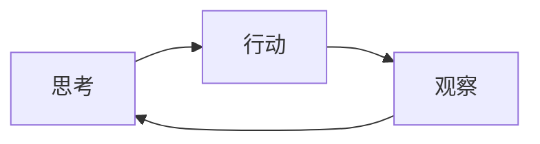
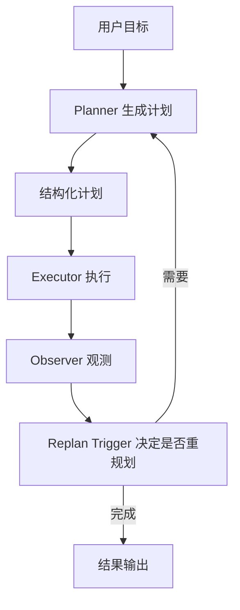

# 背景

> 一句话理解：**从 prompt engineering、CoT 到 ReAct，再到显式 Planning，Agent 的“思考方式”正在从一次性生成演变为可持久化、可回滚、可重规划的多步计划。**

早期的大模型应用大多是“单轮问答”：用户给一段 prompt，模型直接输出答案。这种方式对开放域闲聊、摘要、翻译等任务有效，但对需要多步操作、依赖外部信息、目标模糊的长程任务则显得力不从心。Agent Planning 的出现，正是为了把“想到哪做到哪”升级为“先规划、再执行、边观察、边调整”。

## 单轮 prompt engineering 的局限

prompt engineering 的核心是“把任务写清楚”。通过角色设定、示例、格式要求、约束条件等，让模型一次性生成理想输出。

典型问题：

- **上下文长度限制**：复杂任务需要大量背景信息，单轮 prompt 难以承载。
- **无法利用中间反馈**：模型无法在执行过程中调用工具、查询数据库或验证中间结果。
- **错误累积**：一旦某一步推理出错，后续输出往往一错到底。
- **目标漂移**：用户目标可能模糊或动态变化，单轮模型难以对齐。

## 多轮 CoT：让模型“一步步想”

Chain-of-Thought（CoT）通过让模型生成中间推理步骤，显著提升了数学、逻辑、代码等任务的准确率。

```text
Q: 一个农场有鸡和兔，头共 35 个，脚共 94 只，问鸡兔各多少？
A: 设鸡 x 只，兔 y 只。x + y = 35，2x + 4y = 94……
```

CoT 的本质是把“黑盒输出”变成“可解释的推理链”。但它仍然是单轮生成，模型一旦落笔就无法回头，也无法与外部环境交互。

## ReAct：把推理与行动交错

ReAct（Reasoning + Acting）把 CoT 与工具调用结合起来，形成“思考 → 行动 → 观察 → 再思考”的交错循环。



ReAct 解决了“模型如何与外界交互”的问题，但它的计划是隐式的：每一步的“思考”只决定下一步行动，没有全局任务结构。对于长程复杂任务，这种局部决策容易导致：

- **目标遗忘**：前期目标在后续步骤中被稀释。
- **重复探索**：没有全局路线图，模型可能反复尝试相似路径。
- **难以审计**：计划的“意图”散落在多轮 Thought 中，难以回溯。

## 显式 Planning：把计划作为一等公民

显式 Planning 的核心思想是：在执行前，先把整个任务拆解成结构化的计划；执行过程中，计划可以被观测、被修改、被重规划。



这种范式下，计划成为 Agent 的一等公民（first-class artifact），具备以下能力：

- **可解释**：人可以阅读、审核、修改计划。
- **可执行**：每个计划项对应明确的动作或子目标。
- **可观测**：执行状态实时反馈到计划上。
- **可回滚**：失败时可以回退到某个 checkpoint。
- **可重规划**：环境变化时重新生成或局部调整计划。

## Planning 解决的三类问题

| 问题类型 | 说明 | 示例 |
|---|---|---|
| 目标模糊 | 用户只说“帮我优化这个系统”，没有明确指标和约束 | 自动澄清目标、拆解为可验证子任务 |
| 多步依赖 | 后续步骤依赖前一步输出，存在顺序或并行关系 | 用 DAG 表示依赖，调度器按拓扑执行 |
| 动态环境 | 外部状态变化、工具失败、结果不达预期 | 触发器检测异常，Planner 重新生成计划 |

## 典型场景

- **代码助手**：把“帮我重构这段代码”拆成分析、提取函数、替换调用、运行测试、修复错误等步骤。
- **数据分析**：把“分析本季度销售下滑原因”拆成数据提取、清洗、指标计算、归因、可视化、报告生成。
- **运维排障**：把“排查线上告警”拆成查询监控、定位日志、分析链路、假设验证、修复、复盘。
- **旅行规划**：把“安排一次家庭日本游”拆成目的地选择、签证、机票酒店、行程、预算、备选方案。

这些任务的共同点是：无法通过单次模型调用完成，需要显式规划、多步执行、动态调整。

## 本章小结

- 单轮 prompt 和 CoT 适合明确、短程任务；ReAct 增加了行动与观察，但计划仍是隐式的。
- 显式 Planning 把计划提升为一等公民，解决了目标模糊、多步依赖、动态环境三类核心问题。
- Planning 是 Agent 长程自治的基础，也是后续架构与工程实践的出发点。

**参考来源**
- [ReAct: Synergizing Reasoning and Acting in Language Models](https://arxiv.org/abs/2210.03629)
- [Chain-of-Thought Prompting Elicits Reasoning in Large Language Models](https://arxiv.org/abs/2201.11903)
- [Planning for Agents - LangChain Blog](https://blog.langchain.dev/planning-for-agents/)
