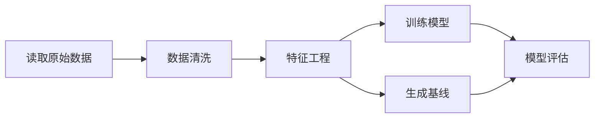
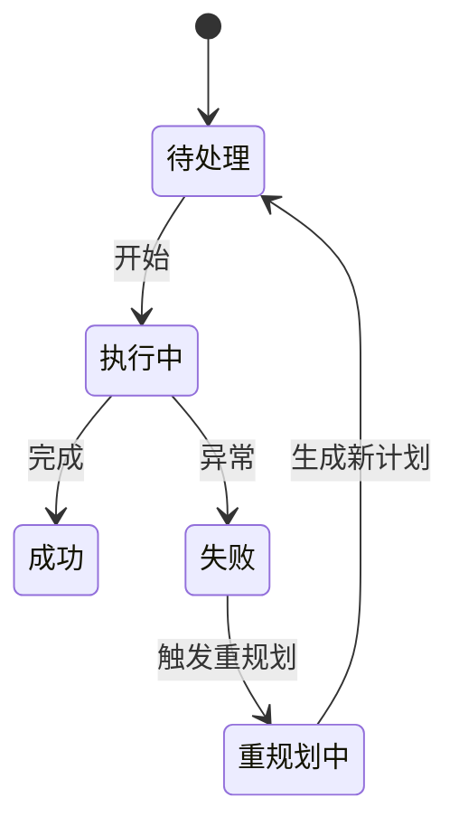
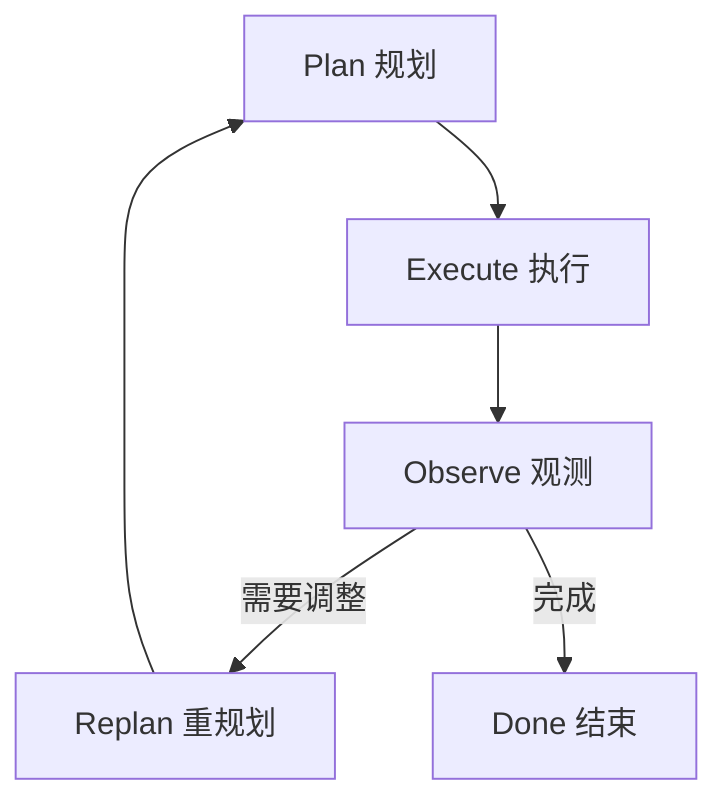

# 核心思想

> 一句话理解：**Planning 的核心是“分解目标、表示计划、执行步骤、观测结果、必要时重规划”的闭环。**

如果把 Agent 比作一个项目管理者，那么 Planning 层就是它的“项目管理办公室”：先理解目标，再拆解任务，排出依赖，分配给执行者，跟踪进度，遇到风险时及时调整。本章介绍 Planning 的五大核心思想：任务分解、计划表示、规划循环、静态与动态重规划、以及与相邻主题的边界。

## 任务分解范式

复杂任务很少能一步完成。Planner 需要把高层目标拆成更小、更可管理的单元。常见分解范式包括：

### 1. 分层分解（Hierarchical Decomposition）

把目标拆成若干阶段，每个阶段再拆成子任务，形成树状结构。

```
目标：发布新版本
├── 阶段 1：需求确认
│   ├── 1.1 收集需求
│   └── 1.2 评审需求
├── 阶段 2：开发
│   ├── 2.1 设计接口
│   └── 2.2 编写代码
└── 阶段 3：上线
    ├── 3.1 运行测试
    └── 3.2 部署
```

适合目标清晰、阶段边界明确的任务。

### 2. 基于依赖的分解（Dependency-Driven Decomposition）

不预先固定阶段，而是识别子任务之间的前置/后置关系，形成 DAG（有向无环图）。



适合数据管道、ML 训练、运维排障等强依赖场景。

### 3. 目标驱动分解（Goal-Driven Decomposition）

从最终目标反向推导需要达成的中间目标，类似 STRIPS/PDDL 中的逆向规划。

适合“达成某个状态”的任务，例如系统修复、配置变更。

### 4. 示例驱动分解（Few-Shot Decomposition）

给模型几个同类任务的拆解示例，让它模仿生成计划。适合计划模式相对固定的场景，如客服 SOP、标准故障处理。

## 计划表示

计划需要一种结构化的表示方式，让 Planner、Executor、Observer、人都能理解。常见形式包括：

### 列表（List）

最简单，按顺序排列的步骤。

```json
{
  "steps": [
    {"id": "s1", "action": "查询库存", "tool": "inventory_api"},
    {"id": "s2", "action": "计算推荐补货量", "tool": "recommendation_model"},
    {"id": "s3", "action": "生成采购单", "tool": "po_generator"}
  ]
}
```

优点：简单、易解析、易展示。
缺点：无法表达并行与依赖。

### DAG

用节点表示步骤，边表示依赖关系。

```json
{
  "nodes": ["s1", "s2", "s3", "s4"],
  "edges": [
    {"from": "s1", "to": "s2"},
    {"from": "s1", "to": "s3"},
    {"from": "s2", "to": "s4"},
    {"from": "s3", "to": "s4"}
  ]
}
```

优点：能表达并行与依赖，是生产中最常用的表示。
缺点：需要拓扑排序或调度器支持。

### 树（Tree）

每个节点可以展开为子树，适合分层任务。

```
            目标
          /   |   \
        子任务1  子任务2  子任务3
       /  \
     步骤1.1 步骤1.2
```

优点：表达层级清晰。
缺点：难以表达跨分支依赖。

### 状态图 / 有限状态机

把计划表示为状态与转移，适合有明确生命周期和分支的任务。



适合审批流、故障处理、机器人流程自动化（RPA）。

## Plan-Execute-Observe-Replan 循环

Planning 不是一次性的，而是一个持续循环：



### Plan

输入：用户目标、上下文、约束、可用工具。
输出：结构化计划（列表/DAG/树/状态图）。
关键：计划必须可验证，每个步骤应有明确的完成标准。

### Execute

输入：计划。
输出：每个步骤的执行结果与状态。
关键：Executor 只负责按调度执行，不重新解释目标。

### Observe

输入：执行结果、环境状态、日志。
输出：是否达预期、是否异常、是否满足约束。
关键：Observer 需要定义“好”与“坏”的标准，而不是只记录原始输出。

### Replan

输入：观测结论。
输出：继续、局部调整、全局重规划、或终止。
关键：重规划需要触发器策略，避免频繁重规划导致的风暴。

## 静态 vs 动态重规划

| 维度 | 静态规划 | 动态重规划 |
|---|---|---|
| 执行前是否完整生成计划 | 是 | 可先生成骨架，再逐步细化 |
| 执行中是否修改计划 | 否 | 是 |
| 适用场景 | 目标清晰、环境稳定 | 环境变化、工具不确定、目标可能演化 |
| 复杂度 | 低 | 高 |
| 成本 | 低 | 高（多次调用 Planner） |

实践中常采用“混合模式”：先静态生成主计划，保留关键 checkpoint；在每个 checkpoint 根据观测结果决定是否动态调整后续步骤。

## 与相邻主题的边界

### 与 Agent Runtime

Planning 决定“做什么”，Runtime 决定“怎么做调度”。Planning 生成计划后交给 Runtime，Runtime 负责任务分发、并发控制、超时、重试、生命周期管理。Planning 不应侵入 Runtime 的调度细节。

### 与 Memory

Planning 需要读取 Memory 中的历史计划、经验教训、用户偏好；也会把当前计划写入 Plan Store。但 Planning 不处理向量化、检索策略、记忆压缩等 Memory 内部机制。

### 与 Reflection

Reflection 负责从失败中总结根因，输出改进建议；Planning 根据这些建议生成新计划。Reflection 是“为什么失败”，Planning 是“下一步怎么做”。

### 与 Multi-Agent

Multi-Agent 解决任务由哪个 Agent 执行。Planning 可以先于 Multi-Agent 运行，生成子任务后再由路由或协调层分配给不同 Agent。Planning 也可以运行在每个 Agent 内部，用于拆解各自被分配的子目标。

### 与 MCP / Tool Use

Planning 把工具视为能力的抽象，计划项中引用 tool name 和参数模板。具体的 MCP 连接、认证、调用、结果解析由 Tool/MCP Gateway 处理。Planning 不直接实现协议细节。

## 本章小结

- 任务分解有分层、依赖驱动、目标驱动、示例驱动等多种范式，应根据任务特征选择。
- 计划表示常用列表、DAG、树、状态图，其中 DAG 能最好地平衡表达能力与执行效率。
- Plan-Execute-Observe-Replan 是 Planning 的核心循环；重规划分为静态与动态两种模式。
- Planning 与 Runtime、Memory、Reflection、Multi-Agent、MCP、Tool Use 的边界必须清晰，否则系统会高度耦合。

**参考来源**
- [ReAct: Synergizing Reasoning and Acting in Language Models](https://arxiv.org/abs/2210.03629)
- [Tree of Thoughts: Deliberate Problem Solving with Large Language Models](https://arxiv.org/abs/2305.10601)
- [Planning for Agents - LangChain Blog](https://blog.langchain.dev/planning-for-agents/)
- [LangGraph Plans](https://langchain-ai.github.io/langgraph/concepts/plans/)
