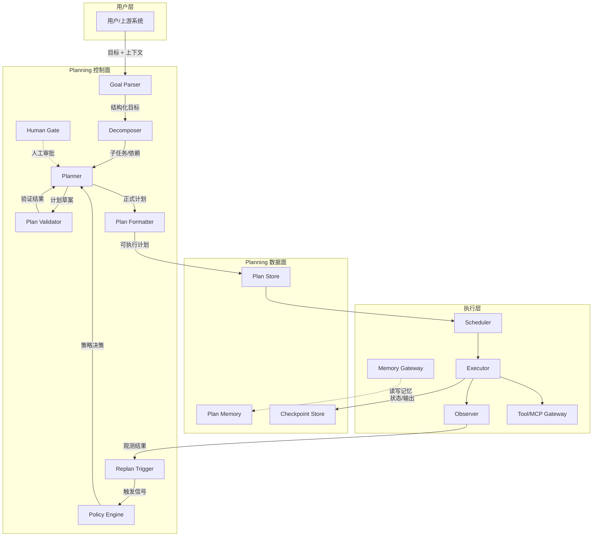
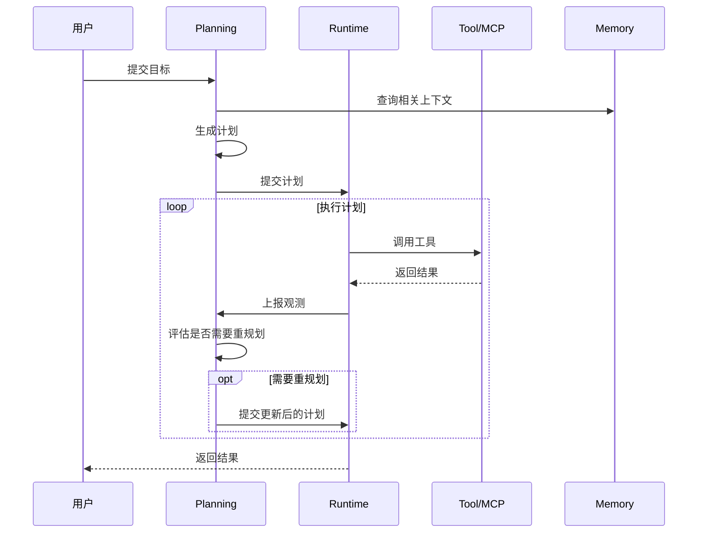

# 架构设计

> 一句话理解：**Planning 层由 Planner、Plan Store、Executor、Observer、Replan Trigger、Policy、Memory Gateway 等组成，是连接“用户目标”与“执行动作”的控制中枢。**

一个生产级的 Planning 层通常不是单个函数，而是一组职责清晰的模块。它们分工协作，把高层目标逐步转化为可执行、可观测、可回滚、可重规划的具体计划。

## 分层架构图



## 控制面与数据面

### 控制面（Control Plane）

控制面负责“思考”与“决策”，通常由大模型或规则引擎驱动：

- **Goal Parser**：把自然语言目标解析为结构化目标，包括约束、优先级、成功标准。
- **Decomposer**：把目标拆成子任务，识别依赖与并行关系。
- **Planner**：根据子任务生成具体计划，选择计划表示形式。
- **Plan Validator**：检查计划是否满足约束、是否可执行、是否有环或死锁。
- **Plan Formatter**：把内部计划转换为 Executor 可消费的格式。
- **Replan Trigger**：根据观测结果决定是否重规划。
- **Policy Engine**：执行重规划策略，例如最大重规划次数、回退策略、成本上限。
- **Human Gate**：在关键节点引入人工审批或人工输入。

### 数据面（Data Plane）

数据面负责“状态持久化”与“上下文流转”：

- **Plan Store**：存储当前计划、历史版本、执行状态。
- **Plan Memory**：存储长期计划相关的经验教训、用户偏好、常见模式。
- **Checkpoint Store**：保存执行过程中的 checkpoint，支持回滚。

控制面与数据面应解耦：控制面不直接读写持久化存储，而是通过定义良好的接口与数据面交互。

## 与 Agent Runtime 的调用边界

Planning 层与 Runtime 层之间的边界是系统设计中最重要的边界之一。

| 职责 | Planning 层 | Runtime 层 |
|---|---|---|
| 任务拆解 | 负责 | 不负责 |
| 计划表示 | 负责 | 消费计划 |
| 工具选择 | 在计划中指定 tool name | 负责 tool 的加载、调用、超时、重试 |
| 并发调度 | 表达可并行步骤 | 负责实际线程/进程/协程调度 |
| 生命周期 | 定义阶段与 checkpoint | 负责执行状态机、超时、取消 |
| 失败处理 | 定义重规划策略 | 负责捕获异常并上报 |
| 记忆读写 | 定义需要哪些记忆 | 负责 Memory 的存取与检索 |

典型调用流程：



## 计划版本与 Checkpoint

生产环境中，计划不是一成不变的。每一次重规划都会产生新版本，每个关键执行节点都应保存 checkpoint。

### 计划版本

```
plan_v1: 初始计划
plan_v1.1: 第 1 次重规划
plan_v1.2: 第 2 次重规划
plan_v2: 目标发生重大变化后的新计划
```

版本管理要求：

- 每次生成新计划都有唯一 ID 与父版本 ID。
- 保留变更原因（diff 说明）。
- 支持审计：谁/何时/为什么修改了计划。

### Checkpoint

Checkpoint 是执行过程中的快照，包含：

- 当前计划版本
- 已完成步骤及其输出
- 当前执行中的步骤
- 环境状态摘要
- 时间戳与触发原因

Checkpoint 的作用：

- **回滚**：失败后回到上一个稳定状态。
- **恢复**：长程任务可以中断后继续。
- **审计**：复盘时可以重现当时状态。
- **对比**：比较不同策略下的执行路径。

## 核心组件接口示例

以下是一个最小化的接口设计，用于说明组件之间的协作关系：

```python
class Planner:
    def plan(self, goal: Goal, context: Context) -> Plan: ...
    def replan(self, plan: Plan, observation: Observation) -> Plan: ...

class PlanStore:
    def save(self, plan: Plan) -> PlanId: ...
    def load(self, plan_id: PlanId) -> Plan: ...
    def list_versions(self, root_id: PlanId) -> list[Plan]: ...

class Scheduler:
    def schedule(self, plan: Plan) -> Iterator[Step]: ...

class Executor:
    def execute(self, step: Step) -> StepResult: ...

class Observer:
    def observe(self, step: Step, result: StepResult) -> Observation: ...

class ReplanTrigger:
    def should_replan(self, plan: Plan, observation: Observation) -> bool: ...
```

这些接口应根据实际系统选择同步或异步实现，但职责边界应保持清晰。

## 本章小结

- Planning 层分为控制面（决策）和数据面（状态），各司其职、解耦协作。
- Planner、Plan Store、Executor、Observer、Replan Trigger、Policy、Memory Gateway 是核心组件。
- 与 Agent Runtime 的边界必须清晰：Planning 决定“做什么”，Runtime 负责“怎么调度执行”。
- 计划版本与 checkpoint 是生产级系统必备能力，支持回滚、恢复、审计与对比。

**参考来源**
- [Planning for Agents - LangChain Blog](https://blog.langchain.dev/planning-for-agents/)
- [LangGraph Plans](https://langchain-ai.github.io/langgraph/concepts/plans/)
- [OpenAI Agents SDK Handoffs](https://openai.github.io/openai-agents-python/handoffs/)
- [AutoGen Planning Tutorial](https://microsoft.github.io/autogen/stable/user-guide/agentchat-user-guide/tutorial/planning.html)
