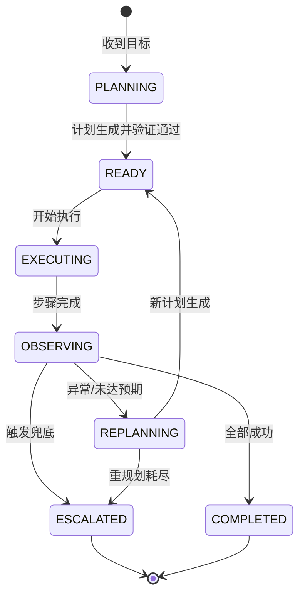
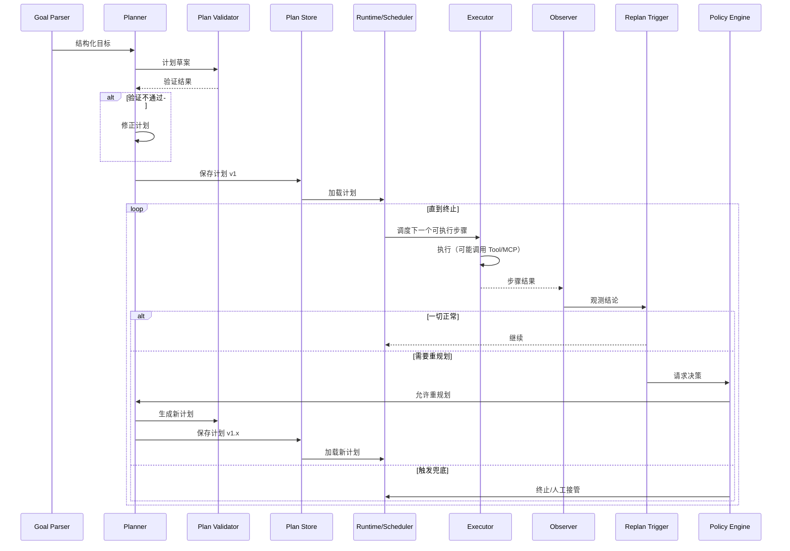

# 规划循环

> 一句话理解：**规划循环按照 Plan → Execute → Observe → Replan 反复运转，直到完成、失败或触发兜底。**

规划循环是 Planning 层的“心跳”。它把目标、计划、执行、反馈串联起来，使 Agent 能够在复杂、动态的环境中持续前进。

## 状态图

## 时序图

## Plan 详解

### 输入

- 结构化目标（Goal）：用户想达成什么、约束条件、成功标准。
- 上下文（Context）：来自 Memory 的历史信息、用户偏好、环境状态。
- 可用能力（Capabilities）：工具/MCP 描述、Agent 能力清单。
- 策略（Policy）：成本预算、最大步骤数、是否允许人工介入。

### 输出

- 结构化计划（Plan）：包含步骤、依赖、执行顺序、预期输出、完成标准。

### 关键注意点

- **计划必须可验证**：每个步骤应有明确的完成标准，Observer 能据此判断成败。
- **避免过度规划**：不要一次性规划出过细的步骤，保留根据反馈调整的空间。
- **约束前置**：把硬约束（如不能访问某些数据、必须在某些时间窗口内完成）体现在计划生成阶段。

## Execute 详解

### 输入

- 当前计划
- 调度器决定的下一个/下一批可执行步骤

### 输出

- 每个步骤的执行结果（成功/失败/超时/部分成功）
- 实际产生的副作用（如写入数据库、调用 API）

### 关键注意点

- **Executor 不重新解释目标**：它只按计划执行，避免目标漂移。
- **原子性**：每个步骤应尽量原子化，失败时影响范围可控。
- **幂等性**：在可能失败并重试的场景下，步骤应设计为幂等。

## Observe 详解

### 输入

- 步骤执行结果
- 原始工具输出
- 环境状态变化

### 输出

- 观测结论：是否成功、是否偏离预期、是否需要关注
- 结构化指标：如准确率、延迟、成本、覆盖率

### 关键注意点

- **Observer 需要标准**：不能只看“是否抛异常”，还要看“结果是否满足业务目标”。
- **区分可恢复与不可恢复失败**：网络超时可能是可恢复的，数据越权是不可恢复的。
- **记录上下文**：观测结论应包含足够上下文，供后续 Reflection 和审计使用。

## Replan 详解

### 触发条件

| 触发条件 | 说明 | 示例 |
|---|---|---|
| 步骤失败 | 工具调用返回错误或异常 | API 500、MCP 连接断开 |
| 结果不达标 | 步骤成功但输出不满足成功标准 | 模型生成代码未通过测试 |
| 环境变化 | 外部状态影响后续计划 | 目标服务已下线、数据已更新 |
| 新信息出现 | 执行中获得原计划未考虑的信息 | 发现新的相关数据源 |
| 用户修正 | 用户中途改变目标或约束 | “再加一个条件” |

### 重规划策略

- **局部修复**：只修改失败步骤及其直接依赖。
- **子计划替换**：重新生成某个子树。
- **全局重规划**：从头生成完整计划。
- **跳过/降级**：跳过非关键步骤，或用备选方案替代。

## 终止条件

规划循环需要明确的终止条件，否则可能无限循环。

| 终止条件 | 说明 |
|---|---|
| 成功完成 | 所有步骤完成且满足成功标准 |
| 失败兜底 | 重规划次数耗尽、不可恢复错误、违反安全策略 |
| 人工终止 | 用户或运维人员主动中断 |
| 成本/时间上限 | 达到预算或超时阈值 |
| 无进展 | 连续多次重规划仍未产生有效进展 |

## 回滚与补偿

当计划执行到一半失败时，系统需要决定是否回滚已完成的步骤。

### 回滚（Rollback）

回到上一个 checkpoint 的状态。适用于：

- 失败步骤有副作用（如写入数据、修改配置）。
- 重规划后的新计划与之前状态不兼容。

### 补偿（Compensation）

为已完成的步骤执行反向操作。例如：

- 创建了资源 → 删除资源
- 发送了通知 → 发送撤回或更正通知
- 修改了配置 → 恢复配置

补偿比回滚更灵活，但也更复杂，需要在设计计划时就考虑。

## 人机协同（HITL）

在以下节点引入人工 gate，可以显著提升系统安全性：

- **计划生成后**：让用户确认或修改计划。
- **高风险步骤前**：如删除数据、修改生产配置、发起转账。
- **重规划后**：当系统决定大幅调整计划时，请求人工确认。
- **失败兜底前**：在自动终止前，给人工一次介入机会。

HITL 不应成为阻塞点，应提供同步等待、异步通知、预授权等多种模式。

## 失败模式

| 失败模式 | 表现 | 应对 |
|---|---|---|
| 重规划风暴 | 频繁触发重规划，成本飙升、无进展 | 设置冷却时间、最大次数、进展检测 |
| 计划粒度过细 | 计划步骤过多，执行开销大、灵活性差 | 采用骨架+细化的混合粒度 |
| 计划粒度过粗 | 步骤模糊，Observer 无法判断成败 | 每个步骤定义明确的输入输出与成功标准 |
| 目标漂移 | 执行过程中逐渐偏离原始目标 | Goal Parser 固化目标，关键节点做一致性检查 |
| 不可恢复错误被重试 | 安全/权限错误反复触发重规划 | 在 Observer 中分类错误，标记不可恢复 |
| 状态不一致 | 回滚或重规划后环境状态与计划假设不符 | 每次重规划前读取最新环境状态 |

## 本章小结

- 规划循环是 Plan → Execute → Observe → Replan 的反复过程。
- 每个阶段都有明确的输入、输出和注意点；终止条件必须提前定义。
- 回滚、补偿、HITL 是生产系统应对失败的必备机制。
- 重规划风暴、计划粒度失衡、目标漂移等失败模式需要在设计时就加以防范。

**参考来源**
- [ReAct: Synergizing Reasoning and Acting in Language Models](https://arxiv.org/abs/2210.03629)
- [Planning for Agents - LangChain Blog](https://blog.langchain.dev/planning-for-agents/)
- [LangGraph Plans](https://langchain-ai.github.io/langgraph/concepts/plans/)
- [OpenAI Agents SDK Handoffs](https://openai.github.io/openai-agents-python/handoffs/)
- [AutoGen Planning Tutorial](https://microsoft.github.io/autogen/stable/user-guide/agentchat-user-guide/tutorial/planning.html)
