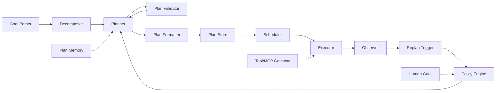

# 核心模块

> 一句话理解：**Planning 层的核心模块把“理解目标、拆解任务、生成计划、验证计划、调度执行、观测反馈、触发重规划、执行策略、记忆历史、人机协同、调用工具”这十一条流水线拆开，每条都有明确职责。**

本章拆解 Planning 层的 11 个核心模块，说明它们的职责、输入输出、关键接口与生产注意点。

## 1. Goal Parser

**职责**：把自然语言或半结构化的用户输入，转换为 Planner 可直接使用的结构化目标。

**输入**：

- 用户原始请求
- 上下文（历史会话、用户画像、当前环境）

**输出**：

- `Goal` 对象：包含目标描述、约束、成功标准、优先级、截止时间等

**关键接口**：

```python
class GoalParser:
    def parse(self, raw_input: str, context: Context) -> Goal: ...
```

**生产注意点**：

- 目标必须是可验证的，避免“做得更好”这类模糊描述。
- 对缺失信息应主动澄清，而不是猜测。
- 记录解析依据，便于后续审计。

## 2. Decomposer

**职责**：把结构化目标拆分为一组子任务，并识别它们之间的依赖与并行关系。

**输入**：

- 结构化目标
- 可用能力清单
- 历史分解模式（来自 Plan Memory）

**输出**：

- 子任务列表与依赖图（通常是 DAG）

**关键接口**：

```python
class Decomposer:
    def decompose(self, goal: Goal, capabilities: list[Capability]) -> TaskGraph: ...
```

**生产注意点**：

- 分解粒度要适中，过细会增加开销，过粗会降低可观测性。
- 依赖关系必须准确，否则会导致调度错误。
- 支持 few-shot 分解模板，提升稳定性。

## 3. Planner

**职责**：根据子任务图生成具体可执行计划，选择计划表示形式。

**输入**：

- 子任务图
- 约束与策略
- 记忆与上下文

**输出**：

- 结构化计划（列表/DAG/树/状态图）

**关键接口**：

```python
class Planner:
    def plan(self, goal: Goal, task_graph: TaskGraph, context: Context) -> Plan: ...
    def replan(self, plan: Plan, observation: Observation) -> Plan: ...
```

**生产注意点**：

- Planner 是核心决策模块，通常由大模型驱动，但关键路径可辅以规则校验。
- 重规划接口应支持局部修复与全局重规划两种模式。
- 模型选择：复杂规划用强模型，简单调度可用轻量模型。

## 4. Plan Formatter

**职责**：把 Planner 生成的内部计划，转换为 Executor 和 Runtime 可消费的格式。

**输入**：

- 内部计划表示
- 目标执行引擎的 schema

**输出**：

- 格式化后的计划（如 JSON、YAML、特定 DSL）

**关键接口**：

```python
class PlanFormatter:
    def format(self, plan: Plan, target_schema: Schema) -> FormattedPlan: ...
```

**生产注意点**：

- 格式转换应可逆，便于审计与调试。
- 参数模板中可能包含变量，Formatter 负责解析占位符。
- 对不兼容的计划项应提前报错，而不是在执行时暴露。

## 5. Plan Validator

**职责**：在计划进入执行阶段前，检查其合法性、可执行性与安全性。

**输入**：

- 计划
- 约束规则
- 工具签名

**输出**：

- 验证报告：通过/不通过，以及具体问题列表

**关键接口**：

```python
class PlanValidator:
    def validate(self, plan: Plan, constraints: list[Constraint]) -> ValidationResult: ...
```

**生产注意点**：

- 检查循环依赖、不可达节点、工具参数类型不匹配。
- 安全校验：是否调用高危工具、是否访问敏感数据。
- 验证应尽可能在规划阶段完成，减少执行时失败。

## 6. Scheduler

**职责**：根据计划依赖关系，决定下一步执行哪些步骤。

**输入**：

- 计划
- 各步骤当前状态

**输出**：

- 可执行步骤集合

**关键接口**：

```python
class Scheduler:
    def next_steps(self, plan: Plan) -> list[Step]: ...
```

**生产注意点**：

- Scheduler 通常属于 Runtime 层，但 Planning 需要定义调度语义（如 DAG 的拓扑顺序）。
- 支持并行调度时，要考虑资源上限与并发安全。
- 动态重规划后，Scheduler 应能平滑切换到新计划。

## 7. Executor

**职责**：按计划执行每个步骤，调用工具/MCP/模型/人。

**输入**：

- 步骤定义
- 前置步骤的输出

**输出**：

- 步骤执行结果

**关键接口**：

```python
class Executor:
    def execute(self, step: Step, inputs: dict) -> StepResult: ...
```

**生产注意点**：

- Executor 只负责执行，不重新解释目标。
- 步骤应支持超时、重试、幂等。
- 对副作用大的操作，应记录审计日志。

## 8. Observer

**职责**：评估步骤执行结果是否满足预期，输出观测结论。

**输入**：

- 步骤定义
- 执行结果
- 成功标准

**输出**：

- 观测结论（成功/失败/需关注）
- 结构化指标

**关键接口**：

```python
class Observer:
    def observe(self, step: Step, result: StepResult) -> Observation: ...
```

**生产注意点**：

- 不能只看异常，要看业务目标是否达成。
- 对模型生成类步骤，可引入 LLM-as-judge 或规则校验。
- 输出应包含失败分类，帮助 Policy Engine 决策。

## 9. Replan Trigger

**职责**：根据观测结论，决定是否触发重规划。

**输入**：

- 当前计划
- 观测结论
- 历史触发记录

**输出**：

- 是否触发重规划
- 触发原因

**关键接口**：

```python
class ReplanTrigger:
    def should_replan(self, plan: Plan, observation: Observation) -> ReplanDecision: ...
```

**生产注意点**：

- 要有冷却机制，避免同一失败反复触发。
- 区分局部失败和全局失败，决定局部修复还是全局重规划。
- 可配置化：不同场景允许不同的触发灵敏度。

## 10. Policy Engine

**职责**：执行重规划策略，控制循环终止、回滚、HITL 等行为。

**输入**：

- Replan Trigger 的信号
- 当前计划状态
- 预算/成本/安全策略

**输出**：

- 决策：允许重规划 / 回滚 / HITL / 终止

**关键接口**：

```python
class PolicyEngine:
    def decide(self, trigger: ReplanDecision, state: PlanState, policy: Policy) -> PolicyDecision: ...
```

**生产注意点**：

- 设置最大重规划次数、最大执行步数、成本上限。
- 对高危操作强制 HITL。
- 策略应可配置、可审计。

## 11. Plan Memory

**职责**：存储与检索计划相关的长期记忆，包括历史计划、分解模板、失败教训、用户偏好。

**输入**：

- 当前计划与执行结果
- 查询请求

**输出**：

- 相关历史记忆

**关键接口**：

```python
class PlanMemory:
    def remember(self, plan: Plan, outcome: Outcome) -> None: ...
    def recall(self, query: str, k: int) -> list[MemoryItem]: ...
```

**生产注意点**：

- Plan Memory 是 Memory 层的消费者，Planning 只定义需要什么样的记忆。
- 记忆更新要有版本控制，避免覆盖重要历史。
- 定期总结与压缩，防止记忆膨胀。

## 12. Human Gate

**职责**：在关键节点引入人工审批或输入。

**输入**：

- 待审批的计划/步骤
- 审批上下文

**输出**：

- 审批结果（通过/拒绝/修改）

**关键接口**：

```python
class HumanGate:
    def request_review(self, item: Plan | Step, context: Context) -> HumanDecision: ...
```

**生产注意点**：

- 不要所有步骤都人工审批，只针对高风险、高不确定性节点。
- 支持同步、异步、预授权多种模式。
- 记录人工决策，满足合规要求。

## 13. Tool/MCP Gateway

**职责**：为 Planning 提供标准化的外部能力调用接口。

**输入**：

- 工具名称与参数

**输出**：

- 工具执行结果

**关键接口**：

```python
class ToolGateway:
    def invoke(self, tool_name: str, params: dict) -> ToolResult: ...
    def list_tools(self) -> list[ToolSpec]: ...
```

**生产注意点**：

- Planning 只依赖 tool name 和 schema，不直接处理 MCP 协议细节。
- 工具描述要清晰，否则 Planner 难以正确选择。
- 对工具调用结果要进行统一封装，便于 Observer 评估。

## 模块协作概览



## 本章小结

- Planning 层由 11 个核心模块组成，每个模块职责单一、接口明确。
- Goal Parser、Decomposer、Planner、Plan Formatter、Plan Validator 属于控制面的“规划侧”。
- Scheduler、Executor、Observer、Replan Trigger、Policy Engine 属于控制面的“执行/反馈侧”。
- Plan Store、Plan Memory、Human Gate、Tool/MCP Gateway 提供数据、记忆、人工、工具四类支撑。
- 模块之间的边界清晰，是系统可维护、可扩展、可审计的基础。

**参考来源**
- [Planning for Agents - LangChain Blog](https://blog.langchain.dev/planning-for-agents/)
- [LangGraph Plans](https://langchain-ai.github.io/langgraph/concepts/plans/)
- [OpenAI Agents SDK Handoffs](https://openai.github.io/openai-agents-python/handoffs/)
- [AutoGen Planning Tutorial](https://microsoft.github.io/autogen/stable/user-guide/agentchat-user-guide/tutorial/planning.html)
