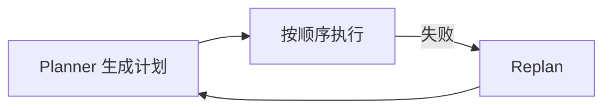
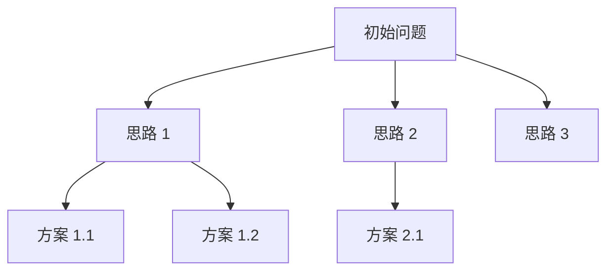
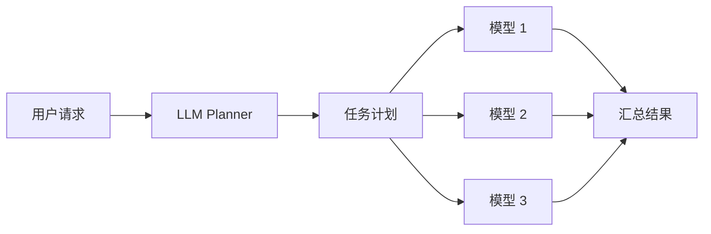
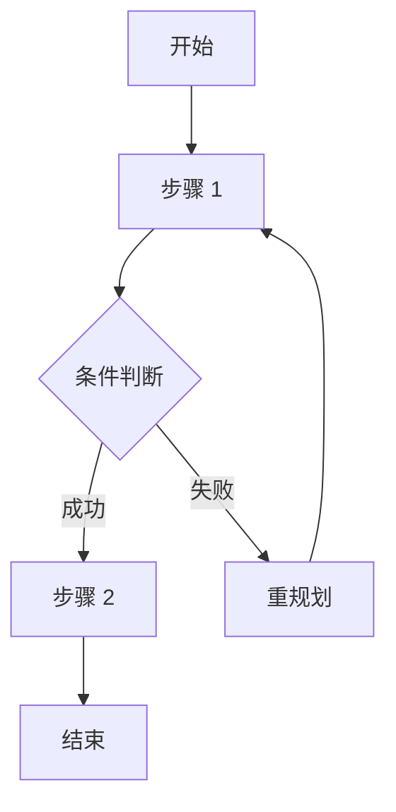
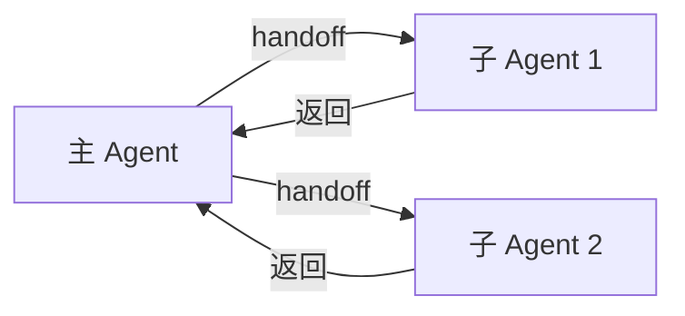
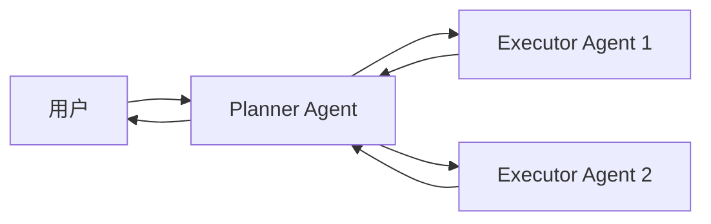

# 源码分析

> 一句话理解：**对比 ReAct、Plan-and-Execute、Tree of Thoughts、LLM+P、HuggingGPT、LangGraph planner、OpenAI Agents SDK handoffs、AutoGen planner，可以看出 Planning 的演进方向：从隐式推理到显式计划，从单路径到多路径，从单 Agent 到多 Agent 协作。**

本章从源码与设计的角度，对比主流 Planning 方案。重点不是罗列 API，而是理解它们的设计取舍：计划如何表示、如何执行、如何反馈、如何扩展。

## 1. ReAct

**论文**：ReAct: Synergizing Reasoning and Acting in Language Models（2022）

**核心思想**：把 Thought、Action、Observation 交错生成，形成隐式规划链。

```text
Thought: 我需要先查询天气。
Action: search_weather[city=北京]
Observation: 北京今天晴，25°C。
Thought: 天气晴朗，适合出行，接下来查询航班。
```

**计划表示**：无显式计划，计划隐含在 Thought 序列中。

**执行方式**：单步交错执行，每步由模型决定下一步 Action。

**优点**：

- 简单直观，无需额外计划数据结构。
- 与工具调用天然结合。

**缺点**：

- 无全局计划，容易目标遗忘、重复探索。
- 难以审计与回滚。

**适用场景**：短程、工具链简单、允许一定探索成本的任务。

## 2. Plan-and-Execute

**来源**：LangChain / LangGraph 中的 planning agent

**核心思想**：先让 Planner 生成完整计划，再按顺序执行，执行中可重规划。



**计划表示**：通常是步骤列表或 DAG。

**执行方式**：先静态规划，再执行；执行失败时进入重规划。

**优点**：

- 有全局视图，适合多步任务。
- 人与系统都能理解计划。

**缺点**：

- 初始计划可能不准确，导致后续大量重规划。
- 对动态环境适应性一般。

**适用场景**：目标相对明确、步骤可预见的任务，如代码生成、数据分析 SOP。

## 3. Tree of Thoughts（ToT）

**论文**：Tree of Thoughts: Deliberate Problem Solving with Large Language Models（2023）

**核心思想**：把推理过程组织成树，每个节点是一个“思维步骤”，通过搜索算法（BFS/DFS）探索多条路径。



**计划表示**：树状结构，节点为中间推理状态。

**执行方式**：通过评估函数选择有潜力的节点继续展开，最终选择最优路径。

**优点**：

- 支持多路径探索，适合需要创造性或搜索的问题。
- 可回溯，避免单路径错误累积。

**缺点**：

- 计算成本高，需要大量模型调用。
- 评估函数设计困难。

**适用场景**：数学推理、游戏、创意写作、复杂决策。

## 4. LLM+P

**论文**：LLM+P: Empowering Large Language Models with Optimal Planning Proficiency（2023）

**核心思想**：把自然语言问题转换为 PDDL（Planning Domain Definition Language），调用经典规划器（如 FastDownward）求解最优计划，再把计划翻译回自然语言。


**计划表示**：PDDL 计划，包含动作序列与状态转移。

**执行方式**：先形式化、再求解、再翻译执行。

**优点**：

- 可得到理论最优或完备的计划。
- 适合状态空间明确、动作可枚举的问题。

**缺点**：

- PDDL 编码成本高，难以处理开放域问题。
- 对不确定性、动态环境支持弱。

**适用场景**：机器人规划、物流调度、资源配置等状态/动作可形式化的领域。

## 5. HuggingGPT

**论文**：HuggingGPT: Solving AI Tasks with ChatGPT and its Friends in HuggingFace（2023）

**核心思想**：由 LLM 担任“任务规划器”，把复杂 AI 任务拆解为多个模型能力调用，并调度 Hugging Face 上的专家模型执行。



**计划表示**：任务依赖图，节点为模型调用。

**执行方式**：LLM 生成计划后，按依赖调度模型执行，最后汇总结果。

**优点**：

- 充分利用现有专家模型，解决多模态/多能力任务。
- 计划可解释，便于人工检查。

**缺点**：

- 依赖模型描述质量，工具选择容易出错。
- 对失败恢复与动态调整支持有限。

**适用场景**：多模态 AI 任务、需要组合多种模型能力的场景。

## 6. LangGraph planner

**来源**：LangGraph Plans

**核心思想**：把计划表示为图，节点可以是步骤、子图、甚至子 Agent；通过图的边表达控制流与数据流。



**计划表示**：图（节点 + 边），支持循环、条件、并行。

**执行方式**：LangGraph 的运行时按图结构执行，支持 checkpoint 与重放。

**优点**：

- 表达能力强，能描述复杂控制流。
- 与 LangChain 生态集成好。

**缺点**：

- 学习曲线较陡，调试复杂图较困难。
- 图的复杂度过高时，可维护性下降。

**适用场景**：需要复杂状态机、条件分支、循环、并行的 Agent 工作流。

## 7. OpenAI Agents SDK handoffs

**来源**：OpenAI Agents SDK

**核心思想**：通过 handoff 把任务从一个 Agent 转交给另一个 Agent，每个 Agent 可自带规划与执行能力。



**计划表示**：handoff 链，每个 Agent 内部可有自己的计划。

**执行方式**：顶层 Agent 决定把任务交给哪个子 Agent，子 Agent 执行后返回结果。

**优点**：

- 天然支持 Multi-Agent 协作。
- 每个 Agent 可独立演化，职责清晰。

**缺点**：

- handoff 决策本身需要训练或提示工程，容易出错。
- 全局计划可能被拆散到各 Agent 内部，难以统一审计。

**适用场景**：多领域协作、需要不同专家 Agent 分工的任务。

## 8. AutoGen planner

**来源**：AutoGen Planning Tutorial

**核心思想**：多个 Conversable Agent 通过对话协作完成任务，Planner 可以是其中一个 Agent 的角色。



**计划表示**：对话中隐式或显式地表达计划。

**执行方式**：通过 Agent 间对话推进任务，Planner Agent 负责协调。

**优点**：

- 高度灵活，适合探索性、对话式任务。
- 人机协同自然。

**缺点**：

- 对话状态复杂，难以保证一致性。
- 计划与执行边界模糊，调试困难。

**适用场景**：研究原型、需要频繁人机协作、任务边界不固定的场景。

## 设计取舍对比表

| 方案 | 计划表示 | 执行方式 | 动态性 | 可解释性 | 扩展性 | 计算成本 |
|---|---|---|---|---|---|---|
| ReAct | 隐式 Thought 链 | 单步交错 | 高 | 低 | 低 | 中 |
| Plan-and-Execute | 列表/DAG | 先规划后执行 | 中 | 高 | 中 | 中 |
| Tree of Thoughts | 树 | 搜索 + 评估 | 高 | 中 | 中 | 高 |
| LLM+P | PDDL 计划 | 经典规划器求解 | 低 | 高 | 低 | 中 |
| HuggingGPT | 任务依赖图 | 模型调度 | 中 | 高 | 高 | 高 |
| LangGraph planner | 图 | 图运行时 | 高 | 中 | 高 | 中 |
| OpenAI Agents SDK handoffs | handoff 链 | Agent 转交 | 高 | 中 | 高 | 中 |
| AutoGen planner | 对话/隐式 | 多 Agent 对话 | 高 | 低 | 高 | 高 |

## 选型建议

| 场景 | 推荐方案 |
|---|---|
| 短程工具调用、快速原型 | ReAct |
| 目标明确的多步 SOP | Plan-and-Execute |
| 需要探索多路径的推理/决策 | Tree of Thoughts |
| 状态/动作可形式化的领域 | LLM+P |
| 多模态/多模型能力组合 | HuggingGPT |
| 复杂控制流、状态机、并行 | LangGraph planner |
| 多 Agent 分工协作 | OpenAI Agents SDK handoffs / AutoGen |

## 本章小结

- ReAct 隐式规划，适合短程任务；Plan-and-Execute 显式计划，适合目标明确的 SOP。
- ToT 多路径探索，LLM+P 形式化最优规划，HuggingGPT 多模型组合。
- LangGraph、OpenAI Agents SDK、AutoGen 代表了 Planning 与 Multi-Agent、图运行时、对话系统融合的方向。
- 选型应根据计划表示、执行方式、动态性、可解释性、扩展性、计算成本综合判断。

**参考来源**
- [ReAct: Synergizing Reasoning and Acting in Language Models](https://arxiv.org/abs/2210.03629)
- [Planning for Agents - LangChain Blog](https://blog.langchain.dev/planning-for-agents/)
- [Tree of Thoughts: Deliberate Problem Solving with Large Language Models](https://arxiv.org/abs/2305.10601)
- [LLM+P: Empowering Large Language Models with Optimal Planning Proficiency](https://arxiv.org/abs/2304.11477)
- [HuggingGPT: Solving AI Tasks with ChatGPT and its Friends in HuggingFace](https://arxiv.org/abs/2303.17580)
- [LangGraph Plans](https://langchain-ai.github.io/langgraph/concepts/plans/)
- [OpenAI Agents SDK Handoffs](https://openai.github.io/openai-agents-python/handoffs/)
- [AutoGen Planning Tutorial](https://microsoft.github.io/autogen/stable/user-guide/agentchat-user-guide/tutorial/planning.html)
