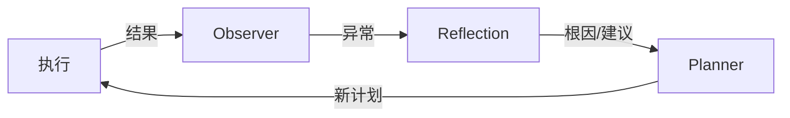
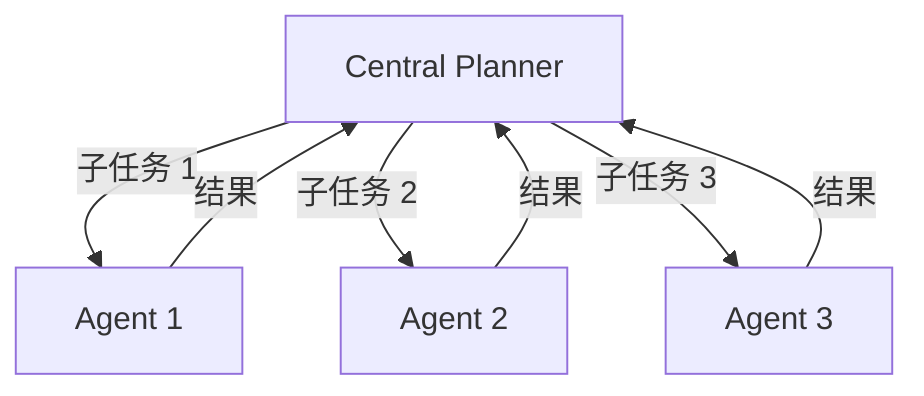

# 企业生产实践

> 一句话理解：**在生产中启用 Planning 层，不是为了“让 Agent 更聪明”，而是为了让长程复杂任务可预测、可控制、可审计、可回滚。**

本章讨论 Planning 在企业落地时的关键问题：何时启用独立 Planning 层、如何与相邻模块集成、如何防止重规划风暴、如何实现人机协同与审计。

## 何时启用独立 Planning 层

不是所有 Agent 都需要独立 Planning 层。以下场景建议启用：

| 场景特征 | 说明 |
|---|---|
| 任务步骤通常超过 5 步 | 需要显式计划避免目标漂移 |
| 存在复杂依赖或并行 | 需要 DAG/图调度 |
| 工具/Agent 数量多 | 需要 Planner 统一选择与编排 |
| 失败恢复成本高 | 需要 checkpoint、回滚、重规划 |
| 需要人工审批或审计 | 计划必须作为可解释 artifact |
| 目标模糊或可能变化 | 需要动态重规划 |

反之，如果只是简单的“调用一次搜索 API 然后总结”，ReAct 或单次 prompt 就足够了。

## 与 Runtime 集成

Planning 层与 Runtime 层的集成方式决定了系统的灵活性与稳定性。

### 集成模式

| 模式 | 说明 | 适用 |
|---|---|---|
| Planning 生成完整计划，Runtime 只执行 | 简单清晰，Planning 与 Runtime 完全解耦 | 目标明确、计划稳定的任务 |
| Planning 生成骨架计划，Runtime 执行中动态细化 | 平衡灵活性与可控性 | 中等复杂度任务 |
| Planning 与 Runtime 交替运行 | 每执行一步或一个阶段后，Planning 重新评估 | 高动态、长程任务 |

### 接口约定

- Planning 输出标准化计划格式（如 JSON Schema）。
- Runtime 消费计划，按依赖调度执行。
- Runtime 把执行结果与状态回传给 Planning，但不修改计划语义。


## 与 Memory 集成

Planning 需要 Memory 提供上下文，也需要把计划写入 Memory。

### 读取 Memory

- 用户偏好：例如常用工具、输出格式、风险容忍度。
- 历史计划：相似任务的成功计划可作为 few-shot 示例。
- 失败教训：Reflection 总结的失败模式可帮助 Planner 避免重复犯错。

### 写入 Memory

- 当前计划版本与执行历史。
- 每个 checkpoint 的状态。
- 重规划的原因与结果。

### 注意点

- 不要一次性把所有记忆塞进 prompt，要进行检索与压缩。
- Plan Memory 与通用 Memory 应分开管理，便于审计。

## 与 Reflection 集成

Reflection 是 Planning 的重要输入源。



### 集成方式

- Reflection 输出结构化的失败分析：`root_cause`、`suggested_fix`、`confidence`、`related_past_cases`。
- Planner 根据建议进行局部修复或全局重规划。
- 对高 confidence 的建议可直接应用，低 confidence 的建议转人工审核。

## 与 Multi-Agent 集成

在多 Agent 系统中，Planning 可以作为中央 Planner，也可以分布到每个 Agent 内部。

### 中央 Planner 模式



优点：全局最优、易于审计。
缺点：单点瓶颈、中央 Planner 可能不了解各 Agent 的私有能力。

### 分布式 Planner 模式

每个 Agent 自带 Planner，只负责自己的子目标。上层协调者只负责 handoff 或结果汇总。

优点：各 Agent 可独立演化，扩展性好。
缺点：全局计划碎片化，难以统一回滚。

### 选型建议

- 跨 Agent 依赖强、需要全局优化的任务：中央 Planner。
- Agent 能力差异大、需要高度自治的任务：分布式 Planner。

## 与 MCP / Tool Use 集成

Planning 通过 Tool/MCP Gateway 使用外部能力。

### 工具描述

Planner 需要清晰的工具描述，包括：

- 工具名称与用途
- 输入参数 schema
- 返回值 schema
- 副作用与风险等级
- 典型使用示例

### 工具选择

- 简单场景：Planner 直接生成 tool name。
- 复杂场景：引入工具检索模块，根据目标从工具库中召回候选工具，再交给 Planner 选择。

### 注意点

- 工具描述质量直接影响 Planner 准确率。
- 高危工具应在计划验证阶段被标记，并触发 HITL。

## 计划验证

生产环境中，计划进入执行前必须经过验证。

### 验证维度

| 维度 | 检查内容 |
|---|---|
| 语法 | 步骤 ID 唯一、依赖存在、无环 |
| 语义 | 工具存在、参数类型匹配、必填参数完整 |
| 安全 | 是否调用高危工具、是否越权访问 |
| 资源 | 步骤数、并行度、预估成本是否在预算内 |
| 业务 | 是否满足用户约束、是否覆盖成功标准 |

### 验证失败处理

- 自动修正：对简单问题（如参数缺失）由 Planner 自动重试。
- 人工审核：对安全或业务问题转 HITL。
- 终止：对无法修正的计划直接拒绝。

## 重规划风暴防护

重规划风暴是生产中最常见的问题之一。

### 防护措施

| 措施 | 说明 |
|---|---|
| 冷却时间 | 同一失败原因在 N 分钟内不重复触发 |
| 最大次数 | 设置全局与单步骤的重规划上限 |
| 进展检测 | 如果新计划与旧计划无实质差异，则终止 |
| 失败分类 | 不可恢复错误直接终止，不再重试 |
| 成本上限 | 达到预算后强制终止 |
| 兜底策略 | 重规划耗尽后转人工或返回部分结果 |

### 示例策略

```python
policy = {
    "max_replans": 3,
    "replan_cooldown_seconds": 60,
    "max_plan_versions": 5,
    "cost_limit_usd": 2.0,
    "unrecoverable_errors": ["PermissionDenied", "InvalidConfiguration"],
}
```

## 人机协同

HITL 在生产中不是“能力不足”的标志，而是安全与信任机制。

### HITL 节点

- 计划生成后确认
- 高危操作前审批
- 重规划大幅变更前确认
- 失败兜底前介入

### HITL 模式

| 模式 | 说明 | 适用 |
|---|---|---|
| 同步阻塞 | 等待人工响应后再继续 | 关键审批 |
| 异步通知 | 发送通知，人工可在窗口期内介入 | 非关键但需知情 |
| 预授权 | 用户提前授权某类操作 | 重复性任务 |
| 事后审计 | 操作完成后供人复查 | 低风险高频操作 |

## 审计

Planning 层必须提供完整审计能力。

### 审计内容

- 每个计划版本的内容与生成原因
- 每步执行状态、输入、输出、耗时、成本
- 每次重规划的触发原因、旧计划、新计划
- 人工审批记录
- 失败与兜底处理记录

### 审计用途

- 问题排查与复盘
- 模型效果评估
- 合规与安全审查
- 持续优化 Planning 策略

## 成本与 SLO

### 成本模型

Planning 的成本主要来自：

- Planner 调用大模型的 token 消耗
- 重规划次数
- 工具/MCP 调用费用
- 人工审批成本

### SLO 建议

| 指标 | 说明 |
|---|---|
| 计划生成成功率 | 生成并通过验证的计划占比 |
| 首次执行成功率 | 无需重规划即完成的任务占比 |
| 平均重规划次数 | 反映计划质量 |
| 任务完成率 | 最终成功完成的任务占比 |
| 平均任务耗时 | 端到端执行时间 |
| 平均任务成本 | 单次任务的花费 |
| 人工介入率 | 需要 HITL 的任务占比 |

## 本章小结

- 独立 Planning 层适合长程、多步、高失败成本、需审计的任务。
- 与 Runtime、Memory、Reflection、Multi-Agent、MCP、Tool Use 的集成需要清晰的接口与职责边界。
- 计划验证、重规划风暴防护、人机协同、审计、成本与 SLO 是生产落地的五大支柱。

**参考来源**
- [Planning for Agents - LangChain Blog](https://blog.langchain.dev/planning-for-agents/)
- [LangGraph Plans](https://langchain-ai.github.io/langgraph/concepts/plans/)
- [OpenAI Agents SDK Handoffs](https://openai.github.io/openai-agents-python/handoffs/)
- [AutoGen Planning Tutorial](https://microsoft.github.io/autogen/stable/user-guide/agentchat-user-guide/tutorial/planning.html)
- [LLM+P: Empowering Large Language Models with Optimal Planning Proficiency](https://arxiv.org/abs/2304.11477)
